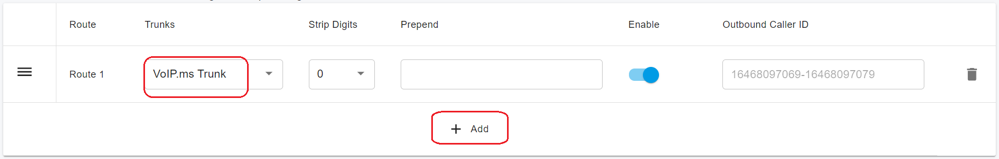
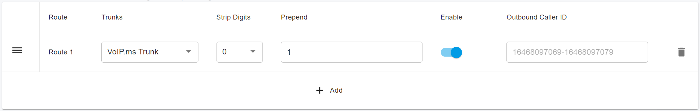
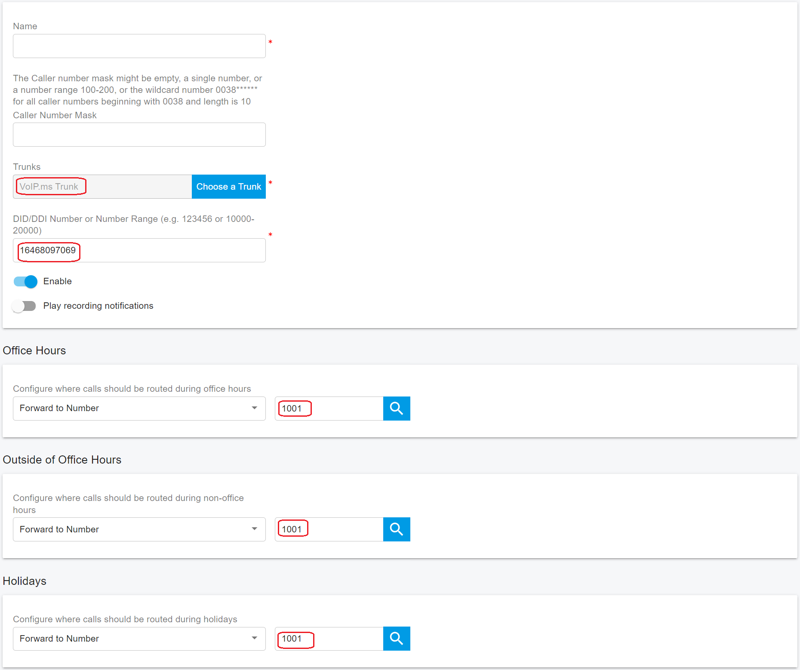

# Configuring Outbound & Inbound Calls

You need to sign in to the PortSIP PBX web portal to create the outbound and inbound rules for making & receiving calls.

***

### Sign in to the PortSIP PBX Web Portal

To configure outbound and inbound call routing, you must first sign in to the PortSIP PBX Web Portal.

You can access a tenant in one of the following ways:

#### Option 1: Sign in as System Administrator

1. Sign in to the PortSIP PBX Web Portal as a **System Administrator**.
2. Navigate to **Tenants**.
3. Select the desired tenant and click **Manage** to switch to that tenant’s administration context.

#### Option 2: Sign in as Tenant Administrator

* Sign in directly as a **Tenant Administrator** to manage that tenant.

> ❗**Note**\
> For more information about tenant roles and access control, refer to [Tenant Management](../../portsip-pbx-administration-guide/3-tenant-management/).

***

### Configure Outbound Rules

To place outbound calls, you must create at least one **Outbound Rule**.

#### Step 1: Add an Outbound Rule

1. From the left-hand navigation menu, go to **Call Manager > Outbound Rules**.
2. Click **Add**.
3. Enter a **Name** for the outbound rule (for example, `VoIPms-Outbound`).
4. In the **Apply this rule to the following calls** section, configure **at least one condition** to specify which calls this rule applies to

<figure><figcaption></figcaption></figure>

***

#### Step 2: Select the Trunk Route

5. Scroll to **Place outbound calls using the following trunk routes**.
6. Click the **Add (+)** icon.
7. Select the **VoIP.ms trunk**.
8. Save the outbound rule.

<figure><figcaption></figcaption></figure>

***

#### Step 3: Configure Number Format (Optional)

Ensure that dialed numbers match one of the supported formats:

* **10-digit format** (for example, `3322496213`)
* **11-digit format** (for example, `13322496213`)
* **E.164 format** (for example, `+13322496213`)

Depending on your users’ dialing habits, you may need to **strip leading digits** or **prepend a country code**.

**Example**\
If users dial US domestic numbers in national format (10 digits), configure the rule to **prepend `1`** before sending the call to the trunk.

> ❗**Best Practice**\
> Normalizing outbound numbers to **E.164 format** improves SIP trunk compatibility, routing accuracy, and caller ID consistency.

<figure><figcaption></figcaption></figure>

***

### Configure Inbound Rules

To receive inbound calls, you must configure at least one **Inbound Rule**.

#### Step 1: Add an Inbound Rule

1. From the left-hand navigation menu, go to **Call Manager > Inbound Rules**.
2. Click **Add**.
3. Enter a **Name** for the inbound rule (for example, `VoIPms-Inbound`).

***

#### Step 2: Configure Inbound Rule Settings

4. Click **Choose a Trunk**, then select the **VoIP.ms trunk**.
5. In the **DID/DDI Number or Number Range** field, enter the destination number(s).
   * The number must be **within the DID pool range** assigned to the selected trunk.
6. Select the **Extension** to route inbound calls to.

<figure><figcaption></figcaption></figure>

***

#### Step 3: (Optional) Configure Time-Based Routing

Depending on your business requirements, you can further enhance the inbound rule by:

* Defining **office hours** or schedules
* Routing calls to **different extensions** based on time of day
* Sending calls to **voicemail** outside business hours
* Automatically **rejecting or dropping calls** based on the schedule

For more details, refer to [Call Route Management](../../portsip-pbx-administration-guide/8-call-route-management/).

