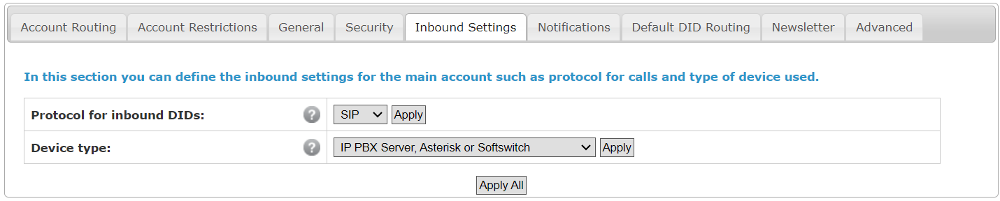
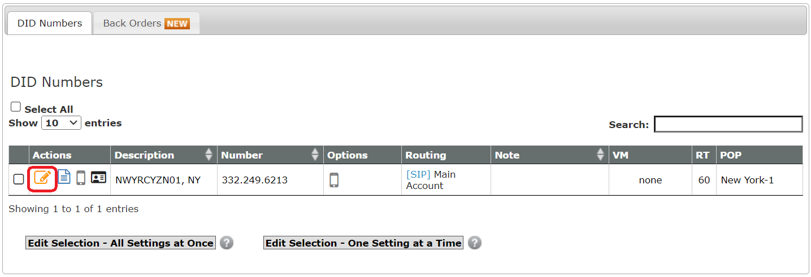
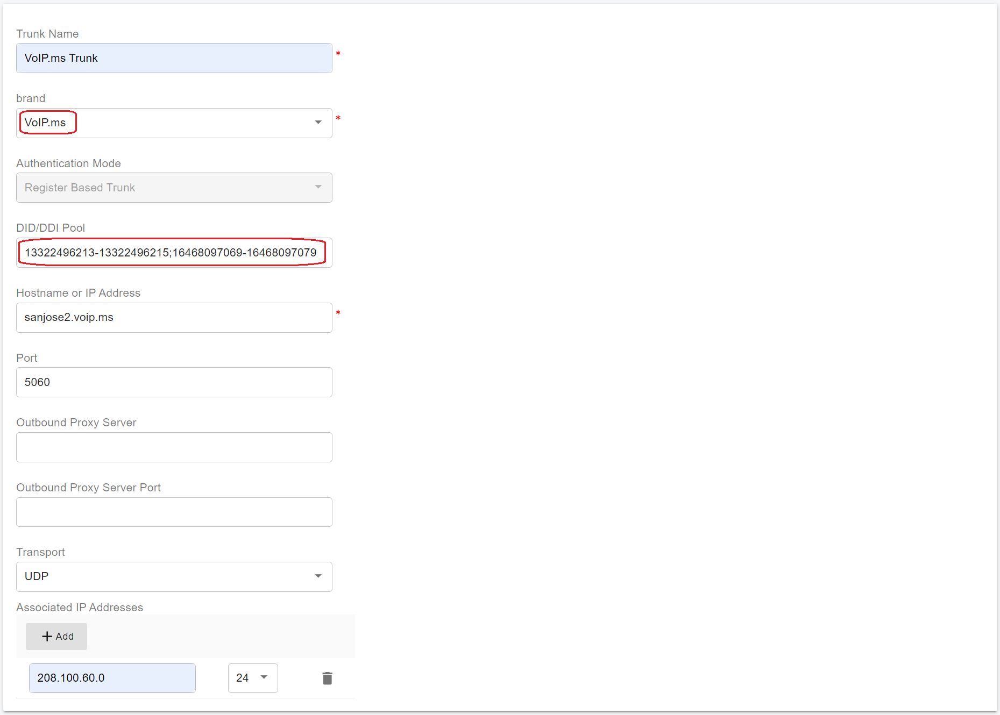
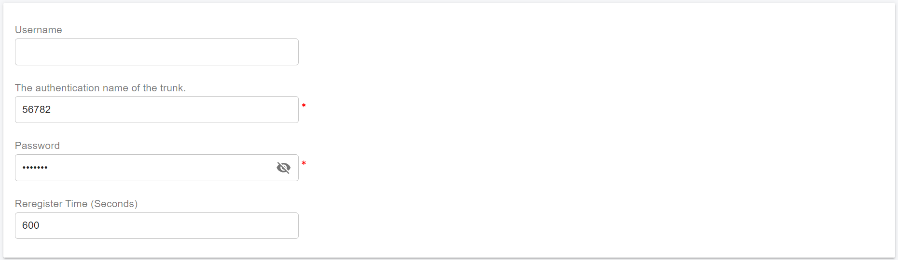
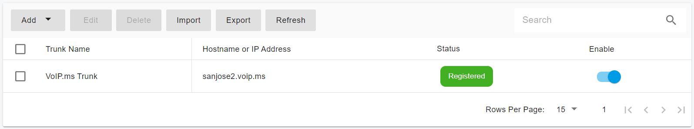

# Configuring VoIP.ms Register Based Trunk

Before proceeding with the next steps, you need to [purchase a DID on the VoIP.ms](purchase-a-did-on-voip.ms.md).

***

### Create a SIP Trunk on the VoIP.ms Platform

#### Step 1: Configure Inbound Settings

1. Log in to your VoIP.ms account.
2. Navigate to **Main Menu > Account Settings**.
3. Open the **Inbound Settings** tab.
4. Configure the following options:
   * **Protocol**: Select **SIP**
   * **Device Type**: Select **IP PBX Server**
5. Click **Apply Changes** to save the settings.

<figure><figcaption></figcaption></figure>

#### Step 2: Link DIDs to the Main Account

To ensure calls are correctly routed to PortSIP PBX, your DID numbers must be linked to the **Main Account**.

1. Navigate to **DID Numbers > Manage DID(s)**.
2. Locate the DID you want to configure and click the **Edit DID** (pencil) icon.
3. Verify the routing configuration:
   * **Routing**: Select **SIP/IAX**
   * **Account**: Ensure the DID is linked to your **Main Account**
4. Save the changes.

<figure><figcaption></figcaption></figure>

#### Step 3: Collect Required Settings for PortSIP PBX

Before configuring the Register-Based Trunk in PortSIP PBX, gather the following information from your VoIP.ms account.

**SIP Registration Credentials**

* **Username**\
  Found under **Main Menu > Account Information**.
* **Password**
  * Sent to you by VoIP.ms during account registration, **or**
  * Can be changed by navigating to **Main Menu > Account Settings > Security**

> **Security Note**\
> Treat the SIP password as sensitive credentials. Use a strong password and store it securely.

<figure><figcaption></figcaption></figure>

**DID Numbers**

* Navigate to **DID Numbers > Manage DID(s)**.
* Make a note of the DID number(s) that will be used for inbound and outbound calling.

**SIP Registrar (Server Address)**

VoIP.ms uses different SIP registrars depending on your geographic location.

* **North America**
  1. Navigate to **Main Menu > Account Settings > Default DID Routing**.
  2. Select the **United States** tab.
  3.  Note the selected server.\
      **Example:**

      ```
      sanjose2.voip.ms
      ```

<figure><figcaption></figcaption></figure>

* **Outside North America**
  1. Navigate to **Main Menu > Account Settings > Default DID Routing**.
  2. Select the **International** tab.
  3.  Note the selected server.\
      **Example:**

      ```
      sydney1.voip.ms
      ```

> **Best Practice**\
> Always use the registrar closest to your PortSIP PBX location to minimize latency and improve call quality.

<figure><figcaption></figcaption></figure>

***

### Configure a Register-Based Trunk with PortSIP PBX

VoIP.ms uses **SIP registration** for PBX integration. In PortSIP PBX, this corresponds to a **Register-Based Trunk**.

You can configure a Register-Based Trunk at **either** of the following levels:

* **System Administrator level**
  * The trunk can be **shared with one or more tenants**
* **Tenant Administrator level**
  * The trunk is **dedicated to a single tenant** and cannot be shared

***

#### Step 1: Create a Register-Based Trunk

1. Sign in to the **PortSIP PBX Web Portal** as a **System Administrator** or **Tenant Administrator**.
2. From the left navigation menu, go to **Call Manager > Trunks**.
3. Click **Add** to open the trunk type menu.
4. Select **Register Based Trunk**.

<figure><figcaption></figcaption></figure>

***

#### Step 2: Configure Basic Trunk Settings

On the **Basic Settings** page, configure the following fields:

* **Name**\
  Enter a friendly and descriptive name (for example, `VoIPms-Register-Trunk`).
* **Brand**\
  Select **VoIP.ms**.
*   **DID Pool** _(Tenant Administrator level only)_\
    Configure the VoIP.ms DID numbers assigned to this tenant.

    * The tenant can use **only** these DIDs to:
      * Create inbound and outbound rules
      * Configure outbound caller ID for extensions

    **DID Pool Format Examples:**

    ```
    13322496213
    13322496213;13322496215
    13322496213-13322496215;16468097069
    13322496213-13322496215;16468097069-16468097079
    ```
*   **Hostname or Address**\
    Enter the VoIP.ms SIP registrar noted earlier, for example:

    ```
    sanjose2.voip.ms
    ```
*   **Associated IP Addresses**\
    VoIP.ms operates multiple points of presence. Add the VoIP.ms server IP addresses in **CIDR format**.

    * Traffic originating from these IPs is trusted as VoIP.ms traffic.
    * This prevents PortSIP PBX **anti-hacking mechanisms** from blocking legitimate calls.

    > **Reference**\
    > For the full list of VoIP.ms server IPs, refer to the [official VoIP.ms documentation](https://wiki.voip.ms/article/Servers).

5. Click **Next** to continue.

<figure><figcaption></figcaption></figure>

***

#### Step 3: Configure SIP Authentication Credentials

Enter the SIP registration credentials from VoIP.ms, which you set up in [Step 3: Collect Required Settings for PortSIP PBX](configuring-voip.ms-register-based-trunk.md#step-3-collect-required-settings-for-portsip-pbx):

* **Authentication Name**\
  Enter the VoIP.ms username.
* **Password**\
  Enter the VoIP.ms SIP password.

6. Click **Next** to continue.

> **Important**\
> Ensure these credentials exactly match the values configured in your VoIP.ms account.

<figure><figcaption></figcaption></figure>

***

#### Step 4: Configure Trunk Options

On the **Options** page:

* **Max Concurrent Calls**\
  Set the maximum number of simultaneous calls allowed on this trunk.
  * This should align with your VoIP.ms service plan and expected call volume.
* **Other Options**\
  Leave the default values unless you have specific codec, routing, or interoperability requirements.

> **Recommendation**\
> Default settings are suitable for most VoIP.ms deployments.

7. Click **Next** to proceed.


<figure><figcaption></figcaption></figure>

***

#### Step 5: Assign Tenants and DID Pool

This step appears **only** when the trunk is created at the **System Administrator level**.

1. Assign one or more tenants to use this trunk.
2. Configure the **DID Pool** for each tenant.
3. Click **OK** to save the configuration.

**DID Pool Rules**

* Each **DID can be assigned to only one tenant**
* Tenants can use only their assigned DIDs to:
  * Create inbound and outbound rules
  * Configure outbound caller ID for extensions

**DID Pool Format Examples:**

```
13322496213
13322496213;13322496215
13322496213-13322496215;16468097069
13322496213-13322496215;16468097069-16468097079
```

<figure><figcaption></figcaption></figure>

***

#### Expected Result:

* PortSIP PBX registers the trunk to the VoIP.ms platform.
* On the **Trunks** list page, the trunk status displays as **Online**.

<figure><figcaption></figcaption></figure>

***

### Next Steps

The VoIP.ms Register Authentication Trunk is now ready for use.

You can proceed to:

* Configure outbound call routing rules
* Configure inbound DID routing
* Assign outbound caller IDs

Refer to the next guide section: [Configuring Outbound & Inbound Calls](../vonage-sip-trunk/configuring-outbound-and-inbound-calls.md).


