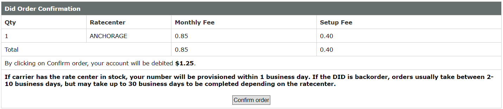

# Purchase a DID on VoIP.ms

Before placing or receiving calls, you must have **at least one active DID** (or multiple DIDs) on your VoIP.ms account.

If you already have active DID numbers on your VoIP.ms account, you may **skip this section** and proceed to trunk configuration.

***

### Steps to Purchase a DID

1. Log in to your account on [VoIP.ms](https://voip.ms/signin/index.php)
2. Click on **Order DIS(s)** under **DID numbers** in the top menu
3. Select a country and region you wish to purchase a DID in
4. Choose a specific number or numbers and click the **Oder DID** button
5. Follow the instructions to click the Confirm order to check out of the DID(s)

<figure><figcaption></figcaption></figure>

***

### Next Steps

After purchasing your DID number(s), proceed with trunk configuration:

* [Configuring VoIP.ms Register-Based Trunk](configuring-voip.ms-register-based-trunk.md)

Once the trunk is configured in PortSIP PBX, you can create inbound and outbound rules to begin making and receiving calls.

