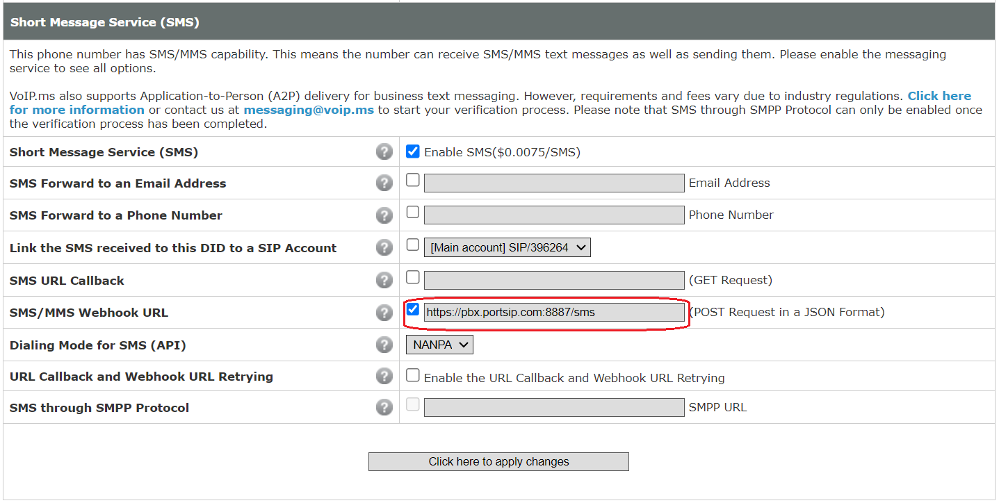

# VoIP.ms SMS Integration

Before proceeding with the next steps, you need to[ purchase a DID on the VoIP.ms platform](purchase-a-did-on-voip.ms.md).

The VoIP.ms SMS service has some limitations. Please refer to this link for more details: [Service Limitations](https://wiki.voip.ms/article/SMS-MMS#Service_Limitations).

***

### Set an API Password in VoIP.ms

PortSIP PBX uses the **VoIP.ms API Password** to send and receive SMS/MMS messages.\
If you have not already created an API password, follow these steps.

#### Step 1: Enable the VoIP.ms API

1. Sign in to the **VoIP.ms Client Portal**.
2. Navigate to **Main Menu > SOAP and REST/JSON API**.
3. If the API is not enabled, click **Enable the API**
4. Enter a value in the **API Password** field.
5. Click **Save API Password**.

> ❗**Important**
>
> * The API password is shown **only once** when it is created.
> * Copy and store it securely—you will need it later when configuring SMS in PortSIP PBX.
> * If the password is lost, you must **generate a new one**.

<figure><figcaption></figcaption></figure>

***

### Configure SMS with VoIP.ms Trunk in PortSIP PBX

Before configuring SMS in PortSIP PBX, ensure that a **VoIP.ms SIP trunk** has already been configured.

* [Configuring VoIP.ms Register Authentication Trunk](configuring-voip.ms-register-based-trunk.md)

***

### Sign in to the PortSIP PBX Web Portal

You can access the tenant configuration using one of the following methods.

#### Option 1: Sign in as System Administrator

1. Sign in to the PortSIP PBX Web Portal as a **System Administrator**.
2. Navigate to **Tenants**.
3. Select a tenant and click **Manage** to switch to that tenant.

#### Option 2: Sign in as Tenant Administrator

* Sign in directly as a **Tenant Administrator** to manage the tenant.

> ❗**Note**\
> For more information about roles and permissions, refer to [Tenant Management](../../portsip-pbx-administration-guide/3-tenant-management/).

***

### Add an SMS Configuration in PortSIP PBX

#### Step 1: Create the SMS Configuration

1. In the PortSIP PBX Web Portal, navigate to **SMS/MMS**.
2. Click **Add**.
3. Select your configured **VoIP.ms trunk**.
4. Configure the following fields:
   * **Username**
     * Enter your **VoIP.ms account username** (usually your login email).
   * **Password**
     * Paste the **VoIP.ms API Password** created earlier.

<figure><figcaption></figcaption></figure>

***

#### Step 2: Copy the Webhook URL

6. You will be redirected to the **SMS/MMS list** page.
7. Copy the **Webhook URL** using one of the following methods:
   * Select the SMS configuration and click **Copy Webhook**.
   * Or, double-click the SMS configuration and copy the **Webhook URL** from the details page.

***

### Configure SMS Settings in VoIP.ms

#### Step 1: Assign the Webhook URL to the DID

1. Sign in to the **VoIP.ms Client Portal**.
2. Navigate to **DID Numbers > Manage DIDs**.
3. Click the **Edit (yellow pencil)** icon next to the DID you want to use for SMS.
4. Scroll down to the **Message Service (SMS/MMS)** section.
5. Enable the **SMS/MMS** service.
6. In the **SMS/MMS Webhook URL** field, paste the **Webhook URL** copied from PortSIP PBX.

***

#### Step 2: Select the SMS Number Format

7. Choose the SMS/MMS number format:

* **E.164 format**
  * Messages must include the `+` sign and country code
  * Example: `+13322496213`
* **NANPA format**
  * Messages use a 10-digit number without country code
  * Example: `3322496213`

8. Click **Click here to apply changes** to save the configuration.

<figure><figcaption></figcaption></figure>

***

### Verify the Configuration

At this point, the VoIP.ms SMS/MMS integration is complete.

You can now [create outbound and inbound rules](configuring-outbound-and-inbound-calls.md) in PortSIP PBX to send and receive SMS/MMS messages using the VoIP.ms trunk, just as you would configure rules for voice calls.

