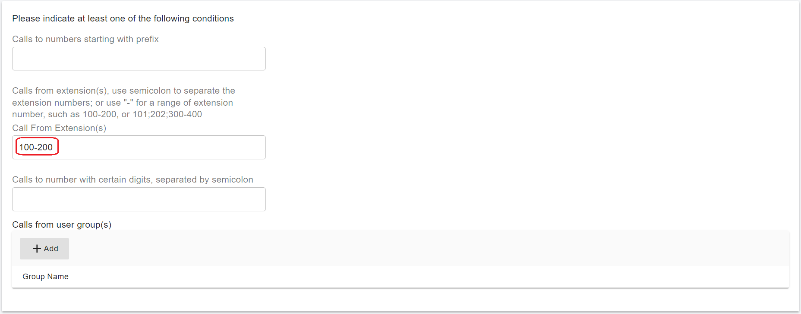
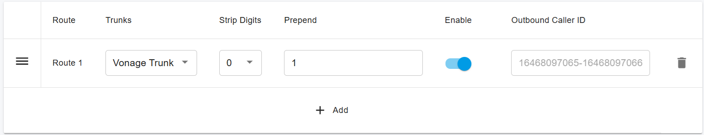
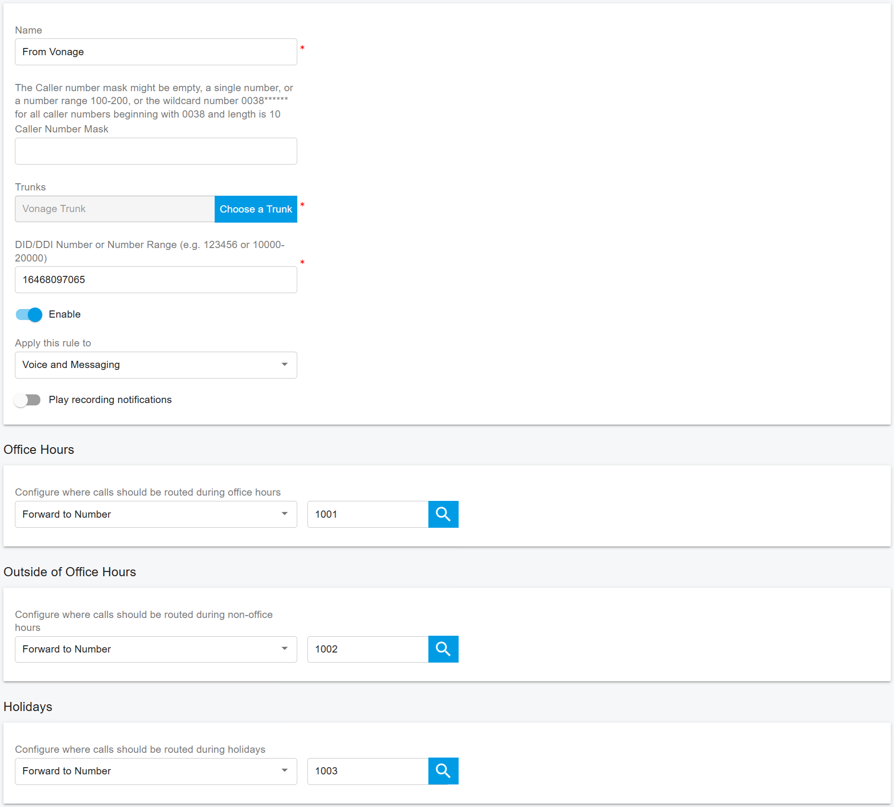

# Configuring Outbound & Inbound Calls

You need to sign in to the PortSIP PBX web portal to create the outbound and inbound rules for making & receiving calls.

***

### Sign in to the PortSIP PBX Web Portal

To configure outbound and inbound call routing, you must first sign in to the PortSIP PBX Web Portal.

You can access a tenant in one of the following ways:

#### Option 1: Sign in as System Administrator

1. Sign in to the PortSIP PBX Web Portal as a **System Administrator**.
2. Navigate to **Tenants**.
3. Select the desired tenant and click **Manage** to switch to that tenant’s administration context.

#### Option 2: Sign in as Tenant Administrator

* Sign in directly as a **Tenant Administrator** to manage that tenant.

> ❗**Note**\
> For more information about tenant roles and access control, refer to [Tenant Management](../../portsip-pbx-administration-guide/3-tenant-management/).

***

### Configure Outbound Rules

Outbound Rules determine how outbound calls are routed and which trunk is used when users place calls.

#### Add an Outbound Rule

1. In the PortSIP PBX Web Portal, navigate to **Call Manager > Outbound Rules**.
2. Click **Add**.
3. Configure the following settings:
   * **Name**\
     Enter a descriptive name for the outbound rule.
   * **Apply this rule to the following calls**\
     Define at least **one condition** (for example, number patterns or call types) that determines when this rule is applied.

<figure><figcaption></figcaption></figure>

#### Select the Trunk Route

5. Scroll to **Place outbound calls using the following trunk routes**.
6. Click the **Add (+)** icon.
7. Select the **Vonage trunk**, then save the outbound rule.

<figure><figcaption></figcaption></figure>

#### Number Format (Optional)

Depending on user dialing habits, you may need to modify the dialed number format before sending calls to the SIP trunk.

Common use cases include:

* Stripping leading digits
* Prepending a country code

**Example:**\
If users dial U.S. domestic numbers without the country code, you can configure the rule to **prepend `1`** to all outbound numbers so they are sent in the correct E.164 format.

> **Best Practice**\
> Ensure the final number format matches the requirements of your SIP trunk provider.

<figure><figcaption></figcaption></figure>

***

### Configure Inbound Rules

Inbound Rules define how incoming calls (DIDs/DDIs) are routed to extensions, ring groups, queues, or other destinations.

#### Add an Inbound Rule

1. Navigate to **Call Manager > Inbound Rules**.
2. Click **Add**.
3. Configure the following settings:
   * **Name**\
     Enter a descriptive name for the inbound rule.
   * **Choose a Trunk**\
     Select the SIP trunk associated with the inbound calls.
   * **DID/DDI Number or Number Range**\
     Enter a single number or number range.
     * The entered value **must be within the DID pool** assigned to the selected trunk.
   * **Destination**\
     Select the extension (or other destination) to which inbound calls should be routed.
4. Click **OK** to save the inbound rule.

<figure><figcaption></figcaption></figure>

***

### Advanced Routing Options (Optional)

Depending on your business requirements, you can further enhance the inbound rule by:

* Defining **office hours** or schedules
* Routing calls to **different destinations** based on time of day
* Sending calls to **voicemail** outside business hours
* Automatically **rejecting or dropping calls** when appropriate

For more details, refer to the article [Office Hours and Holiday Schedule](../../portsip-pbx-administration-guide/office-hours-and-holiday-schedule/).

For comprehensive information about inbound and outbound routing behavior, see [Call Route Management](../../portsip-pbx-administration-guide/8-call-route-management/).

