# Configuring Vonage IP Authentication Trunk

Before proceeding with the next steps, you need to [purchase a DID on the Vonage platform](purchase-a-did-on-vonage-platform.md).

### Create a SIP Trunk on the Vonage Platform

You can also refer to the [official Vonage documentation](https://developer.vonage.com/en/sip/sip-dashboard?source=sip) for additional details on SIP trunk configuration.

***

#### Step 1: Create a New SIP Trunk

1. Sign in to the **Vonage Dashboard**.
2. Navigate to **Build & Manage > SIP**.
3. By default, Vonage provides a pre-created SIP trunk.
   * You may click the **Settings** icon to modify it, or
   * Click **Create New** to create a new SIP trunk.
4. In this guide, we will create a new SIP trunk.
5. Click **Create New**, enter a domain name for the trunk (for example, `portsip`), and then click **Create**.

<figure><figcaption></figcaption></figure>

6. Once the SIP trunk is successfully created, you are automatically redirected to the **Trunk Details** page.

<figure>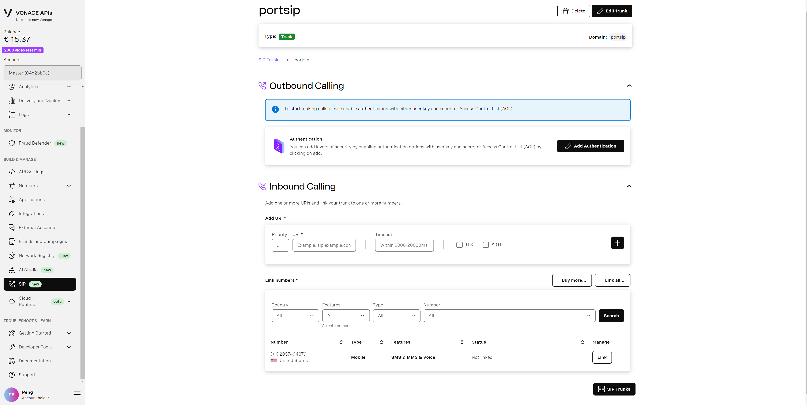<figcaption></figcaption></figure>

***

#### Step 2: Configure Outbound Calling (IP Authentication)

1. On the **Trunk Details** page, locate the **Outbound Calling** section.
2. Click **Add Authentication**.\
   You will be redirected to the **Authentication** page.
3. Under **Access Control List (ACL)**:
   * **IP Address**: Enter your PortSIP PBX **static public IP address**
   * **Range**: Enter `32` (single IP address)
4. Save the configuration.

<figure>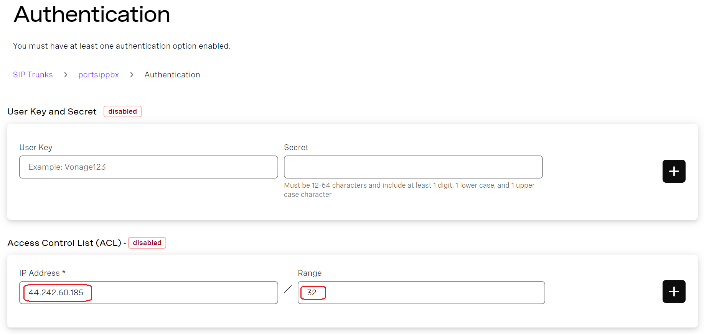<figcaption></figcaption></figure>

6.  The **Access Control List (ACL)** section will appear **enabled (green)**, indicating that **IP-based authentication** is active.

    > **Important**
    >
    > * **ACL (IP authentication) and User Key / Secret authentication are mutually exclusive.**
    > * If you enable ACL authentication, **do not configure a User Key and Secret**, as both methods cannot be enabled at the same time.

<figure>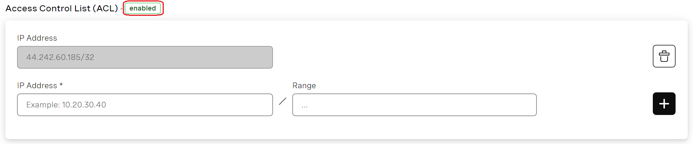<figcaption></figcaption></figure>

7. Click **Back** to return to the **Trunk Details** page.

On the Trunk Details page, **Outbound Calling** should now be displayed as **Ready**.

***

#### Step 3: Note the Vonage SIP Trunk Domain

On the Trunk Details page, copy and save the **Vonage SIP trunk domain**.\
Choose the domain closest to your PortSIP PBX location for optimal latency:

* `portsip.sip-us.vonage.com`
* `portsip.sip-eu.vonage.com`
* `portsip.sip-ap.vonage.com`

You will need this domain when configuring the SIP trunk in **PortSIP PBX**.

<figure>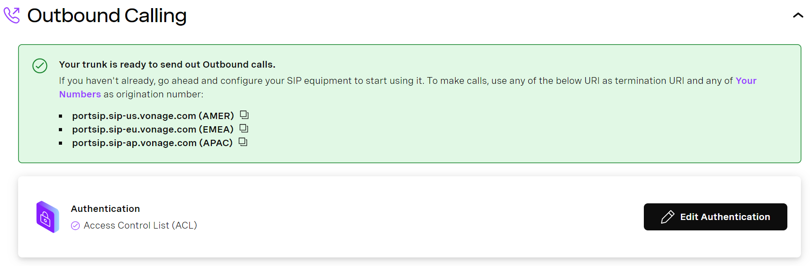<figcaption></figcaption></figure>

***

#### Step 4: Configure Inbound Calling (SIP URI Routing)

To allow Vonage to route inbound calls to your PortSIP PBX, you must configure a SIP URI.

1. In the **Inbound Calling** section, add a new SIP URI with the following parameters:
   *   **Priority**\
       Enter a unique value between **0 and 100** (for example, `1`).

       * `0` is the **highest priority**
       * Each URI must have a **unique priority value**

       > **Note**\
       > If priority values are not unique, Vonage cannot guarantee call routing order.
   * **URI**\
     Enter your PortSIP PBX **public IP address or domain name**, for example:
     * `44.242.60.185`
     * `pbx.portsip.com`
   * **Timeout**\
     Set a timeout value between **2000 ms and 20000 ms**.
     * If left blank, Vonage uses the default timeout of **5000 ms**.
   * **TLS (Optional)**
     * Enable this option if your PortSIP PBX is configured to receive SIP signaling over **TLS**.
     * By default, Vonage sends TLS traffic to **port 5061**.
     *   If your PortSIP PBX listens on a different TLS port (for example, `5063`), include it in the URI:

         ```
         44.242.60.185:5063
         ```
   * **SRTP (Optional)**
     * Enable this option to allow **secure media encryption (SRTP)**.
     * This is recommended when using TLS for SIP signaling.

<figure>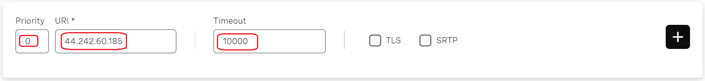<figcaption></figcaption></figure>

2. Click the **+** button to add the SIP URI.\
   The SIP URI is displayed in the **Inbound Calling** section, indicating that inbound call routing is configured.

<figure>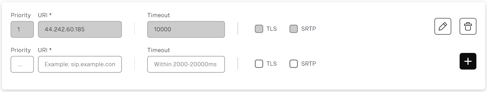<figcaption></figcaption></figure>

***

#### Step 5: Link Phone Numbers to the SIP Trunk

1. In the **Link Numbers** section:
   * Click **Link all…** to associate all available numbers, or
   * Click **Link** to select specific numbers.
2. If no numbers are available:
   * Click **Buy Numbers**, which redirects you to the Vonage number purchasing portal.
3. In the **Numbers Dashboard**, you can filter, link, or unlink numbers as needed.

<figure>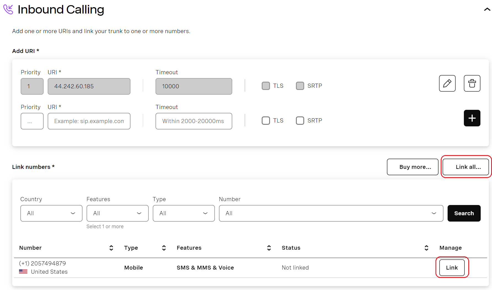<figcaption></figcaption></figure>

4. Once numbers are successfully linked, Vonage will display a status indicating that the SIP trunk is ready to receive inbound calls.

<figure>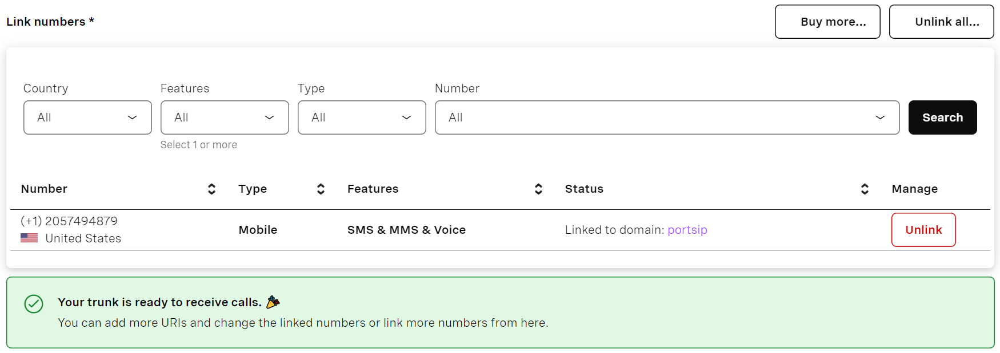<figcaption></figcaption></figure>

***

### Configure an IP Authentication Trunk in PortSIP PBX

In PortSIP PBX, an **IP Authentication Trunk** refers to an **IP-Based Trunk**, where calls are authenticated using the source IP address instead of SIP credentials.

You can configure an IP-Based Trunk at **either** of the following levels:

* **System Administrator level**
  * The trunk can be shared across multiple tenants
* **Tenant Administrator level**
  * The trunk is exclusive to that tenant and cannot be shared

***

#### Step 1: Create an IP-Based Trunk

1. Sign in to the PortSIP PBX Web Portal as a **System Administrator** or **Tenant Administrator**.
2. From the left navigation menu, go to **Call Manager > Trunks**.
3. Click **Add** to open the trunk type menu.
4. Select **IP Based Trunk**.

<figure><figcaption></figcaption></figure>

***

#### Step 2: Configure Basic Trunk Settings

On the **Basic Settings** page, configure the following fields:

* **Name**\
  Enter a friendly and descriptive name for the trunk (for example, `Vonage-IP-Trunk`).
* **Brand**\
  Select **Vonage**.
*   **Hostname or IP Address**\
    Paste the **Vonage SIP trunk domain** copied earlier, for example:

    ```
    portsip.sip-us.vonage.com
    ```

5. Click **Next** to continue.

<figure>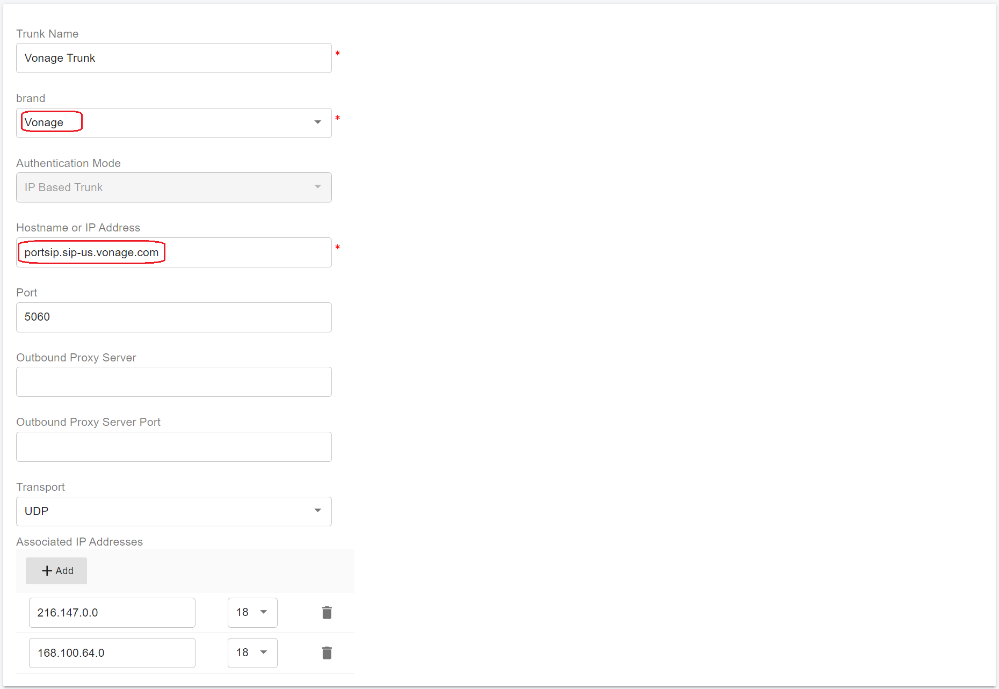<figcaption></figcaption></figure>

***

#### Step 3: Configure Trunk Options

On the **Options** page:

* **Max Concurrent Calls**\
  Set the maximum number of simultaneous calls allowed on this trunk.
  * This value should align with your Vonage service limits and expected call volume.
* **Other Options**\
  Keep the default values unless you have specific routing, codec, or interoperability requirements.

> **Recommendation**\
> For most deployments, the default options provide optimal compatibility and stability.

6. Click **Next** to proceed.

<figure><figcaption></figcaption></figure>

***

#### Step 4: Assign Tenants and Configure DID Pool

This step appears **only** when configuring the trunk at the **System Administrator level**.\
It is **not available** when the trunk is created at the Tenant Administrator level.

1. Assign one or more tenants that are allowed to use this trunk.
2. Configure the **DID Pool** to distribute Vonage phone numbers to tenants.

**DID Pool Rules**

* Each **DID can be assigned to only one tenant**
* Tenants can:
  * Use only the DIDs in their assigned pool
  * Create inbound and outbound rules using those DIDs
  * Configure outbound caller ID for extensions using those DIDs

**DID Pool Format Examples**

*   Single number:

    ```
    12057494879
    ```
*   Continuous range:

    ```
    12057494879-12057494880
    ```
*   Multiple entries:

    ```
    12057494879-12057494880;12057494885
    ```
*   Multiple ranges:

    ```
    12057494879-12057494880;12057494890-12057494899
    ```

3. Click **OK** to save the configuration.

<figure>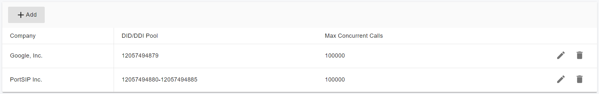<figcaption></figcaption></figure>

***

#### **Expected Result:**

* The trunk is successfully created.
* In the **Trunks** list, the status appears as **Online**.

> **Note**\
> For **IP-Based Trunks**, the status always displays as **Online**.\
> This is expected behavior and does **not** indicate SIP registration in the traditional sense.

<figure>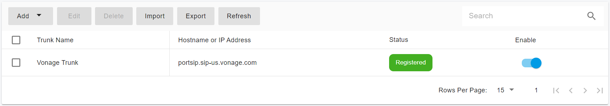<figcaption></figcaption></figure>

***

### Next Steps

The Vonage IP Authentication Trunk is now ready for use.

You can proceed to:

* Configure outbound call routing rules
* Configure inbound DID routing
* Assign outbound caller IDs

Refer to the next guide section: [Configuring Outbound & Inbound Calls](configuring-outbound-and-inbound-calls.md).


