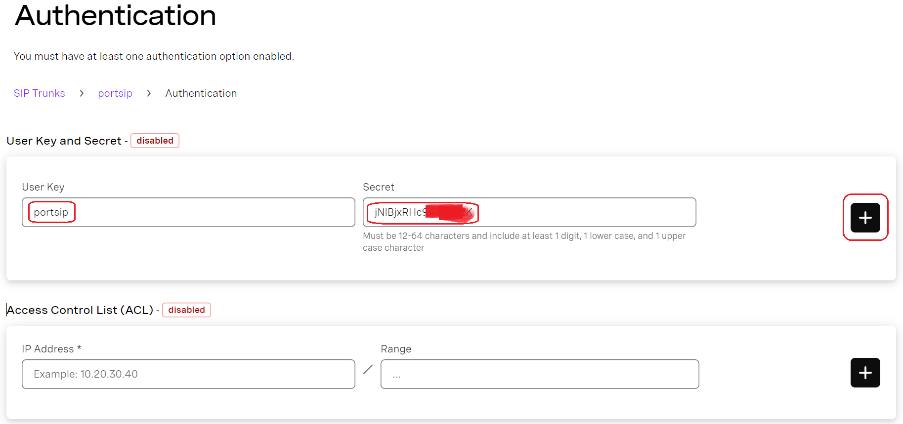
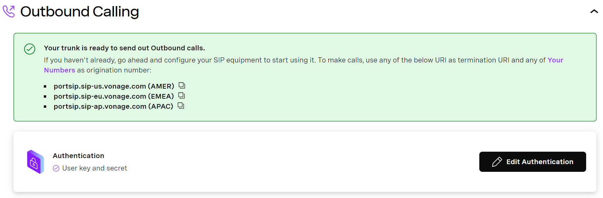
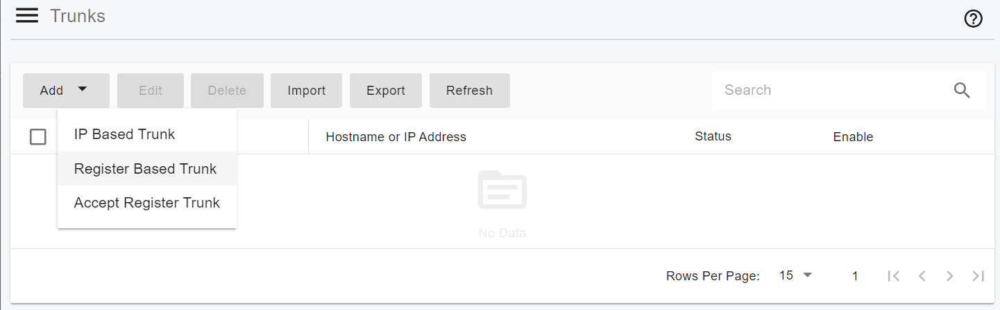
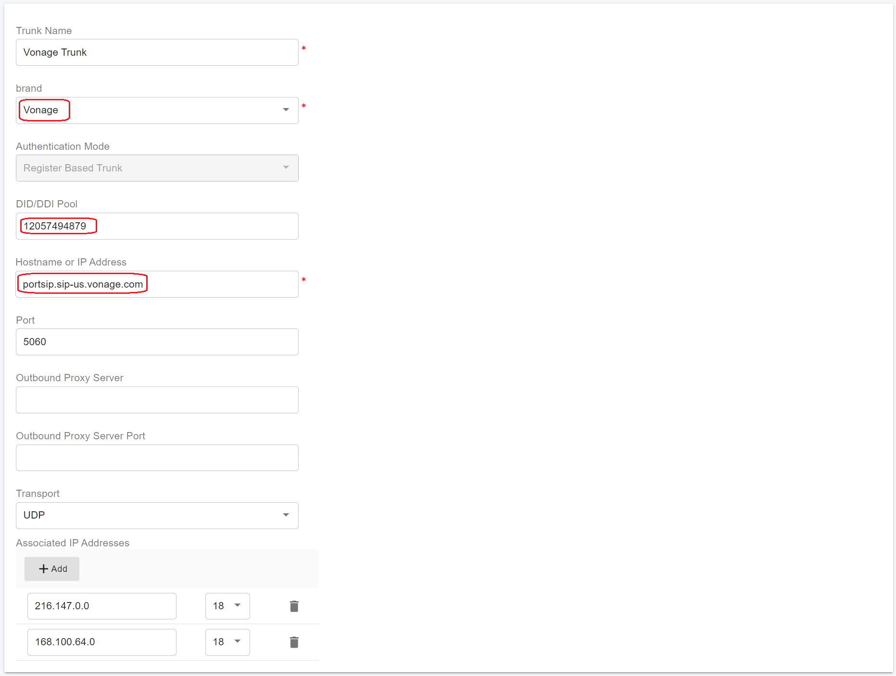
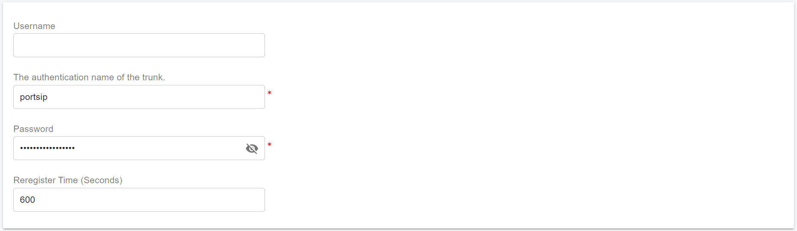

# Configuring Vonage Register Authentication Trunk

Before proceeding with the next steps, you need to [purchase a DID on the Vonage platform](purchase-a-did-on-vonage-platform.md).

### Create a SIP Trunk on the Vonage Platform

You can also reference the [Vonage documentation for configuring the SIP Trunk](https://developer.vonage.com/en/sip/sip-dashboard?source=sip).

***

#### Step 1: Create a New SIP Trunk

1. Sign in to the **Vonage Dashboard**.
2. Navigate to **Build & Manage > SIP**.
3. By default, Vonage provides a pre-created SIP trunk.
   * You may click the **Settings** icon to modify it, or
   * Click **Create New** to create a new SIP trunk.
4. In this guide, we will create a new SIP trunk.
5. Click **Create New**, enter a domain name for the trunk (for example, `portsip`), and then click **Create**.

<figure><figcaption></figcaption></figure>

***

#### Step 2: Configure Outbound Calling (Register Authentication)

1. Once the SIP trunk is successfully created, you are automatically redirected to the **Trunk Details** page.

<figure><figcaption></figcaption></figure>

2. On the **Trunk Details** page, locate the **Outbound Calling** section.
3. Click **Add Authentication**.\
   You will be redirected to the **Authentication** page.
4. Under the **User Key and Secret** section:
   * Enter a value for **User Key**
   * Enter a value for **Secret**
   * Click the **+** button to add the credentials

> **Important**
>
> * Be sure to **record the User Key and Secret**, as they will be required later when configuring the SIP trunk in **PortSIP PBX**.
> * These credentials function as SIP registration credentials.

<figure><figcaption></figcaption></figure>

6.  After the User Key and Secret are added, the section appears **enabled (green)**, indicating that **register-based authentication** is active.

    > **Important**
    >
    > * **User Key / Secret authentication and Access Control List (ACL) authentication cannot be enabled at the same time.**
    > * If you use **User Key and Secret**, **do not configure ACL-based IP authentication** for this trunk.

<figure><figcaption></figcaption></figure>

7. Click **Back** to return to the **Trunk Details** page.

***

#### Step 3: Note the Vonage SIP Trunk Domain

1. On the Trunk Details page, **Outbound Calling** should now display a status of **Ready**.
2. Copy and save the **Vonage SIP trunk domain**.\
   Select the domain closest to your PortSIP PBX location to minimize latency:

* `portsip.sip-us.vonage.com`
* `portsip.sip-eu.vonage.com`
* `portsip.sip-ap.vonage.com`

You will need this domain when configuring the **Register-Based Trunk** in PortSIP PBX.

<figure><figcaption></figcaption></figure>

***

#### Step 4: Configure Inbound Calling (SIP URI Routing)

To allow Vonage to route inbound calls to your PortSIP PBX, configure a SIP URI.

1. In the **Inbound Calling** section, add a new SIP URI with the following parameters:
   *   **Priority**\
       Enter a unique value between **0 and 100** (for example, `1`).

       * `0` is the **highest priority**
       * Each SIP URI must have a **unique priority value**

       > **Note**\
       > If priority values are not unique, Vonage cannot guarantee inbound call routing order.
   * **URI**\
     Enter your PortSIP PBX **public IP address or domain name**, for example:
     * `44.242.60.185`
     * `pbx.portsip.com`
   * **Timeout**\
     Enter a value between **2000 ms and 20000 ms**.
     * If left empty, Vonage uses the default timeout of **5000 ms**.
   * **TLS (Optional)**
     * Enable this option if your PortSIP PBX is configured to receive SIP signaling over **TLS**.
     * By default, Vonage sends TLS traffic to **port 5061**.
     *   If your PortSIP PBX listens on a different TLS port (for example, `5063`), include it in the URI:

         ```
         44.242.60.185:5063
         ```
   * **SRTP (Optional)**
     * Enable this option to allow **secure media encryption (SRTP)**.
     * SRTP is recommended when TLS is enabled for SIP signaling.

<figure><figcaption></figcaption></figure>

2. Click the **+** button to add the SIP URI.\
   The SIP URI is listed under the **Inbound Calling** section, indicating that inbound call routing is configured.

<figure><figcaption></figcaption></figure>

***

#### Step 5: Link Phone Numbers to the SIP Trunk

1. In the **Link Numbers** section:
   * Click **Link all…** to associate all available numbers, or
   * Click **Link** to select specific numbers.
2. If no numbers are available:
   * Click **Buy Numbers** to open the Vonage number purchasing portal.
3. In the **Numbers Dashboard**, you can filter, link, or unlink numbers as needed.

<figure><figcaption></figcaption></figure>

4. Once numbers are successfully linked, Vonage displays a confirmation indicating that the SIP trunk is **ready to receive inbound calls**.

<figure><figcaption></figcaption></figure>

***

### Configure a Register-Based Trunk in PortSIP PBX

In PortSIP PBX, a Vonage Registration Trunk corresponds to a Register-Based Trunk, where the PBX authenticates to Vonage using SIP credentials (User Key and Secret).

You can configure a Register-Based Trunk at **either** of the following levels:

* **System Administrator level**
  * The trunk can be **shared with one or more tenants**
* **Tenant Administrator level**
  * The trunk is **dedicated to a single tenant** and cannot be shared

***

#### Step 1: Create a Register-Based Trunk

1. Sign in to the PortSIP PBX Web Portal as a **System Administrator** or **Tenant Administrator**.
2. From the left navigation menu, go to **Call Manager > Trunks**.
3. Click **Add** to open the trunk type menu.
4. Select **Register Based Trunk**.

<figure><figcaption></figcaption></figure>

***

#### Step 2: Configure Basic Trunk Settings

On the **Basic Settings** page, configure the following fields:

* **Name**\
  Enter a friendly and descriptive name (for example, `Vonage-Register-Trunk`).
* **Brand**\
  Select **Vonage**.
*   **DID Pool** _(Tenant Administrator level only)_

    * Configure the Vonage DID numbers assigned to this tenant.
    * The tenant can use **only** the DIDs in this pool to:
      * Create inbound and outbound rules
      * Configure outbound caller ID for extensions

    **DID Pool Format Examples:**

    ```
    12057494879
    12057494879-12057494880
    12057494879-12057494880;12057494885
    12057494879-12057494880;12057494890-12057494899
    ```
*   **Hostname or IP Address**\
    Paste the **Vonage SIP trunk domain** copied earlier, for example:

    ```
    portsip.sip-us.vonage.com
    ```

5. Click **Next** to continue.

<figure><figcaption></figcaption></figure>

***

#### Step 3: Configure Trunk Authentication Credentials

On the **Authentication** page, enter the SIP registration credentials created on the Vonage platform:

* **Authentication Name**\
  Enter the **User Key** from the Vonage SIP trunk.
* **Password**\
  Enter the **Secret** from the Vonage SIP trunk.

6. Click **Next** to continue.

> **Important**\
> These credentials are used by PortSIP PBX to register with Vonage.\
> Ensure they match exactly with the values configured on the Vonage platform.

<figure><figcaption></figcaption></figure>

***

#### Step 4: Configure Trunk Options

On the **Options** page:

* **Max Concurrent Calls**\
  Set the maximum number of simultaneous calls allowed on this trunk.
  * This should align with your Vonage service limits and expected traffic.
* **Other Options**\
  Leave the default values unless you have specific requirements related to codecs, routing, or interoperability.

> **Recommendation**\
> The default settings are suitable for most deployments and provide optimal compatibility with Vonage.

7. Click **Next** to proceed.

<figure><figcaption></figcaption></figure>

***

#### Step 5: Assign Tenants and Configure DID Pool

This step appears **only** when the trunk is created at the **System Administrator level**.

1. Assign one or more tenants to use this trunk.
2. Configure the **DID Pool** for each tenant.

**DID Pool Rules**

* Each **DID can be assigned to only one tenant**
* A tenant can use only the DIDs assigned to it to:
  * Create inbound and outbound rules
  * Configure outbound caller ID for extensions

3. Click **OK** to save the configuration.

**DID Pool Format Examples:**

```
12057494879
12057494879-12057494880
12057494879-12057494880;12057494885
12057494879-12057494880;12057494890-12057494899
```

<figure><figcaption></figcaption></figure>

***

#### Expected Result

* PortSIP PBX initiates SIP registration to the Vonage platform.
* Once registration is successful, the trunk status displays as **Online** on the trunk list page.

<figure><figcaption></figcaption></figure>

***

### Next Steps

The Vonage Register Authentication Trunk is now ready for use.

You can proceed to:

* Configure outbound call routing rules
* Configure inbound DID routing
* Assign outbound caller IDs

Refer to the next guide section: [Configuring Outbound & Inbound Calls](configuring-outbound-and-inbound-calls.md).


