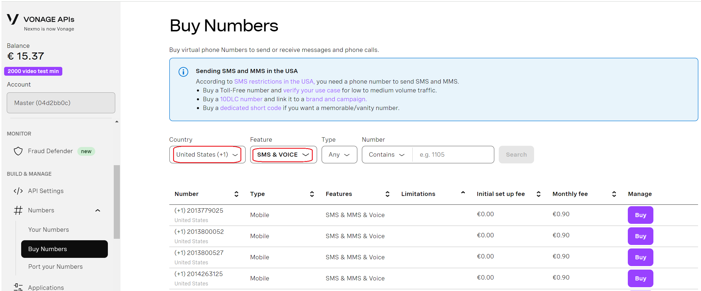

# Purchase a DID on Vonage Platform

Before placing or receiving a call, you need to have an active DID or a dozen DID numbers on your Vonage account. If you already have an active number on your Vonage account, the below steps are optional.

To purchase a DID on your Vonage account:

1. Log in to your account on the [Vonage ](https://ui.idp.vonage.com/ui/auth/login)platform.
2. Navigate to the menu **Build & Manage > Numbers > Buy Numbers**.
3. Search for numbers by country, and select the ones with voice and SMS features (SMS is optional, so you don’t need to select it if you don’t need SMS). Then, click **Buy**.

<figure><figcaption></figcaption></figure>

After purchasing the DID, you can follow one of the guides to configure the trunk with PortSIP PBX.

* [Configuring Vonage Register AuthenticationTrunk](configuring-vonage-register-authentication-trunk.md)

