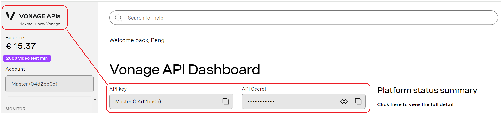
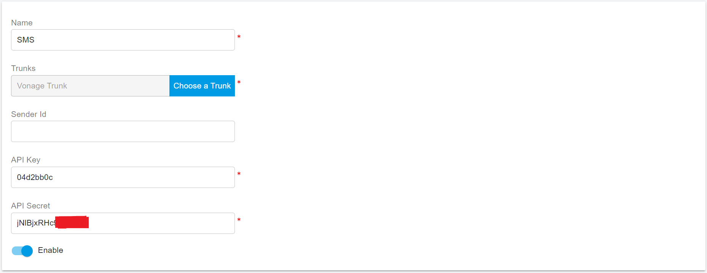
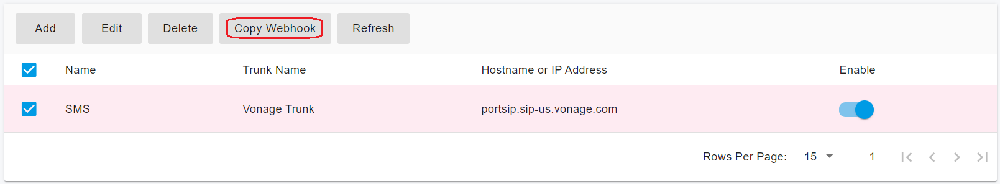
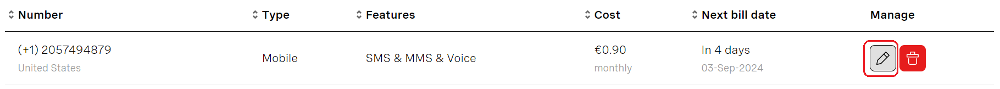
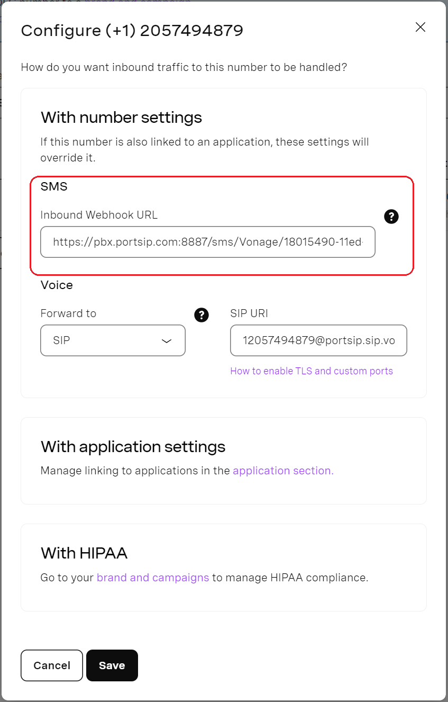

# Vonage SMS Integration

Before proceeding with the next steps, you need to [purchase a DID on the Vonage platform](purchase-a-did-on-vonage-platform.md) that is SMS/MMS enabled.

## Obtain the Vonage API Key

You need to take the Vonage API key for the PortSIP PBX to send the SMS/MMS. Please follow the below steps:

1. Log in to your account on the [Vonage ](https://ui.idp.vonage.com/ui/auth/login)platform.
2. Click on the Vonage logo in the top left corner to open the **Vonage API Dashboard**.
3. Copy and note the **API Key** and **API Secret**.

<figure><figcaption></figcaption></figure>

## Configure SMS with Vonage Trunk in PortSIP PBX

Before configuring SMS in PortSIP PBX, you must have already configured a Vonage SIP trunk using one of the following guides:

* [Configuring Vonage Register Based Trunk](configuring-vonage-register-authentication-trunk.md)
* [Configuring Vonage IP Based Trunk](configuring-vonage-ip-authentication-trunk.md)

### Sign in PortSIP PBX Web Portal

You can sign in to the PortSIP PBX Web portal using one of the following methods:

1. Sign in as the PBX system administrator, navigate to the **Tenants** menu, choose a tenant, and click the **Manage** button to switch to that tenant.
2. Sign in as a tenant admin to manage the tenant.

For more details please reference [Tenant Management](../../portsip-pbx-administration-guide/3-tenant-management/).

### Add an SMS configuration

Please follow the below steps:

1. In the PortSIP PBX Web portal, navigate to the left menu, select **SMS/MMS**, and click the **Add** button.&#x20;
2. Sender ID: If you have the sender ID for outbound SMS, please input it here. For more details, please see:
   * [Global Sender ID Registration Guide](https://api.support.vonage.com/hc/en-us/articles/6791919802652-Global-Sender-ID-Registration-Guide)
   * [Global Sender ID Portal - FAQs](https://api.support.vonage.com/hc/en-us/articles/9092597969436-Global-Sender-ID-Portal-FAQs)
3. Choose your configured Vonage Trunk :
   * **API Key**: Enter the Vonage API Key you noted in [Obtain the Vonage API Key](vonage-sms-integration.md#obtain-the-vonage-api-key)
   * **Secret**: Enter the Vonage Secret you noted in [Obtain the Vonage API Key](vonage-sms-integration.md#obtain-the-vonage-api-key)

<figure><figcaption></figcaption></figure>

4. Click **OK** to be brought to the SMS/MMS list page. You can select that SMS configuration, then press the **Copy Webhook** button to copy the Webhook URL. Or Double-click the SMS configuration to edit the SMS configuration, in the details copy the Webhook URL.

<figure><figcaption></figcaption></figure>

## Configure the SMS in Vonage

You will need to add a webhook URL to Vonage in order to receive inbound SMS. Vonage sends the SMS to this webhook URL when it forwards inbound SMS to your PortSIP PBX.

### Adding a Webhook URL at the Account Level

1. Log in to your account on the [Vonage ](https://ui.idp.vonage.com/ui/auth/login)platform.
2. Navigate to the menu **Build & Manager**, under the **SMS settings** section, set up as the below:
   * Choose **SMS API**
   * Choose **POST-JSON** for the **Webhook format**
   * Paste the PortSIP PBX SMS Webhook URL to **the Inbound SMS webhooks** field
3. Press **Save changes**

<figure><figcaption></figcaption></figure>

### Adding a Webhook URL at the Number Level

You can specify a unique inbound webhook URL for each of your numbers. Note that if you add a webhook URL to one of your numbers then this will take precedence over the account-level webhook URL.

1. Navigate to the [Your Numbers](https://dashboard.nexmo.com/your-numbers) page, select the number you want to edit by clicking the pencil icon under the Manager column.

<figure><figcaption></figcaption></figure>

2. Set the number-level webhook URL in the pop-up configuration window.

<figure><figcaption></figcaption></figure>

3. Save the change before you close the pop-up window.

## Verify Configuration

Now you can [create the outbound and inbound rules](configuring-outbound-and-inbound-calls.md) in PortSIP PBX for sending and receiving SMS/MMS using the Vonage Trunk, just like you create the rules for making and receiving calls.

