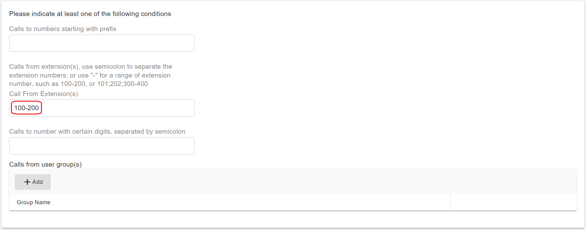
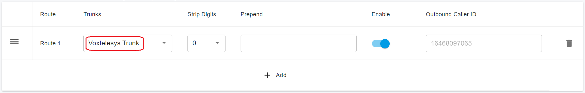
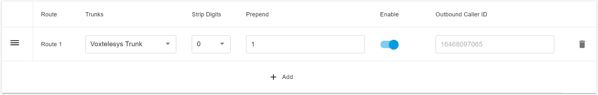
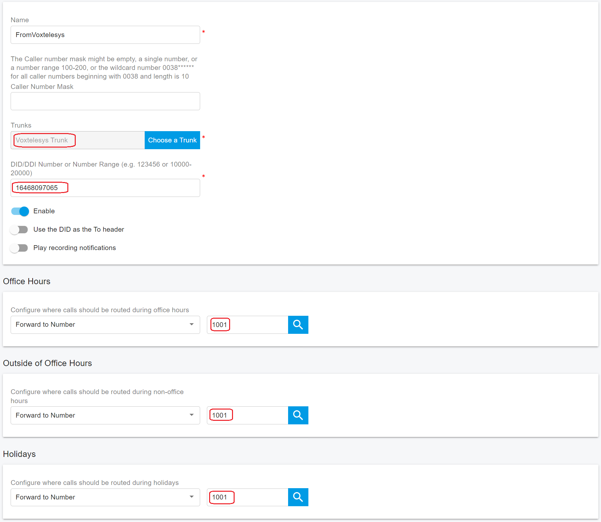

# Configuring Outbound & Inbound Calls

You need to sign in to the PortSIP PBX web portal to create the outbound and inbound rules for making & receiving calls.

***

### Sign in to the PortSIP PBX Web Portal

To configure outbound and inbound call routing, you must first sign in to the PortSIP PBX Web Portal.

You can access a tenant in one of the following ways:

#### Option 1: Sign in as System Administrator

1. Sign in to the PortSIP PBX Web Portal as a **System Administrator**.
2. Navigate to **Tenants**.
3. Select the desired tenant and click **Manage** to switch to that tenant’s administration context.

#### Option 2: Sign in as Tenant Administrator

* Sign in directly as a **Tenant Administrator** to manage that tenant.

> ❗**Note**\
> For more information about tenant roles and access control, refer to [Tenant Management](../../portsip-pbx-administration-guide/3-tenant-management/).

***

### Configure Outbound Rules

To place outbound calls, you must configure at least one **Outbound Rule** in PortSIP PBX.

***

#### Step 1: Add an Outbound Rule

1. Sign in to the **PortSIP PBX Web Portal** as a **System Administrator** or **Tenant Administrator**.
2. From the left-hand navigation menu, go to **Call Manager > Outbound Rules**.
3. Click **Add**.
4. Enter a **Name** for the outbound rule (for example, `Voxtelesys-Outbound`).

***

#### Step 2: Define Rule Conditions

5. In the **Apply this rule to the following calls** section, configure **at least one condition** to specify which calls this rule applies to\
   (for example, destination number patterns or call types).

<figure><figcaption></figcaption></figure>

***

#### Step 3: Select the Trunk Route

6. Scroll to **Place outbound calls using the following trunk routes**.
7. Click the **Add (+)** icon.
8. Select the **Voxtelesys trunk**.
9. Save the outbound rule.

<figure><figcaption></figcaption></figure>

***

#### Step 4: Configure Number Format (Optional)

Depending on your users’ dialing habits, you may need to **normalize dialed numbers** before routing calls to the trunk.

For example, if users typically dial **US domestic numbers** in national format (10 digits), you can configure the outbound rule to **prepend `1`** to all dialed numbers.

> **Best Practice**\
> Normalizing outbound numbers to **E.164 format** (for example, `+13322496213`) improves SIP trunk compatibility, routing accuracy, and caller ID consistency.

<figure><figcaption></figcaption></figure>

***

### Configure Inbound Rules

To receive inbound calls, you must configure at least one **Inbound Rule** in PortSIP PBX.

***

#### Step 1: Add an Inbound Rule

1. Sign in to the **PortSIP PBX Web Portal** as a **System Administrator** or **Tenant Administrator**.
2. From the left-hand navigation menu, go to **Call Manager > Inbound Rules**.
3. Click **Add**.
4. Enter a **Name** for the inbound rule (for example, `Voxtelesys-Inbound`).

***

#### Step 2: Configure Inbound Rule Settings

5. Click **Choose a Trunk**, then select the **Voxtelesys trunk**.
6. In the **DID/DDI Number or Number Range** field, enter the destination number or number range.
   * The entered number **must be within the DID pool range** assigned to the selected trunk.
7. Select the **Extension** (or other destination, such as a ring group or queue) to which inbound calls should be routed.
8. Click **OK** to save the inbound rule.

<figure><figcaption></figcaption></figure>

***

#### Step 4: (Optional) Configure Time-Based Routing

Depending on your business requirements, you can further enhance the inbound rule by:

* Defining **office hours** or schedules
* Routing calls to **different extensions** based on time of day
* Sending calls to **voicemail** outside business hours
* Automatically **rejecting or dropping calls** based on the schedule

For more details, refer to [Office Hours and Holiday Schedule](../../portsip-pbx-administration-guide/office-hours-and-holiday-schedule/) and [Call Route Management](../../portsip-pbx-administration-guide/8-call-route-management/).

