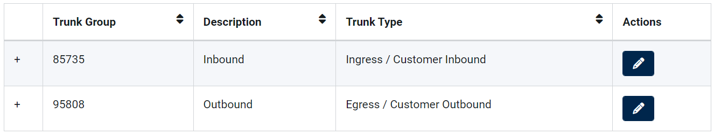
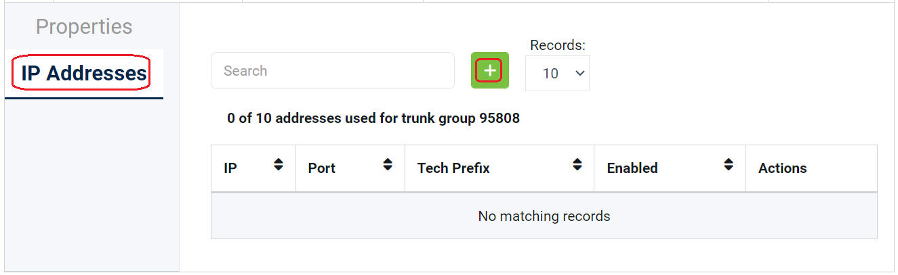
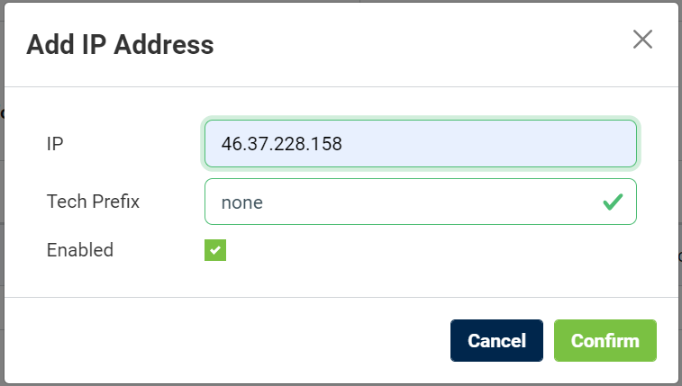
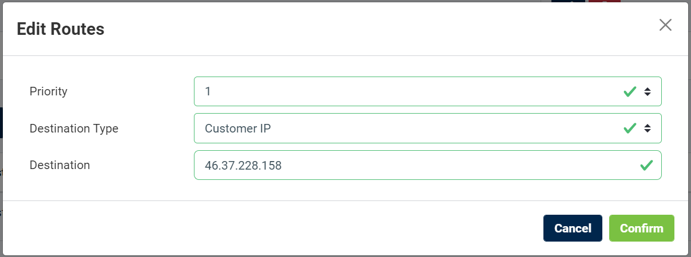
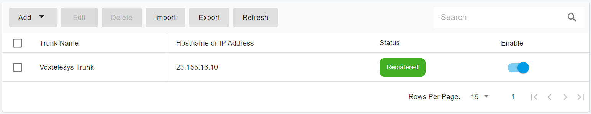

# Configuring Voxtelesys IP Authentication Trunk

Before proceeding with the next steps, you need to [purchase a DID on the Voxtelesys platform](purchase-a-did-on-questblue-platform.md).

### Create a SIP Trunk on the Voxtelesys platform

In the Voxtelesys portal, SIP trunks are managed under **SIP Trunks**.\
These trunks are automatically created by Voxtelesys and used internally for routing.

* **Inbound Trunk**
  * Handles calls and SMS from Voxtelesys to PortSIP PBX
* **Outbound Trunk**
  * Handles calls and SMS from PortSIP PBX to Voxtelesys

You do not need to manually create these trunks.\
Instead, you must **authorize your PBX IP address** on both the inbound and outbound trunk groups.

<figure><figcaption></figcaption></figure>

***

#### Add PBX IP Address to the Outbound Trunk Group

The Outbound Trunk Group is used for outbound calls and SMS from PortSIP PBX.

1. Navigate to **SIP Trunks**.
2. Select the **Outbound Trunk Group**.
3. Open the **IP Addresses** tab.
4. Click the **green (+)** icon to add a new IP address.

<figure><figcaption></figcaption></figure>

5. Configure the following fields:

* **IP**
  * Enter your **PortSIP PBX static public IP address**.
* **Tech Prefix**
  * Leave set to **none** (default).
  * Use only if you need a prefix for advanced SIP routing scenarios.
* **Enabled**
  * Check this option to enable the IP address.

6. Save the changes.

<figure><figcaption></figcaption></figure>

***

#### Add PBX IP Address to the Inbound Trunk Group

The **Inbound Trunk Group** is used for **inbound calls and SMS** from Voxtelesys to PortSIP PBX.

1. In the **SIP Trunks** section, select the **Inbound Trunk Group**.
2. Navigate to the **Routing** tab.
3. Click the **green (+)** icon to add a new route.

<figure><figcaption></figcaption></figure>

1. Enter a **friendly name** for the route.
2. Click **Confirm** to create the route.
3. Double-click the newly created route to expand it.
4. Click the **Edit (pencil)** icon.
5. Configure the following fields:

* **Priority**
  * Set the priority level for this route.
* **Destination Type**
  * Select **Customer IP**.
* **Destination**
  * Enter your **PortSIP PBX static public IP address**.

6. Save the route configuration.

<figure><figcaption></figcaption></figure>

If multiple inbound routes exist, you can adjust the inbound route priority as below:

1. Click **Edit Priorities**.
2. Use the priority drop-down list to adjust the **Customer IP** route position.
3. Click **Confirm Changes** to apply the updated priority order.

***

### Assign DID Numbers to a SIP Trunk

After purchasing DID numbers on **Voxtelesys**, you must assign them to the appropriate SIP trunk.

#### Step 1: Assign a DID to the Trunk

1. Sign in to your **Voxtelesys** account.
2. Navigate to **Telephone Numbers > Telephone Numbers**.
3. Locate the DID you want to assign.
4. Click the **Edit (pen)** icon next to the DID.
5. In the popup window, select the desired **SIP Trunk** from the **Trunk** drop-down list.
6. Click **Submit** to save the changes.

Repeat these steps to assign additional DID numbers as needed.

***

### Configure an IP Authentication Trunk in PortSIP PBX

The **Voxtelesys IP Authentication Trunk** corresponds to an **IP-Based Trunk** in PortSIP PBX.

> ❗**Important**\
> IP-Based Trunks **must be configured at the System Administrator level**.\
> Once configured, the trunk can be **shared with one or more tenants**.

***

#### Step 1: Create the IP-Based Trunk

1. Sign in to the **PortSIP PBX Web Portal** as a **System Administrator**.
2. Navigate to **Call Manager > Trunks**.
3. Click **Add**, then select **IP Based Trunk**.

<figure><figcaption></figcaption></figure>

***

#### Step 2: Configure Basic Trunk Settings

Enter the following information:

* **Name**\
  Enter a friendly name for the trunk (for example, `Voxtelesys-IP-Trunk`).
* **Brand**\
  Select **Voxtelesys** from the Brand list.
*   **Hostname or IP Address**\
    Enter the Voxtelesys SIP IP address:

    ```
    23.155.16.10
    ```

Click **Next** to continue.

<figure><figcaption></figcaption></figure>

***

#### Step 3: Configure Call Capacity

* **Max Concurrent Calls**\
  Defines the maximum number of simultaneous calls that PortSIP PBX can establish through this trunk.
  * Adjust this value according to your Voxtelesys service plan and expected traffic.

Leave all other options at their default values unless you have specific requirements.

Click **Next** to continue.

<figure><figcaption></figcaption></figure>

***

#### Step 4: Assign Tenants and DID Pool

1. Assign the trunk to one or more tenants.
2. Provide Voxtelesys DID numbers to each tenant using the **DID Pool**.

> ❗**Important**
>
> * Each DID can be assigned to **only one tenant**.
> * A tenant can use **only the DID numbers in its DID pool** to:
>   * Create inbound and outbound call rules
>   * Configure outbound caller IDs for extensions

**DID Pool Format Examples**

```
16468097065
16468097065;16468097066
16468097065-16468097066;16468097069
16468097065-16468097066;16468097070-16468097080
```

Click **OK** to save the configuration.

<figure><figcaption></figcaption></figure>

***

#### Expected Result

* The Voxtelesys IP-Based trunk is successfully created.
* The trunk status displays **Online** in the trunk list\
  &#xNAN;_(this is expected behavior for IP-Based Trunks)_.

<figure><figcaption></figcaption></figure>

***

### Next Steps

The Vonage IP Authentication Trunk is now ready for use.

You can proceed to:

* Configure outbound call routing rules
* Configure inbound DID routing
* Assign outbound caller IDs

Refer to the next guide section: [Configuring Outbound & Inbound Calls](configuring-outbound-and-inbound-calls.md).


