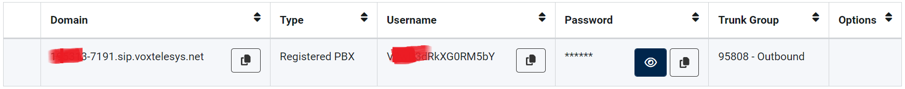
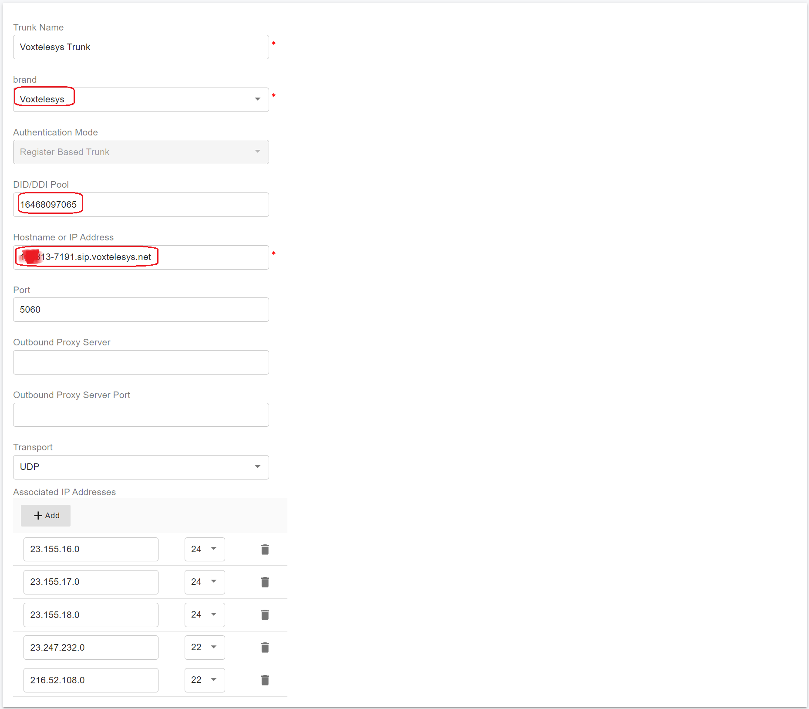
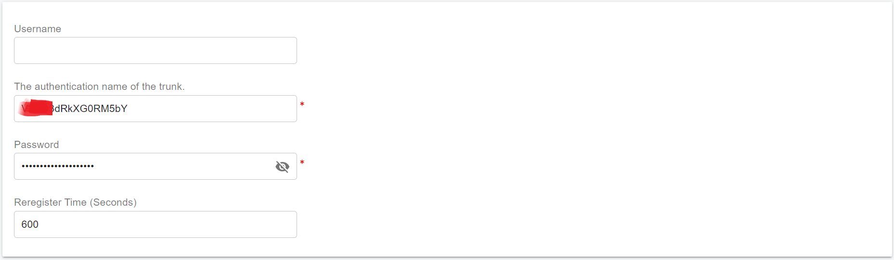

# Configuring Voxtelesys Register Authentication Trunk

Before proceeding with the next steps, you need to [purchase a DID on the Voxtelesys platform](purchase-a-did-on-questblue-platform.md).

## Collecting Settings for PortSIP PBX

In order to be able to register and operate the trunk in your PortSIP PBX, you will to gather some information that will be needed in the configuration of the trunk in PortSIP PBX.

1. Navigate the menu **SIP Registrations**
2. Copy the below items and note them
   * **Domain**
   * **Username**
   * **Password**

<figure><figcaption></figcaption></figure>

From here, this is all we need to do on Voxtelesys’s side of things. We can now move on to PortSIP PBX to configure the Voxtelesys trunk.

## Configure Register Based Trunk in PortSIP PBX

The **Voxtelesys Registration** trunk refers to the **Register Based Trunk** in PortSIP PBX. You can configure the Register Based Trunk at either the PortSIP PBX **system administrator level** or the **Tenant Admin level**:

* If configured at the system administrator level, you can share this trunk with tenants.
* If configured at the tenant admin level, this trunk can only be used by the tenant itself

Please follow the below steps:

1. Sign in to the PortSIP PBX Web Portal as a System Administrator or Tenant Admin. Navigate to the left menu and select **Call Manager > Trunks**.&#x20;
2. Click the **Add** button to open a menu. From the menu, choose **Register Based Trunk**.

<figure><figcaption></figcaption></figure>

3. Enter the trunk name and choose the brand:
   * **Name**: Enter a friendly name for the trunk.
   * **Brand**: Select **Voxtelesys** for this field.
   * **DID Pool**: This step is only for you at the _**Tenant admin Level**_ to configure this **Register Based Trunk**,  you will need to set up your Voxtelesys DID numbers for this DID pool for this trunk.
     * This tenant can only use the DID numbers within the DID pool range to create inbound and outbound rules and configure the outbound caller ID for extensions.
     * &#x20;The DID pool can consist of a single number, a range of numbers, or a combination of both. For example:
       * `16468097065`
       * `16468097065-16468097066`
       * `16468097065-16468097066;16468097069`&#x20;
       * `16468097065-16468097066;16468097070-16468097080`
   * Hostname or IP Address: Paste the **Domain** that you copied in the [Collecting Settings for PortSIP PBX](configuring-questblue-register-authentication-trunk.md#collecting-settings-for-portsip-pbx) section.

<figure><figcaption></figcaption></figure>

4. Click the **Next** button, and set up the trunk credentials.
   * Authentication name: Paste the **Username** that you copied in the [Collecting Settings for PortSIP PBX](configuring-questblue-register-authentication-trunk.md#collecting-settings-for-portsip-pbx) section.
   * Password: Paste the **Password** that you copied in the [Collecting Settings for PortSIP PBX](configuring-questblue-register-authentication-trunk.md#collecting-settings-for-portsip-pbx) section.

<figure><figcaption></figcaption></figure>

5. Click the **Next** button, you can adjust the options for the trunk.
   * &#x20;**Max Concurrent Calls:** This field sets the maximum number of calls that PortSIP can establish with this trunk. You can adjust it to an appropriate value.
   * We recommend keeping the default settings for other options unless you have specific requirements.

<figure><figcaption></figcaption></figure>

6. This step is only available when configuring the Register-Based Trunk at the _**System Administrator Level**_. Click the **Next** button to assign this trunk to the tenants and provide your Voxtelesys DIDs/Numbers to them with the DID Pool (DID numbers).  A DID can be only assigned to one tenant.
   * A tenant assigned to this trunk can only use the DID numbers within the DID pool range to create inbound and outbound rules and configure the outbound caller ID for extensions.
   * DID Pool: The DID pool can consist of a single number, a range of numbers, or a combination of both. For example:
     * `16468097065`
     * `16468097065;16468097066`
     * `16468097065-16468097066;16468097069`&#x20;
     * `16468097065-16468097066;16468097070-16468097080`

<figure><figcaption></figcaption></figure>

Click the **OK** button to save the changes, the trunk configuration is completed.

Once the PortSIP PBX successfully registers this trunk to the Voxtelesys platform, in the trunk list page you will see the status displayed as **Registered**.

<figure><figcaption></figcaption></figure>

Now you can follow the article to [Configuring inbound and outbound calls.](configuring-outbound-and-inbound-calls.md)

