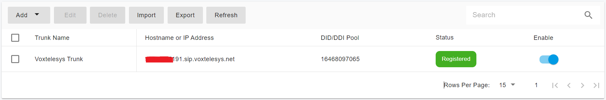

# Configuring Voxtelesys Register Authentication Trunk

Before proceeding with the next steps, you need to [purchase a DID on the Voxtelesys platform](purchase-a-did-on-questblue-platform.md).

### Collect Settings for PortSIP PBX

Before configuring the Voxtelesys trunk in PortSIP PBX, you must first collect the required **SIP registration details** from the **Voxtelesys** platform.

These values are required for the **Register-Based Trunk** configuration in PortSIP PBX.

***

#### Step 1: Retrieve SIP Registration Details from Voxtelesys

1. Sign in to your **Voxtelesys** account.
2. Navigate to **SIP Registrations**.
3. Copy and securely record the following information:
   * **Domain**
   * **Username**
   * **Password**

> ❗**Note**\
> These credentials will be used by PortSIP PBX to register to the Voxtelesys SIP trunk.\
> Keep them secure and do not share them publicly.

At this point, no further configuration is required on the Voxtelesys side.\
You can now proceed to configure the trunk in **PortSIP PBX**.

<figure><figcaption></figcaption></figure>

***

### Configure a Register Authentication Trunk in PortSIP PBX

The **Voxtelesys Registration Trunk** corresponds to a **Register-Based Trunk** in PortSIP PBX.

> ❗**Important**
>
> * The Register-Based Trunk can be configured at either the **System Administrator** level or the **Tenant Administrator** level.
> * If configured at the **System Administrator** level, the trunk can be **shared with multiple tenants**.
> * If configured at the **Tenant Administrator** level, the trunk is available **only to that tenant**.

***

#### Step 1: Create the Register-Based Trunk

1. Sign in to the PortSIP PBX Web Portal as a **System Administrator** or **Tenant Administrator**.
2. Navigate to **Call Manager > Trunks**.
3. Click **Add**, then select **Register Based Trunk**.

<figure><figcaption></figcaption></figure>

***

#### Step 2: Configure Basic Trunk Settings

Enter the following information:

* **Name**\
  Enter a friendly name for the trunk (for example, `Voxtelesys-Reg-Trunk`).
* **Brand**\
  Select **Voxtelesys**.
*   **DID Pool** _(Tenant Admin level only)_\
    If configuring this trunk at the **Tenant Administrator** level, specify the Voxtelesys DID numbers assigned to this tenant.

    > ❗**Important**
    >
    > The tenant can use **only the DID numbers in its DID pool** to:
    >
    > * Create inbound and outbound call rules
    > * Configure outbound caller IDs for extensions
* **Hostname or IP Address**\
  Paste the **Domain** copied earlier from the [Collect Settings for PortSIP PBX](configuring-questblue-register-authentication-trunk.md#collect-settings-for-portsip-pbx) section.

**DID Pool Format Examples**

```
16468097065
16468097065;16468097066
16468097065-16468097066;16468097069
16468097065-16468097066;16468097070-16468097080
```

Click **Next** to continue.

<figure><figcaption></figcaption></figure>

***

#### Step 3: Configure Trunk Credentials

Enter the SIP registration credentials obtained earlier:

* **Authentication Name**\
  Paste the **Username** copied from Voxtelesys.
* **Password**\
  Paste the **Password** copied from Voxtelesys.

Click **Next** to continue.

<figure><figcaption></figcaption></figure>

***

#### Step 4: Configure Trunk Options

* **Max Concurrent Calls**\
  Specifies the maximum number of simultaneous calls that PortSIP PBX can establish using this trunk.
  * Adjust this value based on your Voxtelesys service plan and expected call volume.

Leave all other options at their default values unless you have specific requirements.

Click **Next** to continue.

<figure><figcaption></figcaption></figure>

***

#### Step 5: Assign Tenants and DID Pool _(System Admin level only)_

This step is available **only** when configuring the trunk at the **System Administrator** level.

1. Assign the trunk to one or more tenants.
2. Provide Voxtelesys DID numbers to each tenant using the **DID Pool**.

> ❗**Important**
>
> * Each DID can be assigned to **only one tenant**.
> * A tenant can use **only the DID numbers in its DID pool** to:
>   * Create inbound and outbound call rules
>   * Configure outbound caller IDs for extensions

**DID Pool Format Examples**

```
16468097065
16468097065;16468097066
16468097065-16468097066;16468097069
16468097065-16468097066;16468097070-16468097080
```

Click **OK** to save the configuration.

<figure><figcaption></figcaption></figure>

***

#### Expected Result

* The Voxtelesys Register-Based trunk is successfully created in PortSIP PBX.
* PortSIP PBX registers to the Voxtelesys platform using the provided credentials.
* The trunk status displays **Online** in the trunk list.

<figure><figcaption></figcaption></figure>

### Next Steps

The Vonage IP Authentication Trunk is now ready for use.

You can proceed to:

* Configure outbound call routing rules
* Configure inbound DID routing
* Assign outbound caller IDs

Refer to the next guide section: [Configuring Outbound & Inbound Calls](configuring-outbound-and-inbound-calls.md).


