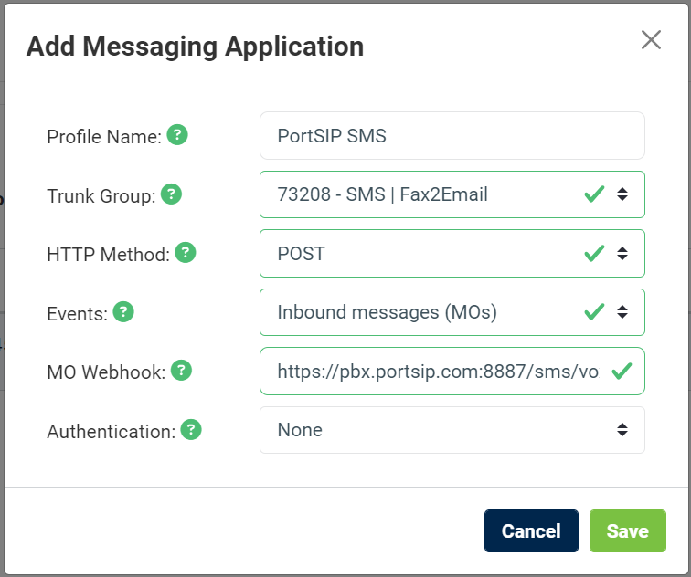

# Voxtelesys SMS Integration

Before proceeding with the next steps, you need to [purchase a DID on the Voxtelesys platform](purchase-a-did-on-questblue-platform.md) with SMS/MMS enabled.

***

### Create a Voxtelesys API Key

To enable **SMS/MMS sending** from PortSIP PBX, you must create a **Voxtelesys API key**.

#### Step 1: Generate the API Key

1. Sign in to the [Voxtelesys Portal](https://portal.voxtelesys.net/).
2. Navigate to **API Keys > Keys**.
3. Click **Create Key**.
4. Copy the generated **API key** and store it securely.

> **Important**\
> The API key is required later when configuring SMS/MMS in PortSIP PBX.\
> Treat it as a sensitive credential. If the key is compromised, revoke it and create a new one immediately.

<figure><figcaption></figcaption></figure>

***

### Configure SMS with Voxtelesys Trunk in PortSIP PBX

Before configuring SMS in PortSIP PBX, ensure that a Voxtelesys SIP trunk has already been configured using one of the following guides:

* [Configuring Voxtelesys Register Based Trunk](configuring-questblue-register-authentication-trunk.md)
* [Configuring Voxtelesys IP-Based Trunk](configuring-questblue-ip-authentication-trunk.md)

Once the SIP trunk is ready, you can proceed with the SMS/MMS configuration in PortSIP PBX.

***

### Sign in to the PortSIP PBX Web Portal

You can access the tenant configuration using one of the following methods:

#### Option 1: Sign in as System Administrator

1. Sign in to the PortSIP PBX Web Portal as a **System Administrator**.
2. Navigate to **Tenants**.
3. Select the desired tenant and click **Manage** to switch to that tenant’s administration context.

#### Option 2: Sign in as Tenant Administrator

* Sign in directly as a **Tenant Administrator** to manage the tenant.

> **Note**\
> For more information about tenant roles and permissions, refer to [Tenant Management](../../portsip-pbx-administration-guide/3-tenant-management/).

***

### Add an SMS Configuration in PortSIP PBX

To enable SMS/MMS using the **Voxtelesys trunk**, you must create an SMS configuration in PortSIP PBX.

***

#### Step 1: Create the SMS Configuration

1. In the PortSIP PBX Web Portal, navigate to **SMS/MMS** from the left-hand menu.
2. Click **Add**.
3. Select your configured **Voxtelesys trunk**.
4. Configure the following fields:
   * **Sender ID**
     * Optional.
     * Leave this field empty unless Voxtelesys has explicitly enabled and provided a Sender ID for your account.
   * **API Key**
     * Paste the **Voxtelesys API Key** you created earlier.
5. Click **OK** to save the configuration.

<figure><figcaption></figcaption></figure>

***

#### Step 2: Copy the Webhook URL

6. After saving, you will be redirected to the **SMS/MMS list** page.
7. Obtain the **Webhook URL** using one of the following methods:
   * Select the SMS configuration and click **Copy Webhook**.
   * Or, double-click the SMS configuration to open its details page, then copy the **Webhook URL** from there.

> **Important**\
> The Webhook URL is required for Voxtelesys to deliver **inbound SMS/MMS messages** to PortSIP PBX.\
> You will configure this URL on the Voxtelesys side in the next step.

***

### Configure SMS in Voxtelesys

After creating the SMS configuration in PortSIP PBX, you must configure **Voxtelesys** to deliver inbound SMS/MMS messages to PortSIP PBX.

***

#### Step 1: Create a Messaging Application

1. Sign in to the [Voxtelesys Portal](https://portal.voxtelesys.net/).
2. Navigate to **APIs > Messaging Applications**.
3. Click **Create Application**.
4. Configure the application with the following values:
   * **Profile Name**: `PortSIP SMS`
   * **Trunk Group**:
     * Select the **same trunk group** associated with the API key you created earlier.
   * **HTTP Method**: `POST`
   * **Events**: `Inbound Messages (MOs)`
   * **MO Webhook**:
     * Paste the **PortSIP PBX Webhook URL** you copied in the previous steps.
   * **Authentication**: `None`
5. Click **Save** to create the messaging application.

<figure><figcaption></figcaption></figure>

***

#### Step 2: Enable SMS on the DID Number

1. Navigate to **Phone Numbers > Numbers**.
2. Click the **pencil (Edit)** icon next to the DID number that will receive SMS messages.
3. In the pop-up window, configure the following settings:
   * **SMS Enabled**: ✔ Enable
   * **Service Trunk**: `SMS | Fax2Email`
   * **Messaging Application**: `PortSIP SMS`
   * **Campaign**:
     * Select the appropriate campaign value based on your compliance requirements.
4. Click **Confirm** to save the changes.

Your Voxtelesys SMS integration with PortSIP PBX is now complete.

<figure><figcaption></figcaption></figure>

***

#### Additional Notes and Best Practices

* Ensure the DID number (with SMS enabled) is assigned to the correct user or extension in PortSIP PBX.
* Inbound SMS routing in PortSIP PBX follows the same inbound rules logic as voice calls.
* Number Format Requirement:
  * PortSIP PBX supports SMS in E.164 format.
  * Ensure:
    * DID numbers in PortSIP PBX are configured in E.164 format.
    * The Voxtelesys Messaging Application uses E.164.
    * The Inbound Trunk on Voxtelesys is also configured for E.164.

> **Best Practice**\
> Using E.164 formatting consistently avoids delivery failures and ensures correct sender/recipient matching across SIP trunks and messaging platforms.

***

### Verify Configuration

You can now [create Outbound and Inbound Rules](configuring-outbound-and-inbound-calls.md) in PortSIP PBX for sending and receiving SMS/MMS using the Voxtelesys trunk, exactly the same way you configure rules for voice calls.

