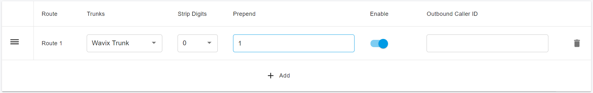
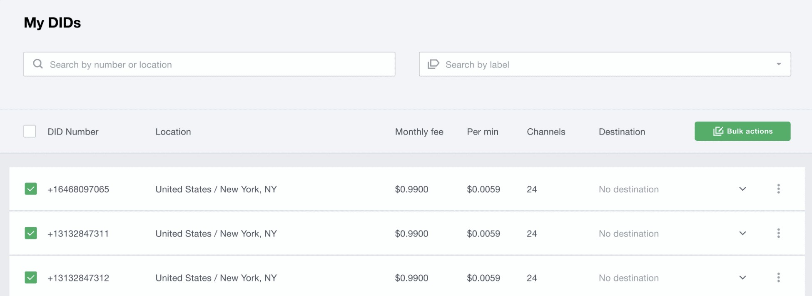

# Configuring Outbound & Inbound Calls

You need to sign in to the PortSIP PBX web portal to create the outbound and inbound rules for making & receiving calls.

***

### Sign in to the PortSIP PBX Web Portal

To configure outbound and inbound call routing, you must first sign in to the PortSIP PBX Web Portal.

You can access a tenant in one of the following ways:

#### Option 1: Sign in as System Administrator

1. Sign in to the PortSIP PBX Web Portal as a **System Administrator**.
2. Navigate to **Tenants**.
3. Select the desired tenant and click **Manage** to switch to that tenant’s administration context.

#### Option 2: Sign in as Tenant Administrator

* Sign in directly as a **Tenant Administrator** to manage that tenant.

> ❗**Note**\
> For more information about tenant roles and access control, refer to [Tenant Management](../../portsip-pbx-administration-guide/3-tenant-management/).

***

### Configure Outbound and Inbound Call Routing with Wavix in PortSIP PBX

This section explains how to configure **Outbound Rules**, **Inbound Rules**, and **Wavix-side routing** so your PortSIP PBX can successfully place and receive calls using a Wavix SIP trunk.

***

### Configure Outbound Rules

Outbound Rules define how extensions place calls and which SIP trunk is used to route those calls.

#### Add an Outbound Rule in PortSIP PBX

1. Sign in to the **PortSIP PBX Web Portal**.
2. In the left-hand menu, navigate to:\
   **Call Manager > Outbound Rules**
3. Click **Add**.
4. Enter a **Name** for the outbound rule.
5. Under **Apply this rule to the following calls**, configure at least one matching condition (for example, number length or prefix).

<figure><figcaption></figcaption></figure>

***

#### Select the Trunk Route

1. Scroll to **Place outbound calls using the following trunk routes**.
2. Click the **Add** icon.
3. Select the **Wavix Trunk**.
4. Click **Save** to apply the outbound rule.

<figure><figcaption></figcaption></figure>

***

#### Number Format Requirements (Wavix)

When placing outbound calls via the Wavix trunk, **all destination numbers must be in E.164 international format**.

**E.164 format rules**

* Maximum of **15 digits**
* Format:\
  `+[country code][subscriber number including area code]`
* Example (US number):\
  `+16561223344`

> **Important**\
> Calls to numbers **without a country code** or containing **national access prefixes** (for example, `0` or `00`) will be **rejected by the Wavix platform**.

<figure><figcaption></figcaption></figure>

**Dialing Normalization**

Depending on your users’ dialing habits, you may need to:

* Strip leading digits, or
* Prepend a country code

**Example**\
If users dial U.S. domestic numbers without the leading `1`, configure the outbound rule to **prepend `1` automatically** so the final number conforms to E.164 format.

<figure><figcaption></figcaption></figure>

***

### Configure Inbound Rules

Inbound Rules determine how incoming calls from Wavix are routed to extensions, voicemail, or other destinations.

#### Add an Inbound Rule in PortSIP PBX

1. In the PortSIP PBX Web Portal, navigate to:\
   **Call Manager > Inbound Rules**
2. Click **Add**.
3. Enter a **Name** for the inbound rule.
4. Click **Choose a Trunk** and select the **Wavix Trunk**.
5. In the **DID/DDI Number** or **Number Range** field, enter the DID(s).
   * The number must fall within the **DID pool range** of the selected trunk.
6. Select the **Extension** (or destination) to route incoming calls to.
7. Click **OK** to save the rule.

<figure><figcaption></figcaption></figure>

***

#### Optional: Office Hours Routing

Based on business requirements, you may:

* Define office hours
* Route calls differently outside business hours
* Send calls to voicemail
* Automatically reject calls

> **Note**\
> For more information, see [Office Hours and Holiday Schedule](../../portsip-pbx-administration-guide/office-hours-and-holiday-schedule/).&#x20;

***

### Configure Call Routing in Wavix

To deliver inbound calls to your PortSIP PBX, you must also configure routing on the Wavix platform.

#### Configure Routing for a DID

1. Log in to your **Wavix account**.
2. Navigate to **Numbers & Trunks > My Numbers**.
3. Click the **three-dot (⋯)** menu next to the DID.
4. Select **Edit DID**.

<figure><figcaption></figcaption></figure>

5. In the **Destination** section, select the appropriate **trunk**.
6. Click **Add** to add the destination.
7. Click **Save** to apply the changes.

<figure><figcaption></figcaption></figure>

**Bulk Editing**

* To modify multiple DIDs at once:
  1. Select multiple numbers.
  2. Click **Bulk actions**.
  3. Apply the desired changes.

<figure><figcaption></figcaption></figure>

***

### Inbound Routing for IP Authentication Trunks

> **Skip this section** if your Wavix trunk uses **Digest (Register-Based) Authentication**.

#### Important Limitation

SIP trunks configured with **IP authentication** do **not register** with Wavix proxies.\
As a result, inbound routing **cannot rely on registration** and must use a **static SIP URI** instead.

***

#### Configure Inbound Routing to a SIP URI

1. Log in to your **Wavix account**.
2. Navigate to **Numbers & Trunks > My DIDs**.
3. Click the **three-dot (⋯)** menu next to the DID and select **Edit DID**\
   (double-click is also supported).
4. In the **Transport** drop-down menu, select **SIP URI**.
5. Enter a valid SIP URI using the following format:

```
+[did]@FQDN:port;transport=connection
```

Where:

* **\[did]** – The destination phone number (auto-filled by Wavix at runtime)
* **FQDN** – Fully qualified domain name or IP address of the PortSIP PBX
* **port** – SIP listening port on the PBX
* **connection** – `udp`, `tcp`, or `tls` (default is `udp`)

**Examples**

If:

* PBX domain: `sip.yourpbx.com`
* PBX IP: `98.11.99.12`
* SIP port: `5060`
* Transport: UDP

Valid SIP URIs include:

```
+did@sip.yourpbx.com:5060;transport=udp
+did@98.11.99.12:5060;transport=udp
```

6. Click **Add** to add the destination.
7. Click **Save** to apply the settings.

> **Note**\
> The `[did]` parameter is automatically replaced with the actual dialed number when the call is routed.

**Bulk Editing**

* You can update multiple DIDs simultaneously using **Bulk actions**.
* Changes apply to **all selected numbers**.

***

#### Final Validation Checklist

Before testing inbound calls, ensure that:

* All Wavix DIDs are included in the **DID Pool** of the Wavix trunk in PortSIP PBX
* Outbound rules enforce **E.164 number formatting**
* Inbound rules match the correct DID ranges
* SIP ports and transports are reachable from Wavix

***

#### Configure Time-Based Routing (Optional)&#x20;

Depending on your business requirements, you can further enhance the inbound rule by:

* Defining **office hours** or schedules
* Routing calls to **different extensions** based on time of day
* Sending calls to **voicemail** outside business hours
* Automatically **rejecting or dropping calls** based on the schedule

For more details, refer to [Call Route Management](../../portsip-pbx-administration-guide/8-call-route-management/).<br>


