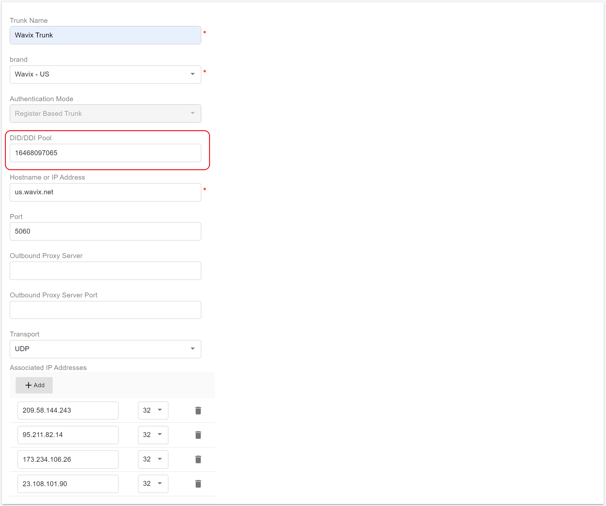

# Configuring Wavix Digest Trunk

Before proceeding with the next steps, you need to [purchase a DID on the Wavix platform](purchase-a-did-on-wavix-platform.md).

### Create a SIP Trunk on the Wavix Platform (Digest Authentication)

Follow the steps below to create a new SIP trunk on the Wavix platform using **Digest (username/password) authentication**.

***

#### Procedure

1. **Sign in to the Wavix Platform**\
   Log in to your Wavix account using administrator credentials.
2. **Navigate to SIP Trunks**\
   From the top menu, select **Numbers & Trunks**, then click **Trunks**.
3. **Create a New SIP Trunk**\
   Click **Create New**.
4. **Select Authentication Method**\
   Choose **Digest** as the authentication method.
5. **Configure Basic Trunk Settings**
   * **SIP Trunk Name**\
     Enter a descriptive name to identify this trunk.
   * **SIP Trunk Password**\
     Set a strong password. This password will be required when configuring the trunk in PortSIP PBX.
   * **Caller ID**\
     Select one of the DIDs on your Wavix account to be used as the default outbound caller ID.

<figure><figcaption></figcaption></figure>

6. **(Optional) Configure Usage Limits**\
   You may optionally configure the following limits for this SIP trunk:

* **Maximum outbound call duration**
* **Maximum number of simultaneous calls**
* **Maximum call cost**

> **Note**\
> If these parameters are not configured, the **global account limits** defined on your Wavix account will apply.

7. **Create the SIP Trunk**\
   Click **Create** to complete the configuration.

***

#### Result

* After the SIP trunk is successfully created, it will appear in the **SIP Trunks list** in your Wavix account.

<figure><figcaption></figcaption></figure>

***

#### Important Security and Capacity Notes

> **Security Policy – Concurrent Call Limit**\
> For security reasons, **new Wavix accounts are limited to 2 simultaneous calls by default**.

* To increase the concurrent call limit:
  * Contact your **Wavix account manager**, or
  * Email **support@wavix.com** with your request.

> **Security Recommendation**\
> Store the SIP trunk username and password securely, and avoid reusing credentials across multiple systems.

***

### Configure Digest Authentication Trunk in PortSIP PBX

A Wavix Digest Authentication trunk is configured as a **Register-Based Trunk** in **PortSIP PBX**.

You can create a Register-Based Trunk at **either** of the following levels:

* **System Administrator level**\
  The trunk can be shared with multiple tenants.
* Tenant Administrator level\
  The trunk is available only to that tenant.

***

#### Step 1: Open the Trunks Configuration Page

1. Sign in to the PortSIP PBX Web Portal as a **System Administrator** or **Tenant Admin**.
2. Navigate to **Call Manager > Trunks**.

***

#### Step 2: Add a Register-Based Trunk

1. Click **Add** to open the trunk type menu.
2. Select **Register Based Trunk**.

<figure><figcaption></figcaption></figure>

***

#### Step 3: Configure Basic Trunk Information

Configure the following fields:

* **Name**\
  Enter a descriptive name for the trunk (for example, `Wavix-US-Digest-Trunk`).
* **Brand**\
  Select the appropriate Wavix brand (for example, **Wavix – US**).

***

#### Step 4: Configure the DID Pool (Tenant Admin Only)

> **Note**\
> This step applies **only** when configuring the trunk at the **Tenant Admin level**.

* Define the **DID Pool** for this tenant.
* The tenant can use **only the DIDs in this pool** for:
  * Inbound rules
  * Outbound rules
  * Outbound caller ID configuration

**DID Pool format examples:**

```
16468097065
16468097065-16468097066
16468097065-16468097066;16468097069
16468097065-16468097066;16468097070-16468097080
```

Click **Next** to continue.

<figure><figcaption></figcaption></figure>

***

#### Step 5: Configure SIP Authentication

Enter the credentials created on the Wavix platform:

* **SIP Trunk ID**\
  The 5-digit SIP trunk username generated by Wavix.
* **Password**\
  The SIP trunk password configured in the Wavix portal.

Click **Next**.

<figure><figcaption></figcaption></figure>

***

#### Step 6: Configure Trunk Options

* **Max Concurrent Calls**\
  Sets the maximum number of simultaneous calls PortSIP PBX can establish using this trunk.\
  Adjust this value according to your Wavix account limits.

> **Recommendation**\
> Keep all other settings at their default values unless you have specific routing or interoperability requirements.

Click **Next**.

<figure><figcaption></figcaption></figure>

***

#### Step 7: Assign Tenants and DID Numbers (System Admin Only)

> **Note**\
> This step is available **only** when configuring the trunk at the **System Administrator level**.

* Assign the trunk to one or more tenants.
* Configure the **DID Pool** for each tenant.

> **Important**
>
> * Each DID can be assigned to **only one tenant**.
> * Tenants can use **only their assigned DID pool** for inbound routing, outbound routing, and outbound caller ID.

**DID Pool format examples:**

```
16468097065
16468097065;16468097066
16468097065-16468097066;16468097069
16468097065-16468097066;16468097070-16468097080
```

<figure><figcaption></figcaption></figure>

Click **OK** to save the trunk configuration.

***

### Verification

After PortSIP PBX successfully registers the trunk with Wavix:

* The trunk appears in the **Trunks list**
* The **Status** displays **Online**

> **Expected Outcome**\
> “Online” confirms that PortSIP PBX has successfully authenticated with the Wavix SIP platform using Digest authentication.

<figure><figcaption></figcaption></figure>

***

### Next Steps

You can now proceed to:

* Configure inbound call routing
* Configure outbound call routing
* Assign outbound caller IDs and test call flows

Continue with the next guide: [Configuring inbound and outbound calls](configuring-outbound-and-inbound-calls.md).


