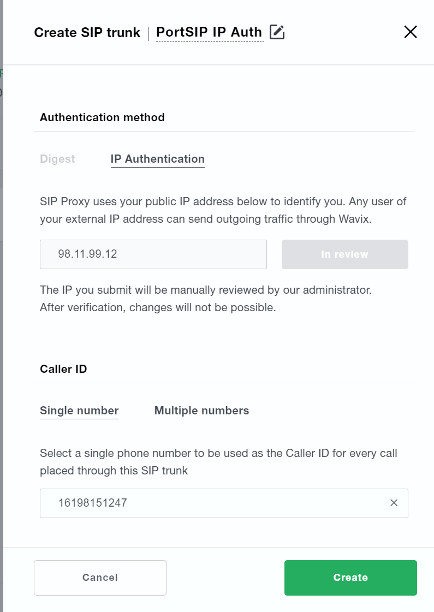
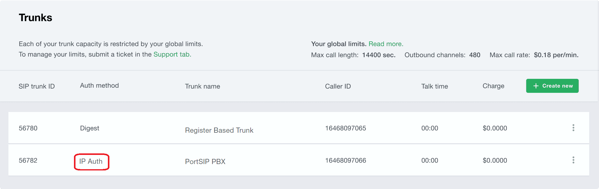
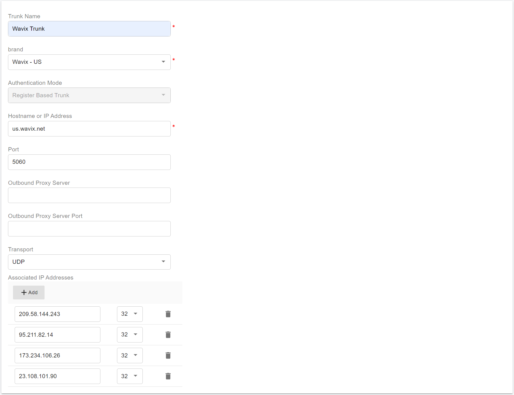

# Configuring Wavix IP Authentication Trunk

Before proceeding with the next steps, you need to [purchase a DID on the Wavix platform](purchase-a-did-on-wavix-platform.md).

***

### Create a SIP Trunk on the Wavix Platform

#### Procedure

1. **Sign in to the Wavix Platform**\
   Log in to your Wavix account using administrator credentials.
2. **Navigate to SIP Trunks**\
   From the top menu, go to **Numbers & Trunks**, then select **Trunks**.
3. **Create a New Trunk**\
   Click **Create New**.
4. **Select Authentication Method**\
   Choose **IP Authentication** as the authentication method.
5. **Enter PBX IP Address**\
   Enter the **static public IP address** of your PortSIP PBX, then click **Submit**.
   * The **Submit** button will be disabled and the trunk status will change to **In Review**.
6. **Save the Configuration**\
   Click **Save** to apply the changes.

<figure><figcaption></figcaption></figure>

***

#### Approval and Activation

Once the request is reviewed and approved by the Wavix Operations team, IP authentication will be enabled on your SIP trunk.\
After approval, the SIP trunk will appear in your **SIP Trunks list** and be available for use.

<figure><figcaption></figcaption></figure>

***

#### Important Notes and Restrictions

> **Warning – Authentication Lock**\
> After submitting an IP authentication request:
>
> * You **cannot modify** the IP address.
> * You **cannot change** the authentication method.
>
> Ensure the configured IP address is correct before submission.

> **Note – IP Address Mapping**
>
> * By default, **one IP address can be assigned to only one SIP trunk**.
> * If you require **multiple Wavix SIP trunks to share the same IP address**, contact Wavix support at **support@wavix.com**.

***

#### Call Capacity Limitation (Security Policy)

> **Security Notice**\
> For security reasons, **new Wavix accounts are limited to 2 concurrent calls by default**.

* To increase the simultaneous call limit:
  * Contact your **Wavix account manager**, or
  * Email **support@wavix.com** with your request.

***

### Configure IP Authentication Trunk in PortSIP PBX

The Wavix IP Authentication trunk is configured as an IP-Based Trunk in PortSIP PBX.

Because IP-based trunks are shared resources, they **must be created at the System Administrator** level. Once configured, the trunk can be assigned to one or more tenants, along with their associated DID numbers.

***

#### Prerequisites

Before you begin, ensure that:

* A **Wavix IP-authenticated SIP trunk** has already been created and approved on the **Wavix** platform.
* You are signed in as a **PortSIP PBX System Administrator**.
* Your Wavix DID numbers are available and ready to be assigned.

***

#### Step 1: Open the Trunks Configuration Page

1. Sign in to the **PortSIP PBX Web Portal** as a **System Administrator**.
2. Navigate to **Call Manager > Trunks** from the left-hand menu.

***

**Step 2: Add an IP-Based Trunk**

1. Click **Add** to open the trunk type menu.
2. Select **IP Based Trunk**.

<figure><figcaption></figcaption></figure>

***

#### Step 3: Configure Basic Trunk Information

On the **General Settings** page, configure the following:

* **Name**\
  Enter a descriptive, friendly name for the trunk (for example, `Wavix-US-IP-Trunk`).
* **Brand**\
  From the **Brand** drop-down list, select the Wavix trunk closest to your deployment region (for example, **Wavix – US**).

Click **Next** to continue.

<figure><figcaption></figcaption></figure>

***

#### Step 4: Configure Trunk Options

On the trunk options page:

* **Max Concurrent Calls**\
  Defines the maximum number of simultaneous calls PortSIP PBX can establish using this trunk.
  * Set this value according to your Wavix account limits and expected traffic.
  * For new Wavix accounts, this may need to match the default concurrent call restriction.

> **Recommendation**\
> Keep all other settings at their default values unless you have specific routing, codec, or interoperability requirements.

Click **Next** to continue.

<figure><figcaption></figcaption></figure>

***

#### Step 5: Assign Tenants and DID Numbers

In this step, assign the trunk and DID numbers to tenants:

* Select one or more **tenants** that are allowed to use this trunk.
* Define the **DID Pool** to assign Wavix numbers to each tenant.

> **Important Rules**
>
> * Each DID can be assigned to **only one tenant**.
> * A tenant can use **only the DIDs included in its assigned DID pool** for:
>   * Inbound rules
>   * Outbound rules
>   * Outbound caller ID configuration

***

**DID Pool Format Examples**

The DID pool supports:

*   A single number

    ```
    16468097065
    ```
*   Multiple individual numbers

    ```
    16468097065;16468097066
    ```
*   A range of numbers

    ```
    16468097065-16468097066
    ```
*   Combined ranges and individual numbers

    ```
    16468097065-16468097066;16468097070-16468097080
    ```

***

<figure><figcaption></figcaption></figure>

Click **OK** to save the trunk configuration.

***

#### Verification

After saving:

* The trunk will appear in the **Trunks list**.
*   The **Status** will display **Registered**.

    > This is expected behavior for IP-Based Trunks and does not indicate SIP registration in the traditional sense.

<figure><figcaption></figcaption></figure>

***

### Next Steps

You can now proceed to:

* Configure inbound call routing
* Configure outbound call routing
* Assign outbound caller IDs and test call flows

Continue with the next guide: [Configuring inbound and outbound calls](configuring-outbound-and-inbound-calls.md).


