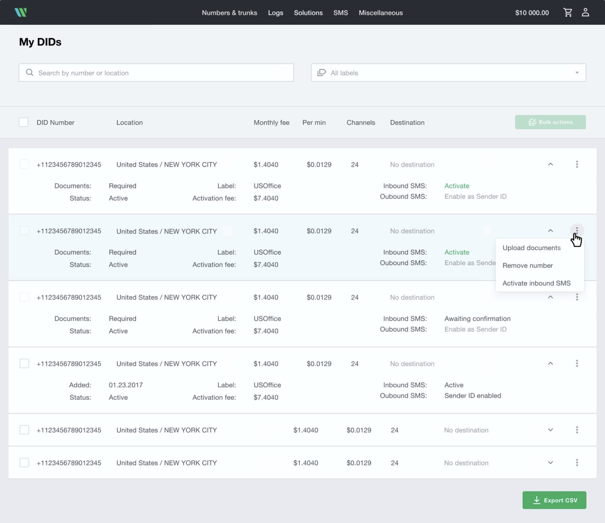
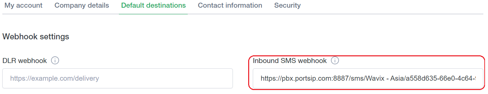
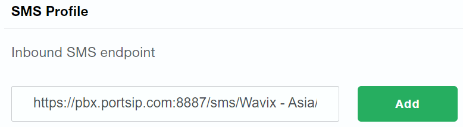

# Wavix SMS Integration

Before proceeding with the next steps, you need to [purchase a DID on the Wavix platform](purchase-a-did-on-wavix-platform.md).

### Register a Sender ID

Before sending SMS or MMS messages, you must register and activate a **Sender ID** on the Wavix platform.

A **Sender ID** is the identifier that recipients see as the message sender on their devices. Sender IDs can be:

* **Numeric** (E.164 phone numbers)
* **Alphanumeric** (brand or service names)

***

#### Sender ID Types and Messaging Capabilities

* **Two-way messaging (send and receive messages)**
  * Numeric Sender ID is required
* **One-way messaging (send-only)**
  * Both Numeric and Alphanumeric Sender IDs are supported

> **Important**\
> Alphanumeric Sender IDs **do not support inbound (reply) messages** and are suitable for notifications or marketing use cases only.

***

#### Prerequisite

* You must have already **purchased DID phone numbers** on the Wavix platform.\
  Refer to the guide [purchase a DID on the Wavix platform](purchase-a-did-on-wavix-platform.md) before continuing.

***

#### SMS-Enable Your Number (US & Canada Only)

> ⚠️ **This step applies only if**:
>
> * You have purchased **U.S. or Canadian phone numbers**, **and**
> * You want to use those numbers as **numeric Sender IDs** for SMS/MMS

Inbound SMS is supported only for U.S. and Canadian numbers.

If you are using phone numbers from other countries, or if you plan to use an alphanumeric Sender ID, skip this section and proceed to Create a Sender ID on the Wavix Platform

To activate inbound SMS/MMS for a U.S. or Canadian number:

1. Log in to your **Wavix account**.
2. From the top menu, select **Numbers & Trunks > My Numbers**.
3. Select the phone number you want to enable for inbound SMS.
4. Click the **down arrow** to expand additional details.
5. Click **Activate** next to **Inbound SMS**.

#### Support

If you have any questions or encounter issues during Sender ID registration or SMS activation:

* Open a ticket via the **Support** tab in your Wavix account, or
* Email **support@wavix.com**

<figure><figcaption></figcaption></figure>

***

### Create a Sender ID on the Wavix Platform

After activating SMS capabilities (if required), you can create a Sender ID to use when sending SMS messages.

***

#### Steps to Create a Sender ID

1. Log in to your **Wavix account**.
2. From the top menu, select **SMS > Sender IDs**.
3. Click **Add New Sender ID**.
4. Select the **Sender ID Type**:
   * **Alphanumeric**
   * **Numeric**

<figure><figcaption></figcaption></figure>

***

#### Sender ID Type Rules and Limitations

**Alphanumeric Sender ID**

* Maximum length: **11 characters**
* Allowed characters:
  * Uppercase and lowercase letters (`A–Z`, `a–z`)
  * Digits (`0–9`)
  * Spaces
* Typically used for **one-way (send-only) messaging**, such as notifications or branding.

> **Important**\
> Alphanumeric Sender IDs **do not support inbound (reply) messages**.

**Numeric Sender ID**

* Must be associated with an **SMS-enabled phone number** in your Wavix account.
* Required for **two-way messaging** (sending and receiving SMS).

> **Note**\
> If you select **Numeric Sender ID** but do not see any numbers available in the drop-down list, verify that:
>
> * The number exists in your account, and
> * The number is **SMS-enabled**.

***

#### Select Destination Countries

1. Select the **country or countries** you will be sending SMS messages to.
2. Sender ID support and restrictions vary by destination:
   * Hover over the **ⓘ (information)** icon next to each country to view specific requirements.
   * If the selected Sender ID type is **not supported** for a destination, that country will appear **greyed out**.

> **Important**
>
> * **Alphanumeric Sender IDs are not supported** in several countries, including the **United States and Canada**.
> * In some countries, Sender IDs may require **pre-registration or approval** by local carriers.

<figure><figcaption></figcaption></figure>

***

#### Review and Registration Process

* Review your Sender ID configuration and selected destinations carefully.
* Your Sender ID will be **automatically approved** for countries that do not require additional documentation.
* For countries that require registration or carrier approval:
  * A member of the **Wavix provisioning team** will contact you with further instructions and requirements.

***

### Configure SMS with Wavix Trunk in PortSIP PBX

This section explains how to configure SMS/MMS messaging in PortSIP PBX using a Wavix SIP trunk.

***

### Prerequisites

Before configuring SMS in PortSIP PBX, ensure that:

* A **Wavix SIP trunk** has already been configured using one of the following guides:
  * [Configuring Wavix IP Authentication Trunk](configuring-wavix-ip-authentication-trunk.md)
  * [Configuring Wavix Digest Trunk](configuring-wavix-digest-trunk.md)
* A **Sender ID** has been created and approved on the Wavix platform (if required)
* You have access to the **Wavix Administration** portal to generate an API key

***

### Sign in to the PortSIP PBX Web Portal

You can access the PortSIP PBX Web Portal using one of the following methods:

#### Option 1: System Administrator

1. Sign in as a **PBX System Administrator**.
2. Navigate to **Tenants**.
3. Select the target tenant.
4. Click **Manage** to switch to that tenant.

#### Option 2: Tenant Administrator

* Sign in directly as a **Tenant Admin** to manage the tenant.

> **Note**\
> For more details about tenant roles and access levels, see [Tenant Management](../../portsip-pbx-administration-guide/3-tenant-management/).

***

### Add an SMS Configuration

#### Step 1: Create or Copy a Wavix API Key

1. Log in to your [Wavix account.](https://app.wavix.com/profile/api-keys)
2. From the top menu, go to **Administration**.
3. Click **Create New** to generate a new **API Key**,\
   or copy an **existing API Key** if one is already available.
4. Save the API key securely, you will need it in the next step.

> **Security Note**\
> Treat the API key as a credential. Do not share it publicly or store it in plain text outside secure systems.

***

#### Step 2: Create an SMS Configuration in PortSIP PBX

1. Sign in to the PortSIP PBX Web Portal.
2. From the left-hand menu, navigate to:\
   **SMS/MMS**
3. Click **Add**.
4. Select your Wavix Trunk.
5. Configure the following fields:
   * **Sender ID**
     * If you want to use a **Sender ID** created on the Wavix platform, enter it here.
     * If left empty, PortSIP PBX will use the **DID number associated with the Wavix trunk** as the Sender ID.
   * **API Key**
     * Paste the **Wavix API key** you copied earlier.
6. Click **OK** to save the configuration.

<figure><figcaption></figcaption></figure>

***

### Configure Inbound SMS Webhook in Wavix

To receive inbound SMS messages in PortSIP PBX, you must configure a **Webhook URL** on the Wavix platform.

#### Step 1: Copy the PortSIP PBX Webhook URL

1. In PortSIP PBX, navigate to **Message Channel > SMS/MMS**.
2. Select the SMS configuration you just created.
3. Click **Copy Webhook**, or double-click the SMS configuration and manually copy the Webhook URL.

***

#### Step 2: Configure the Webhook in Wavix

1. Log in to your [Wavix account](https://app.wavix.com/profile/api-keys).
2. Click the **My Account** icon in the top-right corner.
3. Open the **Default Destinations** tab.
4. Paste the copied **PortSIP PBX Webhook URL** into the **Inbound SMS** (Webhook) field.
5. Click  **Save changes** to apply the changes.

<figure><figcaption></figcaption></figure>

6. Alternatively, in your Wavix account, navigate to **Numbers & Trunks > My Numbers**, select the phone number you want to modify, and paste the Webhook URL into the **Inbound SMS Endpoint** field.

<figure><figcaption></figcaption></figure>

***

### Verify the Configuration

At this point, the Wavix SMS/MMS integration is complete.

You can now [create outbound and inbound rules](configuring-outbound-and-inbound-calls.md) in PortSIP PBX to send and receive SMS/MMS messages using the Wavix trunk, just as you would configure rules for voice calls.

