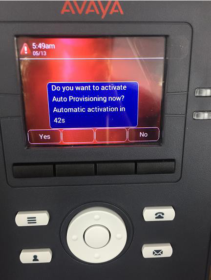
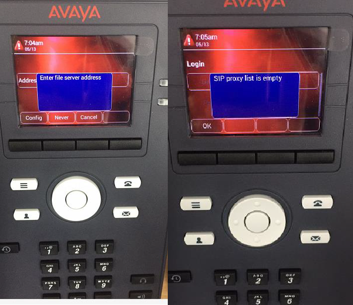
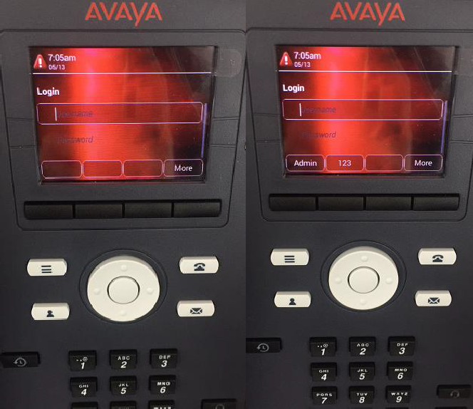

# How to Configuring Avaya J Series Phone

The Avaya J series IP phone is using widely in the customers.

This guide explains how to manually register an Avaya J139 IP Phone to PortSIP PBX in 3PCC mode.

### Audience

This guide is intended for administrators who need to configure an Avaya J139 IP Phone manually without using auto-provisioning.

### Prerequisites

Before you begin, make sure you have the following information from PortSIP PBX:

| Required item          | Description                                                                         |
| ---------------------- | ----------------------------------------------------------------------------------- |
| Extension number       | The PortSIP PBX extension assigned to the phone.                                    |
| Extension password     | The SIP authentication password for the extension.                                  |
| Tenant SIP domain      | The tenant domain configured in PortSIP PBX.                                        |
| SIP server address     | The PortSIP PBX SIP server IP address or FQDN.                                      |
| SIP port and transport | For example, UDP or TCP, depending on your PortSIP PBX SIP transport configuration. |

> **Note**\
> The default Avaya administrator password shown in this guide is `27238`. If the password was changed previously, use the current administrator password.

### 1. Start the Phone and Skip Auto-Provisioning

1. Power on the Avaya J139 IP Phone.
2. When the phone asks whether to activate auto-provisioning, select **No**.
3. Wait for the phone to finish booting.

<figure><figcaption></figcaption></figure>

### 2. Cancel the Server Address Prompt

After the phone finishes booting, it may prompt you to enter a server address.

1. Select **Cancel**.
2. Press **OK** to continue.

<figure><figcaption></figcaption></figure>

### 3. Open the Administration Menu

1. Press **More**.
2. Select **Admin**.
3. Enter the administrator password. The default password is `27238`.
4. Press **Enter**.

<figure><figcaption></figcaption></figure>

### 4. Find the Phone IP Address

1. In the Administration menu, select **IP Configuration**.
2. Locate the IP address assigned to the phone.
3. Write down the IP address. You will use it to access the phone web interface.

### 5. Sign in to the Phone Web Interface

1. Open a web browser from a computer on the same network as the phone.
2. Enter the phone IP address in the browser address bar.
3.  Sign in with the following credentials:

    | Field    | Value                                                  |
    | -------- | ------------------------------------------------------ |
    | Username | `admin`                                                |
    | Password | `27238` by default, unless it has already been changed |
4. On first sign-in, the phone requires you to change the administrator password.
5. Enter a new password that meets the phone password requirements.
6. Sign in again with the new password.

> **Password requirement**\
> The new administrator password must be 8 to 31 characters long.

### 6. Verify 3PCC Mode

After signing in to the web interface, verify that the phone is running in **3PCC** mode.

1. On the main status page, check the **Server Mode** field.
2. Confirm that the value is **3PCC**.
3. If the phone is not in 3PCC mode, go to **Environment Settings** and enable 3PCC mode first.

### 7. Configure SIP Global Settings

1. In the phone web interface, open the **SIP** tab.
2. Go to **SIP Global Settings**.
3.  Configure the following settings:

    | Setting            | Value                                                            |
    | ------------------ | ---------------------------------------------------------------- |
    | SIP Domain         | Enter the PortSIP PBX tenant SIP domain.                         |
    | Proxy Policy       | Select **Manual**.                                               |
    | SIP Proxy / Server | Enter the PortSIP PBX SIP server address in the required format. |
4.  For the SIP proxy/server address, use the following format:

    ```
    <SIP_SERVER_IP_OR_FQDN>:<PORT>;transport=<udp|tcp>
    ```

    Example:

    ```
    sip.example.com:5060;transport=udp
    ```
5. Scroll to the bottom of the page.
6. Click **Save**.

> **Note**\
> Use the SIP transport configured on PortSIP PBX. For example, use `transport=udp` for UDP or `transport=tcp` for TCP.

### 8. Configure the SIP Account

1. In the **SIP** tab, go to **SIP Account**.
2.  Configure the following fields:

    | Field                   | Value                                                                                                  |
    | ----------------------- | ------------------------------------------------------------------------------------------------------ |
    | SIP User ID             | Enter the PortSIP PBX extension number.                                                                |
    | Authentication User ID  | Enter the PortSIP PBX extension number, unless your deployment uses a different SIP authentication ID. |
    | Authentication Password | Enter the extension SIP password.                                                                      |
3. Click **Login**.
4. Confirm that the SIP account status shows as registered.

### 9. Verify Registration and Test Calls

After the account registers successfully:

1. Confirm the extension status in the PortSIP PBX web portal.
2. Place an outbound test call from the Avaya J139 IP Phone.
3. Place an inbound test call to the extension.
4. Verify two-way audio.

### Troubleshooting

#### The phone web interface cannot be opened

* Confirm that the computer and the phone are on the same network.
* Confirm that the phone has a valid IP address.
* Check whether access to the phone web interface is blocked by network security settings.

#### SIP registration fails

* Verify the extension number and SIP authentication password in PortSIP PBX.
* Confirm that the SIP Domain matches the tenant SIP domain.
* Confirm that the SIP server address, port, and transport are correct.
* Make sure the phone is in 3PCC mode.
* Check firewall and NAT rules between the phone and PortSIP PBX.

#### Calls connect but there is no audio

* Verify that RTP traffic is allowed between the phone and PortSIP PBX.
* Check NAT and firewall rules.
* Confirm that the phone and PortSIP PBX have compatible audio codec settings.

### Configuration Summary

| Avaya setting           | PortSIP PBX value                                                  |
| ----------------------- | ------------------------------------------------------------------ |
| SIP Domain              | Tenant SIP domain                                                  |
| Proxy Policy            | Manual                                                             |
| SIP Proxy / Server      | PortSIP PBX SIP server address, port, and transport                |
| SIP User ID             | Extension number                                                   |
| Authentication User ID  | Extension number, unless a different SIP authentication ID is used |
| Authentication Password | Extension SIP password                                             |
