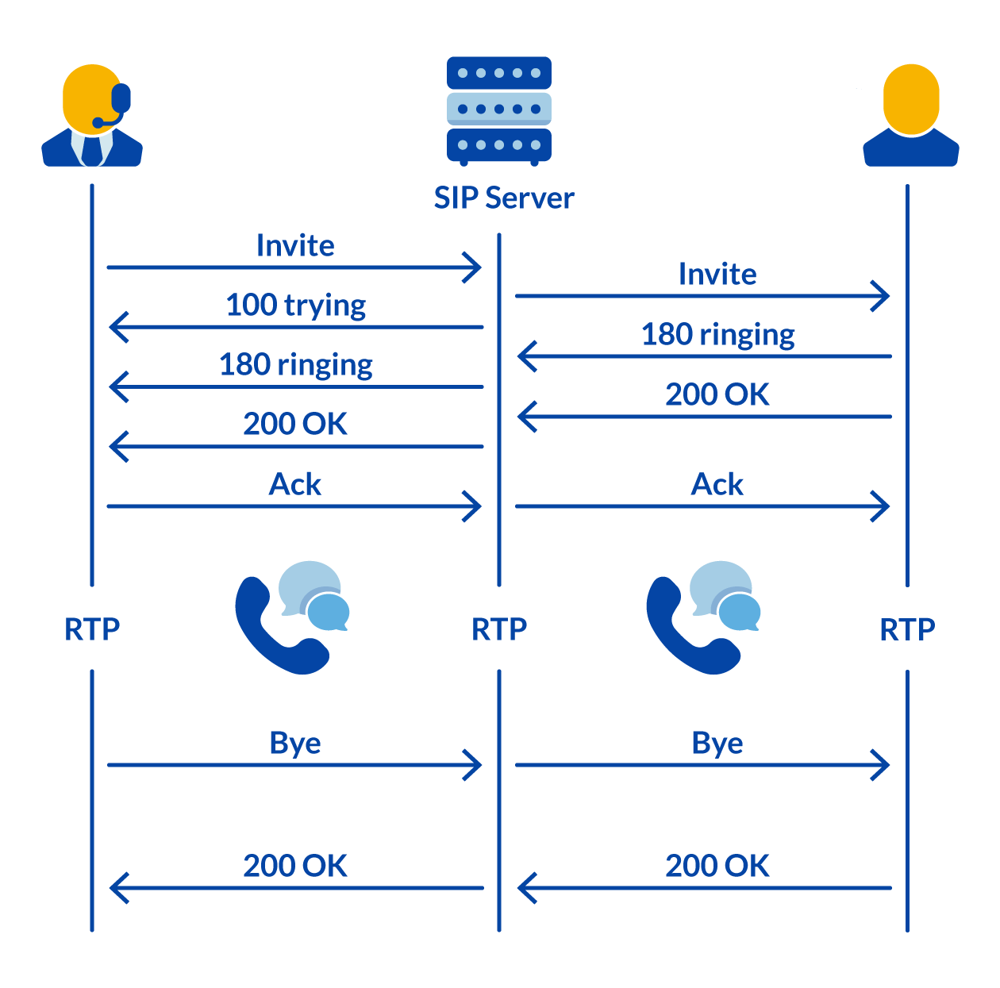
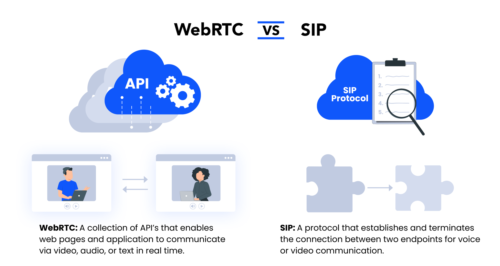
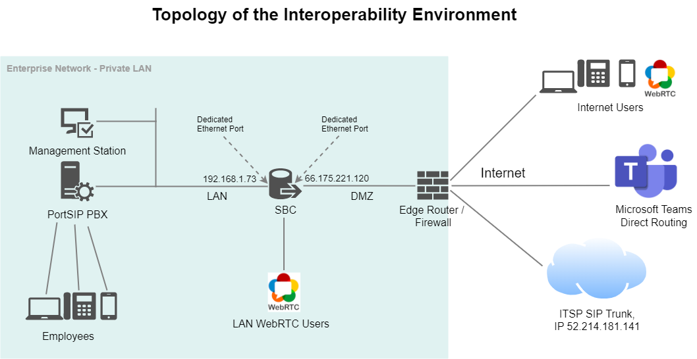

# Simplifying Unified Communications with WebRTC and SIP

[PortSIP SBC](https://www.portsip.com/portsip-sbc/) provides a bridge between Voice over Internet Protocol (VoIP) networks and the latest web services. It performs a number of federation services to transform SIP communications into WebRTC or vice versa, so organizations can retain their SIP-based call control (PBX, contact center, etc.) and offer tools that embed real-time communications into business applications, websites, processes, and workflows.

## What is WebRTC

WebRTC and SIP are two distinct yet interconnected technologies that enable real-time communication over the Internet. They are the backbone of modern web communication, empowering web pages and applications with capabilities such as video conferencing, voice calls, and data sharing.

This article delves into the intricacies of WebRTC and SIP, providing a comprehensive understanding of how each technology operates, their differences, advantages and disadvantages, and appropriate use cases.

WebRTC, or Web Real-Time Communication, is a collection of APIs that facilitates direct, peer-to-peer connections between web pages, enabling users to transmit various types of media in real-time. This includes voice, video, text, files, and other data types. Developers leverage these WebRTC APIs to construct robust software solutions, mobile applications, and web pages with integrated video, audio, and data sharing capabilities.

Written in JavaScript and built upon an open standard, WebRTC APIs are compatible with nearly every web browser, desktop platform, and mobile carrier, including Google Chrome, Mozilla Firefox, Safari, Android, and iOS. By incorporating these APIs into their native applications and web pages, developers empower these platforms to support peer-to-peer media communication across any browser or device.

What sets WebRTC apart from other real-time media processes, such as WebSockets, is its ability to establish a peer-to-peer connection between users. Once a connection is established via WebRTC, users can communicate directly, without the need for server intermediation, as is the case with WebSockets. This makes WebRTC’s communication capabilities faster and more efficient than its alternatives, and it does not require any plugins.

## How Does WebRTC Work?

WebRTC, or Web Real-Time Communication, employs a set of APIs that orchestrate a process for web clients to connect and exchange video, audio, and data in real-time.

When a user initiates a call on a WebRTC-enabled webpage, the APIs manage the entire interaction. They establish the connection, identify each user’s IP address, determine the types of data to be sent, negotiate the codec, and facilitate the continuous data transfer between endpoints. Once this process is complete, each user can share media and data directly with all other users participating in the call.

WebRTC-enabled applications and webpages handle this multimedia communication process via three primary APIs:

1. **Accessing Audio and Video (MediaStream)**: This API collects data from each participant. When multiple users communicate via WebRTC, MediaStream requests their permission to use video and audio. It also gathers any other data that needs to be sent during the interaction, such as text, file transfers, interactive polls, online gaming, and more. MediaStream determines each user’s resolution, framerate, and other specifications.
2. **Sharing Audio and Video (RTCPeerConnection)**: To share the audio and video in real-time, WebRTC uses a signaling protocol to determine shared parameters, codecs, and media details for the interaction. Common signaling protocols include Session Initiation Protocol (SIP) or Extensive Messaging and Presence Protocol (XMPP). It communicates with network servers to discover each user’s IP address and create a peer-to-peer (P2P) connection for quick data transfer. Finally, it encrypts all data for security.
3. **Sending Other Data (RTCDataChannel)**: This API bundles arbitrary data like text, files, and game data alongside the audio and video data packets. Similarly, this data is encrypted and sent using UDP or TCP–the former being faster and the latter being more reliable.

## What is Session Initiation Protocol (SIP)?

Session Initiation Protocol (SIP) is a signaling protocol that orchestrates the establishment, maintenance, and termination of real-time media communication sessions among two or more parties. SIP delineates data processing and formatting rules that synchronize computers to establish a direct media session for voice, audio, or messaging communications.

SIP is the driving force behind popular communication technologies such as business Voice over IP (VoIP), video conferencing, Voice over LTE (VoLTE), instant messaging, and other unified communications services. By providing a standardized framework for real-time communication, SIP has become an integral part of the digital communication landscape.

<figure><figcaption></figcaption></figure>

SIP software is a versatile tool that enables a multitude of communication systems, including but not limited to:

* **VoIP Calls**: SIP is integral to the operation of Voice over IP (VoIP) calls, facilitating the conversion of voice into a digital signal that can be transmitted over the internet.
* **Video Conferencing**: It plays a crucial role in video conferencing by establishing and managing the communication session between the involved parties.
* **Unified Communications**: SIP is a key component in unified communications, a technology framework that integrates various communication methods within a business.
* **Call Centers**: In call centers, SIP is used to manage inbound and outbound calls, ensuring efficient communication between the center and its customers.

As a signaling mechanism, SIP initiates the call between all involved parties and determines each side’s capabilities and parameters. Once the call is concluded, SIP communicates to all participants that the call has ended, thereby ensuring a smooth and efficient communication experience.

## How Does SIP Work?

The Session Initiation Protocol (SIP) defines the format and sequence of backend messages that computers use to coordinate and initiate real-time media communications. The protocol outlines rules that disparate software systems follow to synchronize various aspects of the media call, including the media streams involved, invitations to each party, each user’s IP address, the ports that will be used, the media codecs that will be used, and data message formatting.

In simpler terms, SIP guides computer systems to synchronize their technology and establish direct media communications, such as voice or video calls over the Internet. This is achieved through a series of backend messages that each user’s software sends to other parties involved. These messages contain information and data that establish the call.

SIP handles the following media functions:

1. **Registers Users and Locations**: SIP messages carry information about each user’s IP address and identity, which registers and authenticates users before connecting them on a call.
2. **Invites Users**: One user sends a SIP message inviting other parties for a VoIP or video call, thereby initiating a real-time connection.
3. **Specifies Formatting Details**: SIP messages enable users, or endpoints, to coordinate important formatting details, such as which codecs participants will use, active media streams the call will use, and which protocols will carry the media. Typically, SIP sessions utilize Real-Time Transport Protocol (RTP) or Secure Real-Time Transport Protocol (SRTP) to transmit media.
4. **Confirms Receipt and Initiates the Session**: SIP provides receipts confirming that users have received and responded to messages, getting everyone on the same page to initiate the session.
5. **Terminates Session**: Similar to how SIP requests invite users, they also communicate termination to each user when the media session ends.

SIP works alongside other application-layer protocols that handle other aspects of real-time media communication. For example, some SIP messages contain Session Description Protocol (SDP) data that coordinates parameters for the meeting. Once SIP establishes a media session, RTP or SRTP transmits the audio and video data.

## Key Differences between WebRTC and SIP

<figure><figcaption></figcaption></figure>

The distinction between WebRTC and SIP lies in their scope and functionality. WebRTC is a comprehensive collection of APIs that manage the entire multimedia communication process between devices. On the other hand, SIP is a signaling protocol that primarily focuses on establishing, negotiating, and terminating the data exchange. In essence, protocols are just one specific part of an API, making SIP one potential subroutine that WebRTC can utilize.

While both technologies provide a roadmap for real-time communication via video, audio, and other data, WebRTC has a broader scope. Its APIs offer a framework for the setup, signaling, exchange, and ongoing peer-to-peer (P2P) data sharing between web pages or apps. Conversely, the SIP protocol is specific to signaling, offering one potential method of establishing, negotiating, and terminating a media stream between users. It’s worth noting that SIP isn’t the only protocol capable of handling signaling, allowing WebRTC to use alternatives.

Given that SIP is the standard protocol for VoIP technology, WebRTC often employs SIP to signal or establish a connection between devices, apps, or web pages. Once this connection is established, WebRTC can retrieve and share voice, video, chat, or data between the clients involved, relying on other protocols and tools to do so.

### Here are a few key differences between WebRTC and SIP:

1. **Format**: WebRTC is a collection of APIs that developers embed into the code for a webpage or app to support real-time communications. Conversely, SIP is a protocol–a singular API that guides applications and web pages to establish and negotiate a connection through a SIP server.
2. **Scope**: WebRTC has a broader scope than SIP. WebRTC covers the entire process for two web pages and applications to not only connect but also continually share data in real-time. The more specific SIP protocol only handles the connection. In simpler terms, WebRTC uses SIP as one tool or protocol among others.
3. **Purpose**: WebRTC enables web pages to establish a connection and communicate in real-time, while SIP merely establishes a connection between users.
4. **Server Involvement**: WebRTC enables direct peer-to-peer communications, while SIP utilizes a server to facilitate the connection.
5. **Available Tools**: WebRTC consists of limitless tools and protocols, which it can choose from to establish real-time video, audio, and data communication between web pages. SIP, on the other hand, is a singular tool, just one protocol that WebRTC can utilize.

## When to Use WebRTC?

WebRTC is best utilized in the following scenarios:

1. **Adding Real-Time Audio and Video Communications to a Web Page or App**: WebRTC APIs enable web pages and applications to facilitate real-time peer-to-peer (P2P) video, audio, and data transmission.
2. **Building Your Own App**: WebRTC is a developer’s tool because its APIs provide functionality for apps and webpages. It works best if you want to build a video-conferencing solution and application.
3. **UCaaS and Video Conferencing**: Many Unified Communications as a Service (UCaaS) services and video-conferencing apps use WebRTC to power video meetings.
4. **Live Streaming**: Many live-streaming services utilize WebRTC.

## When to Use SIP?

Keep in mind that WebRTC uses SIP, so the two technologies work together in many of the below situations.

SIP plays an important role in the following scenarios:

1. **PBX Phone Systems**: Cloud-based PBX phone systems utilize SIP to enable real-time VoIP telecommunications over the Internet.
2. **Video Conferencing**: Similar to VoIP, video-conferencing and UCaaS apps utilize SIP to establish secure connections for real-time video meetings.
3. **Call Centers**: Call center providers use SIP to enable voice calls.
4. **Remote Workforce**: Remote businesses often use SIP instead of a landline phone system, because SIP-based solutions utilize non-fixed virtual phone numbers and applications accessible to users anywhere.

## Interconnect SIP and WebRTC

While WebRTC allows for browser-based communication, traditional SIP-based PBX phone systems rely on the SIP protocols. To enable these two technologies to work together seamlessly, a WebRTC gateway is essential. This gateway serves as an intelligent bridge between Voice over Internet Protocol (VoIP) networks and the open ecosystem of the Internet.

PortSIP, a renowned name in this domain, offers a product called [PortSIP SBC](https://www.portsip.com/portsip-sbc/). This product provides a bridge between VoIP networks and the latest web services. It performs a number of federation services to transform SIP communications into WebRTC or vice versa. This allows organizations to retain their SIP-based call control (such as PBX, contact center, etc.) and offer tools that embed real-time communications into business applications, websites, processes, and workflows.

Positioned at the edge of the network, the [PortSIP SBC](https://www.portsip.com/portsip-sbc/) provides open, web-centric APIs. These APIs allow application developers to gain access to the enterprise’s Unified Communications (UC) services – including voice, video, presence, shared address book, call history, instant messaging, and collaboration.

<figure><figcaption></figcaption></figure>
