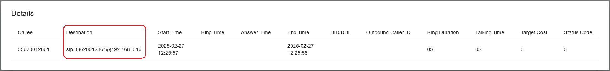
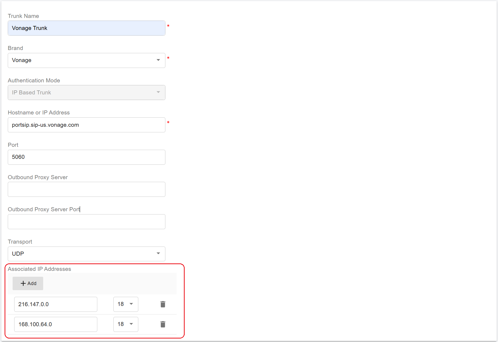
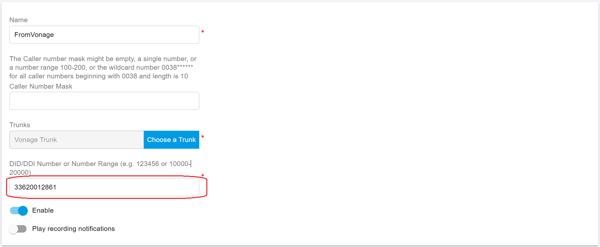
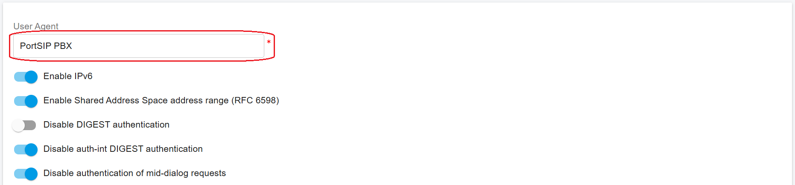

# Troubleshooting Call Issues

This article provides solutions for common PortSIP PBX issues with calls.

## 1. Troubleshooting Outbound Calls Issues

When you make a call from the app or an IP Phone, if the call fails, you will receive a status code indicating the reason. Below, we explain the status codes and their meanings:

### Check if the Error Originates from the PBX or the Trunk

When an outbound call fails, you can determine whether the error occurs in the PBX or is returned by the trunk by following these steps:

First, navigate to **Call Statistics > CDR**.

* If no record of your call appears, it means the PBX did not receive the call. In this case, check if your app or IP phone can reach the PortSIP PBX.
* If a record for the call exists, double-click it:
  * If no pop-up window appears, it indicates the call failed within the PBX (e.g., no outbound rule matched).
  * If a window appears displaying the call details and the **Destination** field is not empty, it indicates the call was sent to the trunk, but the trunk returned an error. See the example screenshot below for reference.

<figure><figcaption></figcaption></figure>

### **480 - Temporarily Unavailable**

This status code usually means the callee is not online or unavailable to answer your call.

### **408 - Request Timeout**

This status code indicates the callee can’t be reached, possibly due to a lost network connection.

### **503 - Service Unavailable**

This code may appear for the following reasons:

* The PortSIP PBX can’t provide service at this moment.
* The app/IP Phone failed to resolve the PBX domain DNS.
* The SIP trunk can’t provide service at this moment if the call is sent to the trunk.
* The PortSIP PBX failed to resolve the trunk domain DNS.

### **403 - Forbidden**

This code may appear for the following reasons:

* The current usage exceeds the PortSIP PBX license.
* The caller extension lacks sufficient call permissions. Please check its assigned role to resolve the issue.
* Caller permissions:
  * If you make a call to the SIP trunk and the called number starts with a **+**, it means this is an international call.
  *   If you configure the **International Code** under menu **Advanced > Codes and E164 > E164**, any number you dial that begins with this code will be recognized as an international call.

      For example, if you configure **02** as the International Code, when you dial a number such as **02xxxxxx**, the PBX will treat it as an international call.
  * In the above examples, if the extension’s caller role is set to **Standard User**, the call will fail with a 403 error code, because standard users do not have permission to place international calls. To resolve this, assign the extension a role that allows international calling.
* If the extension caller has permission to make international calls, but the country code is disallowed, you will need to allow the country code in the menu: **Advanced > Codec and E164.** Click the tab **ALLOWED COUNTRY CODE** and select the country code to enable it and save changes.
* The current established calls have reached the maximum call limit of the trunk.
* The callee number is in the PBX number blacklist. You can manage the blacklist in the menu: **Advanced > Number Blacklist**.
* The tenant’s current calls have reached the **Maximum Simultaneous Calls** limit. Please contact PBX system administrator to increase it.
* The trunk received the call from the PortSIP PBX but returned an error. Please **contact your trunk support team** for further assistance.

### **402 - Payment Required**

This code appears if the tenant admin has enabled online billing, but the extension caller does not have enough balance.

### **404 - Not Found**

This code may appear for the following reasons:

* The called extension number does not exist.
* The called PSTN number does not exist, so the trunk replied 404.
* The outbound call doesn’t match any outbound rule.
* The outbound call matched a trunk that was not available.
* The outbound rule matched, but it is currently outside office hours or during holidays, click the Office Hours tab of the outbound rule to check.

### Other Errors

Usually, trunks require the Outbound Caller ID (CLI) to be included in the **From** header of the INVITE message sent to the trunk. The caller extension must configure the **Outbound Caller ID** or must configure an **Outbound Caller ID** at the tenant level. For more details, please refer to the section on [Handling Outbound Calls Through SIP Trunk](../portsip-pbx-administration-guide/7-trunk-management/handle-outbound-calls-through-sip-trunk.md#outboundcallerid).

Note: Some trunks also require the **Outbound Caller ID** to start with a '**+**'. Please confirm this requirement with your trunk provider.

## 2. Troubleshooting Inbound Calls Issues

Sometimes, after configuring the trunk and inbound rule in the PortSIP PBX, calls to the DID number may not be received. To troubleshoot this issue, please follow the steps below.

### Check the Trunk IP Address

If the trunk sends calls to the PortSIP PBX from an IP address that does not match the IP host or the **Associated IP Addresses** configured for the trunk in the PortSIP PBX, the PBX will respond with a 407 error.

It’s important to contact your trunk provider to obtain the IP addresses they use to send the INVITE messages to the PortSIP PBX. Once you have this information, add the IP addresses to the **Trunk Associated IP Addresses** as shown in the screenshot below.

**Note**: Some preconfigured trunks already have these associated IP addresses.

<figure><figcaption></figcaption></figure>

The trunk also includes an option in the PortSIP PBX: **"Verify the port when receiving SIP messages from the trunk"**. This option is **disabled** by default. When enabled, the PBX will verify that the source port of incoming SIP messages matches the port configured in the PortSIP PBX. If the ports do not match, the PBX will respond with a **407** error.

We recommend keeping this option **disabled** by default unless you specifically require it for your configuration.

### Check the DID Number

When the PortSIP PBX identifies that the call is coming from a configured trunk, it will check if the dialed number falls within the trunk's DID pool range. If the dialed number is not within the DID pool for a tenant’s configured trunk, the PBX will respond with a **407** error to the trunk.

In many scenarios, customers configure the DID pool without including the **country code**, but the trunk sends the INVITE message to the PortSIP PBX with the country code prefixed. For example, if a tenant’s DID pool is set to **620012861** or **620012861-6200128618**, but the trunk sends the DID as **33620012861** or **+33620012861**, the PortSIP PBX will return a 407 error because the dialed number is outside the DID pool range. In this case, the DID pool should be configured as **33620012861** or **33620012861-633200128618**.

**Note:** You do not need to include the "+" prefix in the DID pool configuration; the PortSIP PBX will automatically handle this scenario.

### Check the Inbound Rules

Once the PortSIP PBX verifies that the call is coming from the trunk, it will proceed to match the tenant's inbound rules. You must ensure that the dialed number matches at least one inbound rule.

For the inbound rule, fill in the **"DID/DDI Number or Number Range"** field with the dialed number you want to route to an extension or system extension.&#x20;

Typically, the **Caller Number Mask** field does not need to be filled in. For more details, please refer to the guide on [**Configuring Inbound Rules**](../portsip-pbx-administration-guide/8-call-route-management/configuring-inbound-rule.md).

<figure><figcaption></figcaption></figure>

## 3. Troubleshooting No Response from the Trunk

In some cases, the trunk may not respond to the PortSIP PBX when it sends REGISTER, INVITE, or other SIP messages. To troubleshoot this issue, please follow the steps below.

### Check the Whitelist on the Trunk Side

Some trunk providers require you to whitelist the PortSIP PBX’s IP address. Please contact your trunk provider to confirm this requirement.

### Change the User-Agent

Some trunk providers host their services based on PortSIP competitors' platforms, and they may block the PortSIP PBX **User-Agent**.  So if the trunk recognizes that the SIP message’s **User-Agent** header includes the "**PortSIP**" string, it may silently discard the message without sending any response to the PortSIP PBX.

To resolve this, sign in to the PortSIP PBX web portal as a **System Administrator**, navigate to the menu **Advanced > Settings**, change the **User-Agent**, save the changes, and then try again.

**Note:** This is an unfortunate behavior that wastes both customer and support team time during troubleshooting.

<figure><figcaption></figcaption></figure>

## 4. Troubleshooting Voice Issues for Trunk Calls

If extension-to-extension calls work correctly, but inbound or outbound trunk calls experience no audio or one-way audio issues, follow these troubleshooting steps:

1.  In the trunk **Options** section of PortSIP PBX, there is a setting labeled **"Use the private IP address to communicate with this trunk."** This setting determines how the PBX populates the media IP address in the **SDP** of **INVITE** and **200 OK** messages during call establishment.

    * When **enabled**, the PBX inserts its **private IP address** into the SDP.
    * When **disabled**, the PBX inserts its **public IP address** into the SDP.

    **Best Practice:**

    * If the trunk is connected over the **public Internet**, keep this option **disabled**.
    * If the trunk is within a **local network (LAN)**, enable this option.
2. Some SIP trunk providers require the **PBX's IP address** to be whitelisted in order to receive RTP (media) packets.
   * Ensure that both the **PBX’s IP address** and the **Extended Media Server IP address** (if configured) are whitelisted on the trunk provider's side.
   * Refer to the **trunk provider’s documentation** for specific whitelisting requirements.
3. If your PortSIP PBX is hosted on a cloud platform such as **AWS, Microsoft Azure, or Google Cloud (GCE)**, you must configure network security rules to allow media traffic.
   * Ensure that RTP (Real-Time Transport Protocol) port ranges are open.
   * For these port ranges, refer to the **"**[**Preparing the Server for Installation**](../portsip-pbx-administration-guide/1-installation-of-the-portsip-pbx/installation-of-portsip-pbx-v22/install-portsip-pbx-on-linux.md#preparing-the-server-for-installation)**"** article.

By following these steps, you can resolve most voice-related issues with trunk calls. If problems persist, verify the SIP trunk provider's settings and contact the [PortSIP support team](mailto:support@portsip.com).

## 5. Troubleshooting PBX Web Portal Login Failures

Sometimes, you may encounter error messages when trying to log in to the PortSIP PBX Web Portal. Refer to the following common errors and their potential causes:

* **Error: Unknown Error (500)**
  * This usually occurs due to insufficient disk space on the server.
  * Check your server’s disk space usage.
  * As a temporary solution, you can free space by deleting archived log files with the `.gz` extension in the `/var/lib/portsip/pbx/log` directory.
  * For a permanent solution, consider increasing your disk size.
  * To receive alerts before running out of space, enable email notifications by referring to the [Configuring Email Notifications](../portsip-pbx-administration-guide/configuring-email-notifications.md) guide.
* **Error: Login failed, authentication error. (UNAUTHORIZED)**
  * This indicates that your username or password is incorrect. Verify your credentials and try again.
* **Error: No tenant information found by provided SIP domain (404)**
  * This means the SIP domain does not exist. Double-check the SIP domain you entered and make sure it is correct.
* **Error: Server error, please try again later (502)**
  * This indicates that the PortSIP PBX API gateway is down.
  * Insufficient disk space can also trigger this error.
  * If resolving disk space issues does not help, please contact the PortSIP Support Team.
* **Error: the client IP address x.x.x.x has been blocked until \[date/time] (DENIED)**
  * This occurs when you enter an incorrect password too many times, causing your IP address to be blocked.
  * Use a different IP address (or network) to access the PortSIP PBX Web Portal with the correct credentials.
  * Remove the blocked IP address from the **IP Blacklist** once you regain access.

Following these steps should help you diagnose and resolve the most common login issues with the PortSIP PBX Web Portal. If you continue to experience problems, please contact PortSIP Support for further assistance.

## 6. Collect the Logs

PortSIP provides a powerful tool that allows you to troubleshoot calls visually. For more details, please refer to the article [Trace Server - A Better Way to Monitoring SIP Messages and QoS for PortSIP PBX.](../../pbx_v12/tutorials/debug-sip-message.md)&#x20;

### Capture SIP Messages and RTP Packets

You can capture SIP messages and RTP packets during a call to aid in troubleshooting.

#### Linux

1. Ensure that **tcpdump** is installed on your Linux server. If not, install it using the following command:

```sh
sudo apt install tcpdump
```

2. Run the following command to start capturing packets:

```sh
tcpdump -i any -w 1000.pcap
```

You can specify any file name you prefer (other than `1000.pcap`), but make sure to use the `.pcap` extension.

3. Make the call and reproduce the issue.
4. Once the issue occurs, keep the call for 5-10 seconds, then stop **tcpdump** by pressing **Ctrl + C**.
5. Send the captured **PCAP** file to the PortSIP team.

#### Windows

1. Install [**Wireshark** ](https://www.wireshark.org)and start capturing packets.
2. Make the call and reproduce the issue.
3. Once the issue occurs, keep the call for 5-10 seconds, then stop the capture.
4. Save the captured packets as a **.pcapng** file and send it to the PortSIP team.

### Download PortSIP Log Files

By default, the PortSIP PBX log files are stored in the following locations:

#### Linux

```sh
/var/lib/portsip/pbx/log/
```

If you configured a different path rather than the default path during the installation, the log files will be located in:

```sh
path/portsip/pbx/log/
```

#### Windows

```
C:\ProgramData\PortSIP\pbx\log\
```

If you configured a different path rather than the default path during the installation, the log files will be located in:

```
path\PortSIP\pbx\log\
```

Typically, you should copy the **callmanager.log** file, compress it, and send it to the PortSIP team for further investigation.

Feel free to contact the PortSIP support team at [support@portsip.com](mailto:support@portsip.com) or [submit a ticket](https://portsip.atlassian.net/servicedesk/customer/portals). Our team will help you resolve any issues.

