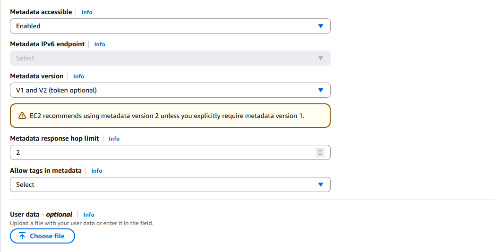
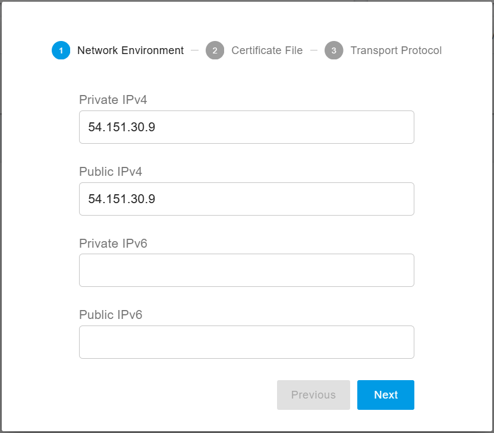
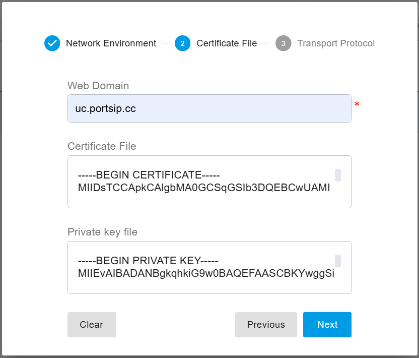

# High Availability Installations on AWS

This guide provides step-by-step instructions for deploying **PortSIP PBX High Availability (HA)** in an **AWS EC2 environment**, ensuring service resilience, automatic failover, and call continuity.

***

### Prerequisites

Before deploying the PortSIP PBX HA cluster, ensure the following requirements are met.

#### Operating System

* Ubuntu 24.04 LTS (64-bit) is required on all PBX nodes.

#### AWS EC2 Instances

* **Three AWS EC2 instances** are required.
* In this guide, the terms **EC2 server**, **PBX server**, and **node** are used interchangeably and all refer to an AWS EC2 instance.

#### Instance Specifications

* Minimum **4 vCPUs**
* Minimum **4 GB RAM**
* Higher specifications are recommended for production or high-call-volume environments.

#### Network Requirements

* **Public IP Assignment:** Enable Assign a public IP automatically when creating each EC2 instance.
* **Private IP Address:** Each EC2 instance must be assigned a static private IP address.
* **Location:** All EC2 instances must be deployed in the same AWS Region, VPC, and subnet.

#### IP and Storage Resources

* **Elastic IP (EIP):** One Elastic IP address must be allocated.
* **Elastic Block Store (EBS):** A shared [EBS ](https://docs.aws.amazon.com/AWSEC2/latest/UserGuide/AmazonEBS.html)volume is required for persistent PBX data.

***

### Working Mechanisms

The PortSIP PBX High Availability (HA) architecture operates through the following mechanisms.

<figure><figcaption></figcaption></figure>

#### Node Configuration

Three PBX nodes operate concurrently as part of an HA cluster.\
This **quorum-based design** prevents split-brain scenarios and ensures reliable failover decisions when switching the active node.

#### Data Storage

[Amazon EBS](https://docs.aws.amazon.com/AWSEC2/latest/UserGuide/AmazonEBS.html) is used as shared, persistent storage for critical PBX data, including:

* Active call state information
* Call recording files
* Log files
* Call Detail Records (CDRs)
* User-uploaded prompt and media files

This ensures all PBX nodes have access to the most up-to-date data during failover.

#### Access Point

An **AWS Elastic IP (EIP),** a static public IP address serves as the **single external access point** for the PBX system.

The Elastic IP is always mapped to the **currently active PBX node**.

#### Client Access

The Elastic IP is used by:

* IP phones
* Desktop and mobile client applications
* Web browsers and WebRTC clients

This provides a consistent access address regardless of which node is active.

#### Status Monitoring

[Pacemaker](http://www.clusterlabs.org/) continuously monitors the health and availability of all PBX nodes and cluster resources, detecting failures in real time.

#### Service Provisioning and Failover

Under normal operation, the **active (primary) node** provides PBX services.

If the active node becomes unavailable:

* Pacemaker immediately relocates the **Elastic IP** to a healthy standby node.
* New service requests are transparently handled by the standby node.
* No endpoint reconfiguration is required.

#### Call Restoration

Any calls that were established on the failed primary node are **automatically restored** by the standby node, ensuring minimal disruption to ongoing communications.

English.

***

### Notes

* All Linux commands in this guide must be executed as the default **`ubuntu`** user.

***

### Creating the User Group and User

To deploy PortSIP PBX High Availability (HA) on AWS, you must create an **IAM user group** and **IAM user** with the appropriate permissions.

***

#### Create an IAM User Group

1. Open the AWS IAM Console.
2. Choose one of the following:
   * Select an existing user group, or
   * Click Create group to create a new user group.
3. Assign the required permission policies to the group.

**Required Permission Policies**

The IAM user group **must include** the following permission policies:

* AmazonEC2FullAccess
* AmazonEBSCSIDriverPolicy

These policies allow the HA cluster to manage EC2 instances, Elastic IPs, and EBS volumes during failover operations.

**Example Configuration**

As shown in the screenshot below, you may name the group **`hagroup`** and ensure the following policies are attached:

* AmazonEC2FullAccess
* AmazonEBSCSIDriverPolicy

<figure><figcaption></figcaption></figure>

Verify that both policies are attached before proceeding to create the IAM user.

***

### Create User

To create a new IAM user, follow these steps:

1. Open the **AWS IAM Console**.
2. Click **Users** to view the list of existing users.
3. Click **Create user** to start the user creation process.
4. Enter a user name (for example, **`hauser`**).
5. Assign this user to the previously created user group **`hagroup`**.

As shown in the screenshot below, the user **`hauser`** should be associated with the **`hagroup`**, ensuring it inherits the required permissions for deploying and managing the PortSIP PBX HA cluster.

<figure><figcaption></figcaption></figure>

***

### Create User Access Key

After successfully creating the IAM user, follow the steps below to create an access key for the user (for example, **`hauser`**).

1. In the AWS IAM Console, select Users and choose the user `hauser`.
2. Click **Create access key**.
3. In Step 1, under **Access key best practices & alternatives**, select **Command Line Interface (CLI)** as the **use case**.

<figure><figcaption></figcaption></figure>

4. Continue to Step 3, **Retrieve access keys**. Here, it's crucial to note and save the **Access key** and **Secret access key** for future use.

<figure><figcaption></figcaption></figure>


> ❗**Important**\
> Make sure to securely save both the **Access key ID** and the **Secret access key**.\
> These credentials are required for configuring AWS CLI access on the PBX servers and **cannot be retrieved again** after this step.

Once the access key is created and saved, you can proceed with configuring AWS CLI credentials on the PortSIP PBX HA nodes.

***

### VPC and Subnet

#### VPC

In the PortSIP PBX High Availability (HA) deployment, **all PBX nodes must be deployed within the same AWS Availability Zone, VPC, and subnet**.\
This is a strict requirement to ensure reliable failover, shared storage access, and consistent network behavior.

In this example, the deployment uses the **us-west-1** Region.

To configure the VPC:

1. Open the **AWS VPC Console**.
2. Use the **default VPC** (you may also create a new VPC if required).
3. Verify the IPv4 CIDR block.

As shown in the screenshot below, the example VPC uses the following IPv4 CIDR:

* **VPC IPv4 CIDR:** `172.31.0.0/16`

<figure><figcaption></figcaption></figure>

Each PBX node must be assigned a **static private IP address** from the subnet within this VPC.

***

#### Create the Subnet

To create or verify the subnet configuration, follow these steps:

1. In the **AWS VPC Console**, click **Subnets**.
2. If no suitable subnet exists, click **Create subnet** to create a new one.
3. Select the VPC created or chosen in the previous step.
4. Configure the subnet settings.

In the example shown below:

* **Subnet ID:** `subnet-8cadc4e8`
* **IPv4 CIDR:** `172.31.16.0/20`
* **Availability Zone:** `us-west-1c`

> ❗**Important**\
> The subnet **CIDR block must be `/20`**.\
> Using any other CIDR size will cause the PortSIP PBX HA installation to fail.

<figure><figcaption></figcaption></figure>

In this deployment scenario, the following **static private IP addresses** are assigned to the PBX nodes:

* **Node 1:** `172.31.16.133`
* **Node 2:** `172.31.16.134`
* **Node 3:** `172.31.16.135`

These IP addresses must be reserved and consistently assigned to each EC2 instance to ensure stable HA operation.

***

### Create Security Group

To create a security group for the PortSIP PBX HA deployment, follow these steps:

1. Open the **AWS EC2 Console**.
2. Navigate to **Security Groups** to view the existing security groups.
3. If no suitable security group exists, click **Create security group**.
4. Enter a name and description for the security group.

#### Example Configuration

For example:

* **Security Group Name:** `pbx-ha`
* **Security Group ID:** `sg-0e2bea9ea4033f893`

This security group will later be configured with the required inbound and outbound rules to allow SIP signaling, media traffic, web access, and HA cluster communication between PBX nodes.

<figure><figcaption></figcaption></figure>

> ❗ Important\
> The same security group must be configured and attached when creating all PortSIP PBX HA EC2 instances.

***

#### Inbound rule&#x20;

> ❗ **Important**\
> For the PortSIP PBX HA cluster to function correctly, ALL TCP and ALL UDP traffic must be allowed within the same subnet.

| **TYPE**   | **PROTOCOL** | **PORT RANGE** | **SOURCE**    | **DESCRIPTION** |
| ---------- | ------------ | -------------- | ------------- | --------------- |
| Custom UDP | UDP          | 35000 - 65000  | 0.0.0.0/0     | RTP             |
| ALL TCP    | TCP          | 0 - 65535      | 172.31.0.0/16 |                 |
| ALL UDP    | UDP          | 0 - 65535      | 172.31.0.0/16 |                 |
| Custom TCP | TCP          | 5432           | 172.31.0.0/16 | db              |
| SSH        | TCP          | 22             | 0.0.0.0/0     | ssh             |
| Custom UDP | UDP          | 5060           | 0.0.0.0/0     | pbx sip/udp     |
| Custom TCP | TCP          | 5061           | 0.0.0.0/0     | pbx sip/tcp     |
| Custom TCP | TCP          | 5063           | 0.0.0.0/0     | pbx sip/wss     |
| Custom TCP | TCP          | 8882-8900      | 0.0.0.0/0     | pbx             |
| Custom TCP | TCP          | 10443          | 0.0.0.0/0     | sbc webrtc      |
| HTTP       | TCP          | 80             | 0.0.0.0/0     | http            |
| HTTPS      | TCP          | 443            | 0.0.0.0/0     | https           |

#### **Outbound rule**

| **TYPE**    | **PROTOCOL** | **PORT RANGE** | **DESTINATION** | **DESCRIPTION - OPTIONAL** |
| ----------- | ------------ | -------------- | --------------- | -------------------------- |
| All traffic | All          | All            | 0.0.0.0/0       | –                          |

### Create EC2 Instances

This section explains how to create the AWS EC2 instances used for the PortSIP PBX High Availability (HA) cluster.

#### Create EC2 Instance

Follow the steps below to create each EC2 instance.

**Application and OS Image (AMI)**

In the **Application and OS Images (Amazon Machine Image)** section:

* Select Ubuntu Server 24.04 LTS (HVM), SSD Volume Type

This operating system is required for PortSIP PBX HA deployments.

***

**Instance Type**

In the **Instance type** section:

* Select **`t3.medium`** or another suitable instance type.

You should choose the instance type based on your **business requirements**, including user scale and call concurrency.

For environments with:

* Higher numbers of users
* Increased concurrent calls

More **CPU cores and memory** are required. Refer to the **Hardware Specifications** documentation when selecting the appropriate instance type.

***

#### Create a Key Pair for Login

In the **Key pair (login)** section:

* Select an existing key pair, **or**
* Click **Create new key pair** to generate a new one.

<figure><figcaption></figcaption></figure>

In this guide, a new key pair named **`aws-portsip-pbx-ha`** is created. This action generates a private key file named:

```
aws-portsip-pbx-ha.pem
```

> ❗ **Important**\
> All EC2 instances in the **PortSIP PBX HA cluster must use the same key pair**.\
> Using different key pairs will prevent consistent administrative access and complicate HA management.

***

#### Networking

To configure networking for the EC2 instances, follow these steps.

**Network Settings**

* **VPC:** `vpc-027ba466`
* **Subnet:** `subnet-8cadc4e8`\
  (Created earlier in this guide)
* **Auto-assign public IP:** Select **Enable**

***

**Firewall (Security Groups)**

In the **Firewall (security groups)** section:

* Select the existing security group **`pbx-ha`** that was created earlier.

> ❗ **Important**\
> All HA EC2 instances **must use the same security group** to ensure proper cluster communication, failover detection, and service continuity.

***

**Advanced Network Configuration**

In **Advanced network configuration > Network interface 1**:

Set the **Primary IP** for each EC2 instance as follows:

* **Node 1:** `172.31.16.133`
* **Node 2:** `172.31.16.134`
* **Node 3:** `172.31.16.135`

<figure><figcaption></figcaption></figure>

> ❗ **Important**\
> These **static private IP addresses must be assigned exactly as specified**.\
> Changing or reassigning these IPs after deployment may cause HA failover failures or service disruption.

***

### Configuring Storage (Volume)

In the **Storage (Volumes)** section, configure the disk that will be used to install the **Linux operating system** for the PortSIP PBX HA nodes.

<figure><figcaption></figcaption></figure>

This volume is primarily used for:

* The Ubuntu operating system
* System packages and runtime dependencies

For most deployments:

* **40 GB** is sufficient for standard environments
* **100 GB** is recommended for larger or long-term production deployments

Choose the disk size based on your operational requirements and future growth plans.

In the **Advanced details** section, configure **Metadata version** to **V1 and V2 (token optional)**, as shown in the screenshot below.

<figure><figcaption></figcaption></figure>

> ❗ **Important**\
> This storage volume is used **only for the operating system and system-level components**.\
> PBX data such as recordings, logs, databases, and media files are stored on a **separate shared EBS volume**, which is configured later in this guide.

***

### Verifying Host Name

By default, AWS automatically assigns a host name to each EC2 instance after it is successfully created. In most cases, no manual host name configuration is required, which simplifies the setup process.


In this deployment scenario, the host names appear as shown in the screenshot below.

| NODE | HOST NAME        | PUBLIC IP   | PRIVATE IP    | DISK            | DEFAULT USER |
| ---- | ---------------- | ----------- | ------------- | --------------- | ------------ |
| 1    | ip-172-31-16-133 | Auto-assign | 172.31.16.133 | /dev/sda (40GB) | **ubuntu**   |
| 2    | ip-172-31-16-134 | Auto-assign | 172.31.16.134 | /dev/sda (40GB) | ubuntu       |
| 3    | ip-172-31-16-135 | Auto-assign | 172.31.16.135 | /dev/sda (40GB) | ubuntu       |

### Allocate Elastic IP

Next, you need to allocate an **Elastic IP (EIP)** for the PortSIP PBX HA cluster. This Elastic IP serves as the single public access point for all PBX clients.

Follow these steps:

1. Open the **AWS EC2 Console**.
2. Click **Elastic IPs** to view the list of allocated Elastic IP addresses.
3. Click **Allocate Elastic IP address** to create a new one.

<figure><figcaption></figcaption></figure>

For example:

* **Elastic IP address:** `54.151.30.9`
* **Allocation ID:** `eipalloc-02c7cf64a5cd449cf`. Please note it and will used in the later steps.

***

### Create Elastic Block Store (EBS) Volume

Next, create an **Amazon Elastic Block Store (EBS)** volume to store **shared PBX HA data**.

This EBS volume is used to store critical data, including:

* Databases (DB)
* Call recording files
* Log files
* Call reports
* Chat and media files

Because this volume holds **all tenant and call data**, it should be sized generously, especially in production environments.

#### Recommended Volume Size

* **Production environments:** 1000 GB or larger
* Adjust sizing based on:
  * Call volume
  * Recording retention period
  * Chat and media usage

***

#### Create the EBS Volume

To create the EBS volume:

1. In the **AWS EC2 Console**, click **Volumes**.
2. Click **Create volume**.
3. Configure the volume settings.

For example, the volume configuration may look like this (as shown in the screenshot below).

| Type | Volume ID             | Size   | IOPS | Availability Zone | Encryption | Multi-Attach enabled |
| ---- | --------------------- | ------ | ---- | ----------------- | ---------- | -------------------- |
| io2  | vol-0e06e1e9da3c49b67 | 1000GB | 500  | us-west-1c        | No         | No                   |

The following screenshot shows the example:

<figure><figcaption></figcaption></figure>

***

### Configuring AWS

This section describes how to install and configure the **AWS CLI** and prepare the required credentials and key files on the PortSIP PBX HA nodes.

#### Install AWS CLI

Install the **AWS CLI v2** on **all EC2 instances** in the HA cluster.

Run the following commands on **each EC2 instance**:

```bash
sudo apt install unzip && \
curl "https://awscli.amazonaws.com/awscli-exe-linux-x86_64.zip" \
-o "awscliv2.zip" && unzip awscliv2.zip && sudo ./aws/install
```

After installation, verify the AWS CLI version:

```bash
aws --version
```

***

#### Configuring AWS IAM

Before running the configuration, determine the **AWS Region** where your EC2 instances are deployed.\
In this example, the region is **`us-west-1`** (as shown in the AWS console screenshot).

<figure><figcaption></figcaption></figure>

Run the following command on **all EC2 instances**:

```bash
aws configure
```

When prompted, enter the following information:

```
AWS Access Key ID [None]: type your Access Key ID here (see Create User Access Key)
AWS Secret Access Key [None]: type your Secret Access Key Here (see Create User Access Key)
Default region name [None]: type region name here
Default output format [None]: json
```

* **AWS Access Key ID \[None]:**\
  Enter your Access Key ID (see _Create User Access Key_).
* **AWS Secret Access Key \[None]:**\
  Enter your Secret Access Key.
* **Default region name \[None]:**\
  Enter the AWS region (for example, `us-west-1`).
* **Default output format \[None]:**\
  Enter `json`.

***

#### Configuring the Certificate (Key Pair) File

You must upload the EC2 **key pair file** to the primary node for SSH access between HA nodes.

In this guide, the key pair file is: **aws-portsip-pbx-ha.pem**

Upload this file to the following directory on the node with IP address **`172.31.16.133`**:

```bash
/home/ubuntu/.ssh/
```

After uploading the file, set the correct permissions. Run the following command **only on node `172.31.16.133`**:

```bash
chmod 400 /home/ubuntu/.ssh/aws-portsip-pbx-ha.pem
```

> ❗ **Important**\
> This step must be performed **only on the primary node (172.31.16.133)**.\
> Incorrect file permissions or missing key files will prevent secure SSH communication required for HA operations.

***

### Configuring PortSIP PBX HA

This section describes how to download the required HA resources and prepare the configuration variables for deploying the PortSIP PBX HA cluster.

#### Download the PBX Resource Package

The following commands **must be executed only on the EC2 instance** with the private IP address **`172.31.16.133`**.

Run the commands below to download and extract the PortSIP PBX HA resource package:

```bash
cd /opt/ && sudo wget -N \
https://www.portsip.com/downloads/ha/v22/portsip-pbx-ha-on-aws-guide-22.tar.gz \
 && sudo tar xf portsip-pbx-ha-on-aws-guide-22.tar.gz
```

***

#### Set Variables

Before proceeding with the HA deployment, prepare values for the required configuration variables.

<table><thead><tr><th>VARIABLES</th><th width="117.33333333333331">TYPE</th><th>DESCRIPTION</th></tr></thead><tbody><tr><td>pbx01_instance_id</td><td>string</td><td>The instance id of the node 1</td></tr><tr><td>pbx02_instance_id</td><td>string</td><td>The instance id of the node 2</td></tr><tr><td>pbx03_instance_id</td><td>string</td><td>The instance id of the node 3</td></tr><tr><td>eip_allocation_id</td><td>string</td><td>Elastic Allocation ID. In this example is eipalloc-02c7cf64a5cd449cf</td></tr><tr><td>ebs_volume_id</td><td>string</td><td>EBS Volume ID</td></tr><tr><td>pbx_image</td><td>string</td><td>PortSIP PBX docker image</td></tr><tr><td>ssh_private_key_file</td><td>string</td><td>The path of certificate file for the key pair "aws-portsip-pbx-ha"</td></tr></tbody></table>

The following commands **must be executed only on the EC2 instance** with the private IP address **`172.31.16.133`**.

```sh
cd /opt/portsip-pbx-ha-guide && sudo bash -c 'cat > ./res/vars.yml' << EOF
pbx01_instance_id: i-08807c762627239b8
pbx02_instance_id: i-03411641c37513049
pbx03_instance_id: i-0c301db1a53ae3a4b
eip_allocation_id: eipalloc-02c7cf64a5cd449cf
ebs_volume_id: vol-0e06e1e9da3c49b67
pbx_image: portsip/pbx:22
ssh_private_key_file: /home/ubuntu/.ssh/aws-portsip-pbx-ha.pem
EOF
```

***

#### Install Dependencies

The following commands **must be executed only on the EC2 instance** with the private IP address **`172.31.16.133`**.

```sh
cd /opt/portsip-pbx-ha-guide/ && /bin/bash install_dependencies.sh
```

***

### Deploying PBX HA

#### Deploy the HA Cluster

The following command **must be executed only on the EC2 instance** with the private IP address **`172.31.16.133`**.

Run the command below to start deploying the PortSIP PBX HA cluster:

```bash
cd /opt/portsip-pbx-ha-guide/ && /bin/bash deploy_pbx.sh
```

> ❗ **Important**\
> The deployment process may take a **significant amount of time** to complete.\
> **Do not interrupt the process**, and **do not restart or shut down** the EC2 instance while the deployment is in progress.\
> Interrupting the process may result in an incomplete or corrupted HA deployment.

***

#### Accessing the PBX After Deployment

Once the resource configuration and deployment are completed successfully, you can access the PortSIP PBX Web Portal by opening the following URL in a web browser: https://54.151.30.9:8887

From this point forward:

* All PBX management, configuration, and administration will be performed via the **Elastic IP** `54.151.30.9`.
* SIP clients, applications, and web access will continue to use this Elastic IP, regardless of which HA node is active.

You may also configure your **web domain** to resolve to this Elastic IP if you prefer to access the PBX using a domain name instead of an IP address.

***

### Configuring PortSIP PBX

When you sign in to the **PBX Web Portal**, the **Setup Wizard** will automatically appear.

#### Step 1: Network Environment

In the **first step** of the wizard, configure the network settings as follows:

* **Private IPv4:** Enter the **private virtual IP** `54.151.30.9`.
* **Public IPv4:** Enter the **Elastic IP** `54.151.30.9`.

<figure><figcaption></figcaption></figure>

***

#### Step 2: SSL Certificate <a href="#step-2-ssl-certificate" id="step-2-ssl-certificate"></a>

To enable **TLS transport for SIP** and secure **HTTPS access** to the Web Portal and REST API, an SSL certificate must be configured.

**Domain Setup**

You need a domain name that points to your PBX server IP address. For example, you may purchase a domain from providers such as [GoDaddy ](https://www.godaddy.com/)and configure its DNS records accordingly.

**SSL Certificate Requirements**

A **trusted SSL certificate** is strongly recommended to avoid browser security warnings. Common certificate providers include [DigiCert](https://www.digicert.com/), [GeoTrust](https://www.geotrust.com/), [GoDaddy](https://www.godaddy.com/), and others.

If you **do not have a trust domain or SSL certificate**, you may:

* Use the PBX IP address as the Web Domain
* Proceed with the **default self-signed certificate**

> ❗**Note** The default self-signed certificate will cause browsers to display security warnings and may block access unless manually allowed.

**Preparing the Certificate**

Follow the guide [Preparing TLS Certificates ](https://support.portsip.com/portsip-communications-solution/tutorials/certificates-for-tls-https-webrtc/preparing-tls-certificates)to obtain the certificate files:

* `portsip.key`
* `portsip.pem`

**Configuring the Certificate**

In this guide, we assume the use of the domain **uc.portsip.cc** for the PBX web domain.

1. In the **Web Domain** field, enter **uc.portsip.cc**.
2. Open the **portsip.pem** file in a text editor (such as Windows Notepad), and copy the entire contents into the **Certificate File** field.
3. Similarly, open the **portsip.key** file, and copy its entire contents into the **Private Key File** field.

<figure><figcaption></figcaption></figure>

***

#### Step 3: Transport Protocol <a href="#step-3-transport-protocol" id="step-3-transport-protocol"></a>

Configure the SIP transport protocols by clicking **Add**.

Default transport ports are:

* **UDP:** 5060
* **TCP:** 5063
* **TLS:** 5061

<figure><figcaption></figcaption></figure>

You may change these ports if required, provided the selected ports are not already in use by other services.

> ❗**Important** After adding or modifying transport protocols, update your firewall rules to allow traffic on the configured ports. IP phones and client applications will use these ports to connect to the PBX.

***

#### Step 4: Reboot to Apply SSL Certificate <a href="#step-4-reboot-to-apply-ssl-certificate" id="step-4-reboot-to-apply-ssl-certificate"></a>

If you uploaded a trusted SSL certificate (instead of using the default self-signed certificate), you must restart the PBX to apply the changes.

The following command **must be executed only on the EC2 instance** with the private IP address **`172.31.16.133`**.

```bash
cd /opt/portsip-pbx-ha-guide && /bin/bash ha_ctl.sh restart -s pbx
```

After the restart, you can now access the PBX Web Portal at: https://uc.portsip.cc:8887

***

### Install PortSIP IM Service <a href="#install-portsip-im-service" id="install-portsip-im-service"></a>

With the PortSIP PBX High Availability deployment complete, you are now ready to install the **PortSIP Instant Messaging (IM) Service**.

Please follow the Scaling IM Server on AWS for High Availability guide to complete the installation and configuration.

***

### Install PortSIP Data Flow Service <a href="#install-portsip-data-flow-service" id="install-portsip-data-flow-service"></a>

With the PortSIP PBX High Availability deployment complete, you are now ready to install the **PortSIP Data Flow Service**.

Please follow the Scaling Data Flow Server on AWS for High Availability guide to complete the installation and configuration.

***

### Managing PBX HA

Once you have successfully configured PortSIP PBX High Availability (HA) using the steps above, you can manage and monitor the HA cluster using the commands provided in this section.

> ❗ **Important**\
> All HA management commands **must be executed only on the EC2 instance** with the private IP address **`172.31.16.133`**.

***

#### View PBX HA Status

To view the current status of the PBX HA cluster, run the following command:

```bash
cd /opt/portsip-pbx-ha-guide && /bin/bash ha_ctl.sh show
```

A healthy HA cluster will produce output similar to the following.

This output indicates that:

* The HA cluster is running normally
* The EC2 instance **`172.31.16.133`** is currently acting as the **master node**
* The EC2 instances **`172.31.16.134`** and **`172.31.16.135`** are operating as **slave (standby) nodes**

```
Cluster name: ha_cluster
Cluster Summary:
  * Stack: corosync
  * Current DC: ip-172-31-16-134 (version 2.0.3-4b1f869f0f) - partition with quorum
  * Last updated: Tue Sep 19 03:29:30 2023
  * Last change:  Tue Sep 19 03:25:28 2023 by root via cibadmin on ip-172-31-16-133
  * 3 nodes configured
  * 7 resource instances configured

Node List:
  * Online: [ ip-172-31-16-133 ip-172-31-16-134 ip-172-31-16-135 ]

Full List of Resources:
  * eip    (ocf::portsip:awseip):     Started ip-172-31-16-133
  * privip    (ocf::heartbeat:awsvip):     Started ip-172-31-16-133
  * vip    (ocf::heartbeat:IPaddr2):     Started ip-172-31-16-133
  * src_pkt_ip    (ocf::portsip:awsipsrcaddr):     Started ip-172-31-16-133
  * ebs    (ocf::portsip:awsebs):     Started ip-172-31-16-133
  * datapath_fs    (ocf::heartbeat:Filesystem):     Started ip-172-31-16-133
  * pbx    (ocf::portsip:pbx):     Started ip-172-31-16-133

Daemon Status:
  corosync: active/enabled
  pacemaker: active/enabled
  pcsd: active/enabled
```

***

#### Check the Current Master Node

To identify which EC2 instance is currently acting as the **master PBX node**, run the following command:

```bash
cd /opt/portsip-pbx-ha-guide && /bin/bash ha_ctl.sh master
```

The output will clearly indicate the EC2 instance that is currently hosting the active PBX services.

***

#### Restart PBX Service

To restart the PBX service within the HA cluster, use the following command:

```bash
cd /opt/portsip-pbx-ha-guide && /bin/bash ha_ctl.sh restart -s pbx
```

A successful restart will produce output similar to the following:

```
try to restart resource pbx
disable resource pbx
resource 'pbx' is not running on any node
enable resource pbx
```

This indicates that the PBX resource has been cleanly stopped and restarted under Pacemaker control.


