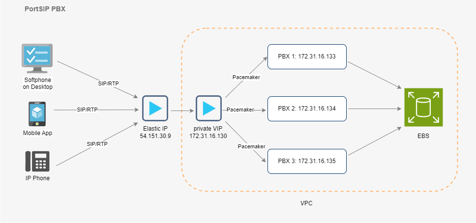
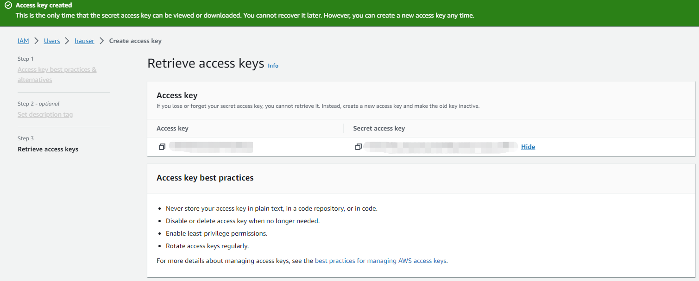

# High Availability Installations on AWS

This guide provides instructions on how to deploy PortSIP PBX HA on the AWS EC2 environment.

## Prerequisites

* **Operating System**: Ubuntu **24.04** LTS 64-bit is required.&#x20;
* **AWS EC2 Instances**: You will need three AWS EC2 instances. In this guide, the terms **EC2 server**, **PBX server**, and **node** are used interchangeably, all referring to an AWS EC2 instance.
* **Instance Specifications**: Each EC2 instance should have a minimum of 4 vCPUs and 4GB of memory.
* **Public IP Assignment**: Ensure to select the **Assign a public IP automatically** option when creating each EC2 instance.
* **Private IP Address**: Each EC2 instance must be assigned a static private IP address.
* **Location**: All EC2 instances must be located within the same Region, VPC, and subnet.
* **Elastic IP Address**: An Elastic IP address must be allocated.
* **Virtual IP**: A virtual IP is required. This should be an unused private IP address within the same VPC/subnet.
* **Elastic Block Store Volume**: An Elastic Block Store(EBS) volume is needed.

## **Architecture**

**Figure 1-1**   PortSIP PBX HA Architecture

<figure><figcaption></figcaption></figure>

## Pacemaker

The [Pacemaker](http://www.clusterlabs.org/) is a high-availability Cluster Resource Manager (CRM) that can be used to manage resources and ensure that they remain available in the event of a node failure.

The PortSIP PBX HA uses the [Pacemaker](http://www.clusterlabs.org/) to do the resource management and monitoring, once the event of PBX node failure, the resources will automatically move to a working node in the cluster.&#x20;

## AWS EBS

Amazon [Elastic Block Store](https://docs.aws.amazon.com/AWSEC2/latest/UserGuide/AmazonEBS.html) (Amazon EBS) is an easy-to-use, scalable, high-performance block-storage service designed for Amazon [Elastic Compute Cloud](https://aws.amazon.com/ec2/) (Amazon EC2).  It provides block-level storage volumes for use with EC2 instances. EBS volumes behave like raw, unformatted block devices.&#x20;

You can mount these volumes as devices on your instances. EBS volumes that are attached to an instance are exposed as storage volumes that persist independently from the life of the instance. You can create a file system on top of these volumes, or use them in any way you would use a block device (such as a hard drive). You can dynamically change the configuration of a volume attached to an instance.

The[ EBS](https://docs.aws.amazon.com/AWSEC2/latest/UserGuide/AmazonEBS.html) is utilized in the PortSIP HA scenario to synchronize data (DB, recording files, log files, and prompt files) between the PBX nodes.

To connect to the PBX service, all SIP clients (IP Phone, Softphone, Mobile App, WebRTC Client) will access the Virtual IP of PortSIP PBX in the HA scenario.

## Working Mechanisms

The working mechanisms of PortSIP PBX HA are as follows:

* **Node Configuration**: Three PBX nodes operate concurrently to prevent split-brain scenarios during HA switching.
* **Data Storage**: [EBS](https://docs.aws.amazon.com/AWSEC2/latest/UserGuide/AmazonEBS.html) is utilized to store PBX data, which includes active call information, recording files, logs, call records, and user-uploaded prompt voice files.
* **Access Point**: A Virtual IP (VIP), an unused static private IP in the APC/subnet, serves as the access entry point for the PBX system.
* **IP Mapping**: The Elastic IP consistently points to the Virtual IP, which is exposed for the IP Phone, APP, and Web browser access.
* **Status Monitoring**: [Pacemaker](http://www.clusterlabs.org/) is used to monitor the status between EC2 servers.
* **Service Provision**: The primary node provides services. If the primary node goes DOWN, the Pacemaker will immediately drift the VIP to the standby node upon detection. User service requests will then be automatically routed to the standby node, which will continue to provide services.
* **Call Restoration**: Any established call on the primary node will be automatically restored by the standby node.

## Notes

* All Linux commands must be performed as the default user "**ubuntu**".

## Creating the User Group and User

To set up the PortSIP PBX HA on AWS, you’ll need to create the user group and user in IAM.&#x20;

### Create User Group

1. Open IAM. You can choose an existing group or create a new one by clicking on **Create group**.
2. The permissions policies for this user group must include **AmazonEC2FullAccess** and **AmazonEBSCSIDriverPolicy**.
3. As the below screenshot shows up, you could name the group **hagroup**, and ensure that the permissions policies include both **AmazonEC2FullAccess** and **AmazonEBSCSIDriverPolicy**.

<figure><figcaption></figcaption></figure>

### Create User

To create a new user, follow these steps:

1. Click on **Users** to view the list of users.
2. Click on **Create user** to start the process of creating a new user.
3. As the below screenshot shows up, you could name the user **hauser**, and assign this user to the previously created user group **hagroup**.

<figure><figcaption></figcaption></figure>

### **Create User Access Key**

Once you’ve successfully created the user, follow these steps to create an access key for that user (**hauser**):

1. Click on **Create access key**.
2. In Step 1, under **Access key best practices & alternatives**, select **Command Line Interface (CLI)** for the **Use case**.

<figure><figcaption></figcaption></figure>

4. Proceed to Step 3, **Retrieve access keys**. Here, it's crucial to note and save the **Access key** and **Secret access key** for future use.

<figure><figcaption></figcaption></figure>

## VPC and Subnet <a href="#vpc-and-subnet" id="vpc-and-subnet"></a>

### VPC

In the PortSIP PBX HA setup, all PBX nodes will be deployed within the same Availability Zone (in this example, we’re using us-west-1), VPC, and subnet. It’s important to assign a static private IP from the subnet to each PBX node.

To do this, open the AWS VPC menu and use the default VPC(You can also create a new VPC). As shown in the screenshot below, the VPC IPv4 CIDR is **172.31.0.0/16**.

<figure><figcaption></figcaption></figure>

### **Create the subnet**

To set up the subnets, follow these steps:

1. Click on **Subnets** to view the list of subnets. If there are no existing subnets, click on **Create subnet** to create a new one.
2. As shown up below the example, the Subnet ID could be **subnet-8cadc4e8**, with an IPv4 CIDR of **172.31.16.0/20**, and located in the Availability Zone **us-west-1c**.


The CIDR must be **20** otherwise the installation will fail.


<figure><figcaption></figcaption></figure>

In this scenario, we’ll assign the following static private IPs to the nodes:

* Node 1: 172.31.16.133
* Node 2: 172.31.16.134
* Node 3: 172.31.16.135

## Create Security Group <a href="#create-security-group" id="create-security-group"></a>

To set up the security group, follow these steps:

1. Click on **Security Groups** to view the list of security groups. If there are no existing security groups, click on **Create security group** to create a new one.
2. For example, your Security Group name could be **pbx-ha**, with a Security Group ID of **sg-0e2bea9ea4033f893**.

<figure><figcaption></figcaption></figure>

### Inbound rule&#x20;

| **TYPE**   | **PROTOCOL** | **PORT RANGE** | **SOURCE**    | **DESCRIPTION** |
| ---------- | ------------ | -------------- | ------------- | --------------- |
| Custom UDP | UDP          | 35000 - 65000  | 0.0.0.0/0     | RTP             |
| ALL TCP    | TCP          | 0 - 65535      | 172.31.0.0/16 |                 |
| ALL UDP    | UDP          | 0 - 65535      | 172.31.0.0/16 |                 |
| Custom TCP | TCP          | 5432           | 172.31.0.0/16 | db              |
| SSH        | TCP          | 22             | 0.0.0.0/0     | ssh             |
| Custom UDP | UDP          | 5060           | 0.0.0.0/0     | pbx sip/udp     |
| Custom TCP | TCP          | 5061           | 0.0.0.0/0     | pbx sip/tcp     |
| Custom TCP | TCP          | 5063           | 0.0.0.0/0     | pbx sip/wss     |
| Custom TCP | TCP          | 8882-8900      | 0.0.0.0/0     | pbx             |
| Custom TCP | TCP          | 10443          | 0.0.0.0/0     | sbc webrtc      |
| HTTP       | TCP          | 80             | 0.0.0.0/0     | http            |
| HTTPS      | TCP          | 443            | 0.0.0.0/0     | https           |


The rule for **ALL TCP** and **ALL UDP** is allowed under the same subnet, all hosts can access each other.


### **Outbound rule**

| **TYPE**    | **PROTOCOL** | **PORT RANGE** | **DESTINATION** | **DESCRIPTION - OPTIONAL** |
| ----------- | ------------ | -------------- | --------------- | -------------------------- |
| All traffic | All          | All            | 0.0.0.0/0       | –                          |


Configure the security group when creating all HA EC2 instances.


## **Create EC2 instances** <a href="#create-ec2-instances" id="create-ec2-instances"></a>

### Create EC2

Please follow the below steps to create the EC instance.

* In the Section **Application and OS Images (Amazon Machine Image)**, please choose the AMI **Ubuntu Server 24.04 LTS (HVM), SSD Volume Type**.
* In the section **Instance type**,  please choose the instance type **t3.medium** or other instance types.&#x20;


You should choose the appropriate instance type for your business usage.


For higher user volumes and concurrent calls, more CPU and memory resources are required. Therefore, it's important to choose an instance type that is appropriate for your specific needs. Please consider your user volume and call concurrency when selecting your instance type.&#x20;

You can reference the [Hardware Specifications](../../faq/hardware-specifications-for-portsip.md) to choose the instance type.

### Create a Key pair for login

In the **Key pair (login)** section, you have the option to select an existing **Key pair name** or create a new one by clicking on **Create new key pair**.

For instance, in this guide, we’ll create a new key pair and name it **aws-portsip-pbx-ha**. This will generate a certificate file named **aws-portsip-pbx-ha.pem**.

<figure><figcaption></figcaption></figure>


In the PortSIP PBX HA, all EC2 instances must use the same key pair.


### Networking

To set up the network for the EC2 servers, follow these steps:

* Choose the VPC **vpc-027ba466** and Subnet **subnet-8cadc4e8** that you created earlier.&#x20;
* For **Auto-assign public IP**, select **Enable**.&#x20;
* In the **Firewall (security groups)** section, select the existing security group **pbx-ha** that you created earlier.&#x20;

**Note**: In the **Advanced network configuration** > **Network interface 1** section, enter the following IPs for the **Primary IP** field:

* Node 1: Enter "172.31.16.133"&#x20;
* Node 2: Enter "172.31.16.134"&#x20;
* Node 3: Enter "172.31.16.135"

<figure><figcaption></figcaption></figure>

### Configuring Storage (Volume)

In the Section **Storage(Volume)** we can configure the disk for the PBX HA, this disk is used for installing the Linux OS, usually, 40G or 100G is enough.

<figure><figcaption></figcaption></figure>

### Verifying Host NAME

By default, AWS automatically sets up the Host Name for each EC2 instance once it’s successfully created. This means you don't have to manually assign a Host Name to each instance, simplifying the setup process.

In this scenario, it shows up as the below.

| NODE | HOST NAME        | PUBLIC IP   | PRIVATE IP    | DISK            | DEFAULT USER |
| ---- | ---------------- | ----------- | ------------- | --------------- | ------------ |
| 1    | ip-172-31-16-133 | Auto-assign | 172.31.16.133 | /dev/sda (40GB) | **ubuntu**   |
| 2    | ip-172-31-16-134 | Auto-assign | 172.31.16.134 | /dev/sda (40GB) | ubuntu       |
| 3    | ip-172-31-16-135 | Auto-assign | 172.31.16.135 | /dev/sda (40GB) | ubuntu       |

### Allocate Elastic IP

Next, you'll need to allocate an Elastic IP for the PBX HA. Here’s how:

Click on **Elastic IPs** to list the current allocated Elastic IPs. Click on **Allocate Elastic IP address** to create a new one. For example, your allocated IPv4 address could be **54.151.30.9**, with an allocation ID of **eipalloc-02c7cf64a5cd449c**.

<figure><figcaption></figcaption></figure>

## Create Elastic Block Store Volume <a href="#create-elastic-block-store-volume" id="create-elastic-block-store-volume"></a>

Next, you’ll need to create an EBS volume to store the PBX HA data. This volume usually should be large since it is used to store the PBX data such as DB, recording files, logs, and chat files, in your production environment, we suggest it be as big as possible, such as 1000G.

Here’s how:

1. Click on **Volumes** to view the list of volumes.
2. Click on **Create volume** to create a new one.

For example, your volume info could look like this:

| Type | Volume ID             | Size   | IOPS | Availability Zone | Encryption | Multi-Attach enabled |
| ---- | --------------------- | ------ | ---- | ----------------- | ---------- | -------------------- |
| io2  | vol-0e06e1e9da3c49b67 | 1000GB | 500  | us-west-1c        | No         | No                   |

The following screenshot shows the example:

<figure><figcaption></figcaption></figure>

## Configuring AWS

### **Install AWS CLI**

Perform the below command on all EC2 instances.

```sh
sudo apt install unzip && curl "https://awscli.amazonaws.com/awscli-exe-linux-x86_64.zip" -o "awscliv2.zip" && unzip awscliv2.zip && sudo ./aws/install
```

You can use the following command to check the AWS CLI version:

```
aws --version
```

### **Configuring AWS IAM**

Take the region name as the screenshot, in case the region name is **us-west-1**.

<figure><figcaption></figcaption></figure>

Perform the below command on all EC2 instances.

```
aws configure
```

Enter the necessary information for the prompts.

```
AWS Access Key ID [None]: type your Access Key ID here (see Create User Access Key)
AWS Secret Access Key [None]: type your Secret Access Key Here (see Create User Access Key)
Default region name [None]: type region name here
Default output format [None]: json
```

### Configuring Certificate File

You’ll need to upload the `aws-portsip-pbx-ha.pem` file to the `/home/ubuntu/.ssh/` directory of the node with IP `172-31-16-133`. This `aws-portsip-pbx-ha.pem` file is the key pair that was generated when creating the EC2 instances.

Perform the below command on the node **ip-172-31-16-133** only.

```sh
chmod 400 /home/ubuntu/.ssh/aws-portsip-pbx-ha.pem
```

## Configuring PortSIP PBX HA

### Download the PBX resource package

The following command should only be executed on the EC2 **ip-172-31-16-133**.

```sh
cd /opt/ && sudo wget -N https://www.portsip.com/downloads/ha/v22/portsip-pbx-ha-on-aws-guide-22.tar.gz \
 && sudo tar xf portsip-pbx-ha-on-aws-guide-22.tar.gz
```

### Set variables

Please prepare the value for the below Variables.

<table><thead><tr><th>VARIABLES</th><th width="117.33333333333331">TYPE</th><th>DESCRIPTION</th></tr></thead><tbody><tr><td>pbx01_instance_id</td><td>string</td><td>The instance id of the node 1</td></tr><tr><td>pbx02_instance_id</td><td>string</td><td>The instance id of the node 2</td></tr><tr><td>pbx03_instance_id</td><td>string</td><td>The instance id of the node 3</td></tr><tr><td>private_vip_address</td><td>string</td><td>The virtual IP(in the example, 172.31.16.130 is used)</td></tr><tr><td>eip_address</td><td>string</td><td>Elastic IP Address</td></tr><tr><td>eip_allocation_id</td><td>string</td><td>Elastic Allocation ID</td></tr><tr><td>ebs_volume_id</td><td>string</td><td>EBS Volume ID</td></tr><tr><td>pbx_image</td><td>string</td><td>PortSIP PBX docker image</td></tr><tr><td>ssh_private_key_file</td><td>string</td><td>The path of certificate file for the key pair "aws-portsip-pbx-ha"</td></tr></tbody></table>

The following command should only be executed on the EC2 **ip-172-31-16-133**.

```sh
cd /opt/portsip-pbx-ha-guide && sudo bash -c 'cat > ./res/vars.yml' << EOF
pbx01_instance_id: i-08807c762627239b8
pbx02_instance_id: i-03411641c37513049
pbx03_instance_id: i-0c301db1a53ae3a4b
private_vip_address: 172.31.16.130
eip_address: 54.151.30.9
eip_allocation_id: eipalloc-02c7cf64a5cd449cf
ebs_volume_id: vol-0e06e1e9da3c49b67
pbx_image: portsip/pbx:22
ssh_private_key_file: /home/ubuntu/.ssh/aws-portsip-pbx-ha.pem
EOF
```

### Install Dependencies

The following command should only be executed on the EC2 **ip-172-31-16-133**.

```sh
cd /opt/portsip-pbx-ha-guide/ && /bin/bash install_dependencies.sh
```

### Deploying PBX HA

Perform the below command on the node **ip-172-31-16-133** only.&#x20;

The execution may take a long time, so patience is required. Please do not interrupt, restart, or shut down while the process is in progress.

```sh
cd /opt/portsip-pbx-ha-guide/ && sudo /bin/bash deploy_pbx.sh
```

Once the resource configuration is complete, you can access your PBX by opening [https://54.151.30.9:8887](https://54.151.30.9:8887/) in a web browser. All future PBX management, configuration, and access will be done through the Elastic IP 54.151.30.9.

You can also resolve your web domain to the Elastic IP.

### Configuring PortSIP PBX

When you sign into the PBX Web portal, the setup wizard will automatically pop up. In its first step, Enter the private virtual IP **172.31.16.130** as the filed **Private IPv4**, and enter the Elastic IP **54.151.30.9** as the filed **Public IPv4**.

<figure><figcaption></figcaption></figure>

Once successfully completed the Setup Wizard, select the menu **Advanced > Settings > Advanced**, select the **Enable Call Recovery** option, and confirm by clicking on the **OK** button.

## Installing PortSIP IM Service

You are now ready to install the **PortSIP IM Service**. Please refer to the guide [**Installation of PortSIP IM Server**](../../portsip-pbx-administration-guide/1-installation-of-the-portsip-pbx/installation-of-portsip-pbx-v22/install-portsip-im-server-on-linux.md) for detailed steps to complete the installation.

## Managing PBX HA

Once you successfully configured the PortSIP PBX HA as per the above steps, you can use the following commands to manage the PBX HA.

All commands should be performed only on the EC2 instance **ip-172-31-16-133.**

### View PBX HA Status

```
cd /opt/portsip-pbx-ha-guide && /bin/bash ha_ctl.sh show
```

The following output indicates that the PBX HA is working properly. The EC2 instance with IP **172-31-16-133** is serving as the current master node, while the EC2 instances with IPs **172-31-16-134** and **172-31-16-135** are acting as slave nodes.

```
Cluster name: ha_cluster
Cluster Summary:
  * Stack: corosync
  * Current DC: ip-172-31-16-134 (version 2.0.3-4b1f869f0f) - partition with quorum
  * Last updated: Tue Sep 19 03:29:30 2023
  * Last change:  Tue Sep 19 03:25:28 2023 by root via cibadmin on ip-172-31-16-133
  * 3 nodes configured
  * 7 resource instances configured

Node List:
  * Online: [ ip-172-31-16-133 ip-172-31-16-134 ip-172-31-16-135 ]

Full List of Resources:
  * eip    (ocf::portsip:awseip):     Started ip-172-31-16-133
  * privip    (ocf::heartbeat:awsvip):     Started ip-172-31-16-133
  * vip    (ocf::heartbeat:IPaddr2):     Started ip-172-31-16-133
  * src_pkt_ip    (ocf::portsip:awsipsrcaddr):     Started ip-172-31-16-133
  * ebs    (ocf::portsip:awsebs):     Started ip-172-31-16-133
  * datapath_fs    (ocf::heartbeat:Filesystem):     Started ip-172-31-16-133
  * pbx    (ocf::portsip:pbx):     Started ip-172-31-16-133

Daemon Status:
  corosync: active/enabled
  pacemaker: active/enabled
  pcsd: active/enabled
```

### Check the Current Master Node

Perform the below command only on the EC2 instance **ip-172-31-16-133**.

```
cd /opt/portsip-pbx-ha-guide && /bin/bash ha_ctl.sh master
```

The output will indicate the current master node is on which EC2 instance.

### Restart PBX

Use the below command to restart the PBX.

```
cd /opt/portsip-pbx-ha-guide && /bin/bash ha_ctl.sh restart -s pbx
```

The following output indicates that the PBX is successfully restarted.

```
try to restart resource pbx
disable resource pbx
resource 'pbx' is not running on any node
enable resource pbx
```


