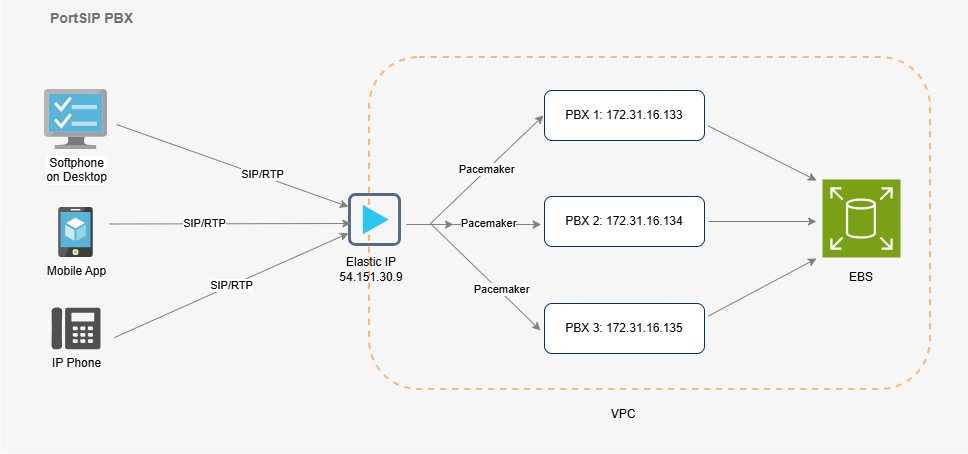

# PortSIP PBX High Availability Architecture

A **three-node PortSIP PBX high-availability (HA) cluster** provides resilience and service continuity. PortSIP PBX can detect multiple types of node failures and automatically fail over control to another healthy PBX node. When a failover occurs, **established calls are automatically recovered**, minimizing service disruption.

**Figure 1-1 PortSIP PBX HA Architecture**

<figure><figcaption></figcaption></figure>

***

### Pacemaker

[Pacemaker](http://www.clusterlabs.org/) is a high-availability **Cluster Resource Manager (CRM)** used to manage and monitor cluster resources. It ensures that critical services remain available by:

* Monitoring the health of PBX nodes and cluster resources
* Detecting failures and triggering failover events
* Automatically moving PBX resources to a healthy node when a node fails

In the PortSIP PBX HA deployment, [Pacemaker](http://www.clusterlabs.org/) is responsible for resource monitoring and failover orchestration, ensuring that services are automatically brought online on an operational node when failures occur.

***

### AWS EBS

[Amazon EBS](https://docs.aws.amazon.com/AWSEC2/latest/UserGuide/AmazonEBS.html)(Amazon Elastic Block Store) is a scalable, high-performance block storage service for Amazon EC2. [EBS](https://docs.aws.amazon.com/AWSEC2/latest/UserGuide/AmazonEBS.html) volumes behave like persistent block devices (similar to physical disks) and can be:

* Attached to EC2 instances as storage devices
* Formatted with a filesystem and mounted
* Resized or reconfigured dynamically
* Retained independently from the lifecycle of an EC2 instance

In the PortSIP PBX HA scenario, **EBS is used to keep critical PBX data synchronized across nodes**, including:

* Databases (DB)
* Call recordings
* Log files
* Prompt and media files

This shared/persistent storage approach allows a standby node to quickly assume service responsibility with the latest data available after failover.

***

### Client Access via Elastic IP

In an HA deployment, all SIP clients—including **IP phones, desktop softphones, mobile apps, and WebRTC clients**—connect to the PBX using the **Elastic IP.**

Using an Elastic IP ensures:

* A single, consistent SIP server address for all clients
* Seamless failover (the Elastic IP moves to the active node)
* No need to reconfigure endpoints when a node change occurs

