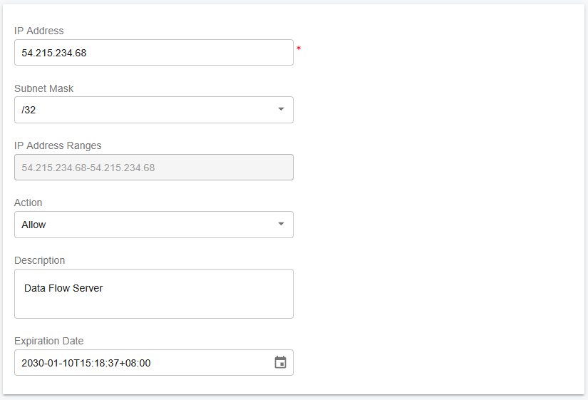
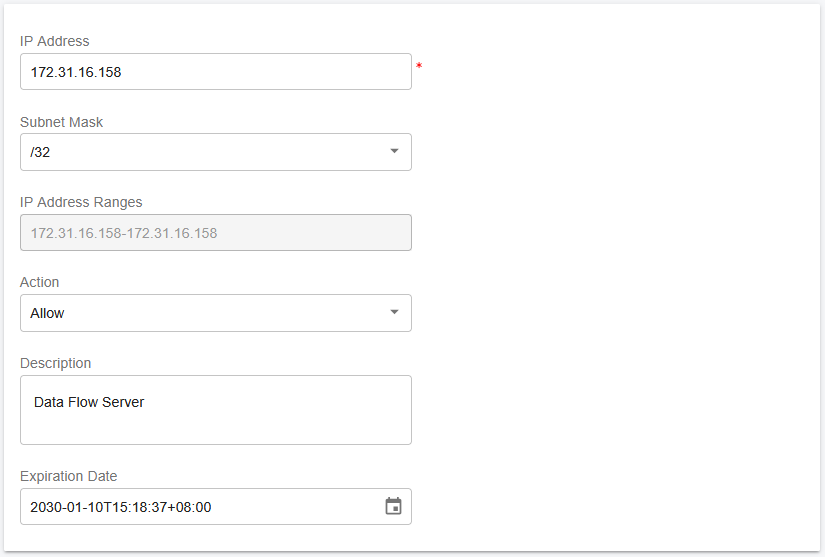

# Scaling Data Flow Server on AWS for High Availability

With a PortSIP PBX High Availability (HA) deployment, the Data Flow Service must be installed on a separate server.

Before proceeding with this guide, ensure that you have successfully completed the PortSIP PBX [High Availability installation on AWS.](https://support.portsip.com/portsip-communications-solution/high-availability-v22.x/high-availability-and-scalability-on-aws/high-availability-installations-on-aws)

***

### Install Data Flow Service on a Separate Server

The **PortSIP Data Flow Service,** a high-performance analytics engine built on **ClickHouse**.

The Data Flow service powers the following advanced capabilities:

* Call Detail Record (CDR) storage and analytics
* Real-time data dashboards
* Queue wallboards for contact center operations

ClickHouse is optimized for large-scale analytical workloads, capable of handling billions of CDRs and real-time queue or agent activity data with extremely fast query performance. This makes it ideal for service providers and enterprise-grade deployments.

#### Hardware Requirements <a href="#hardware-requirements" id="hardware-requirements"></a>

For best performance, ensure your hardware meets or exceeds the specifications below. For additional reference, see the [**ClickHouse official best practices documentation**](https://clickhouse.com/docs/guides/sizing-and-hardware-recommendations).

**Minimum Requirements**

* **vCPU**: 4 cores
* **Memory**: 8 GB
* **Disk**: 128 GB SSD

***

**Recommended Requirements**

* **vCPU**: 8 cores
* **Memory**: 16 - 32 GB
* **Disk**: 256GB or larger (NVMe SSD preferred)

***

**Hardware Sizing Formula (Large-Scale Deployments)**

For large or high-volume environments, use the following guideline:

* **vCPU**: ≥ 8
* **Memory**: vCPU × 4 GB
* **Disk**: Based on expected CDR volume and data retention policy

***

#### User Account Requirements

For seamless integration with the HA environment, the Data Flow server must meet the following user account requirements:

* The Data Flow server **must use the same username and password as the PBX servers**
* In this guide, the username **`pbx`** is used as an example
* The user account **must have sudo privileges** to execute administrative commands

***

#### Disk Space Recommendations

To ensure stable operation and sufficient capacity for growth, we recommend the following disk allocations:

* Minimum **128 GB**
* Used for storing call detail records (CDRs), logs, recordings, and messaging data

If your deployment handles **very large call volumes**, increase the data volume size accordingly, as described in the earlier sections of this guide.

***

### Deployment Requirements

* Each application server must be deployed on a dedicated EC2 instance. Do not install multiple application server roles on a single EC2 instance.
* Each EC2 instance must use a **static private IP address** and an **elastic IP address**. DHCP-assigned IP addresses are not supported.

***

#### Preparing Linux Servers (EC2 Instances)

Prepare the EC2 instance that will host the Data Flow server. In this example, the following Data Flow server is deployed:

* Private IP: `172.31.16.158`
* Hostname: `ip-172-31-16-158`
* Elastic IP: `54.215.234.68`

Ensure all IP addresses are reserved and consistently assigned to their respective EC2 instances.

***

#### Step 1: Prepare the Linux Server for Data Flow Installation

The following tasks **must be completed before installing the Data Flow service**:

* Ensure the system date and time are correctly synchronized
* Assign a static private IP address: Example: `172.31.16.158`
* Install all available system updates and service packs
* Do not install PostgreSQL on the **Data Flow** server
* Disable all power-saving features: Set the system to High Performance mode
* Do not install:
  * TeamViewer
  * VPN software
  * Similar remote-access tools
* The server must not act as:
  * DNS server
  * DHCP server

These requirements ensure optimal performance and avoid conflicts with the Data Flow service.

***

### Creating EC2 Instances

Follow the steps below to create the EC2 instances for the Data Flow server.

\
The process is largely the same as the [PortSIP PBX High Availability (HA) deployment on AWS](high-availability-installations-on-aws.md), but please pay close attention to the specific configuration details outlined below.

***

#### Supported Linux Operating System

PortSIP PBX High Availability (HA) and all associated servers require a consistent and compatible Linux environment.

* **Supported OS**: Ubuntu 24.04 (64-bit)
* The IM server **must run the exact same OS version** as the PBX server.

#### Network Settings

* Select the **same VPC and Subnet** used by the PBX HA nodes.
* Select the **same Security Group** used by the PBX HA nodes.
* Set **Auto-assign public IP** to **Disable**.
* Under **Advanced network configuration → Network interface 1**:
  * Set **Primary IP** to `172.31.16.158` for this EC2 server.
* Associate the Elastic IP with this EC2 server. For the Elastic IP address example `54.215.234.68`

#### Disk Space Recommendations

* **Minimum required disk space**: 128 GB
* No separate data partition is required for the Data Flow Server

***

### Configure Security Group Inbound Rules

Modify the **Security Group that is attached to all three PBX HA EC2 instances** and add an Inbound Rule that allows traffic from the **Data Flow servers’ Elastic IP** 54.215.234.68 addresses.

Please follow the screenshot below to add the inbound rule to the Security Group used by the PBX HA servers.

<figure><figcaption></figcaption></figure>

***

### Prerequisites

Before configuring the Data Flow Server, ensure that the following prerequisites are met.

The PortSIP PBX High Availability (HA) installation and configuration must be completed on the Main Server first by following the guide:  [High Availability Installations on AWS](high-availability-installations-on-aws.md).

***

#### Step 2: Configure the IP Address Whitelist

> ⚠️ **IMPORTANT**\
> This step is **mandatory**.\
> The  Data Flow service **will not function correctly** unless the  Data Flow server IP address is added to the PBX whitelist.

To prevent the PBX from applying request-rate limits to the  Data Flow service, you must whitelist the  Data Flow server IP address.

#### Whitelist Configuration Steps

1. Sign in to the PBX Web Portal as a System Administrator
2. Navigate to **IP Blacklist**
3. Click **Add**
4. Enter the Data Flow **Elastic IP address**
5. Set a **long expiration date**
6. Save the configuration

<figure><figcaption></figcaption></figure>

7. Repeat the above steps to add the Data Flow server private IP `172.31.16.158` to the whitelist.

<figure><figcaption></figcaption></figure>

This ensures uninterrupted communication between the PBX and the data flow service.

***

#### Step 3: Generate a Token for the Data Flow Server

To allow the Data Flow server to securely authenticate with the PortSIP PBX HA cluster, you must generate a Data Flow server token from the PBX Web Portal.

1. Sign in to the PortSIP PBX Web Portal as a System Administrator.
2. Navigate to **Servers > Data Flow**.
3. Select the **default Data Flow** **server**.
4. Click **Generate Token**.

The generated token will be used during the Data Flow service installation to establish a trusted and secure connection between the PBX HA cluster and the Data Flow server.

<figure><figcaption></figcaption></figure>

> ⚠️ **IMPORTANT**\
> All commands below for extended servers **must be executed on the `pbx01` node**, regardless of whether it is currently the active node.

***

#### Step 4: Deploy the Data Flow Service

The data flow service deployment **must be initiated from the `ip-172-31-16-133` node** of the PBX HA cluster.

> ⚠️ **IMPORTANT**\
> The deployment process may take several minutes.\
> **Do not interrupt the process, reboot any server, or close the terminal** until the command completes.

**Command parameters**

* `-p` : Path for storing Data Flow and ClickHouse data (required)
* `-d` : ClickHouse Docker image (`portsip/clickhouse:25.8`)
* `-a` : Private IP address of the Data Flow server
* `-A` : Elastic IP address
* `-i` : PortSIP PBX Docker image version (required)

Example:

```bash
cd /opt/portsip-pbx-ha-guide/ && \
/bin/bash dataflow.sh run \
-p /var/lib/portsip \
-a 172.31.16.158 \
-A 54.215.234.68
```

#### Operational Notes (Data Flow)

* If the **PBX IP address changes**, you must delete and recreate the existing Data Flow Docker instance.
* If a **new authentication token** is generated, the Data Flow Docker instance must be deleted and recreated.
* After upgrading the **PBX to a new version**, you must remove and recreate the Data Flow Docker instance to ensure compatibility.

The above operations **do not affect or erase existing analytics data** stored in ClickHouse.

***

### Managing the Data Flow Server

All Data Flow server management operations are performed using the `dataflow.sh` script provided with the PortSIP PBX HA deployment.

> ⚠️ **IMPORTANT**\
> All commands in this section **must be executed on the `pbx01` node**, regardless of which PBX node is currently active.

***

#### Available Operations

The following operations are supported for managing the data flow server:

* **start** – Start the data flow service
* **stop** – Stop the data flow service
* **restart** – Restart the data flow service
* **upgrade** - Upgrade the data flow service
* **rm** – Remove the data flow service installation

***

#### Data Flow Server Management Commands

Run the appropriate command on **`ip-172-31-16-133`** node based on the required operation.

**Start the Data Flow Server**

```bash
cd /opt/portsip-pbx-ha-guide/ && /bin/bash dataflow.sh start
```

**Stop the Data Flow Server**

```bash
cd /opt/portsip-pbx-ha-guide/ && /bin/bash dataflow.sh stop
```

**Restart the Data Flow Server**

```bash
cd /opt/portsip-pbx-ha-guide/ && /bin/bash dataflow.sh restart
```

**Remove the Data Flow Server**

```bash
cd /opt/portsip-pbx-ha-guide/ && /bin/bash dataflow.sh rm
```

> ⚠️ **WARNING**\
> Removing the Data Flow server will stop messaging services and delete the Data Flow service installation.\
> Ensure this operation is performed only during maintenance windows.

***

### Upgrading the Data Flow Server

Follow the steps below to upgrade the Data Flow server in a PortSIP PBX HA environment.

> ⚠️ **IMPORTANT**\
> All upgrade steps **must be performed on the `ip-172-31-16-133` node**, even if `pbx01` is not the current active PBX node.

#### Prerequisites

Before upgrading the Data Flow server:

* Ensure that the PBX HA cluster has already been upgraded by following the guide: [Upgrading High Availability Installation ](upgrading-high-availability-installation.md)
* Ensure the PBX HA cluster is operating normally

***

#### Upgrade the Data Flow Server

On **`pbx01`**, run the following command to upgrade the Data Flow service:

```bash
cd /opt/portsip-pbx-ha-guide/ && /bin/bash dataflow.sh upgrade
```

> ⚠️ **IMPORTANT**\
> The upgrade process may take several minutes.\
> **Do not interrupt the process, reboot any server, or close the terminal** until the command completes.

Once the upgrade finishes successfully, the Data Flow service will be restarted automatically with the updated version.


