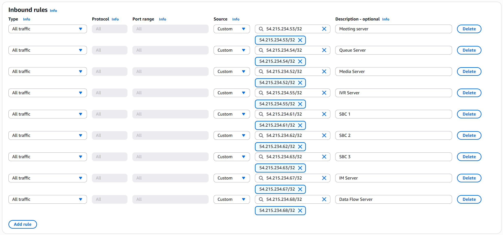
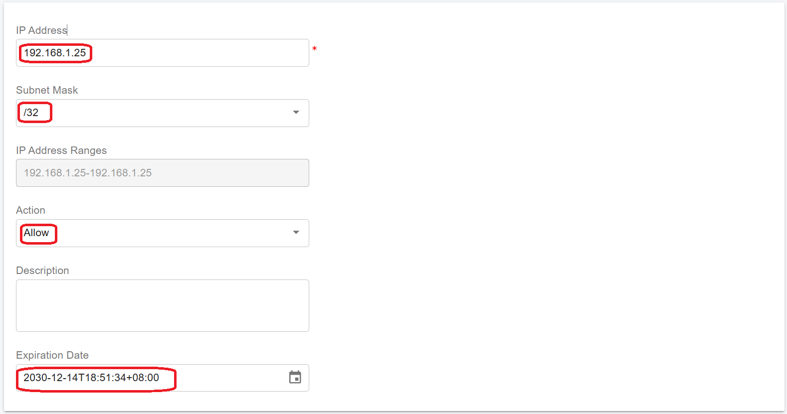
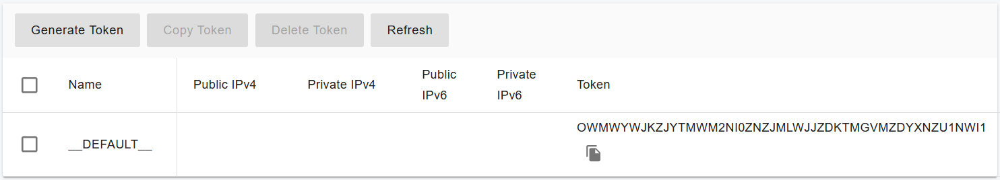

# Scaling IM Server on AWS for High Availability

With a PortSIP PBX High Availability (HA) deployment, the Instant Messaging (IM) Service must be installed on a separate server.

Before proceeding with this guide, ensure that you have successfully completed the PortSIP PBX [High Availability installation on AWS.](high-availability-installations-on-aws.md)

***

### Install IM Service on a Separate Server

For optimal performance and scalability, the PortSIP IM Service should be deployed on a **dedicated EC2 instance**, especially in environments with a large number of users exchanging messages and sharing files (including images and attachments).

#### Large-Scale Deployment

The following specifications are suitable for environments supporting **up to 50,000 concurrent users** with active messaging and file sharing:

* **CPU:** 20 cores or higher
* **Memory:** 16 GB RAM
* **Disk:**
  * High I/O performance required
  * **SSD strongly recommended**
  * Minimum **256 GB**
* **Network Bandwidth:**
  * **1 Gbps or higher**
  * Especially important for high message volumes and file transfers

***

#### Small to Medium Deployment

The following specifications are suitable for environments supporting **up to 10,000 concurrent users** with active messaging and file sharing:

* **CPU:** 6–8 cores or higher
* **Memory:** 16 GB RAM
* **Disk:**
  * High I/O performance required
  * **SSD strongly recommended**
  * Minimum **256 GB**
* **Network Bandwidth:**
  * **100 Mbps or higher**
  * Especially important for high message volumes and file transfers

***

#### Deployment Requirements

* Each application server must be deployed on a dedicated EC2 instance. Do not install multiple application server roles on a single EC2 instance.
* Each EC2 instance must use a **static private IP address** and an **elastic IP address**. DHCP-assigned IP addresses are not supported.

***

#### Preparing Linux Servers (EC2 Instances)

Prepare the EC2 instance that will host the IM server. In this example, the following IM server is deployed:

* Private IP: `172.31.16.157`
* Hostname: `ip-172-31-16-157`
* Elastic IP: `54.215.234.67`

Ensure all IP addresses are reserved and consistently assigned to their respective EC2 instances.

***

### Preparing the Linux Host Machine for Installation

The following tasks **must be completed before installing any PortSIP PBX cluster servers**. Proper preparation ensures system stability, predictable networking behavior, and reliable real-time media performance.

* Ensure the system date and time are correctly synchronized (for example, via NTP).
* Ensure each EC2 instance is assigned a **static private IP addres**s and an **elastic IP address**.
* Install all available operating system updates and service packs before installing the PortSIP application servers.
* Do not install PostgreSQL on the server.
* Do not install TeamViewer, VPN software, or similar remote-access tools on the host machine.
* The server must not be configured as a DNS or DHCP server.

***

### Creating EC2 Instances

Follow the steps below to create the EC2 instances for the application servers.\
The process is largely the same as the [PortSIP PBX High Availability (HA) deployment on AWS](high-availability-installations-on-aws.md), but please pay close attention to the specific configuration details outlined below.

***

#### Supported Linux Operating System

PortSIP PBX High Availability (HA) and all associated servers require a consistent and compatible Linux environment.

* **Supported OS**: Ubuntu 24.04 (64-bit)
* The IM server **must run the exact same OS version** as the PBX server.

#### Network Settings

* Select the **same VPC and Subnet** used by the PBX HA nodes.
* Select the **same Security Group** used by the PBX HA nodes.
* Set **Auto-assign public IP** to **Disable**.
* Under **Advanced network configuration → Network interface 1**:
  * Set **Primary IP** to `172.31.16.157` for this EC2 server.
* Associate the Elastic IP with this EC2 server. For the Elastic IP address example `54.215.234.67`

#### Disk Space Recommendations

* **Minimum required disk space**: 128 GB
* No separate data partition is required fo IM server

***

### Configure Security Group Inbound Rules

Modify the **Security Group that attached to all three PBX HA EC2 instances** and add an Inbound Rule that allows traffic from the **IM servers’ Elastic IP** addresses.

Please follow the screenshot below to add the inbound rule to the Security Group used by the PBX HA servers.

<figure><figcaption></figcaption></figure>

***

### Prerequisites

Before configuring the IM Server, ensure that the following prerequisites are met.

The PortSIP PBX High Availability (HA) installation and configuration must be completed on the Main Server first by following the guide:  [High Availability Installations on AWS ](high-availability-installations-on-aws.md).

***

### User Account Requirements

To ensure consistency and reliable automation across the HA cluster, the IM server must meet the following user account requirements:

* The server must use the **same username and password** as the PBX server
* In this guide, the username `pbx` is used as an example
* The user account **must have sudo privileges** to execute administrative and management commands

***

### Important Notice

All management and operational commands for **IM server**, must execut the following commands **only on the PBX HA node `ip-172-31-16-133`**., regardless of whether it is currently the active or standby node.

This ensures configuration consistency and prevents cluster state conflicts.

***

### Enable Password-Free SSH Login

To allow automated management and deployment, configure **password-free SSH access** from the **PBX HA node `ip-172-31-16-133` only** to IM Server.

If prompted to confirm the connection (yes/no), type **yes**.

```bash
ssh-copy-id -i ~/.ssh/id_rsa.pub pbx@54.215.234.67
```

This step is required before deploying or managing IM server from the HA controller.

***

#### Step 1: Configure the IP Address Whitelist

> ⚠️ **IMPORTANT**\
> This step is **mandatory**.\
> The IM service **will not function correctly** unless the IM server IP address is added to the PBX whitelist.

To prevent the PBX from applying request-rate limits to the IM service, you must whitelist the IM server IP address.

#### Whitelist Configuration Steps

1. Sign in to the PBX Web Portal as a System Administrator
2. Navigate to **IP Blacklist**
3. Click **Add**
4. Enter the IM server IP elastic addres&#x73;**: 54.215.234.67**
5. Set a **long expiration date**
6. Save the configuration

<figure><figcaption></figcaption></figure>

This ensures uninterrupted communication between the PBX and the IM service.

***

#### Step 2: Generate a Token for the IM Server

To allow the IM server to securely authenticate with the PortSIP PBX HA cluster, you must generate an IM server token from the PBX Web Portal.

1. Sign in to the PortSIP PBX HA Web Portal as a System Administrator.
2. Navigate to **Servers > IM Servers**.
3. Select the **default IM server**.
4. Click **Generate Token**.

The generated token will be used during the IM service installation to establish a trusted and secure connection between the PBX HA cluster and the IM server.

<figure><figcaption></figcaption></figure>

> ⚠️ **IMPORTANT**\
> All commands below for extended servers **must be executed on the `ip-172-31-16-133` node**, regardless of whether it is currently the active node.

***

#### Step 3: Deploy the IM Service

The IM service deployment **must be initiated from the `ip-172-31-16-133` node** of the PBX HA cluster.

> ⚠️ **IMPORTANT**\
> The deployment process may take several minutes.\
> **Do not interrupt the process, reboot any server, or close the terminal** until the command completes.

#### Deploy IM Service with Default Storage Path

Run the following command on the **`ip-172-31-16-133` only**, specifying both the **static private IP** and **elastic IP** of the IM server:

```bash
cd /opt/portsip-pbx-ha-guide/ && /bin/bash im.sh run \
-a 172.31.16.157 \
-A 54.215.234.67
```

***

#### Deploy IM Service with a Custom File Storage Path (Optional)

Run the following command on the **`ip-172-31-16-133`  node only i**f you want to store IM chat messages and shared files in a custom directory. Use the **`-f`** parameter:

```bash
cd /opt/portsip-pbx-ha-guide/ && /bin/bash im.sh run \
-a 172.31.16.157 \
-A 54.215.234.67 \
-f /data/im
```

Ensure that the specified directory exists and has sufficient disk space and appropriate permissions.

***

#### Parameter Reference

* **`-a`**: Static private IP address of the IM server
* **`-A`**: Elastic IP address of the IM server
* **`-f`** _(Optional), &#x63;_&#x75;stom directory for storing IM chat messages and shared files


If your network infrastructure includes an additional firewall, ensure that **TCP port 8887** is allowed in the firewall rules. Client applications require access to this port to **send and receive instant messages**.


***

### Managing the IM Server

All IM server management operations are performed using the `im.sh` script provided with the PortSIP PBX HA deployment.

> ⚠️ **IMPORTANT**\
> All commands in this section **must be executed on the `ip-172-31-16-133` node**, regardless of which PBX node is currently active.

***

#### Available Operations

The following operations are supported for managing the IM server:

* **start** – Start the IM service
* **stop** – Stop the IM service
* **restart** – Restart the IM service
* **upgrade** – Upgrade the IM service
* **rm** – Remove the IM service installation

***

#### IM Server Management Commands

Run the appropriate command on **`ip-172-31-16-133`** based on the required operation.

**Start the IM Server**

```bash
cd /opt/portsip-pbx-ha-guide/ && /bin/bash im.sh start
```

**Stop the IM Server**

```bash
cd /opt/portsip-pbx-ha-guide/ && /bin/bash im.sh stop
```

**Restart the IM Server**

```bash
cd /opt/portsip-pbx-ha-guide/ && /bin/bash im.sh restart
```

**Remove the IM Server**

```bash
cd /opt/portsip-pbx-ha-guide/ && /bin/bash im.sh rm
```

> ⚠️ **WARNING**\
> Removing the IM server will stop messaging services and delete the IM service installation.\
> Ensure this operation is performed only during maintenance windows.

***

### Upgrading the IM Server

Follow the steps below to upgrade the IM server in a PortSIP PBX HA environment.

> ⚠️ **IMPORTANT**\
> All upgrade steps **must be performed on the `ip-172-31-16-133` node**, even if **`ip-172-31-16-133`** is not the current active PBX node.

#### Prerequisites

Before upgrading the IM server:

* Ensure that the PBX HA cluster has already been upgraded by following the guide: [Upgrading High Availability Installation ](upgrading-high-availability-installation.md)
* Ensure the PBX HA cluster is operating normally

***

#### Step 1: Generate a New IM Server Token

1. Sign in to the PortSIP PBX Web Portal as a System Administrator
2. Navigate to **Servers > IM Servers**
3. Select the **default IM server**
4. Click **Generate Token** to generate a new authentication token

***

#### Step 2: Upgrade the IM Server

On **`ip-172-31-16-133`**, run the following command to upgrade the IM service:

```bash
cd /opt/portsip-pbx-ha-guide/ && /bin/bash im.sh upgrade
```

> ⚠️ **IMPORTANT**\
> The upgrade process may take several minutes.\
> **Do not interrupt the process, reboot any server, or close the terminal** until the command completes.

Once the upgrade finishes successfully, the IM service will be restarted automatically with the updated version.


