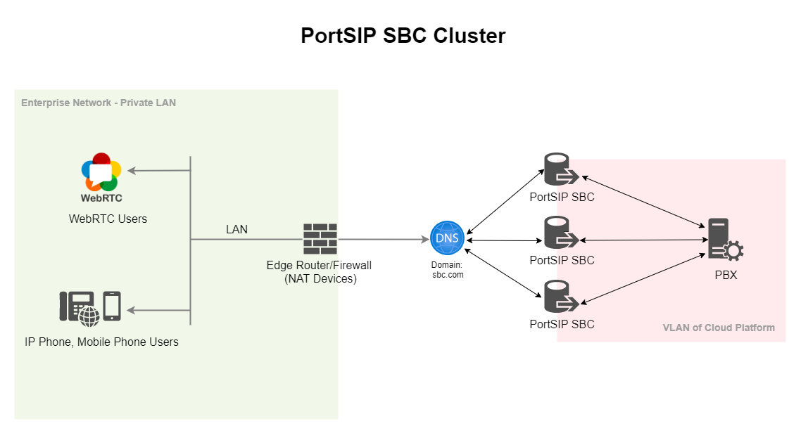

# Scaling SBC on AWS for High Availability

If your deployment handles a high volume of WebRTC traffic, Microsoft Teams Direct Routing calls, or uses a Session Border Controller (SBC) to isolate and protect the PBX, all signaling and media traffic will be routed through the SBC layer.

In these scenarios, deploying the SBC in a clustered, high-availability (HA) configuration is strongly recommended.

An SBC cluster provides:

* Higher throughput to support large call volumes
* Improved scalability as traffic and customer demand grow
* Enhanced resiliency and fault tolerance
* Stronger isolation and protection for the PBX core

This architecture is widely regarded as a best practice for service providers and enterprises operating communications platforms at scale.

***

### Reference Architecture Overview

As illustrated in the architecture diagram, the PortSIP PBX is deployed inside a secure VLAN/VPC within the cloud environment. One or more PortSIP SBC servers are positioned in front of the PBX and act as the single ingress and egress point for all external traffic.

<figure><figcaption></figcaption></figure>

#### Key Architectural Characteristics

* End users and external systems never access the PBX directly
* All SIP, WebRTC, and RTP media traffic is terminated, secured, and controlled by the SBC
* The SBC cluster distributes traffic across multiple nodes to ensure availability and performance
* The PBX core remains isolated, protected, and optimized for call control and service logic

This design significantly improves both the security posture and the operational stability of the overall system.

***

### Deployment Example

In the following sections, we will use **AWS** as an example to demonstrate how to deploy a **high-availability PortSIP SBC cluster** and integrate it with a PortSIP PBX deployment.

This approach applies equally to **service providers**, **UCaaS platforms**, and **enterprise deployments** that require carrier-grade reliability and performance.

***

#### Deployment Requirements

* Each application server must be deployed on a dedicated EC2 instance. Do not install multiple application server roles on a single EC2 instance.
* Each EC2 instance must use a **static private IP address** and an **elastic IP address**. DHCP-assigned IP addresses are not supported.

***

#### Preparing Linux Servers (EC2 Instances)

Prepare the EC2 instances that will host the application servers. In this example, the following application servers are deployed:

* **SBC Server 1**
  * Private IP: `172.31.16.151`
  * Hostname: `ip-172-31-16-151`
  * Elastic IP: `54.215.234.61`
* **SBC 1Server 2**
  * Private IP: `172.31.16.152`
  * Hostname: `ip-172-31-16-152`
  * Elastic IP: `54.215.234.62`
* **SBC Server 3**
  * Private IP: `172.31.16.153`
  * Hostname: `ip-172-31-16-153`
  * Elastic IP: `54.215.234.63`

Ensure all IP addresses are reserved and consistently assigned to their respective EC2 instances.

***

#### Supported Linux Operating System

The following operating system is supported for all application server nodes:

* **Ubuntu 24.04 LTS**

***

### Preparing the Linux Host Machine for Installation

The following tasks **must be completed before installing any PortSIP PBX cluster servers**. Proper preparation ensures system stability, predictable networking behavior, and reliable real-time media performance.

* Ensure the system date and time are correctly synchronized (for example, via NTP).
* Ensure each EC2 instance is assigned a **static private IP addres**s and an **elastic IP address**.
* Install all available operating system updates and service packs before installing the PortSIP application servers.
* Do not install PostgreSQL on the server.
* Do not install TeamViewer, VPN software, or similar remote-access tools on the host machine.
* The server must not be configured as a DNS or DHCP server.

***

### Creating EC2 Instances

Follow the steps below to create the EC2 instances for the application servers.\
The process is largely the same as the [PortSIP PBX High Availability (HA) deployment on AWS](high-availability-installations-on-aws.md), but please pay close attention to the specific configuration details outlined below.

***

#### Supported Linux Operating System

PortSIP PBX High Availability (HA) and all associated servers require a consistent and compatible Linux environment.

* **Supported OS**: Ubuntu 24.04 (64-bit)
* All servers in the HA cluster, including SBC servers, **must run the exact same OS version** as the PBX server.

#### Network Settings

* Select the **same VPC and Subnet** used by the PBX HA nodes.
* Select the **same Security Group** used by the PBX HA nodes.
* Set **Auto-assign public IP** to **Disable**.
* Under **Advanced network configuration → Network interface 1**:
  * Set **Primary IP** to `172.31.16.151`,  `172.31.16.152`, `172.31.16.153` for each EC2 server.
* Associate the Elastic IP with each EC2 server. For the Elastic IP addresses example `54.215.234.61`, `54.215.234.62`, `54.215.234.63`.

#### Disk Space Recommendations

* **Minimum required disk space**: 128 GB
* No separate data partition is required for SBC servers

This disk size is sufficient for SBC binaries, logs, and operational overhead.

***

### DNS Configuration

You must create DNS records for each SBC server to ensure proper call routing, redundancy, and failover. The following DNS record types are supported:

* **A records**
* **DNS SRV records**

#### A Records for Individual SBCs

Create the following A records to map each SBC hostname to its corresponding public IP address:

* `sbc1.sbc.com` → `54.215.234.61`
* `sbc2.sbc.com` → `54.215.234.62`
* `sbc3.sbc.com` → `54.215.234.63`

#### A Records for SBC Cluster Access

To enable load distribution and simplify client configuration, you may also create multiple A records for the shared SBC domain:

* `sbc.com` → `54.215.234.61`
* `sbc.com` → `54.215.234.62`
* `sbc.com` → `54.215.234.63`

With this configuration, DNS resolution for `sbc.com` will return all SBC public IP addresses, allowing clients to distribute traffic across the SBC cluster.

***

### Configure Security Group Inbound Rules

Modify the **Security Group that attached to all three PBX HA EC2 instances** and add an Inbound Rule that allows traffic from the SBC servers’ E**lastic IP** addresses.

Please follow the screenshot below to add the inbound rule to the Security Group used by the PBX HA servers.

<figure><figcaption></figcaption></figure>

***

### TLS Certificates

Purchase and install a **wildcard TLS certificate** for the domain:

```
*.sbc.com
```

This wildcard certificate will secure SIP over TLS, HTTPS, and WebRTC connections across all SBC nodes in the cluster.

For detailed guidance, refer to the document [Certificates for TLS/HTTPS/WebRTC](../../portsip-pbx-administration-guide/certificates-for-tls-https-webrtc/).

***

### Prerequisites

Before configuring the SBC cluster servers, ensure that the following prerequisites are met.

The PortSIP PBX High Availability (HA) installation and configuration must be completed on the Main Server first by following the guide:  [High Availability Installations on Ubuntu](high-availability-installations-on-aws.md).

***

### User Account Requirements

To ensure consistency and reliable automation across the HA cluster, all SBC servers must meet the following user account requirements:

* All SBC servers must use the **same username and password** as the PBX server
* In this guide, the username `pbx` is used as an example
* The user account **must have sudo privileges** to execute administrative and management commands

***

### Important Notice

All management and operational commands for **extended servers**, including SBC servers, must execut the following commands **only on the PBX HA node `ip-172-31-16-133`**., regardless of whether it is currently the active or standby node.

This ensures configuration consistency and prevents cluster state conflicts.

***

### Enable Password-Free SSH Login

To allow automated management and deployment, configure **password-free SSH access** from the **PBX HA node `ip-172-31-16-133` only** to all SBC servers.

If prompted to confirm the connection (yes/no), type **yes**.

```bash
ssh-copy-id -i ~/.ssh/id_rsa.pub pbx@172.31.16.151
ssh-copy-id -i ~/.ssh/id_rsa.pub pbx@172.31.16.152
ssh-copy-id -i ~/.ssh/id_rsa.pub pbx@172.31.16.153
```

This step is required before deploying or managing SBC servers from the HA controller.

***

### Deploying the SBC Servers

Run the following command **only on the `ip-172-31-16-133` node** of your PBX HA cluster.

> ❗**Important**\
> The deployment process may take several minutes.\
> **Do not interrupt, reboot, or close the terminal** while the command is running.

```bash
cd /opt/portsip-pbx-ha-guide/ && /bin/bash sbc.sh run \
-a 172.31.16.151,172.31.16.152,172.31.16.153 \
-i portsip/sbc:11
```

#### Parameters

*   **`-a`**: Specifies the private IP addresses of the SBC servers.\
    Multiple IPs must be separated by commas.

    **Example:**

    ```
    -a 172.31.16.151,172.31.16.152,172.31.16.153 \
    ```
*   **`-i`**: Specifies the SBC image version to deploy.

    **Example:**

    ```
    -i portsip/sbc:11
    ```

***

### Accessing the SBC Web Portals

After the SBC servers are successfully deployed, you can access their web management portals using the following URLs:

* **SBC 1**: [https://sbc1.sbc.com:8883](https://sbc1.sbc.com:8883)
* **SBC 2**: [https://sbc2.sbc.com:8883](https://sbc2.sbc.com:8883)
* **SBC 3**: [https://sbc3.sbc.com:8883](https://sbc3.sbc.com:8883)

***

### Configuring the SBC Servers

Once deployment is complete, follow the guide [Configuring PortSIP SBC for WebRTC](../../portsip-pbx-administration-guide/9-configuring-portsip-sbc/configuring-sbc-for-webrtc.md) to finalize the SBC configuration.

#### Configuration Notes

Please pay close attention to the following settings during configuration:

* **PBX Address**\
  When configuring PBX connectivity on the SBC, **use the PBX HA Virtual IP address**, not the physical IP of any individual PBX node.
* **TLS Certificate Settings**\
  When uploading TLS certificates:
  * Set **TLS Domain** to `sbc.com`
  * Enable **This is SBC Web Domain Certificate**
*   **Web Domain Configuration**\
    In the **Web Domain** field, enter:

    ```
    sbc.com
    ```

***

### WebRTC Client Access

After configuration is complete, users can access the WebRTC client via the following URL: https://sbc.com:10443/webrtc

This URL automatically benefits from SBC clustering and DNS-based load distribution.

***

### Managing SBC Servers

#### Important Notice

All management commands for **extended servers**, including SBC servers, **must be executed on the `ip-172-31-16-133`  node**, regardless of whether it is currently the active or standby node.

***

#### Supported Management Operations

The following operations are supported:

* **start** – Start the SBC servers
* **stop** – Stop the SBC servers
* **restart** – Restart the SBC servers
* **upgrade** – Restart the SBC servers
* **rm** – Remove the SBC servers

You may manage all SBC servers at once or target specific servers using the `-a` parameter.

**Start All SBC Servers**

```bash
cd /opt/portsip-pbx-ha-guide/ && /bin/bash sbc.sh start \
-a 172.31.16.151,172.31.16.152,172.31.16.153
```

**Stop All SBC Servers**

```bash
cd /opt/portsip-pbx-ha-guide/ && /bin/bash sbc.sh stop \
-a 192.168.1.151,192.168.1.152,192.168.1.153
```

**Restart All SBC Servers**

```bash
cd /opt/portsip-pbx-ha-guide/ && /bin/bash sbc.sh restart \
-a 192.168.1.151,192.168.1.152,192.168.1.153
```

**Remove All SBC Servers**

```bash
cd /opt/portsip-pbx-ha-guide/ && /bin/bash sbc.sh rm \
-a 192.168.1.151,192.168.1.152,192.168.1.153
```

***

### Upgrading SBC Servers

All upgrade operations **must be performed on the `ip-172-31-16-133` node**, even if it is not currently the active node.

#### Prerequisite

Before upgrading SBC servers, ensure that the **PBX HA cluster has already been upgraded** by following the guide:  [Upgrading High Availability Installation](upgrading-high-availability-installation.md).&#x20;

***

#### Upgrade All SBC Servers

Run the following command to upgrade all SBC servers:

> ❗**Important**\
> The upgrade process may take some time.\
> **Do not interrupt, reboot, or close the terminal** during execution.

```bash
cd /opt/portsip-pbx-ha-guide/ && /bin/bash sbc.sh upgrade \
-a 192.168.1.151,192.168.1.152,192.168.1.153 \
-i portsip/sbc:11
```

This command automatically applies the latest updates to all configured SBC server instances in the cluster.

