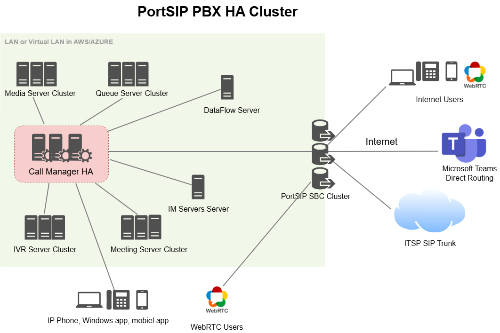
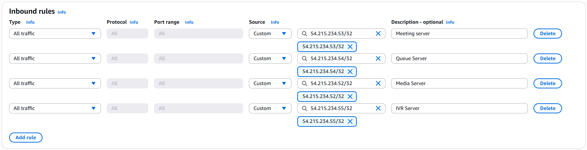
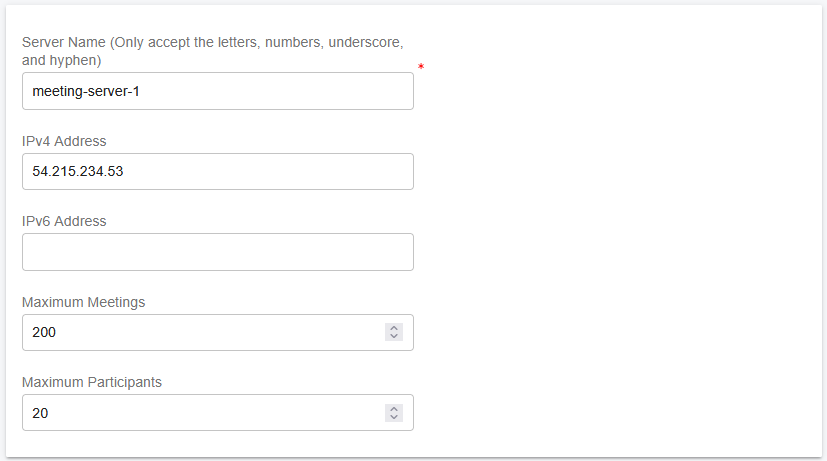
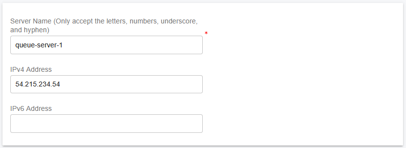

# Scaling Servers on AWS for High Availability

PortSIP PBX provides flexible application server scaling to support growing numbers of users and concurrent calls, enabling your platform to evolve with business demand.\
For architectural background and concepts, refer to the PBX Cluster guide.

This document provides a step-by-step guide to scaling application servers using PortSIP PBX High Availability (HA) in an AWS EC2 environment to operate at very large scale.

<figure><figcaption></figcaption></figure>

The architecture can support:

* Over 1 million total users
* Approximately 50,000 concurrently registered (online) users
* Up to 10,000 simultaneous calls

This deployment model is also ideal for **high-demand workloads**, including large meetings, IVR applications, and high-volume call queues.

***

### Prerequisites <a href="#prerequisites" id="prerequisites"></a>

Before configuring the cluster servers, ensure that you have successfully completed the PBX HA installation and configuration on the **Main Server** by following the guide: [High Availability Installations on AWS](high-availability-installations-on-aws.md)

> ❗ **Note** At this stage, only the PBX needs to be installed. The Instant Messaging (IM) server and Data Flow server should not be installed yet, as it will be deployed later in this guide.

***

### Preparing Cluster Servers <a href="#preparing-cluster-servers" id="preparing-cluster-servers"></a>

The following Linux servers must be prepared to host the PortSIP cluster application services:

* Media Servers
* Queue Servers
* Meeting Servers
* IVR Servers

***

#### Deployment Requirements

* Each application server must be deployed on a dedicated EC2 instance. Do not install multiple application server roles on a single EC2 instance.
* Each EC2 instance must use a **static private IP address** and an **elastic IP address**. DHCP-assigned IP addresses are not supported.

***

#### Preparing Linux Servers (EC2 Instances)

Prepare the EC2 instances that will host the application servers. In this example, the following application servers are deployed:

* **Meeting Server**
  * Private IP: `172.31.16.137`
  * Hostname: `ip-172-31-16-137`
  * Elastic IP: `54.215.234.53`
  * Data Storag&#x65;**:** Minimum 64 GB; recommended 128 GB or higher.
* **Queue Server**
  * Private IP: `172.31.16.138`
  * Hostname: `ip-172-31-16-138`
  * Elastic IP: `54.215.234.54`
  * Data Storage: Minimum 64 GB; recommended 128 GB or higher.
* **Media Server**
  * Private IP: `172.31.16.139`
  * Hostname: `ip-172-31-16-139`
  * Elastic IP: `54.215.234.52`
  * Data Storage: Minimum 128 GB; recommended 256GB or higher.
* **IVR Server**
  * Private IP: `172.31.16.140`
  * Hostname: `ip-172-31-16-140`
  * Elastic IP: `54.215.234.55`
  * Data Storage: Minimum 64 GB; recommended 128 GB or higher.

Ensure all IP addresses are reserved and consistently assigned to their respective EC2 instances.

***

#### Supported Linux Operating System

The following operating system is supported for all application server nodes:

* **Ubuntu 24.04 LTS**

***

### Preparing the Linux Host Machine for Installation

The following tasks **must be completed before installing any PortSIP PBX cluster servers**. Proper preparation ensures system stability, predictable networking behavior, and reliable real-time media performance.

* Ensure the system date and time are correctly synchronized (for example, via NTP).
* Ensure each EC2 instance is assigned a static private IP address and an elastic IP address.
* Install all available operating system updates and service packs before installing the PortSIP application servers.
* Do not install PostgreSQL on the server.
* Do not install TeamViewer, VPN software, or similar remote-access tools on the host machine.
* The server must not be configured as a DNS or DHCP server.

***

### Creating EC2 Instances

Follow the steps below to create the EC2 instances for the application servers.\
The process is largely the same as the [PortSIP PBX High Availability (HA) deployment on AWS](high-availability-installations-on-aws.md), but please pay close attention to the specific configuration details outlined below.

***

### Meeting Server

#### Network Settings

* Select the **same VPC and Subnet** used by the PBX HA nodes.
* Select the **same Security Group** used by the PBX HA nodes.
* Set **Auto-assign public IP** to **Disable**.
* Under **Advanced network configuration → Network interface 1**:
  * Set **Primary IP** to `172.31.16.137`.
* Associate the Elastic IP with this EC2. For the Elastic IP address is `54.215.234.53`.

***

### Queue Server

#### Network Settings

* Select the **same VPC and Subnet** used by the PBX HA nodes.
* Select the **same Security Group** used by the PBX HA nodes.
* Set **Auto-assign public IP** to **Disable**.
* Under **Advanced network configuration → Network interface 1**:
  * Set **Primary IP** to `172.31.16.138`.
* Associate the Elastic IP with this EC2. For the Elastic IP address is `54.215.234.54`.

***

### Media Server

#### Network Settings

* Select the **same VPC and Subnet** used by the PBX HA nodes.
* Select the **same Security Group** used by the PBX HA nodes.
* Set **Auto-assign public IP** to **Disable**.
* Under **Advanced network configuration → Network interface 1**:
  * Set **Primary IP** to `172.31.16.139`.
* Associate the Elastic IP with this EC2. For the Elastic IP address is `54.215.234.52`.

***

### IVR Server

#### Network Settings

* Select the **same VPC and Subnet** used by the PBX HA nodes.
* Select the **same Security Group** used by the PBX HA nodes.
* Set **Auto-assign public IP** to **Disable**.
* Under **Advanced network configuration → Network interface 1**:
  * Set **Primary IP** to `172.31.16.140`.
* Associate the Elastic IP with this EC2. For the Elastic IP address is `54.215.234.55`.

***

### Configure Security Group Inbound Rules

Modify the **Security Group that attached to all three PBX HA EC2 instances** and add an Inbound Rule that allows traffic from the cluster servers’ E**lastic IP** addresses.

Please follow the screenshot below to add the inbound rule to the Security Group used by the PBX HA servers.

<figure><figcaption></figcaption></figure>

***

### Deploying the Meeting Server

Follow the steps below to deploy the **Meeting Server** in your PortSIP PBX HA environment.

#### Step 1: Add the Meeting Server in the PBX Web Portal

1. Sign in to the PortSIP PBX Web Portal as a System Administrator.
2. Navigate to **Servers > Meeting Servers**.
3. Click **Add**, enter the server information as shown in the screenshot, and then click **OK** to save the configuration.
4. **Important:** Please note the server name **`meeting-server-1`**. This name will be used in a later step.

<figure><figcaption></figcaption></figure>

***

#### Step 2: Deploy the Meeting Server Service

Perform the following commands **only on the PBX HA node `ip-172-31-16-133`**.

> ❗ **Important**
>
> * The deployment process may take some time to complete.
> * **Do not interrupt**, restart, or shut down the server while the process is running.

**Command Parameters**

* `-s`: Specifies the service to be installed. For the Meeting Server, use: **meeting-server-only**
* `-n`: Specifies the server name configured in Step 1. In this example: **meeting-server-1**
* `-a`: Specifies the **private IP address** of the Meeting Server. In this example: **172.31.16.137**

```shellscript
cd /opt/portsip-pbx-ha-guide/ && \
/bin/bash extend.sh run \
    -s meeting-server-only \
    -n meeting-server-1 \
    -a 172.31.16.137
```

This server status will be **Online** in the PBX Web Portal after it's successfully installed.

***

### Deploying the Queue Server

Follow the steps below to deploy the **Queue Server** in your PortSIP PBX High Availability environment.

#### Step 1: Add the Queue Server in the PBX Web Portal

1. Sign in to the PortSIP PBX Web Portal as a System Administrator.
2. Navigate to **Servers > Queue Servers**.
3. Click **Add**, enter the server information as shown in the screenshot, and then click **OK** to save the configuration.
4. **Important:** Please note the server name **`queue-server-1`**, as it will be used in a later step.

<figure><figcaption></figcaption></figure>

***

#### Step 2: Deploy the Queue Server Service

Run the following commands **only on the PBX HA node `ip-172-31-16-133`**.

> ❗**Important**
>
> * The deployment process may take some time to complete.
> * **Do not interrupt**, restart, or shut down the server while the process is in progress.

**Command Parameters**

* `-s`: Specifies the service to be installed. For the Queue Server, use: **queue-server-only**
* `-n`: Specifies the server name configured in Step 1. In this example: **queue-server-1**
* `-a`: Specifies the **private IP address** of the Queue Server. In this example: **172.31.16.138**

```bash
cd /opt/portsip-pbx-ha-guide/ && \
/bin/bash extend.sh run \
    -s queue-server-only \
    -n queue-server-1 \
    -a 172.31.16.138
```

This server status will be **Online** in the PBX Web Portal after it's successfully installed.

***

### Deploying the Media Server

Follow the steps below to deploy the **Media Server** in your PortSIP PBX High Availability environment. The Media Server is responsible for handling RTP media processing and therefore plays a critical role in call quality and scalability.

#### Step 1: Add the Media Server in the PBX Web Portal

1. Sign in to the PortSIP PBX Web Portal as a System Administrator.
2. Navigate to **Servers > Media Servers**.
3. Click **Add**, enter the server information as shown in the screenshot, and then click **OK** to save the configuration.
4. **Important:** Please note the server name **`media-server-1`**, as it will be used in a later step.

<figure><figcaption></figcaption></figure>

***

#### Step 2: Deploy the Media Server Service

Run the following commands **only on the PBX HA node `ip-172-31-16-133`**.

> ❗**Important**
>
> * The deployment process may take some time to complete.
> * **Do not interrupt**, restart, or shut down the server while the process is in progress.

**Command Parameters**

* `-s`: Specifies the service to be installed. For the Media Server, use: **media-server-only**
* `-n`: Specifies the server name configured in Step 1. In this example: **media-server-1**
* `-a`: Specifies the **private IP address** of the Media Server. In this example: 1**72.31.16.139**

```bash
cd /opt/portsip-pbx-ha-guide/ && \
/bin/bash extend.sh run \
    -s media-server-only \
    -n media-server-1 \
    -a 172.31.16.139
```

This server status will be **Online** in the PBX Web Portal after it's successfully installed.

***

### Deploying the IVR Server (Virtual Receptionist)

Follow the steps below to deploy the **IVR Server (Virtual Receptionist)** in your PortSIP PBX High Availability environment. The IVR Server is responsible for auto attendants, voice menus, and call routing logic.

#### Step 1: Add the IVR Server in the PBX Web Portal

1. Sign in to the PortSIP PBX Web Portal as a System Administrator.
2. Navigate to **Servers > IVR Servers**.
3. Click **Add**, enter the server information as shown in the screenshot, and then click **OK** to save the configuration.
4. **Important:** Please note the server name **`ivr-server-1`**, as it will be used in a later step.

<figure><figcaption></figcaption></figure>

***

#### Step 2: Deploy the IVR Server Service

Run the following commands **only on the PBX HA node `ip-172-31-16-133`**.

> ❗**Important**
>
> * The deployment process may take some time to complete.
> * **Do not interrupt**, restart, or shut down the server while the process is in progress.

**Command Parameters**

* `-s`: Specifies the service to be installed. For the IVR Server, use: **vr-server-only**
* `-n`: Specifies the server name configured in Step 1. In this example: **ivr-server-1**
* `-a`: Specifies the **private IP address** of the IVR Server. In this example: **172.31.16.140**

```bash
cd /opt/portsip-pbx-ha-guide/ && \
/bin/bash extend.sh run \
    -s vr-server-only \
    -n ivr-server-1 \
    -a 172.31.16.140
```

This server status will be **Online** in the PBX Web Portal after it's successfully installed.

***

### Configuring the IP Address Whitelist

> ❗**Mandatory Step**\
> This configuration is **required**. If the cluster servers’ IP addresses are not added to the whitelist, the services **will not function correctly**.

To prevent the PBX from rate-limiting requests originating from the cluster servers, you must add each cluster server’s IP address to the PBX IP whitelist.

***

#### Configuration Steps

1. Sign in to the PortSIP PBX Web Portal as a System Administrator.
2. Navigate to **IP Blacklist**.
3. Click **Add**.
4. Enter the **cluster server’s IP address**, as shown in the screenshot below.
5. Set a **long expiration date** (or the maximum allowed value).
6. Click **OK** to save the entry.
7. Repeat the above steps for **each cluster server**.

<figure><figcaption></figcaption></figure>

***

### Managing Extended Servers

#### Important Notes

* All management commands for extended servers **must be executed on** on the PBX HA node **ip-172-31-16-133** only, even if it is not the **current active node**.
* Do **not interrupt**, reboot, or close the terminal while any management or upgrade command is running.

***

#### Supported Operations

The following operations are supported for managing extended servers:

* **start** – Start servers
* **stop** – Stop servers
* **restart** – Restart servers
* **upgrade** – Upgrade servers
* **rm** – Remove installed servers

***

#### Server Type Filters (`-s` Parameter)

You can optionally manage a specific type of extended server using the `-s` parameter with one of the following values:

* `media-server-only` – Media Servers
* `queue-server-only` – Queue Servers
* `meeting-server-only` – Meeting Servers
* `ivr-server-only` – IVR Servers

***

#### Targeting a Specific Server (`-a` Parameter)

To manage a **specific server instance**, use the `-a` parameter to specify its **private IP address**.

***

#### Managing All Extended Servers

The following commands apply to **all extended servers**, including Media, Queue, Meeting, and IVR servers.

**Start All Extended Servers**

```bash
cd /opt/portsip-pbx-ha-guide/ && /bin/bash extend.sh start
```

**Stop All Extended Servers**

```bash
cd /opt/portsip-pbx-ha-guide/ && /bin/bash extend.sh stop
```

**Restart All Extended Servers**

```bash
cd /opt/portsip-pbx-ha-guide/ && /bin/bash extend.sh restart
```

**Remove All Extended Servers**

```bash
cd /opt/portsip-pbx-ha-guide/ && /bin/bash extend.sh rm
```

***

#### Managing a Specific Type of Extended Server

To manage **only one type of server** (for example, Media Servers), use the `-s` parameter.

**Start All Media Servers**

```bash
cd /opt/portsip-pbx-ha-guide/ && /bin/bash extend.sh start -s media-server-only
```

**Stop All Media Servers**

```bash
cd /opt/portsip-pbx-ha-guide/ && /bin/bash extend.sh stop -s media-server-only
```

**Restart All Media Servers**

```bash
cd /opt/portsip-pbx-ha-guide/ && /bin/bash extend.sh restart -s media-server-only
```

**Remove All Media Servers**

```bash
cd /opt/portsip-pbx-ha-guide/ && /bin/bash extend.sh rm -s media-server-only
```

> Replace `media-server-only` with another supported server type as needed.

***

#### Managing a Specific Server Instance by IP

To manage a **specific server instance**, use **both** the `-s` (server type) and `-a` (IP address) parameters.

**Example:** Manage a Media Server at **172.31.16.137.**

**Start the Server**

```bash
cd /opt/portsip-pbx-ha-guide/ && /bin/bash extend.sh start \
-s media-server-only \
-a 172.31.16.137
```

**Stop the Server**

```bash
cd /opt/portsip-pbx-ha-guide/ && /bin/bash extend.sh stop \
-s media-server-only \
-a 172.31.16.137
```

**Restart the Server**

```bash
cd /opt/portsip-pbx-ha-guide/ && /bin/bash extend.sh restart \
-s media-server-only \
-a 172.31.16.137
```

**Remove the Server**

```bash
cd /opt/portsip-pbx-ha-guide/ && /bin/bash extend.sh rm \
-s media-server-only \
-a 172.31.16.137
```

> ❗Replace the server type and IP address as required for Queue, Meeting, or IVR servers.

***

### Upgrading Extended Servers

#### Important Notes

* All management commands for extended servers **must be executed** on the PBX HA node **ip-172-31-16-133** only, even if it is not the **current active node**.
* Before upgrading extended servers, ensure that the **PBX HA itself has already been upgraded** by following the guide: [Upgrading High Availability Installation](upgrading-high-availability-installation.md)
* The upgrade process may take some time. **Do not interrupt the process**.

***

#### Upgrading All Extended Servers

To upgrade **all extended servers** (Media, Queue, Meeting, and IVR), run:

```bash
cd /opt/portsip-pbx-ha-guide/ && /bin/bash extend.sh upgrade
```

***

#### Upgrading a Specific Type of Extended Server

To upgrade only a specific server type, use the `-s` parameter.

**Example: Upgrade All Media Servers**

```bash
cd /opt/portsip-pbx-ha-guide/ && /bin/bash extend.sh upgrade -s media-server-only
```

**Supported Server Types for Upgrade:**

* `media-server-only` – Upgrade all Media Servers
* `queue-server-only` – Upgrade all Queue Servers
* `meeting-server-only` – Upgrade all Meeting Servers
* `ivr-server-only` – Upgrade all IVR Servers

***

### Upgrading PortSIP IM Service

Please follow the [Upgrading the IM Server](scaling-im-server-on-aws-for-high-availability.md#upgrading-the-im-server) guide to complete the installation and configuration.

***

### Upgrading PortSIP Data Flow Service

Please follow the [Upgrading Data Flow Server](scaling-data-flow-server-on-aws-for-high-availability.md#upgrading-the-data-flow-server) guide to complete the installation and configuration.

***

### Upgrading PortSIP SBC Service

Please follow the [Upgrading SBC Servers](scaling-sbc-on-aws-for-high-availability.md#upgrading-sbc-servers) guide to complete the installation and configuration.


