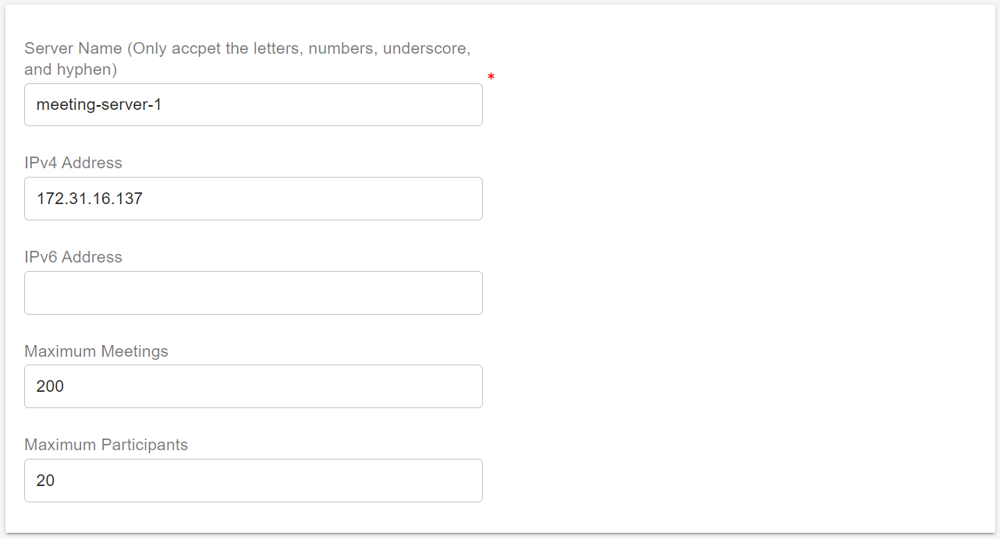
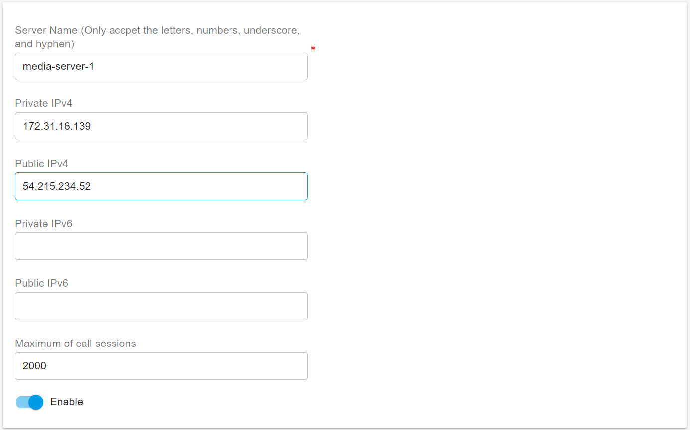

# Scaling Servers on AWS for High Availability

PortSIP PBX provides flexible application server scaling to support growing numbers of users and concurrent calls, enabling your platform to evolve with business demand.\
For architectural background and concepts, refer to the PBX Cluster guide.

This document provides a step-by-step guide to scaling application servers using PortSIP PBX High Availability (HA) in an AWS EC2 environment to operate at very large scale.

<figure><figcaption></figcaption></figure>

The architecture can support:

* Over 1 million total users
* Approximately 50,000 concurrently registered (online) users
* Up to 10,000 simultaneous calls

This deployment model is also ideal for **high-demand workloads**, including large meetings, IVR applications, and high-volume call queues.

***

### Prerequisites <a href="#prerequisites" id="prerequisites"></a>

Before configuring the cluster servers, ensure that you have successfully completed the PBX HA installation and configuration on the **Main Server** by following the guide: [High Availability Installations on AWS](high-availability-installations-on-aws.md)

> ❗ **Note** At this stage, only the PBX needs to be installed. The Instant Messaging (IM) server and Data Flow server should not be installed yet, as it will be deployed later in this guide.

***

### Preparing Cluster Servers <a href="#preparing-cluster-servers" id="preparing-cluster-servers"></a>

The following Linux servers must be prepared to host the PortSIP cluster application services:

* Media Servers
* Queue Servers
* Meeting Servers
* IVR Servers

***

#### Deployment Requirements

* Each application server must be deployed on a dedicated EC2 instance. Do not install multiple application server roles on a single EC2 instance.
* Each EC2 instance must use a **static private IP address** and an **elastic IP address**. DHCP-assigned IP addresses are not supported.

***

#### Preparing Linux Servers (EC2 Instances)

Prepare the EC2 instances that will host the application servers. In this example, the following application servers are deployed:

* **Meeting Server**
  * Private IP: `172.31.16.137`
  * Hostname: `ip-172-31-16-137`
  * Elastic IP: `54.215.234.53`
* **Queue Server**
  * Private IP: `172.31.16.138`
  * Hostname: `ip-172-31-16-138`
  * Elastic IP: `54.215.234.54`
* **Media Server**
  * Private IP: `172.31.16.139`
  * Hostname: `ip-172-31-16-139`
  * Elastic IP: `54.215.234.52`
* **IVR Server**
  * Private IP: `172.31.16.140`
  * Hostname: `ip-172-31-16-140`
  * Elastic IP: `54.215.234.55`

Ensure all IP addresses are reserved and consistently assigned to their respective EC2 instances.

***

#### Supported Linux Operating System

The following operating system is supported for all application server nodes:

* **Ubuntu 24.04 LTS**

***

### Preparing the Linux Host Machine for Installation

The following tasks **must be completed before installing any PortSIP PBX cluster servers**. Proper preparation ensures system stability, predictable networking behavior, and reliable real-time media performance.

* Ensure the system date and time are correctly synchronized (for example, via NTP).
* Ensure each EC2 instance is assigned a static private IP address and an elastic IP address.
* Install all available operating system updates and service packs before installing the PortSIP application servers.
* Do not install PostgreSQL on the server.
* Do not install TeamViewer, VPN software, or similar remote-access tools on the host machine.
* The server must not be configured as a DNS or DHCP server.

***

### Creating EC2 Instances

Follow the steps below to create the EC2 instances for the application servers.\
The process is largely the same as the [PortSIP PBX High Availability (HA) deployment on AWS](high-availability-installations-on-aws.md), but please pay close attention to the specific configuration details outlined below.

***

### Meeting Server

#### Network Settings

* Select the **same VPC and Subnet** used by the PBX HA nodes.
* Select the **same Security Group** used by the PBX HA nodes.
* Set **Auto-assign public IP** to **Disable**.
* Under **Advanced network configuration → Network interface 1**:
  * Set **Primary IP** to `172.31.16.137`.
* Associate the Elastic IP with this EC2. For the Elastic IP address is `54.215.234.53`.

***

### Queue Server

#### Network Settings

* Select the **same VPC and Subnet** used by the PBX HA nodes.
* Select the **same Security Group** used by the PBX HA nodes.
* Set **Auto-assign public IP** to **Disable**.
* Under **Advanced network configuration → Network interface 1**:
  * Set **Primary IP** to `172.31.16.138`.
* Associate the Elastic IP with this EC2. For the Elastic IP address is `54.215.234.54`.

***

### Media Server

#### Network Settings

* Select the **same VPC and Subnet** used by the PBX HA nodes.
* Select the **same Security Group** used by the PBX HA nodes.
* Set **Auto-assign public IP** to **Disable**.
* Under **Advanced network configuration → Network interface 1**:
  * Set **Primary IP** to `172.31.16.139`.
* Associate the Elastic IP with this EC2. For the Elastic IP address is `54.215.234.52`.

***

### IVR Server

#### Network Settings

* Select the **same VPC and Subnet** used by the PBX HA nodes.
* Select the **same Security Group** used by the PBX HA nodes.
* Set **Auto-assign public IP** to **Disable**.
* Under **Advanced network configuration → Network interface 1**:
  * Set **Primary IP** to `172.31.16.140`.
* Associate the Elastic IP with this EC2. For the Elastic IP address is `54.215.234.55`.

***

## Deploying Meeting Server

Please follow the steps below to deploy the Meeting Server.

1. Sign in to the PortSIP BPX web portal as the system administrator.
2. Select the menu **Servers > Meeting Servers**.
3. Click the **Add** button, enter the server information as shown in the screenshot, and then click the **OK** button to save it. Please remember the server name **meeting-server-1**, we will use it in a later step.

<figure><figcaption></figcaption></figure>

4. Perform the below commands on the PBX HA node **ip-172-31-16-133** only. The execution may take some time, so patience is required. Please do not interrupt, restart, or shut down while the process is in progress.

* -s: Specify the service that will be installed. For the meeting server, it should be **meeting-server-only**.
* -n: Specify the server name that you entered in the above step 3; In case is **meeting-server-1**.
* -a: Specify the server's private IP address, in case it's **172.31.16.137**.

```sh
cd /opt/portsip-pbx-ha-guide/ && \
/bin/bash extend.sh run -s meeting-server-only \
-n meeting-server-1 \
-a 172.31.16.137
```

This server status will be **Online** in the PBX Web Portal after it's successfully installed.

## Deploying Queue Server

Please follow the steps below to deploy the Queue Server.

1. Sign in to the PortSIP BPX web portal as the system administrator.
2. Select the menu **Servers > Queue Servers**.
3. Click the **Add** button, enter the server information as shown in the screenshot, and then click the **OK** button to save it. Please remember the server name **queue-server-1**, we will use it in a later step.

<figure><figcaption></figcaption></figure>

4. Perform the below commands on the PBX HA node **ip-172-31-16-133** only. The execution may take some time, so patience is required. Please do not interrupt, restart, or shut down while the process is in progress.

* -s: Specify the service that will be installed. For the meeting server, it should be **queue-server-only**.
* -n: Specify the server name that you entered in the above step 3; In case is **queue-server-1**.
* -a: Specify the server's private IP address, in case it's **172.31.16.138**.

```sh
cd /opt/portsip-pbx-ha-guide/ && \
/bin/bash extend.sh run -s queue-server-only \
-n queue-server-1 \
-a 172.31.16.138
```

This server status will be **Online** in the PBX Web Portal after it's successfully installed.

## Deploying Media Server

Please follow the steps below to deploy the Media Server.

1. Sign in to the PortSIP BPX web portal as the system administrator.
2. Select the menu **Servers > Media Servers**.
3. Click the **Add** button, enter the server information as shown in the screenshot, and then click the **OK** button to save it. Please remember the server name **media-server-1**, we will use it in a later step.

<figure><figcaption></figcaption></figure>

4. Perform the below commands on the PBX HA node **ip-172-31-16-133** only. The execution may take some time, so patience is required. Please do not interrupt, restart, or shut down while the process is in progress.

* -s: Specify the service that will be installed. For the meeting server, it should be **media-server-only**.
* -n: Specify the server name that you entered in the above step 3; In case is **media-server-1**.
* -a: Specify the server's private IP address, in case it's **172.31.16.139**.

```sh
cd /opt/portsip-pbx-ha-guide/ && \
/bin/bash extend.sh run -s media-server-only \
-n media-server-1 \
-a 172.31.16.139
```

This server status will be **Online** in the PBX Web Portal after it's successfully installed.

## Deploying IVR Server

Please follow the steps below to deploy the IVR Server (Virtual Receptionist).

1. Sign in to the PortSIP BPX web portal as the system administrator.
2. Select the menu **Servers > IVR Servers**.
3. Click the **Add** button, enter the server information as shown in the screenshot, and then click the **OK** button to save it. Please remember the server name **ivr-server-1**, we will use it in a later step.

<figure><figcaption></figcaption></figure>

4. Perform the below commands on the PBX HA node **ip-172-31-16-133** only. The execution may take some time, so patience is required. Please do not interrupt, restart, or shut down while the process is in progress.

* -s: Specify the service that will be installed. For the meeting server, it should be **vr-server-only**.
* -n: Specify the server name that you entered in the above step 3; In case is **vr-server-1**.
* -a: Specify the server's private IP address, in case it's **172.31.16.140**.

```sh
cd /opt/portsip-pbx-ha-guide/ && \
/bin/bash extend.sh run -s vr-server-only \
-n vr-server-1 \
-a 172.31.16.140
```

This server status will be **Online** in the PBX Web Portal after it's successfully installed.

## Configuring the IP Address Whitelist


This step is mandatory; without it, the service will not work.


To prevent the PBX from limiting the cluster servers' request rate, we need to add the cluster servers' IPs to the whitelist in the PBX.&#x20;

To do this, please follow the below steps:

1. Sign in as the System Administrator
2. Select the menu **IP Blacklist** > **Add**.&#x20;
3. Enter the cluster server IP, as shown in the screenshot below, and choose a long **expiration date.**
4. Repeat the above steps for each cluster server.

<figure><figcaption></figcaption></figure>

## Managing Servers

Perform the below commands on the PBX HA node **ip-172-31-16-133** only, even if it is not the **current active node**.

In the below media server example commands, use the parameter **-s** to specify the service name. PortSIP PBX supports these services:

* media-server-only
* queue-server-only
* meeting-server-only
* vr-server-only

You can replace the **media-server-only** with another service name, such as mentioned above, and you also need to replace the **-a 172.31.16.139** with a corresponding server IP address.

### Upgrade Server

First, please ensure you have upgraded the PBX HA as per this guide: [Upgrading High Availability Installation](upgrading-high-availability-installation.md). After that, perform the below command to upgrade the server:

```sh
cd /opt/portsip-pbx-ha-guide/ && \
/bin/bash extend.sh run -s media-server-only \
-n media-server-1 \
-a 172.31.16.139
```

### Start Server

```sh
 cd /opt/portsip-pbx-ha-guide/ && \
 /bin/bash extend.sh start -s media-server-only -a 172.31.16.139
```

### Restart Server

```sh
 cd /opt/portsip-pbx-ha-guide/ && \
 /bin/bash extend.sh restart -s media-server-only -a 172.31.16.139
```

### Stop Server

```sh
 cd /opt/portsip-pbx-ha-guide/ && \
  /bin/bash extend.sh stop -s media-server-only -a 172.31.16.139
```

### Remove Server

```sh
 cd /opt/portsip-pbx-ha-guide/ && \
 /bin/bash extend.sh rm -s media-server-only -a 172.31.16.139
```


