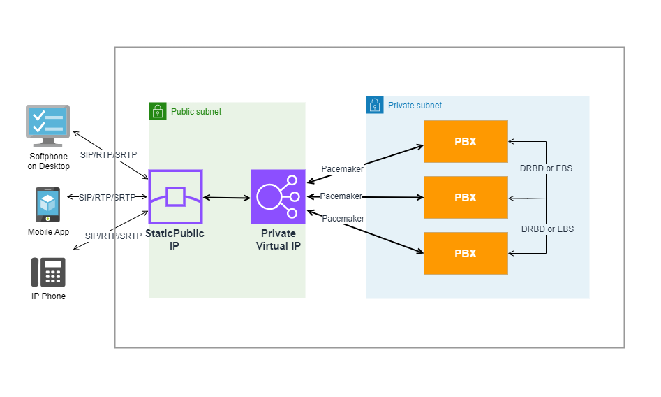

# PortSIP PBX High Availability Architecture

A high-availability (HA) cluster can be built using **three PBX nodes** running **PortSIP PBX**.\
In this architecture, PortSIP PBX continuously monitors the health of each node and can automatically transfer control to another node if a failure is detected. Any established calls are automatically recovered, ensuring minimal service disruption and a seamless user experience.

**Figure 1-1: PortSIP PBX High-Availability Architecture**

<figure><figcaption></figcaption></figure>

### PBX Node Failover Using a Virtual IP (LAN)

As illustrated in the architecture above, the PortSIP PBX HA deployment consists of **three PBX nodes within the same LAN**. A **virtual IP address (VIP)** is configured to float between the active PBX nodes, providing automatic failover and continuous service availability.

***

### How It Works

#### Virtual IP for Active Nodes

A **private virtual IP** is shared among the three PBX nodes. Internal communication components—such as **IVR servers, Queue servers, and other cluster services-** connect to the PBX through this virtual IP.

* The virtual IP always points to an active PBX node.
* If one PBX node becomes unavailable, the virtual IP automatically migrates to another healthy node.
* This guarantees uninterrupted internal service communication without requiring reconfiguration.

The private virtual IP is configured during the **PortSIP PBX HA setup process**.

***

#### Static Public IP for Client Access

A **static public IP address** is mapped to the private virtual IP to handle external client access.

* SIP phones, softphones, mobile apps, and WebRTC clients connect using the static public IP.
* Incoming SIP signaling is routed to the virtual IP.
* The virtual IP forwards traffic to the currently active PBX node.

This design ensures that all client devices consistently connect to the active PBX node without any manual intervention or configuration changes during failover events.

***

#### Pacemaker Monitoring and Automatic Failover

The **Pacemaker** service continuously monitors the health and responsiveness of the PBX nodes.

* If Pacemaker detects that the active PBX node is unresponsive or has failed, it automatically initiates a failover.
* The virtual IP "floats" to another healthy PBX node.
* Services are restarted on the new active node, minimizing downtime and maintaining call continuity.

This automated process ensures rapid recovery and high service reliability.

***

### Core HA Components

#### Pacemaker

Pacemaker is a **High-Availability Cluster Resource Manager (CRM)** used to manage cluster resources and ensure service availability in the event of node failures.

In the PortSIP PBX HA architecture, Pacemaker is responsible for:

* Monitoring PBX node health
* Managing cluster resources
* Automatically relocating resources to a healthy node when a failure occurs

***

#### DRBD

**DRBD (Distributed Replicated Block Device)** is used to provide real-time data replication between PBX nodes.

In the PortSIP PBX HA scenario, DRBD synchronizes critical data, including:

* Databases
* Call recordings
* Log files
* Voice prompt files

This ensures data consistency and business continuity even in the event of hardware or node failures.

***

### Client Access in an HA Deployment

In a high-availability configuration, **all SIP clients**—including:

* IP Phones
* Desktop softphones
* Mobile apps
* WebRTC clients

Connect to the **virtual IP address** of the PortSIP PBX. This abstraction allows clients to remain unaware of node-level failures and ensures seamless operation during failover events.

***

#### Key Benefits of This HA Architecture

* Automatic failover with no manual intervention
* Recovery of established calls
* Consistent client access via a single IP address
* Real-time data synchronization across PBX nodes
* Enterprise-grade reliability suitable for UCaaS and service-provider deployments

