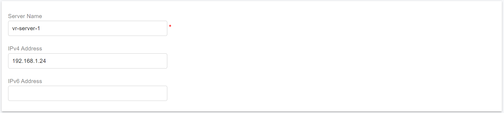

# Scaling Servers On-Premise for High Availability

This guide explains how to configure cluster servers for a **High Availability (HA) PortSIP PBX deployment** designed to operate at very large scale.

<figure><figcaption></figcaption></figure>

\
The architecture can support:

* Over 1 million total users
* Approximately 50,000 concurrently registered (online) users
* Up to 10,000 simultaneous calls

This deployment model is also ideal for **high-demand workloads**, including large meetings, IVR applications, and high-volume call queues.

***

### Prerequisites

Before configuring the cluster servers, ensure that you have successfully completed the PBX HA installation and configuration on the **Main Server** by following the guide: [High Availability Installations on Ubuntu](high-availability-installations-on-ubuntu.md)

> ❗ **Note**\
> At this stage, **only the PBX needs to be installed**.\
> The **Instant Messaging (IM) server and Data Flow server should not be installed yet**, as it will be deployed later in this guide.

***

### Preparing Cluster Servers

The following Linux servers must be prepared to host the PortSIP cluster application services:

* Media Servers
* Queue Servers
* Meeting Servers
* IVR Servers

#### Example Cluster Topology

In this guide, the cluster is deployed using the following server layout:

* **Main Server:** PBX HA with a virtual IP address: `192.168.1.130`
* **Server 1 – Media Server**
  * Private IP: `192.168.1.21`
  * Static Public IP: `104.101.137.60`
* **Server 2 – Queue Server:** IP address: `192.168.1.22`
* **Server 3 – Meeting Server:** IP address: `192.168.1.23`
* **Server 4 – IVR Server:** IP address: `192.168.1.24`

> ❗ **Important**\
> Each server can deploy **only one server role**.\
> For example, you **must not** deploy both a Media Server and a Queue Server on the same machine.

***

### Supported Linux Operating System

* **Supported OS:** Ubuntu 24.04 (64-bit)
* **Version Consistency:** All servers in the HA cluster **must run the exact same OS version** as the PBX server.

***

### User Account Requirements

* All cluster servers must use **the same username and password** as the PBX server.
* In this guide, the username **`pbx`** is used as an example.
* The user account **must have sudo privileges** to execute administrative commands.

***

### Disk Space Recommendations

* **Cluster Servers:**\
  Minimum **128 GB** disk space(No separate data partition is required.)
* **Media Servers with Call Recording Enabled:**\
  Minimum **256 GB** disk space is recommended to accommodate recording storage.

***

### Network Requirements

When deploying a PBX cluster, ensure **sufficient network bandwidth and low latency** between all servers.

> Insufficient network capacity or unstable connectivity may cause degraded performance or unexpected system behavior.

***

### Preparing the Linux Host Machine for Installation

The following tasks must be completed before installing any cluster server components:

* Ensure the system date and time are correctly synchronized.
* If the server is on a LAN, assign a static private IP address.
* For Media Server clusters, each Media Server must also have a static public IP address if it will handle calls from the Internet.
* Install all available OS updates and service packs.
* Do not install PostgreSQL on the server.
* Disable all power-saving features for the system and network adapters (use High-Performance mode).
* Do not install TeamViewer, VPN clients, or similar remote access software.
* The server must not function as a DNS or DHCP server.

***

### Set Up Password-Free Login for All Cluster Servers

The following commands **must be executed only on the PBX HA master node (`pbx01`)**.

This step enables password-free SSH access from the PBX HA node to all cluster servers, which is required for automated deployment and management.

If you are prompted to confirm the connection (yes/no), please enter **`yes`**.

```bash
ssh-copy-id -i ~/.ssh/id_rsa.pub pbx@192.168.1.21
ssh-copy-id -i ~/.ssh/id_rsa.pub pbx@192.168.1.22
ssh-copy-id -i ~/.ssh/id_rsa.pub pbx@192.168.1.23
ssh-copy-id -i ~/.ssh/id_rsa.pub pbx@192.168.1.24
```

***

### Add the Cluster Servers

To add the cluster servers, sign in to the **PBX Web Portal** as a **System Administrator**.

From the administration interface, you can register each Media Server, Queue Server, Meeting Server, and IVR Server so they become part of the HA cluster.

***

### Disable Default Servers on the Main Server

By default, PortSIP PBX installs **Media, Queue, Meeting, and IVR servers** on the Main Server.

For large-scale and high-availability deployments, we strongly recommend **disabling these default servers** so that the Main Server is dedicated exclusively to **SIP signaling and call control**. This significantly improves scalability and allows the system to support more users and concurrent calls.

#### Steps

<figure><figcaption></figcaption></figure>

1. Go to the **Servers** menu in the PBX Web Portal.
2. Expand each server category:
   * Media Servers
   * Queue Servers
   * Meeting Servers
   * IVR Servers
3. Disable the **default server** in each category, as shown in the screenshot below.

> **Note**\
> The **Instant Messaging (IM) Server and data flow does not need to be disabled** and should remain enabled.

***

### Add a Media Server

Follow the steps below to add and deploy a new **Media Server** in the HA cluster.

#### Step 1: Add the Media Server in the PBX Web Portal

1. Sign in to the PBX Web Portal as a System Administrator.
2. Navigate to **Servers > Media Servers**.
3. Click **Add**.
4. Enter the server information as shown in the screenshot, then click **OK** to save.

<figure><figcaption></figcaption></figure>

> ❗**Important**\
> Use the server name **`media-server-1`**. This name will be required in a later deployment step.

***

#### Step 2: Configure the Public IP Address (Required for Internet Access)

If your PBX is deployed to serve **Internet users**, you **must** assign a **static public IP address** to the extended Media Server.

* Enter the static public IP address as shown in the screenshot.
* Ensure the public IP is correctly routed to the Media Server host.

> ❗**Note**\
> We recommend **not setting the maximum number of call sessions higher than 5,000** per Media Server to ensure optimal performance and stability.

***

#### Step 3: Deploy the Media Server

Run the following command **only on the HA PBX node (`pbx01`)**.

The deployment process may take some time. **Do not interrupt the process, close the terminal, or reboot the server while it is running.**

```bash
cd /opt/portsip-pbx-ha-guide/ && /bin/bash extend.sh run \
-s media-server-only \
-n media-server-1 \
-a 192.168.1.21
```

**Parameter Description**

* `-s media-server-only`: Installs **only** the Media Server role on the target machine.
* `-n media-server-1`: Specifies the Media Server name.\
  This value must exactly match the name entered in the **PBX Web Portal**.
* `-a 192.168.1.21`: Specifies the **private IP address** of Server 1 (the Media Server host).

***

#### Step 4: Verify the Media Server Status

Once the deployment completes successfully:

1. Return to the **PBX Web Portal**.
2. Navigate to **Servers > Media Servers**.
3. Confirm that **`media-server-1`** is displayed with the status **Online**.

***

### Add a Queue Server

Follow the steps below to add and deploy a new **Queue Server** in the HA cluster.

#### Step 1: Add the Queue Server in the PBX Web Portal

1. Sign in to the PBX Web Portal as a System Administrator.
2. Navigate to **Servers > Queue Servers**.
3. Click **Add**.
4. Enter the server information as shown in the screenshot, then click **OK** to save.

<figure><figcaption></figcaption></figure>

> ❗**Important**\
> Use the server name **`queue-server-1`**. This name will be required in a later deployment step.

***

#### Step 2: Deploy the Queue Server

Run the following command **only on the HA PBX node (`pbx01`)**.

The deployment process may take some time. **Do not interrupt the process, close the terminal, or reboot the server while it is running.**

```bash
cd /opt/portsip-pbx-ha-guide/ && /bin/bash extend.sh run \
-s queue-server-only \
-n queue-server-1 \
-a 192.168.1.22
```

**Parameter Description**

* `-s queue-server-only`: Installs **only** the Queue Server role on the target machine.
* `-n queue-server-1`: Specifies the Queue Server name.\
  **This value must exactly match the name entered in the PBX Web Portal.**
* `-a 192.168.1.22`: Specifies the **private IP address** of Server 2 (the Queue Server host).

***

#### Step 3: Verify the Queue Server Status

Once the deployment completes successfully:

1. Return to the **PBX Web Portal**.
2. Navigate to **Servers → Queue Servers**.
3. Confirm that **`queue-server-1`** is displayed with the status **Online**.

***

### Add a Meeting Server

Follow the steps below to add and deploy a new **Meeting Server** in the HA cluster.

#### Step 1: Add the Meeting Server in the PBX Web Portal

1. Sign in to the PBX Web Portal as a System Administrator.
2. Navigate to **Servers > Meeting Servers**.
3. Click **Add**.
4. Enter the server information as shown in the screenshot, then click **OK** to save.

<figure><figcaption></figcaption></figure>

> ❗**Important**\
> Use the server name **`meeting-server-1`**. This name will be required in a later deployment step.

***

#### Step 2: Deploy the Meeting Server

Run the following command **only on the HA PBX node (`pbx01`)**.

The deployment process may take some time. **Do not interrupt the process, close the terminal, or reboot the server while it is running.**

```bash
cd /opt/portsip-pbx-ha-guide/ && /bin/bash extend.sh run \
-s meeting-server-only \
-n meeting-server-1 \
-a 192.168.1.23
```

**Parameter Description**

* `-s meeting-server-only`: Installs **only** the Meeting Server role on the target machine.
* `-n meeting-server-1`: Specifies the Meeting Server name.\
  **This value must exactly match the name entered in the PBX Web Portal.**
* `-a 192.168.1.23`: Specifies the **private IP address** of Server 3 (the Meeting Server host).

***

#### Step 3: Verify the Meeting Server Status

Once the deployment completes successfully:

1. Return to the **PBX Web Portal**.
2. Navigate to **Servers → Meeting Servers**.
3. Confirm that **`meeting-server-1`** is displayed with the status **Online**.

***

### Add an IVR Server

Follow the steps below to add and deploy a new **IVR Server** in the HA cluster.

#### Step 1: Add the IVR Server in the PBX Web Portal

1. Sign in to the PBX Web Portal as a System Administrator.
2. Navigate to **Servers > IVR Servers**.
3. Click **Add**.
4. Enter the server information as shown in the screenshot, then click **OK** to save.

<figure><figcaption></figcaption></figure>

> ❗**Important**\
> Use the server name **`ivr-server-1`**. This name will be required in a later deployment step.

***

#### Step 2: Deploy the IVR Server

Run the following command **only on the HA PBX node (`pbx01`)**.

The deployment process may take some time. **Do not interrupt the process, close the terminal, or reboot the server while it is running.**

```bash
cd /opt/portsip-pbx-ha-guide/ && /bin/bash extend.sh run \
-s ivr-server-only \
-n ivr-server-1 \
-a 192.168.1.24
```

**Parameter Description**

* `-s ivr-server-only`: Installs **only** the IVR Server role on the target machine.
* `-n ivr-server-1`: Specifies the IVR Server name.\
  **This value must exactly match the name entered in the PBX Web Portal.**
* `-a 192.168.1.24`: specifies the **private IP address** of Server 4 (the IVR Server host).

***

#### Step 3: Verify the IVR Server Status

Once the deployment completes successfully:

1. Return to the **PBX Web Portal**.
2. Navigate to **Servers → IVR Servers**.
3. Confirm that **`ivr-server-1`** is displayed with the status **Online**.

***

#### Adding Multiple Servers

You can repeat the above steps to deploy **additional servers** for higher capacity or redundancy.

> **Important**\
> When deploying multiple servers:
>
> * Each server **must use a unique server name**.
> * Each server **must have a unique IP address**.
> * The server name specified in the deployment command **must exactly match** the name entered in the PBX Web Portal.

***

### Install PortSIP IM Service

With the PortSIP PBX High Availability deployment complete, if you have not installed the PortSIP IM service yet,  you are now ready to install the PortSIP Instant Messaging (IM) Service.

Please follow the [Scaling IM Server On-Premise for High Availability](scaling-im-server-on-premise-for-high-availability.md) guide to complete the installation and configuration.

***

### Install PortSIP Data Flow Service

With the PortSIP PBX High Availability deployment complete, if you **have not installed the PortSIP Data Flow service yet**,  you are now ready to install the PortSIP Data Flow Service.

Please follow the [Scaling Data Flow Server On-Premise for High Availability](scaling-data-flow-server-on-premise-for-high-availability.md) guide to complete the installation and configuration.

***

### Install PortSIP SBC Service

With the PortSIP PBX High Availability deployment complete, if you **have not installed the PortSIP SBC service yet**,   you are now ready to install the PortSIP SBC Service.

Please follow the [Scaling SBC  On-Premise for High Availability](scaling-sbc-on-premise-for-high-availability.md) guide to complete the installation and configuration.

***

### Managing Extended Servers

#### Important Notes

* All management commands for extended servers **must be executed on the `pbx01` node**, regardless of whether it is currently the active PBX node.
* Do **not interrupt**, reboot, or close the terminal while any management or upgrade command is running.

***

#### Supported Operations

The following operations are supported for managing extended servers:

* **start** – Start servers
* **stop** – Stop servers
* **restart** – Restart servers
* **upgrade** – Upgrade servers
* **rm** – Remove installed servers

***

#### Server Type Filters (`-s` Parameter)

You can optionally manage a specific type of extended server using the `-s` parameter with one of the following values:

* `media-server-only` – Media Servers
* `queue-server-only` – Queue Servers
* `meeting-server-only` – Meeting Servers
* `ivr-server-only` – IVR Servers

***

#### Targeting a Specific Server (`-a` Parameter)

To manage a **specific server instance**, use the `-a` parameter to specify its **private IP address**.

***

#### Managing All Extended Servers

The following commands apply to **all extended servers**, including Media, Queue, Meeting, and IVR servers.

**Start All Extended Servers**

```bash
cd /opt/portsip-pbx-ha-guide/ && /bin/bash extend.sh start
```

**Stop All Extended Servers**

```bash
cd /opt/portsip-pbx-ha-guide/ && /bin/bash extend.sh stop
```

**Restart All Extended Servers**

```bash
cd /opt/portsip-pbx-ha-guide/ && /bin/bash extend.sh restart
```

**Remove All Extended Servers**

```bash
cd /opt/portsip-pbx-ha-guide/ && /bin/bash extend.sh rm
```

***

#### Managing a Specific Type of Extended Server

To manage **only one type of server** (for example, Media Servers), use the `-s` parameter.

**Start All Media Servers**

```bash
cd /opt/portsip-pbx-ha-guide/ && /bin/bash extend.sh start -s media-server-only
```

**Stop All Media Servers**

```bash
cd /opt/portsip-pbx-ha-guide/ && /bin/bash extend.sh stop -s media-server-only
```

**Restart All Media Servers**

```bash
cd /opt/portsip-pbx-ha-guide/ && /bin/bash extend.sh restart -s media-server-only
```

**Remove All Media Servers**

```bash
cd /opt/portsip-pbx-ha-guide/ && /bin/bash extend.sh rm -s media-server-only
```

> Replace `media-server-only` with another supported server type as needed.

***

#### Managing a Specific Server Instance by IP

To manage a **specific server instance**, use **both** the `-s` (server type) and `-a` (IP address) parameters.

**Example: Manage a Media Server at `192.168.1.21`**

**Start the Server**

```bash
cd /opt/portsip-pbx-ha-guide/ && /bin/bash extend.sh start \
-s media-server-only \
-a 192.168.1.21
```

**Stop the Server**

```bash
cd /opt/portsip-pbx-ha-guide/ && /bin/bash extend.sh stop \
-s media-server-only \
-a 192.168.1.21
```

**Restart the Server**

```bash
cd /opt/portsip-pbx-ha-guide/ && /bin/bash extend.sh restart \
-s media-server-only \
-a 192.168.1.21
```

**Remove the Server**

```bash
cd /opt/portsip-pbx-ha-guide/ && /bin/bash extend.sh rm \
-s media-server-only \
-a 192.168.1.21
```

> Replace the server type and IP address as required for Queue, Meeting, or IVR servers.

***

### Upgrading Extended Servers

#### Important Notes

* All upgrade commands **must be executed on the `pbx01` node**, even if it is not currently the active node.
* Before upgrading extended servers, ensure that the PBX HA itself has already been upgraded by following the guide: [Upgrading High Availability Installation](../high-availability-and-scalability-on-aws/upgrading-high-availability-installation.md)
* The upgrade process may take some time. **Do not interrupt the process**.

***

#### Upgrading All Extended Servers

To upgrade **all extended servers** (Media, Queue, Meeting, and IVR), run:

```bash
cd /opt/portsip-pbx-ha-guide/ && /bin/bash extend.sh upgrade
```

***

#### Upgrading a Specific Type of Extended Server

To upgrade only a specific server type, use the `-s` parameter.

**Example: Upgrade All Media Servers**

```bash
cd /opt/portsip-pbx-ha-guide/ && /bin/bash extend.sh upgrade -s media-server-only
```

**Supported Server Types for Upgrade:**

* `media-server-only` – Upgrade all Media Servers
* `queue-server-only` – Upgrade all Queue Servers
* `meeting-server-only` – Upgrade all Meeting Servers
* `ivr-server-only` – Upgrade all IVR Servers

***

### Upgrading PortSIP IM Service

Please follow the [Upgrading the IM Server](scaling-im-server-on-premise-for-high-availability.md#upgrading-the-im-server) guide to complete the installation and configuration.

***

### Upgrading PortSIP Data Flow Service

Please follow the [Upgrading Data Flow Server](scaling-data-flow-server-on-premise-for-high-availability.md#upgrade-the-data-flow-server) guide to complete the installation and configuration.

***

### Upgrading PortSIP SBC Service

Please follow the [Upgrading SBC Servers](scaling-sbc-on-premise-for-high-availability.md#upgrade-all-sbc-servers) guide to complete the installation and configuration.


