# High Availability Installations on Ubuntu

This guide provides step-by-step guidance for deploying a **High Availability (HA)** PortSIP PBX cluster on **Ubuntu Linux**. It is intended for system administrators and service providers who require a resilient, production-grade PBX deployment.

***

### Prerequisites

#### 1. Server Architecture

In the examples used throughout this guide, **three servers** are deployed to form a PortSIP PBX HA cluster. These servers are collectively referred to as **PBX nodes**.

For clarity, the following naming conventions are used:

* **All PBX nodes / Three PBX nodes**\
  Refers to all servers participating in the HA cluster.
* **Master Node / Node 1:** Hostname: `pbx01`
* **Node 2:** Hostname: `pbx02`
* **Node 3:** Hostname: `pbx03`

Each node must be dedicated exclusively to the PBX role and configured consistently to ensure reliable failover and data synchronization.

***

#### 2. Disk Requirements

PortSIP PBX High Availability requires **two separate disk volumes** on **each server**.

In this example, each server is provisioned with an **80 GB disk**, divided as follows:

**System Volume**

* **Device:** `/dev/sda`
* **Size:** 40 GB
* **Purpose:** Linux operating system installation

This volume is used only for the OS. In production environments, you may allocate a larger size (for example, **100 GB**) based on your operational requirements.

**Data Volume**

* **Device:** `/dev/sdb`
* **Size:** 40 GB (example)
* **Purpose:** PortSIP PBX data storage

The **data volume** is used to store:

* Databases
* Call recordings
* Log files
* Instant messaging and chat data

**Important Disk Requirements**

* All PBX nodes **must use identical disk layouts** and **exactly the same volume sizes**.
* The `/dev/sdb` data volume must remain **uninitialized** and **unused** prior to installation.
* **Do not format or mount `/dev/sdb` manually.**\
  Initializing this disk will cause the HA installation to fail.

> **Production Recommendation:**\
> This volume should be sized generously. For real-world deployments, we strongly recommend **500 GB to 1 TB or larger**, depending on call volume, recording retention, and logging policies.

***

#### 3. Network Configuration

In this guide, the HA cluster is deployed using the following private IP addresses:

* `pbx01`: 192.168.1.131
* `pbx02`: 192.168.1.132
* `pbx03`: 192.168.1.133

A **Virtual IP (VIP)** is configured for cluster access:

* **Virtual IP:** `192.168.1.130`

A **static public IP** is routed to the Virtual IP:

* **Public IP:** `104.18.36.119` → `192.168.1.130`

This architecture ensures seamless client access and automatic failover between PBX nodes.

**Network Requirements**

* All IP addresses **must be static**. DHCP-assigned addresses are **not supported**.
* During Ubuntu installation, ensure that **Netplan** is used for network configuration.

***

#### 4. Supported Linux Operating System

PortSIP PBX High Availability on Ubuntu supports the following operating system version:

* **Ubuntu 24.04 LTS (64-bit)**

Ensure the OS is fully updated before proceeding with the installation.

***

#### 5. User Account Requirements

All servers in the HA cluster must use **the same system username and password**.

In this guide:

* **Username:** `pbx` (example)

The user account must:

* Have **sudo privileges** to be able to execute administrative commands without restriction

If you follow this guide from the beginning, the `pbx` user will be created automatically with the required sudo permissions. **No additional configuration is necessary.**

***

### **Architecture**

**Figure 1-1**   PortSIP PBX HA Architecture

<figure><figcaption></figcaption></figure>

#### Notes

* Ensure that each server is provisioned with **at least 4 CPU cores and 4 GB of RAM**. Additional resources may be required for high call volumes or advanced features such as call recording and analytics.
* Unless explicitly stated otherwise, all commands and configuration steps in this guide must be performed on the master node, which is identified as **`pbx01`**.
* During the Linux operating system installation, you must create a system user named **`pbx`**.\
  All Linux commands related to the PortSIP PBX High Availability configuration **must be executed using this user account**.
* During the HA setup process, you may be prompted to enter the **`pbx`** user password multiple times. Please provide the password when prompted to allow the installation and configuration steps to proceed.
* The username **`pbx`** used throughout this guide is **for example purposes only**.\
  You may choose a different username; however, **the same username and password must be created and used consistently across all PBX nodes** in the cluster.

***

### Install Ubuntu Operating System

This section walks you through the installation and initial configuration of the **Ubuntu** operating system on **all three PBX nodes** in the High Availability cluster.

In this guide, **Ubuntu 24.04 LTS (64-bit)** is used as the reference operating system.

#### User Account Configuration

Throughout this guide, the system user **`pbx`** is used as an example.

* The user account **must have sudo privileges** in order to execute administrative commands.
* If you follow the steps in this guide during the Ubuntu installation process, the **`pbx` u**ser will be created automatically with the required sudo permissions, and no additional configuration is needed.

> **Note:**\
> The username `pbx` is used for demonstration purposes only. You may choose a different username, but the **same username and password** must be created and used consistently on all PBX nodes.

#### Select language

<figure>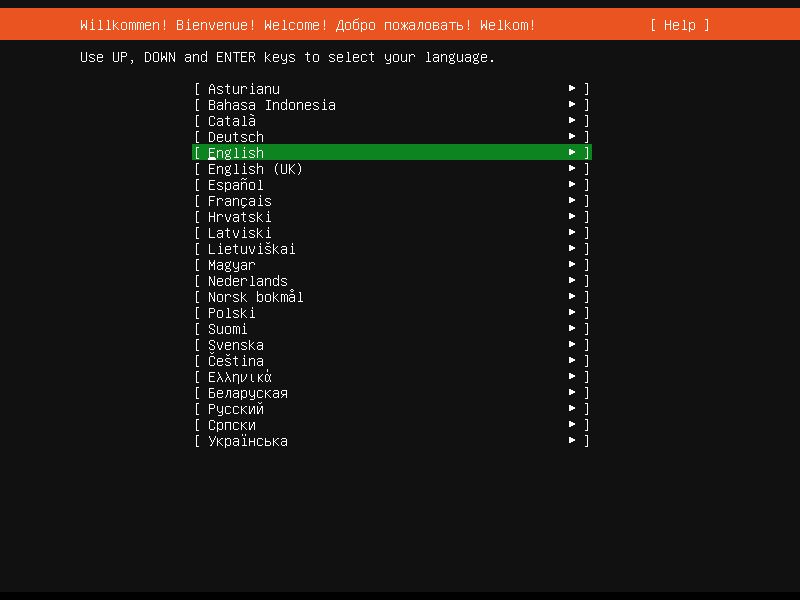<figcaption></figcaption></figure>

#### Install available updates for the installer

<figure>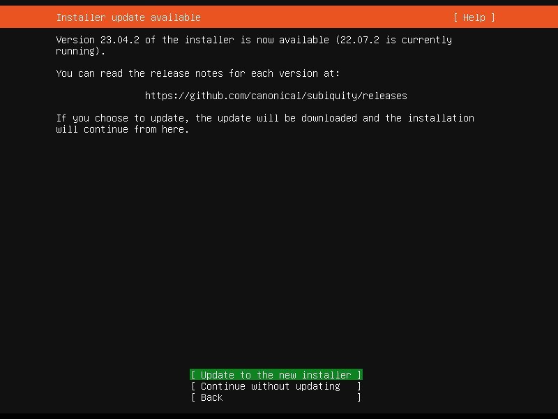<figcaption></figcaption></figure>

<figure><figcaption></figcaption></figure>

#### Keyboard configuration

<figure>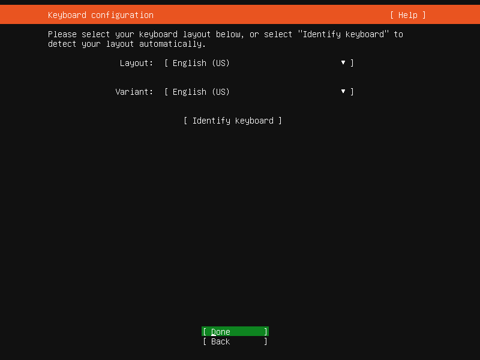<figcaption></figcaption></figure>

#### Choose the type of install <a href="#choosetypeofinstallubuntuserver-mo-ren" id="choosetypeofinstallubuntuserver-mo-ren"></a>

Please choose the **Ubuntu Server**.

<figure><figcaption></figcaption></figure>

#### Network connections  <a href="#networkconnections-pei-zhi-jing-tai-di-zhi" id="networkconnections-pei-zhi-jing-tai-di-zhi"></a>

Please configure a static IP address for the server manually.

<figure>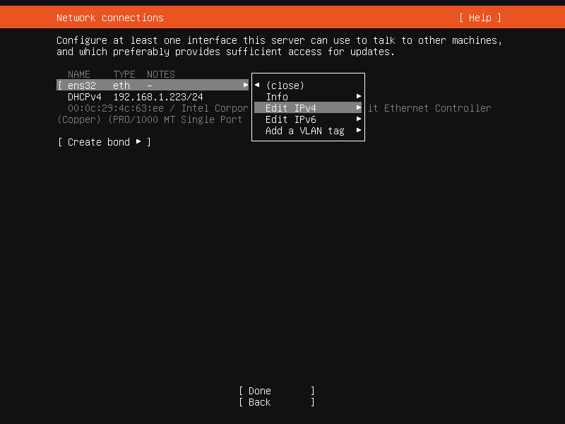<figcaption></figcaption></figure>

<figure><figcaption></figcaption></figure>

#### For the PBX node 1 (pbx01):

<figure>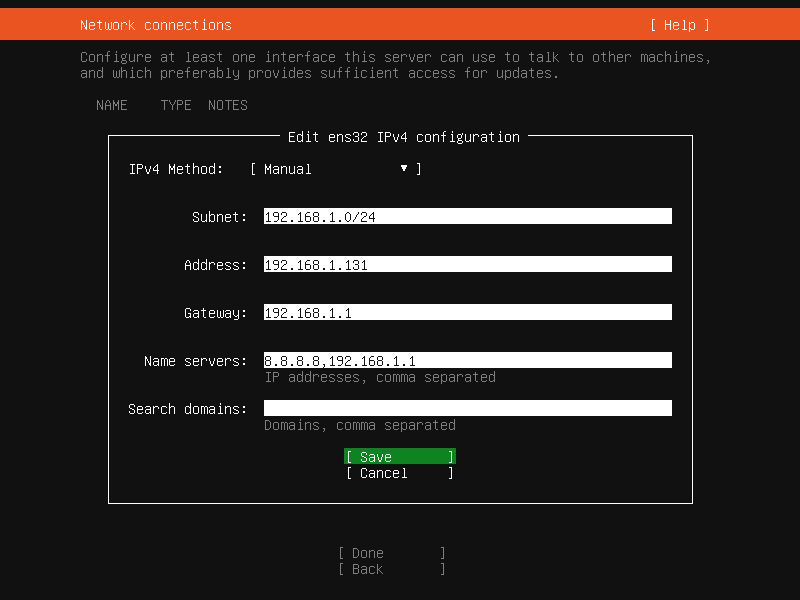<figcaption></figcaption></figure>

<figure>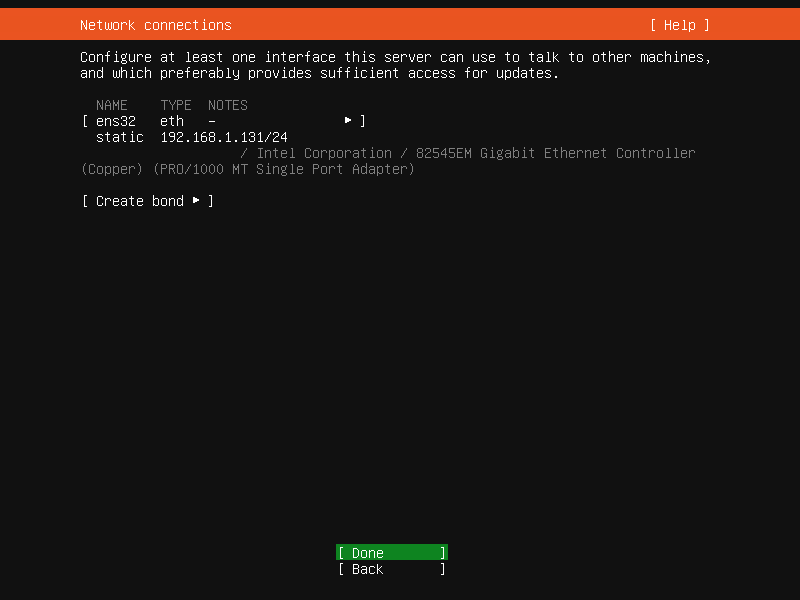<figcaption></figcaption></figure>

#### For the PBX node 2 (pbx02):

<figure><figcaption></figcaption></figure>

<figure><figcaption></figcaption></figure>

#### For the PBX node 3 (pbx03):

<figure><figcaption></figcaption></figure>

<figure><figcaption></figcaption></figure>

#### Configure proxy <a href="#configureproxy-mo-ren" id="configureproxy-mo-ren"></a>

Keep it as the default settings.

<figure><figcaption></figcaption></figure>

#### Configure Ubuntu archive mirror <a href="#configureubuntuarchivemirror-mo-ren" id="configureubuntuarchivemirror-mo-ren"></a>

Keep it as the default settings.

<figure>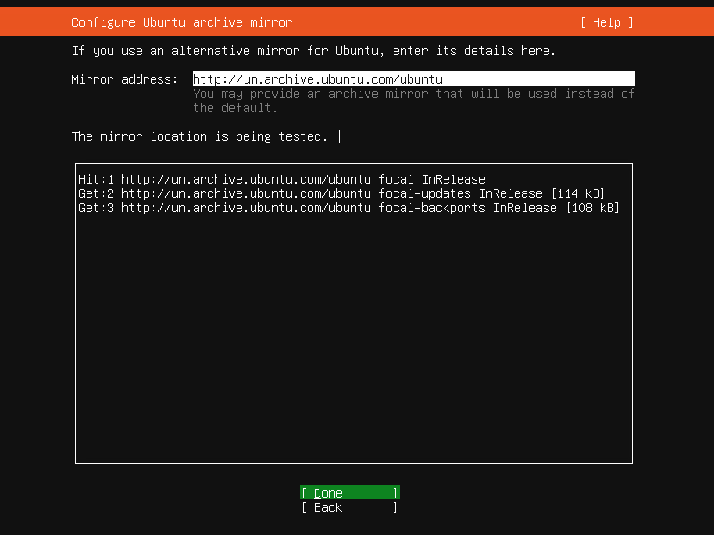<figcaption></figcaption></figure>

#### Guided storage configuration <a href="#guidedstorageconfiguration-mo-ren" id="guidedstorageconfiguration-mo-ren"></a>

Keep it as the default settings.

<figure>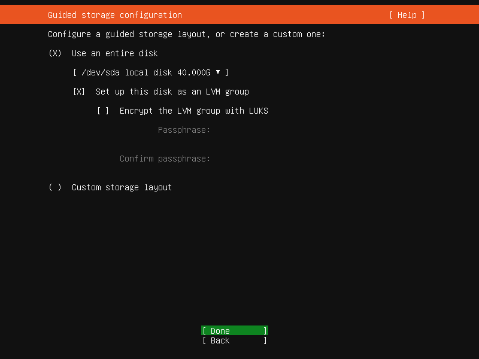<figcaption></figcaption></figure>

#### Storage configuration <a href="#storageconfiguration-mo-ren" id="storageconfiguration-mo-ren"></a>

Keep the storage configuration at its default settings.

* The disk device **`/dev/sdb`** must remain **unused** and **uninitialized**. Otherwise, the HA installation will fail.

<figure><figcaption></figcaption></figure>

<figure>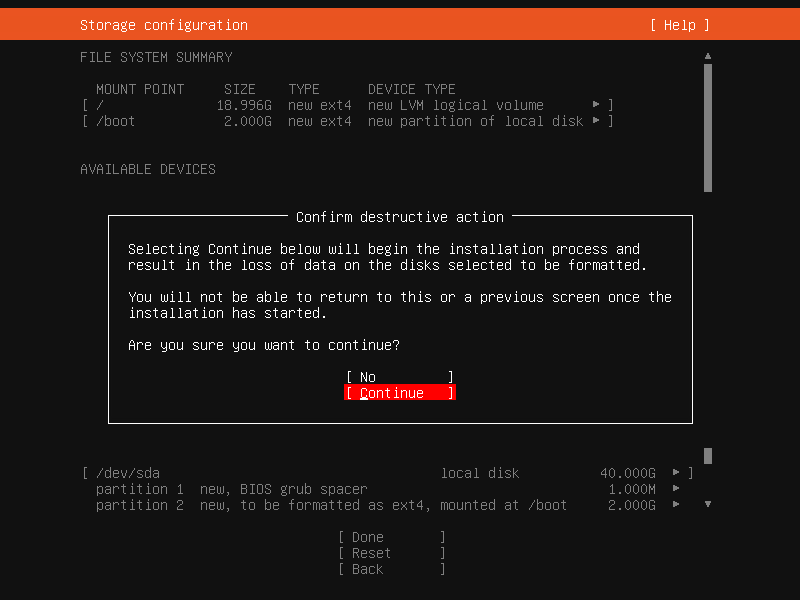<figcaption></figcaption></figure>

#### Profile setup

On **all three PBX servers**, create a system user named **`pbx`**.

* The **`pbx`** user must have **sudo privileges** to perform administrative tasks.
* The **same username and password must be used on all PBX servers** to ensure a consistent and successful High Availability configuration.

#### For the PBX node 1 (pbx01):

<figure><figcaption></figcaption></figure>

#### For the PBX node 2 (pbx02):

<figure><figcaption></figcaption></figure>

#### For the PBX node 3 (pbx03):

<figure>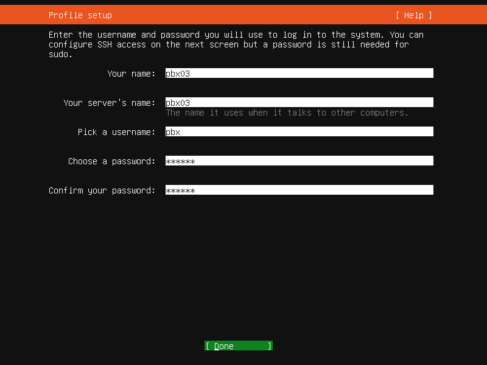<figcaption></figcaption></figure>

#### Upgrade to Ubuntu Pro <a href="#upgradetoubuntupro-mo-ren" id="upgradetoubuntupro-mo-ren"></a>

Keep it as the default settings: **Skip for now**.

<figure><figcaption></figcaption></figure>

#### SSH Setup <a href="#ssh-setup" id="ssh-setup"></a>

Install the OpenSSH server.

<figure><figcaption></figcaption></figure>

#### Featured Server Snaps <a href="#featuredserversnaps-mo-ren" id="featuredserversnaps-mo-ren"></a>

Keep it as the default settings.

<figure><figcaption></figcaption></figure>

#### Installing system <a href="#installingsystem-mo-ren" id="installingsystem-mo-ren"></a>

Start the process of installing the operating system and remain patient while it completes.

<figure><figcaption></figcaption></figure>

#### Install complete <a href="#installcomplete-mo-ren" id="installcomplete-mo-ren"></a>

Once the system is successfully installed, reboot the system (Reboot Now).

<figure>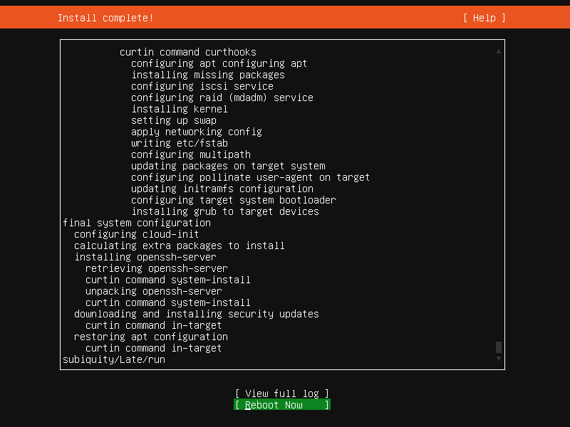<figcaption></figcaption></figure>

After the server reboot, use the "**pbx**" user credentials created during installation to log in and continue with the following steps.

***

### Configure Hostname Resolution

To ensure proper communication between PBX nodes, you must configure hostname resolution on **all three servers**.

Perform the following steps **on each node**: `pbx01`, `pbx02`, and `pbx03`.

> ⚠️ **IMPORTANT**\
> Replace the IP addresses and hostnames in the example below with the **actual values for your environment**.

Run the following command to update the `/etc/hosts` file:

```bash
sudo bash -c 'cat >> /etc/hosts' << EOF
192.168.1.131 pbx01
192.168.1.132 pbx02
192.168.1.133 pbx03
EOF
```

This configuration ensures that each PBX node can reliably resolve the hostnames of the other nodes, which is required for cluster coordination and High Availability operations.

***

### Set Up Password-Free SSH Login

In this guide:

* **`pbx01`** refers to **Node 1 (Master Node)**
* **`pbx02`** refers to **Node 2**
* **`pbx03`** refers to **Node 3**

All commands in this section **must be executed only on `pbx01`**, unless explicitly stated otherwise.

Password-free SSH access is required to allow the PortSIP PBX HA components to securely communicate and coordinate across nodes.

***

#### Step 1: Generate the SSH Key Pair

On **`pbx01`**, generate an SSH key pair for the `pbx` user:

```bash
ssh-keygen -t rsa
```

<figure>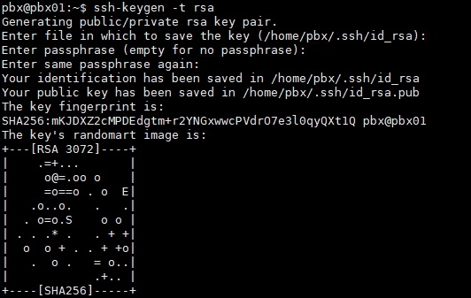<figcaption></figcaption></figure>

When prompted:

* Press **Enter** to accept the default file location.
* Press **Enter** to leave the passphrase empty (recommended for HA automation).

This will generate the SSH private and public keys under the `~/.ssh/` directory.

***

#### Step 2: Configure Password-Free Login for All PBX Nodes

On **`pbx01`** only, copy the public key to all PBX nodes:

```bash
ssh-copy-id -i ~/.ssh/id_rsa.pub pbx01
ssh-copy-id -i ~/.ssh/id_rsa.pub pbx02
ssh-copy-id -i ~/.ssh/id_rsa.pub pbx03
```

* If prompted with a **yes/no** confirmation (for example, to trust the host), type **`yes`** and press **Enter**.
* When prompted, enter the **`pbx` user password** for each node.

After this step, the `pbx` user on `pbx01` will be able to log in to all PBX nodes without requiring a password.

***

#### Verification (Optional but Recommended)

To verify password-free access, run the following commands from **`pbx01`**:

```bash
ssh pbx02
ssh pbx03
```

If the login succeeds without prompting for a password, the configuration is complete.

***

### Configuring PortSIP PBX HA

All steps in this section must be performed on the **master node (`pbx01`) only**, unless explicitly stated otherwise.

#### Step 1: Download the PBX HA Resource Package

On **`pbx01`**, download and extract the PortSIP PBX HA resource package:

```bash
cd /opt/ && sudo wget \
-N https://www.portsip.com/downloads/ha/v22/portsip-pbx-ha-guide-22-online.tar.gz \
&& sudo tar xf portsip-pbx-ha-guide-22-online.tar.gz
```

This package contains the HA deployment scripts and configuration templates required for cluster installation.

***

#### Step 2: Configure HA Variables

Before proceeding, prepare the values for your environment, including hostnames, IP addresses, virtual IP, and disk configuration.

<table data-header-hidden><thead><tr><th width="206">Name</th><th width="120.33333333333326">Type</th><th>Description</th></tr></thead><tbody><tr><td>Name</td><td>Type</td><td>Description</td></tr><tr><td>pbx01_hostname</td><td>string</td><td>The hostname of node 1, in this case is pbx01</td></tr><tr><td>pbx02_hostname</td><td>string</td><td>The hostname of node 2, in this case is pbx02</td></tr><tr><td>pbx03_hostname</td><td>string</td><td>The hostname of node 3, in this case is pbx03</td></tr><tr><td>pbx01_private_ip</td><td>string</td><td>The private <strong>static</strong> IP of node 1, in this case is 192.168.1.131</td></tr><tr><td>pbx02_private_ip</td><td>string</td><td>The private <strong>static</strong> IP of node 2, in this case is 192.168.1.132</td></tr><tr><td>pbx03_private_ip</td><td>string</td><td>The private <strong>static</strong> IP of node 3, in this case is 192.168.1.133</td></tr><tr><td>vip</td><td>string</td><td>The virtual IP in this case is 192.168.1.130</td></tr><tr><td>pbx_image</td><td>string</td><td>PortSIP PBX docker image in this case is <strong>portsip/pbx:22</strong></td></tr><tr><td>pbx_datapath_disk</td><td>string</td><td>The disk volume for PBX data store in this case is /dev/sdb</td></tr><tr><td>pbx_datapath_size</td><td>string</td><td>The disk volume size for PBX data store，in this case is 36G(If set as full 40G maybe report error);<br>For example if the disk volume size is 500G , suggest set as 490G.</td></tr></tbody></table>

On **`pbx01`** only, create and edit the HA variables file:

```bash
cd /opt/portsip-pbx-ha-guide && sudo bash -c 'cat > ./res/vars.yml' << EOF
pbx01_hostname: pbx01
pbx02_hostname: pbx02
pbx03_hostname: pbx03
pbx01_private_ip: 192.168.1.131
pbx02_private_ip: 192.168.1.132
pbx03_private_ip: 192.168.1.133
vip: 192.168.1.130
pbx_image: portsip/pbx:22
pbx_datapath_disk: /dev/sdb
pbx_datapath_size: 36G
EOF
```

> ⚠️ **IMPORTANT**
>
> * Ensure all hostnames and IP addresses match your actual environment.

***

#### Step 3: Install Required Dependencies

On **`pbx01`** only, install all required system dependencies for the HA environment:

```bash
cd /opt/portsip-pbx-ha-guide/ && /bin/bash install_dependencies.sh
```

This script installs and configures the necessary system packages and services required by the PortSIP PBX HA framework.

***

#### Step 4: Reboot All PBX Servers

Once the dependencies installation completes, **all PBX nodes must be rebooted** to apply system-level changes.

Process the reboot process from **`pbx01`** only by commands below(keep the order):

```shellscript
ssh -t pbx03 "sudo reboot"
ssh -t pbx02 "sudo reboot"
ssh -t pbx01 "sudo reboot"
```

***

### Initialize HA Resources

All steps in this section must be executed **only on the master node (`pbx01`)**.

On **`pbx01`**, run the following command to initialize the PortSIP PBX HA resources:

```bash
cd /opt/portsip-pbx-ha-guide/ && /bin/bash deploy_pbx.sh
```

> ⚠️ **IMPORTANT**\
> This process may take several minutes to complete. **Do not interrupt, restart, or shut down any server** while the script is running, as doing so may cause the HA deployment to fail.

Once the resource initialization completes successfully, the PortSIP PBX services will be deployed and started across the cluster.

Open a web browser and access the PBX Web Portal using the **Virtual IP (VIP)**:

```
https://192.168.1.130:8887
```

> **Note:**\
> All future PBX access, administration, and configuration **must be performed using the virtual IP** (`192.168.1.130`), not the individual node IP addresses.

***

### Configure PortSIP PBX

When you sign in to the PBX Web Portal for the first time, the **Setup Wizard** will launch automatically.

#### Setup Wizard Configuration

In the first step of the Setup Wizard:

* Locate the **Private IPv4** field, enter the **Virtual IP address** `192.168.1.130`
* Locate the **Public IPv4** field and enter the public IP address `104.18.36.119`. If your deployment does not use a public IP address, leave this field empty.

If your environment uses a different virtual IP, enter your **actual configured VIP** instead.

<figure><figcaption></figcaption></figure>

Complete the Setup Wizard by following the on-screen instructions.

***

### Enable Call Recovery

After completing the Setup Wizard, enable call recovery to ensure seamless failover for active calls:

1. Navigate to **Advanced > Settings > Advanced**
2. Enable the **Call Recovery** option
3. Click **OK** to save the configuration

Enabling Call Recovery ensures that active calls can be recovered automatically in the event of a PBX node failure, providing true High Availability behavior.

***

### Install PortSIP IM Service

With the PortSIP PBX High Availability deployment complete, you are now ready to install the **PortSIP Instant Messaging (IM) Service**.

Please follow the [Scaling IM Server On-Premise for High Availability](scaling-im-server-on-premise-for-high-availability.md) guide to complete the installation and configuration.

***

### Install PortSIP Data Flow Service

With the PortSIP PBX High Availability deployment complete, you are now ready to install the **PortSIP Data Flow Service**.

Please follow the [Scaling IM Server On-Premise for High Availability guide](scaling-im-server-on-premise-for-high-availability.md) to complete the installation and configuration.

***

### Install PortSIP SBC Service

With the PortSIP PBX High Availability deployment complete, you are now ready to install the **PortSIP SBC Service**.

Please follow the [Scaling SBC  On-Premise for High Availability](11-deploy-the-sbc-cluster.md) guide to complete the installation and configuration.

***

### Managing PortSIP PBX High Availability

Once the PortSIP PBX High Availability cluster has been successfully configured, you can manage and monitor the HA environment using the commands described below.

> ⚠️ **IMPORTANT**\
> All HA management commands **must be executed only on the master node (`pbx01`)**.

#### View PBX HA Status

To check the current status of the PBX HA cluster, run the following command on **`pbx01`**:

```bash
cd /opt/portsip-pbx-ha-guide && sudo /bin/bash ha_ctl.sh status
```

**Expected Output (Healthy HA State)**

The following output indicates that the PBX HA cluster is operating correctly and that the master and slave roles are properly assigned:

```shellscript
drbd_attr    (ocf::linbit:drbd-attr):    Started pbx01
 Master/Slave Set: drbd_devpath-clone [drbd_devpath]
     Masters: [ pbx01 ]
     Slaves: [ pbx02 pbx03 ]
 vip    (ocf::heartbeat:IPaddr2):    Started pbx01
 src_pkt_ip    (ocf::heartbeat:IPsrcaddr):    Started pbx01
 datapath_fs    (ocf::heartbeat:Filesystem):    Started pbx01
 pbx    (ocf::portsip:pbx):    Started pbx01
```

This output confirms that:

* `pbx01` is currently the **active master node**
* `pbx02` and `pbx03` are functioning as **standby nodes**
* The **Virtual IP**, **data path**, and **PBX service** are running on the master node
* Data replication and HA resource management are functioning normally

***

#### Restart the PBX Service

If you need to restart the PBX service (for example, after configuration changes), run the following command on **`pbx01`**:

```bash
cd /opt/portsip-pbx-ha-guide && sudo /bin/bash ha_ctl.sh restart -s pbx
```

**Expected Output**

The following output indicates that the PBX service has been successfully restarted under HA control:

```bash
try to restart resource pbx
disable resource pbx
resource 'pbx' is not running on any node
enable resource pbx
```


