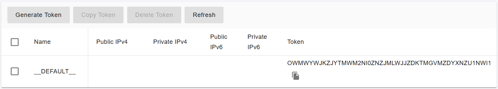
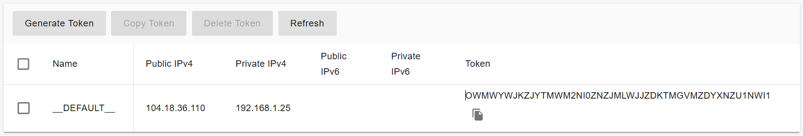

# Scaling IM Server On-Premise for High Availability

With the PortSIP PBX HA deployment, we need to deploy the IM service on a separate server.

Before proceeding with this guide, ensure that you have already completed the [High Availability Installations on Ubuntu](high-availability-installations-on-ubuntu.md) deployment.

## Install IM Service on a Separate Server

For optimal performance, it’s recommended to install the IM service on a separate server, especially when handling a large number of users for chat and file-sharing activities (including files and pictures). The following hardware specifications are suitable for supporting up to 50,000 users online, with messaging and file sharing:

* **CPU**: 20 cores or higher
* **Memory**: 16 GB
* **Disk**: High I/O performance required (SSD recommended, at least 256 GB)
* **Network Bandwidth**: 1000 Mbps or higher, particularly if handling high volumes of messages and file sharing.
* **Static private IP**: You must configure a static private IP for this IM server. In this case, we assume it's **192.168.1.25.**
* **Static public IP:** If your PBX and IM server are located in the cloud for the internet users to access, you must have a static public IP for this IM service. In this case, we assume it's **104.18.36.110.**

### **Supported Linux OS** <a href="#supported-linux-os" id="supported-linux-os"></a>

It only supports 64-bit OS.

* Ubuntu 24.04

For this setup, we assume the **PortSIP PBX High Availability** is installed on a server:

* PBX Server High Availability **Virtual IP** address: **192.168.1.130**
* PBX Server static public IP address: **104.18.36.119**.

### Step 1: **Preparing the Linux server for IM Installation**

Tasks that MUST be completed before installing cluster servers.

* **Ensure the server date-time is synced correctly**.
* If the Linux server is on a LAN, assign a **static private IP** address, in this case, **192.168.1.25**.
* Assign/route the static public IP address to this server, in this case, **104.18.36.110.**
* Install all available updates and service packs before installing the cluster server.
* Do not install PostgreSQL on the server.
* Ensure that all power-saving options for your system and network adapters are disabled (by setting the system to High-Performance mode).
* Do not install TeamViewer, VPN, or similar software on the host machine.
* The server must not be installed as a DNS or DHCP server.

### Step 2: Configuring the IP Address Whitelist <a href="#configuring-the-ip-address-whitelist" id="configuring-the-ip-address-whitelist"></a>

This step is mandatory; the service will not function without it.&#x20;

To prevent the PBX from restricting the request rate to the IM servers, you must add the IM servers' IP addresses to the PBX whitelist. Follow the steps below to complete this process:

1. Sign in to the PBX web portal as the System Administrator
2. Select the menu **IP Blacklist** > **Add**.
3. Enter the IM server IP as shown in the screenshot below, and choose a long **expiration date.**

<figure><figcaption></figcaption></figure>

### Step 3: Generate Token for the IM Server

1. Log in as the **System Administrator** to the PortSIP PBX HA Web portal.
2. Navigate to **Servers > IM Servers**.
3. Select the default server and click the **Generate Token** button.

<figure><figcaption></figcaption></figure>

### **Step 4: Deploy the IM Service**


**Important:** All management commands for extended servers **must be executed on the `pbx01` node**, regardless of whether it is currently the active node.


Run the following command only on the HA PBX node **pbx01**. The process may take some time, so please be patient and wait for it to complete, don't interrupt or reboot.

```sh
cd /opt/portsip-pbx-ha-guide/ && /bin/bash im.sh run \
-a 192.168.1.25 \
-A 104.18.36.110
```

If everything is set up correctly, the PBX web portal will display the IM server's IP address, as shown in the screenshot below.

<figure><figcaption></figcaption></figure>


If you have extra firewall in your network infrastructure, you must ensure that TCP port 8887 is open in the firewall rules. The client application requires access to this port in order to send and receive messages.


The Instant Messaging (IM) server has been successfully installed. We can now proceed with the next steps in the [PortSIP PBX installation step 6](../../portsip-pbx-administration-guide/1-installation-of-the-portsip-pbx/installation-of-portsip-pbx-v22/install-portsip-pbx-on-linux.md#step-6-reboot-to-apply-the-certificate).

