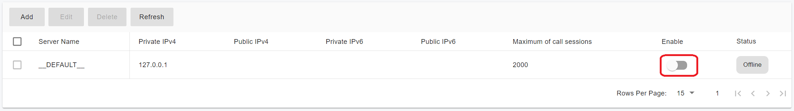
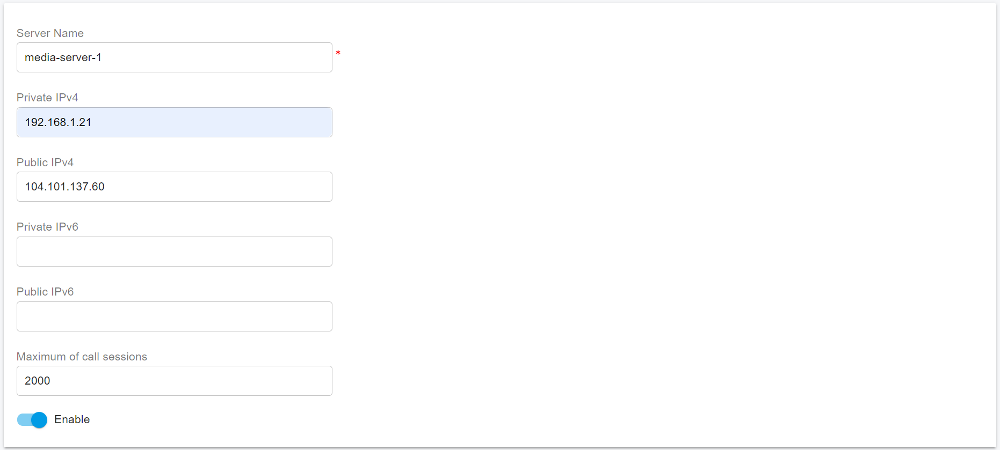
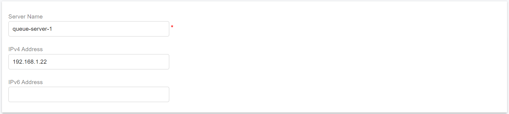
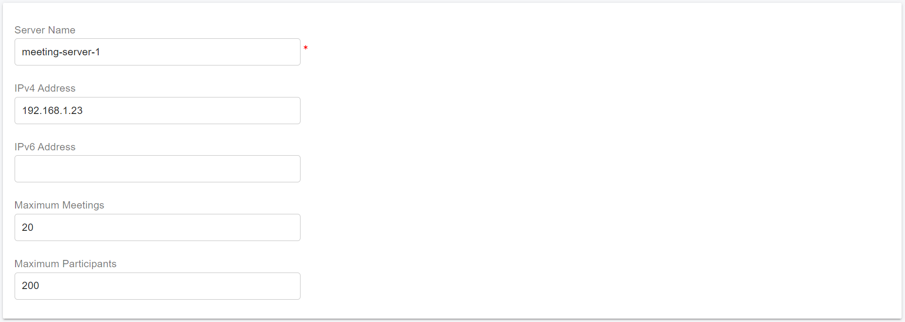
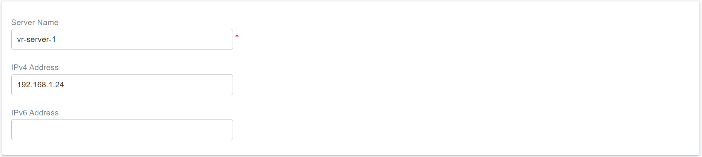

# Scaling Servers On-Premise for High Availability

This guide explains how to configure cluster servers for a **High Availability (HA) PortSIP PBX deployment** designed to operate at very large scale.\
The architecture can support:

* Over 1 million total users
* Approximately 50,000 concurrently registered (online) users
* Up to 10,000 simultaneous calls

This deployment model is also ideal for **high-demand workloads**, including large meetings, IVR applications, and high-volume call queues.

***

### Prerequisites

Before configuring the cluster servers, ensure that you have successfully completed the PBX HA installation and configuration on the **Main Server** by following the guide: [High Availability Installations on Ubuntu](high-availability-installations-on-ubuntu.md)

> ❗ **Note**\
> At this stage, **only the PBX needs to be installed**.\
> The **Instant Messaging (IM) server and Data Flow server should not be installed yet**, as it will be deployed later in this guide.

***

### Preparing Cluster Servers

The following Linux servers must be prepared to host the PortSIP cluster application services:

* Media Servers
* Queue Servers
* Meeting Servers
* IVR Servers

#### Example Cluster Topology

In this guide, the cluster is deployed using the following server layout:

* **Main Server:** PBX HA with a virtual IP address: `192.168.1.130`
* **Server 1 – Media Server**
  * Private IP: `192.168.1.21`
  * Static Public IP: `104.101.137.60`
* **Server 2 – Queue Server:** IP address: `192.168.1.22`
* **Server 3 – Meeting Server:** IP address: `192.168.1.23`
* **Server 4 – IVR Server:** IP address: `192.168.1.24`

> ❗ **Important**\
> Each server can deploy **only one server role**.\
> For example, you **must not** deploy both a Media Server and a Queue Server on the same machine.

***

### Supported Linux Operating System

* **Supported OS:** Ubuntu 24.04 (64-bit)
* **Version Consistency:** All servers in the HA cluster **must run the exact same OS version** as the PBX server.

***

### User Account Requirements

* All cluster servers must use **the same username and password** as the PBX server.
* In this guide, the username **`pbx`** is used as an example.
* The user account **must have sudo privileges** to execute administrative commands.

***

### Disk Space Recommendations

* **Cluster Servers:**\
  Minimum **128 GB** disk space(No separate data partition is required.)
* **Media Servers with Call Recording Enabled:**\
  Minimum **256 GB** disk space is recommended to accommodate recording storage.

***

### Network Requirements

When deploying a PBX cluster, ensure **sufficient network bandwidth and low latency** between all servers.

> Insufficient network capacity or unstable connectivity may cause degraded performance or unexpected system behavior.

***

### Preparing the Linux Host Machine for Installation

The following tasks must be completed before installing any cluster server components:

* Ensure the system date and time are correctly synchronized.
* If the server is on a LAN, assign a static private IP address.
* For Media Server clusters, each Media Server must also have a static public IP address if it will handle calls from the Internet.
* Install all available OS updates and service packs.
* Do not install PostgreSQL on the server.
* Disable all power-saving features for the system and network adapters (use High-Performance mode).
* Do not install TeamViewer, VPN clients, or similar remote access software.
* The server must not function as a DNS or DHCP server.

***


### Set Up Password-Free Login for All Cluster Servers

The following commands **must be executed only on the PBX HA primary node (`pbx01`)**.

This step enables password-free SSH access from the PBX HA node to all cluster servers, which is required for automated deployment and management.

If you are prompted to confirm the connection (yes/no), please enter **`yes`**.

```bash
ssh-copy-id -i ~/.ssh/id_rsa.pub pbx@192.168.1.21
ssh-copy-id -i ~/.ssh/id_rsa.pub pbx@192.168.1.22
ssh-copy-id -i ~/.ssh/id_rsa.pub pbx@192.168.1.23
ssh-copy-id -i ~/.ssh/id_rsa.pub pbx@192.168.1.24
```

***

### Add the Cluster Servers

To add the cluster servers, sign in to the **PBX Web Portal** as a **System Administrator**.

From the administration interface, you can register each Media Server, Queue Server, Meeting Server, and IVR Server so they become part of the HA cluster.

***

### Disable Default Servers on the Main Server

By default, PortSIP PBX installs **local Media, Queue, Meeting, and IVR servers** on the Main Server.

For large-scale and high-availability deployments, we strongly recommend **disabling these default servers** so that the Main Server is dedicated exclusively to **SIP signaling and call control**. This significantly improves scalability and allows the system to support more users and concurrent calls.

#### Steps

1. Go to the **Servers** menu in the PBX Web Portal.
2. Expand each server category:
   * Media Servers
   * Queue Servers
   * Meeting Servers
   * IVR Servers
3. Disable the **default server** in each category, as shown in the screenshot below.

> **Note**\
> The **Instant Messaging (IM) Server does not need to be disabled** and should remain enabled.

***

If you want, next I can:

<figure><figcaption></figcaption></figure>

### Add Media Server <a href="#add-media-server" id="add-media-server"></a>

To add a new media server, please follow the below steps:

1. Select the **Servers > Media Servers** menu and click the **Add** button.
2. Enter the server information as shown in the screenshot, and then click the **OK** button to save it. Please remember the server name "**media-server-1**", we will use it in a later step.
3. If your PBX is deployed for internet users to access, it is **mandatory** to assign a **static public IP** to this extended media server. Enter the static IP address as shown in the screenshot below.

Note: Suggest don't set the maximum of call sessions to more than 5,000.

<figure><figcaption></figcaption></figure>

4. Run the following command only on the HA PBX node **pbx01**. The process may take some time, so please be patient and wait for it to complete, don't interrupt or reboot.

* **-s media-server-only**: This parameter indicates that only the media server should be installed.
* **-n media-server-1**: This parameter specifies the name of the media server, which must match the name entered in step 2 above.
* **-a 192.168.1.21**: This parameter specifies the private IP address of **Server 1** (the extended media server).

```sh
cd /opt/portsip-pbx-ha-guide/ && /bin/bash extend.sh run \
-s media-server-only \
-n media-server-1 \
-a 192.168.1.21
```

Once the process is completed, the server will appear as **Online** in the PBX web portal under the menu: **Servers > Media Servers**.

### Add Queue Server <a href="#add-media-server" id="add-media-server"></a>

To add a new queue server, please follow the below steps:

1. Select the **Servers > Queue Servers** menu and click the **Add** button.
2. Enter the server information as shown in the screenshot, and then click the **OK** button to save it. Please remember the server name "**queue-server-1**", we will use it in a later step.

<figure><figcaption></figcaption></figure>

3. Run the following command only on the HA PBX node **pbx01**. The process may take some time, so please be patient and wait for it to complete, don't interrupt or reboot.

* **-s queue-server-only**: This parameter indicates that only the queue server should be installed.
* **-n queue-server-1**: This parameter specifies the name of the queue server, which must match the name entered in step 2 above.
* **-a 192.168.1.22**: This parameter specifies the private IP address of **Server 2** (the extended queue server).

```sh
cd /opt/portsip-pbx-ha-guide/ && /bin/bash extend.sh run \
-s queue-server-only \
-n queue-server-1 \
-a 192.168.1.22
```

Once the process is completed, the server will appear as **Online** in the PBX web portal under the menu: **Servers > Queue Servers**.

### Add Meeting Server <a href="#add-media-server" id="add-media-server"></a>

To add a new meeting server, please follow the below steps:

1. Select the **Servers > Meeting Servers** menu and click the **Add** button.
2. Enter the server information as shown in the screenshot, and then click the **OK** button to save it. Please remember the server name "**meeting-server-1**", we will use it in a later step.

<figure><figcaption></figcaption></figure>

3. Run the following command only on the HA PBX node **pbx01**. The process may take some time, so please be patient and wait for it to complete, don't interrupt or reboot.

* **-s meeting-server-only**: This parameter indicates that only the meeting server should be installed.
* **-n meeting-server-1**: This parameter specifies the name of the meeting server, which must match the name entered in step 2 above.
* **-a 192.168.1.23**: This parameter specifies the private IP address of **Server 3** (the extended meeting server).

```sh
cd /opt/portsip-pbx-ha-guide/ && /bin/bash extend.sh run \
-s meeting-server-only \
-n meeting-server-1 \
-a 192.168.1.23
```

Once the process is completed, the server will appear as **Online** in the PBX web portal under the menu: **Servers > Meeting Servers**.

### Add IVR Server <a href="#add-media-server" id="add-media-server"></a>

To add a new IVR server, please follow the below steps:

1. Select the **Servers > IVR Servers** menu and click the **Add** button.
2. Enter the server information as shown in the screenshot, and then click the **OK** button to save it. Please remember the server name "**vr-server-1**", we will use it in a later step.

<figure><figcaption></figcaption></figure>

3. Run the following command only on the HA PBX node **pbx01**. The process may take some time, so please be patient and wait for it to complete, don't interrupt or reboot.

* **-s vr-server-only**: This parameter indicates that only the IVR server should be installed.
* **-n vr-server-1**: This parameter specifies the name of the IVR server, which must match the name entered in step 2 above.
* **-a 192.168.1.24**: This parameter specifies the private IP address of **Server 4** (the extended IVR server).

```sh
cd /opt/portsip-pbx-ha-guide/ && /bin/bash extend.sh run \
-s vr-server-only \
-n vr-server-1 \
-a 192.168.1.24
```

Once the process is completed, the server will appear as **Online** in the PBX web portal under the menu: **Servers > IVR Servers**.

**Note**: You can repeat the above steps to set up more IVR servers. If you set up multiple servers, they must not use the same server name or IP address. Especially, you must ensure that the server name specified in the commands matches the one entered on the web portal.

## Managing Extended Servers


**Important:**\
All management commands for extended servers **must be executed on the `pbx01` node**, regardless of whether it is currently the active node.


### Available Operations

The following operations are supported for managing extended servers:

* `start` – Start the servers
* `stop` – Stop the servers
* `restart` – Restart the servers
* `rm` – Remove the installed servers

You can optionally target specific server types using the `-s` parameter, with one of the following values:

* `media-server-only` – Manage all Media Servers
* `queue-server-only` – Manage all Queue Servers
* `meeting-server-only` – Manage all Meeting Servers
* `ivr-server-only` – Manage all IVR Servers

To manage a **specific server instance** by its IP address, use the `-a` parameter.

### Managing All Extended Servers

The following commands apply actions to **all** extended servers(Media servers, Queue Servers, Meeting Servers, IVR Servers):

**Start All:**

```sh
cd /opt/portsip-pbx-ha-guide/ && /bin/bash extend.sh start
```

**Stop All:**

```sh
cd /opt/portsip-pbx-ha-guide/ && /bin/bash extend.sh stop
```

**Restart All:**

```sh
cd /opt/portsip-pbx-ha-guide/ && /bin/bash extend.sh restart
```

**Remove All:**

```sh
cd /opt/portsip-pbx-ha-guide/ && /bin/bash extend.sh rm
```

### Managing a Specific Type of Extended Servers

To manage only a **specific type** of extended server (e.g., Media Servers), use the `-s` parameter. Replace `media-server-only` with other supported server types as needed.

**Start All Media Servers:**

```sh
cd /opt/portsip-pbx-ha-guide/ && /bin/bash extend.sh start -s media-server-only
```

**Stop All Media Servers:**

```sh
cd /opt/portsip-pbx-ha-guide/ && /bin/bash extend.sh stop -s media-server-only
```

**Restart All Media Servers:**

```sh
cd /opt/portsip-pbx-ha-guide/ && /bin/bash extend.sh restart -s media-server-only
```

**Remove All Media Servers:**

```sh
cd /opt/portsip-pbx-ha-guide/ && /bin/bash extend.sh rm -s media-server-only
```

### Managing a Specific Server Instance by IP

To manage a **specific server instance** (e.g., a Media Server at IP `192.168.1.21`), use both `-s` and `-a` parameters:

**Start Specific Media Server:**

```sh
cd /opt/portsip-pbx-ha-guide/ && /bin/bash extend.sh start \
-s media-server-only \
-a 192.168.1.21
```

**Stop Specific Media Server:**

```sh
cd /opt/portsip-pbx-ha-guide/ && /bin/bash extend.sh stop \
-s media-server-only \
-a 192.168.1.21
```

**Restart Specific Media Server:**

```sh
cd /opt/portsip-pbx-ha-guide/ && /bin/bash extend.sh restart \
-s media-server-only \
-a 192.168.1.21
```

**Remove Specific Media Server:**

```sh
cd /opt/portsip-pbx-ha-guide/ && /bin/bash extend.sh rm \
-s media-server-only \
-a 192.168.1.21
```


Replace `media-server-only` with another server type as needed (e.g., `queue-server-only`), and replace `192.168.1.21` with the corresponding server’s IP address.


## Upgrading Servers <a href="#upgrade-server" id="upgrade-server"></a>


All the below commands must be performed on the pbx01 node, even if it is not the current active node.


Perform the following command only on the HA PBX node **pbx01,** even if it is not the current active node.

First, please ensure you have upgraded the PBX HA as per this guide: [Upgrading High Availability Installation](upgrading-high-availability-installation.md).&#x20;

The upgrading process may take some time—**do not interrupt, reboot, or close the terminal** during execution.

### Upgrading All Extended Servers

If you want to upgrade all extended servers—including the **Media Server**, **Queue Server**, **Meeting Server**, and **IVR Server**—run the following command:

```sh
cd /opt/portsip-pbx-ha-guide/ && /bin/bash extend.sh upgrade
```

### Upgrading Specific Types of Extended Servers

If you want to upgrade only a specific type of extended server, use the `-s` parameter to define the server type. For example, to upgrade **all Media Servers**:

```sh
cd /opt/portsip-pbx-ha-guide/ && \
/bin/bash extend.sh upgrade -s media-server-only
```

**Supported Server Types**

In the above command, you can use one of the following values with the `-s` parameter:

* `media-server-only` – Upgrade all Media Servers
* `queue-server-only` – Upgrade all Queue Servers
* `meeting-server-only` – Upgrade all Meeting Servers
* `ivr-server-only` – Upgrade all IVR Servers

