# High Availability Installations on Ubuntu

This article is for guidance on deploying the PortSIP PBX HA on Ubuntu.

## Prerequisites

### Servers

In the examples used in this article, a total of three servers are used. PBX nodes are used to refer to servers in the following

* The **three PBX nodes** or **all PBX nodes,** refer to all PBX servers
* **Master node** and **node 1** refer to **pbx01**
* **Node 2** refers to **pbx02**, and **node 3** refers to **pbx03**

### Disk

Deploying the HA requires having two disk volumes. In this example, the hard disk of each server is **80 GB,** creating two volumes:

* One is **40G** (**/dev/sda**) for Linux OS we called it "**system volume**". This volume is used to install the Linux system, it's can be smaller, in your production environment, you can allocate it such as 100G.
* The other one is **40G** (**/dev/sdb**) for storing the PBX data; we called it "**data volume**". This volume usually should be large since it is used to store the PBX data such as DB, recording files, logs, and chat files, in your production environment, we suggest it be as big as possible, such as 500G, or 1000G.

You are free to decide the disk size, but the size must be the same for all servers.

### Network

In this article, we deploy the HA on three servers that have the following IP addresses:

* 192.168.1.131
* 192.168.1.132
* 192.168.1.133

We used **192.168.1.130** as the VIP (Virtual IP).

### Linux OS

The PortSIP PBX HA for Ubuntu supports the following versions:

* &#x20;Ubuntu 24.04

## **Architecture**

**Figure 1-1**   PortSIP PBX HA Architecture

<figure>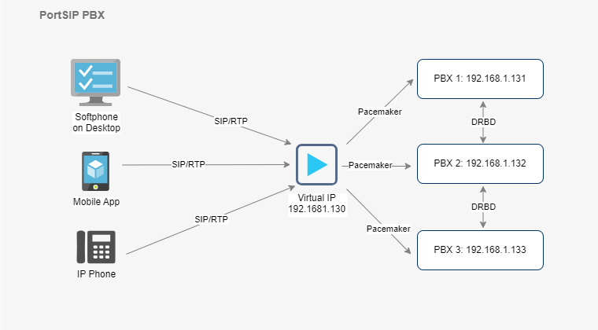<figcaption></figcaption></figure>

## Pacemaker

The [Pacemaker](http://www.clusterlabs.org/) is a high-availability Cluster Resource Manager (CRM) that can be used to manage resources and ensure that they remain available in the event of a node failure.

The PortSIP PBX HA uses the [Pacemaker](http://www.clusterlabs.org/) to do the resource management and monitoring, once the event of PBX node failure, the resources will automatically move to a working node in the cluster.&#x20;

## DRBD

[DRBD ](https://linbit.com/drbd/)is used for High Availability purposes. It is a software product used to replicate data in real time from one server to another. This ensures business continuity even in the event of hardware failure.

The [DRBD ](https://linbit.com/drbd/)is utilized in the PortSIP HA scenario to synchronize data (DB, recording files, log files, and prompt files) between the PBX nodes.

To connect to the PBX service, all SIP clients (IP Phone, Softphone, Mobile App, WebRTC Client) will access the Virtual IP of PortSIP PBX in the HA scenario.

## Working Mechanisms

The PortSIP PBX HA working mechanisms are as follows:

* Three PBX nodes are running at the same time to prevent split-brain during HA switching.
* Use [DRBD ](https://linbit.com/drbd/)to synchronize data between nodes, including current active call information, recording files, logs, call records, and prompt voice files uploaded by users.
* Use virtual IP (VIP) as the access entry point of the system.
* Use the  [Pacemaker](http://www.clusterlabs.org/) to monitor the status between servers.
* The primary node provides services. Once the primary node has a DOWN machine, the  [Pacemaker](http://www.clusterlabs.org/) will immediately drift the VIP to the standby node that takes over after detecting it. User service requests will be automatically routed to the standby node, and the standby node will continue to provide services.
* The established call on the primary node will be automatically restored by the standby node.

## Notes

* Ensure that your hardware has at least 4 cores and 4GB of memory
* Unless otherwise specified, perform the operations mentioned below only on the **master node**, which is named **pbx01**
* During the Linux OS installation, you will need to create a user named “**pbx**”. All Linux commands during the HA configuration process must be performed by that “**pbx**” user.
* During the configuration of the HA, you may be prompted to enter the password for the user "**pbx**" multiple times. Please provide the password as requested.

Please keep in mind that the username "**pbx**" used in this guide is just an example. You’re free to use a different username, but remember to create the same username and password on all three PBX servers.

## Install Ubuntu OS


The steps in this section guide you through the process of installing and configuring the Ubuntu operating system on all **three node servers**.


In this article, we installed the **Ubuntu 24.04**.

### Select language

<figure>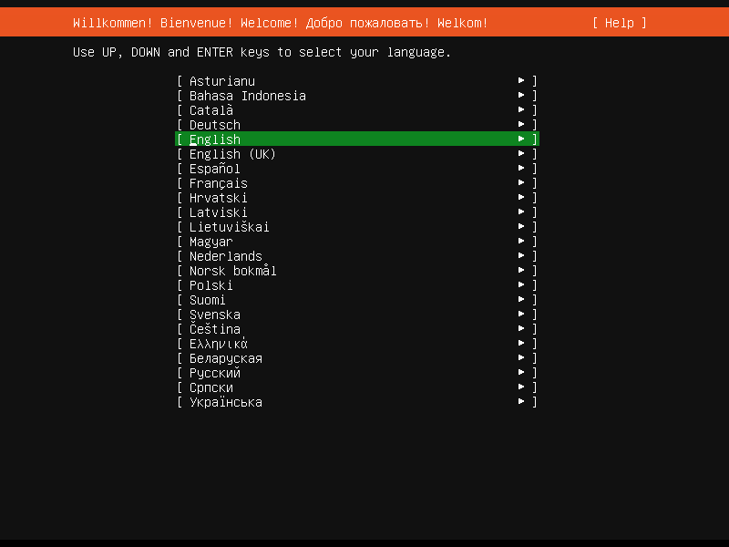<figcaption></figcaption></figure>

### Install available updates for the installer

<figure>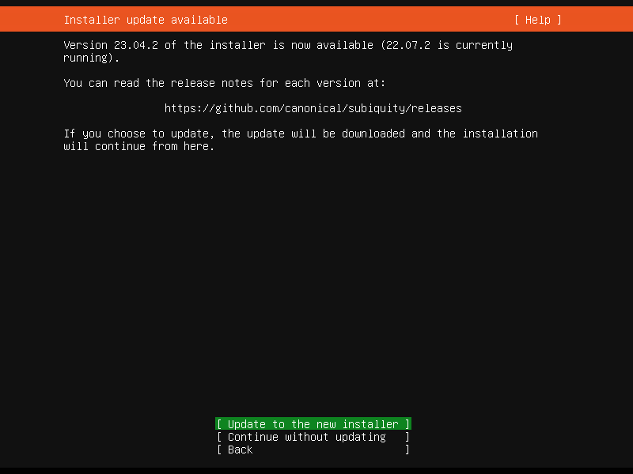<figcaption></figcaption></figure>

<figure>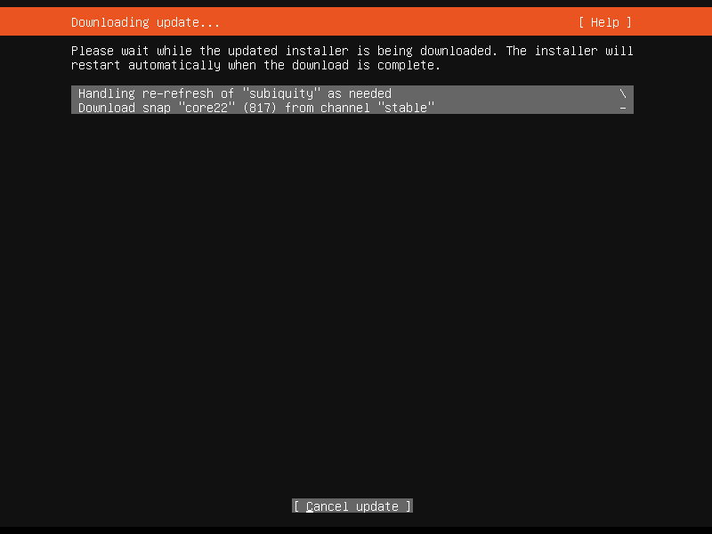<figcaption></figcaption></figure>

### Keyboard configuration

<figure>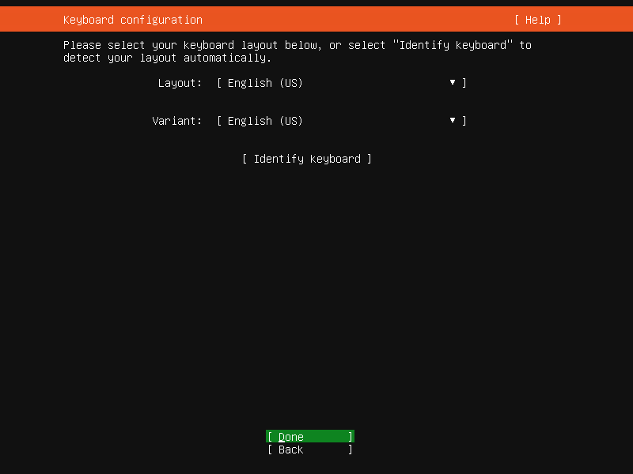<figcaption></figcaption></figure>

### Choose type of install <a href="#choosetypeofinstallubuntuserver-mo-ren" id="choosetypeofinstallubuntuserver-mo-ren"></a>

Please choose the **Ubuntu Server**.

<figure>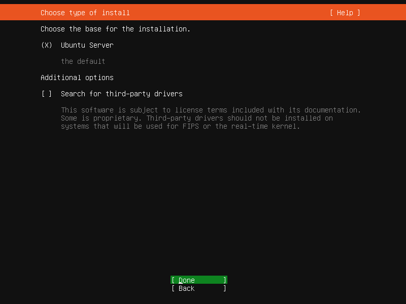<figcaption></figcaption></figure>

### Network connections  <a href="#networkconnections-pei-zhi-jing-tai-di-zhi" id="networkconnections-pei-zhi-jing-tai-di-zhi"></a>

Please configure a static IP address for the server manually.

<figure>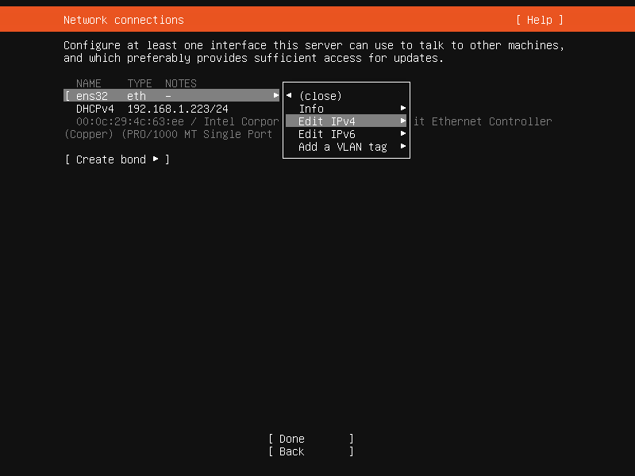<figcaption></figcaption></figure>

<figure>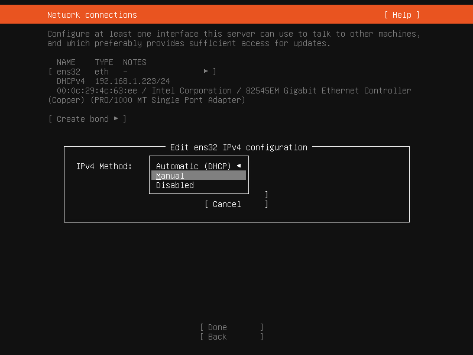<figcaption></figcaption></figure>

#### For the PBX node 1 (pbx01):

<figure><figcaption></figcaption></figure>

<figure>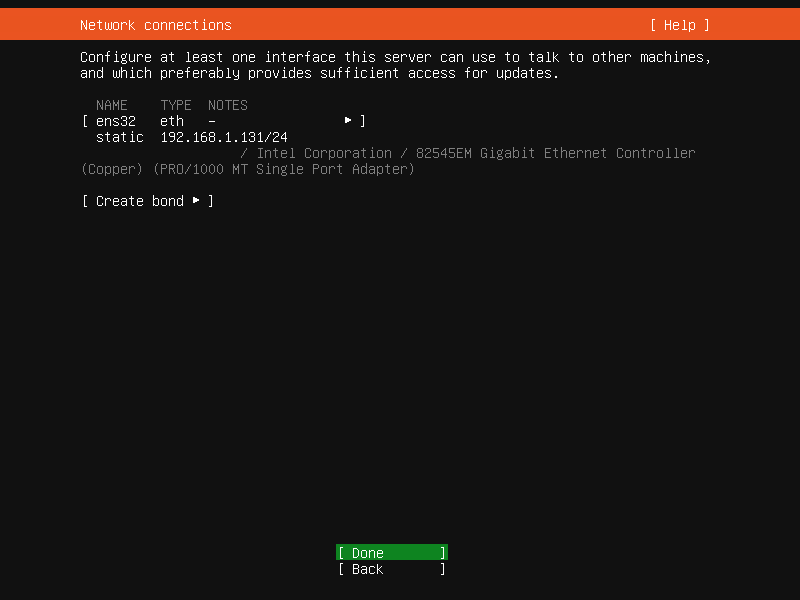<figcaption></figcaption></figure>

#### For the PBX node 2 (pbx02):

<figure>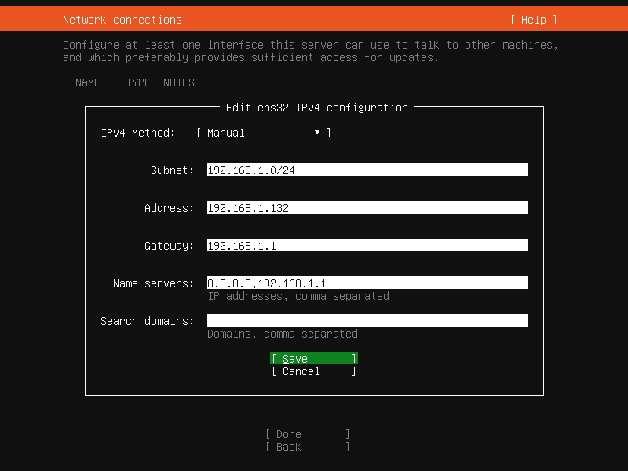<figcaption></figcaption></figure>

<figure><figcaption></figcaption></figure>

#### For the PBX node 3 (pbx03):

<figure><figcaption></figcaption></figure>

<figure><figcaption></figcaption></figure>

### Configure proxy <a href="#configureproxy-mo-ren" id="configureproxy-mo-ren"></a>

Keep it as the default settings.

<figure>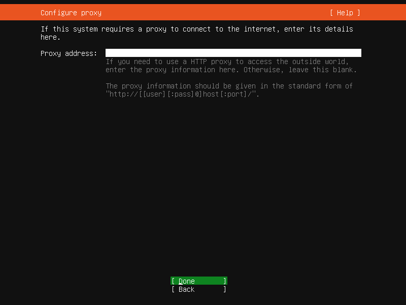<figcaption></figcaption></figure>

### Configure Ubuntu archive mirror <a href="#configureubuntuarchivemirror-mo-ren" id="configureubuntuarchivemirror-mo-ren"></a>

Keep it as the default settings.

<figure><figcaption></figcaption></figure>

### Guided storage configuration <a href="#guidedstorageconfiguration-mo-ren" id="guidedstorageconfiguration-mo-ren"></a>

Keep it as the default settings.

<figure>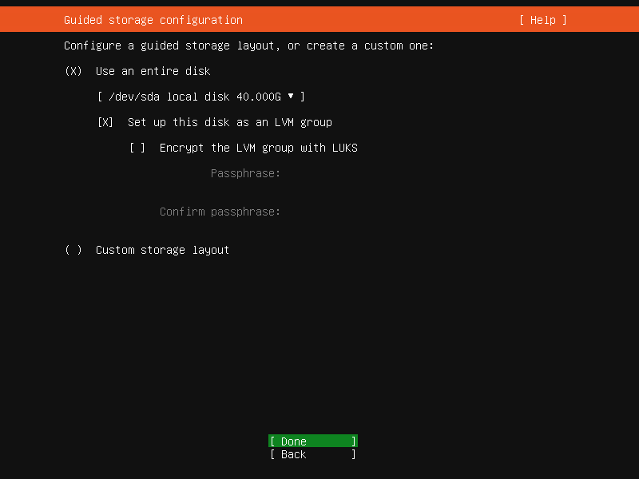<figcaption></figcaption></figure>

### Storage configuration <a href="#storageconfiguration-mo-ren" id="storageconfiguration-mo-ren"></a>

Keep it as the default setting, the **/dev/sdb** should be **unused** state.&#x20;


The `/dev/sdb` disk must remain uninitialized and in an **unused** state; otherwise, the installation will fail.


<figure>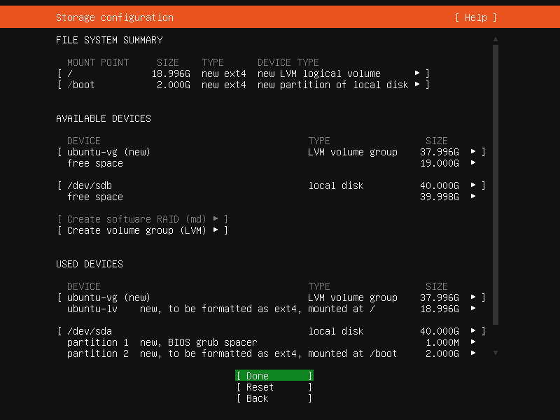<figcaption></figcaption></figure>

<figure>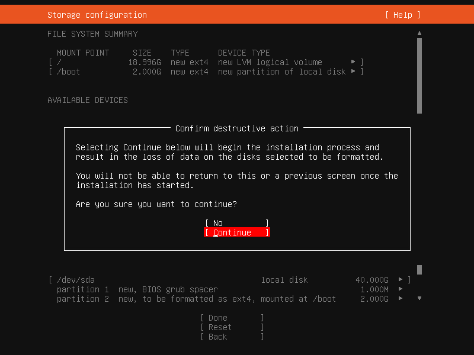<figcaption></figcaption></figure>

### Profile setup

For all three PBX servers, a new user named "**pbx**" needs to be created. This user should be granted **sudo** permissions and should have a consistent password across all servers.

#### For the PBX node 1 (pbx01):

<figure><figcaption></figcaption></figure>

#### For the PBX node 2 (pbx02):

<figure><figcaption></figcaption></figure>

#### For the PBX node 3 (pbx03):

<figure>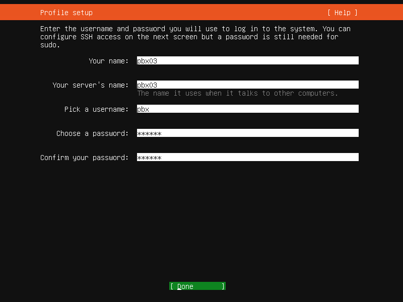<figcaption></figcaption></figure>

### Upgrade to Ubuntu Pro <a href="#upgradetoubuntupro-mo-ren" id="upgradetoubuntupro-mo-ren"></a>

Keep it as the default settings: **Skip for now**.

<figure>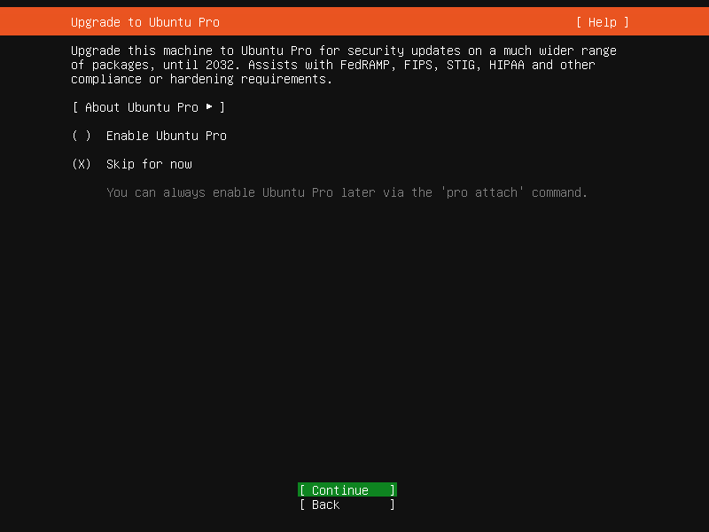<figcaption></figcaption></figure>

### SSH Setup <a href="#ssh-setup" id="ssh-setup"></a>

Install the OpenSSH server.

<figure>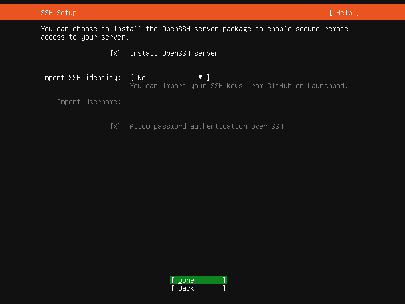<figcaption></figcaption></figure>

### Featured Server Snaps <a href="#featuredserversnaps-mo-ren" id="featuredserversnaps-mo-ren"></a>

Keep it as the default settings.

<figure>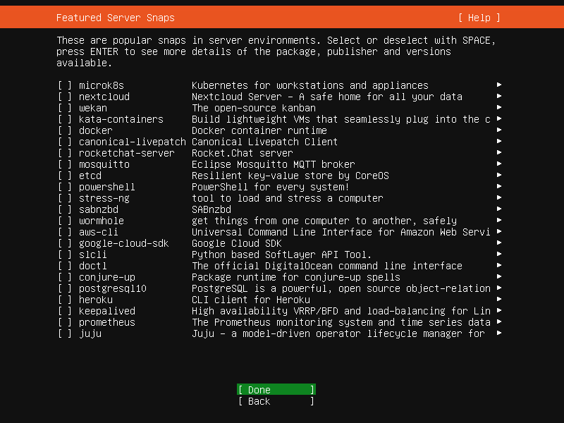<figcaption></figcaption></figure>

### Installing system <a href="#installingsystem-mo-ren" id="installingsystem-mo-ren"></a>

Start the process of installing the operating system and remain patient while it completes.

<figure>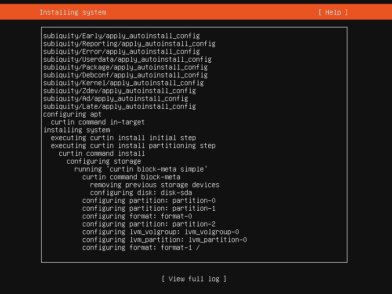<figcaption></figcaption></figure>

### Install complete <a href="#installcomplete-mo-ren" id="installcomplete-mo-ren"></a>

Once the system is successfully installed, reboot the system (Reboot Now).

<figure>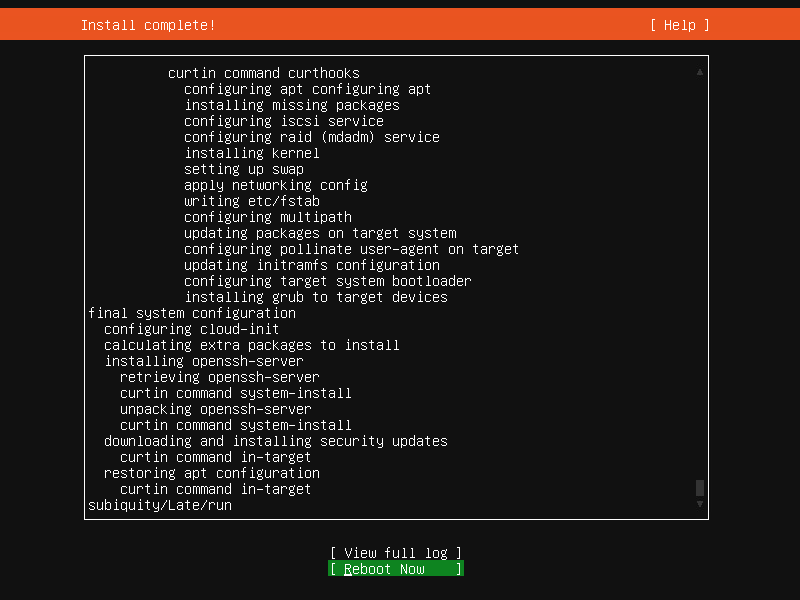<figcaption></figcaption></figure>

After the server reboot, use the "**pbx**" user credentials created during installation to log in and continue with the following steps.

### Resolve all these servers' hostnames

Perform the following commands at all three nodes: **pbx01**, **pbx02**, **pbx03**. Note: you need to replace the IP and hostname in the following command with your actual IP and hostname.

```sh
sudo bash -c 'cat >> /etc/hosts' << EOF
192.168.1.131 pbx01
192.168.1.132 pbx02
192.168.1.133 pbx03
EOF
```

### Set password-free login

In this guide, "**pbx01**", "**pbx02**", and "**pbx03**" are the mean for node 1, node 2, and node 3, respectively. The command provided below should only be executed on the node "**pbx01**".

#### Generate the certificate

Perform the below command only on the **pbx01**:

```sh
ssh-keygen -t rsa
```

&#x20;Follow the prompts to generate the certificate - press the **enter** button if required.

<figure>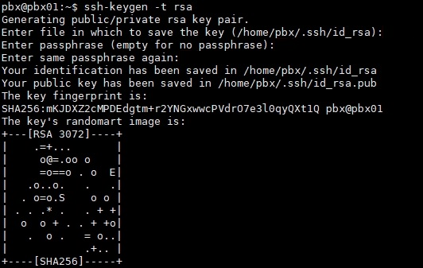<figcaption></figcaption></figure>

#### Set password-free login for all three servers

The following commands provided below should only be executed on the node "**pbx01**".


If you are prompted to choose an option (**yes/no**), please enter **yes**.


<pre class="language-sh"><code class="lang-sh"><strong>sudo ssh-copy-id -i ~/.ssh/id_rsa.pub pbx01
</strong></code></pre>

```sh
sudo ssh-copy-id -i ~/.ssh/id_rsa.pub pbx02
```

```sh
sudo ssh-copy-id -i ~/.ssh/id_rsa.pub pbx03
```

## Configuring PortSIP PBX HA

### Download the PBX resource package

The following command should only be executed on the node "**pbx01**".

```sh
cd /opt/ && sudo wget -N https://www.portsip.com/downloads/ha/v22/portsip-pbx-ha-guide-22-online.tar.gz \ 
&& sudo tar xf portsip-pbx-ha-guide-22-online.tar.gz
```

### Set variables

Please prepare the value for the below variables.

<table data-header-hidden><thead><tr><th width="206">Name</th><th width="120.33333333333326">Type</th><th>Description</th></tr></thead><tbody><tr><td>Name</td><td>Type</td><td>Description</td></tr><tr><td>pbx01_hostname</td><td>string</td><td>The hostname of node 1, in this case is pbx01</td></tr><tr><td>pbx02_hostname</td><td>string</td><td>The hostname of node 2, in this case is pbx02</td></tr><tr><td>pbx03_hostname</td><td>string</td><td>The hostname of node 3, in this case is pbx03</td></tr><tr><td>pbx01_private_ip</td><td>string</td><td>The private <strong>static</strong> IP of node 1, in this case is 192.168.1.131</td></tr><tr><td>pbx02_private_ip</td><td>string</td><td>The private <strong>static</strong> IP of node 2, in this case is 192.168.1.132</td></tr><tr><td>pbx03_private_ip</td><td>string</td><td>The private <strong>static</strong> IP of node 3, in this case is 192.168.1.133</td></tr><tr><td>vip</td><td>string</td><td>The virtual IP in this case is 192.168.1.130</td></tr><tr><td>pbx_image</td><td>string</td><td>PortSIP PBX docker image in this case is <strong>portsip/pbx:22</strong></td></tr><tr><td>pbx_datapath_disk</td><td>string</td><td>The disk volume for PBX data store in this case is /dev/sdb</td></tr><tr><td>pbx_datapath_size</td><td>string</td><td>The disk volume size for PBX data store，in this case is 36G(If set as full 40G maybe report error);<br>For example if the disk volume size is 500G , suggest set as 490G.</td></tr></tbody></table>

The following command is only executed on the node **pbx01**.&#x20;

```sh
cd /opt/portsip-pbx-ha-guide && sudo bash -c 'cat > ./res/vars.yml' << EOF
pbx01_hostname: pbx01
pbx02_hostname: pbx02
pbx03_hostname: pbx03
pbx01_private_ip: 192.168.1.131
pbx02_private_ip: 192.168.1.132
pbx03_private_ip: 192.168.1.133
vip: 192.168.1.130
pbx_image: portsip/pbx:22
pbx_datapath_disk: /dev/sdb
pbx_datapath_size: 36G
EOF
```

### Install Dependencies

The following command is only executed on the node **pbx01**.&#x20;

```sh
cd /opt/portsip-pbx-ha-guide/ && sudo /bin/bash install_dependencies.sh
```

### Reboot Servers

The following commands are only executed on the node **pbx01** (Note, the pbx01 must be restarted after the pbx02, and pbx03 restarted).

#### Restart pbx03

```sh
sudo ssh -t pbx03 "sudo reboot"
```

#### Restart pbx02

```sh
sudo ssh -t pbx02 "sudo reboot"
```

#### Restart pbx01

```sh
sudo ssh -t pbx01 "sudo reboot"
```

### Initialize Resources

Only execute the following command on the node **pbx01**, the execution may take some time, so patience is required. Please do not interrupt, restart, or shut down while the process is in progress.

```sh
cd /opt/portsip-pbx-ha-guide/ && sudo /bin/sh deploy_pbx.sh
```

Once the resource configuration is complete, you can access your PBX by opening https://192.168.1.130:8887 in a web browser. All future PBX management, configuration, and access will be done through the virtual IP 192.168.1.130.

### Configuring PortSIP PBX

When you sign into the PBX Web portal, the setup wizard will automatically pop up. In its first step, it asks for setting up the IP addresses and entering the virtual IP **192.168.1.130** for the **Private IPv4** filed. If your virtual IP is different from 192.168.1.130, please enter your actual virtual IP

<figure>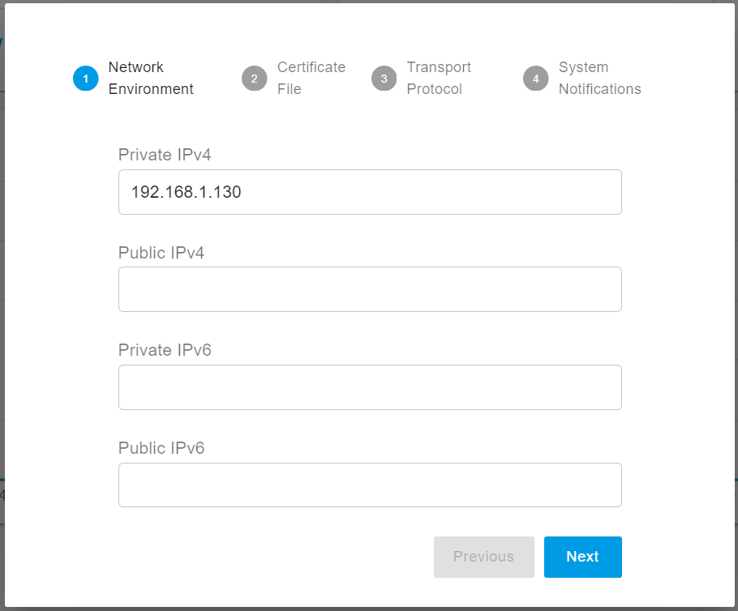<figcaption></figcaption></figure>

Once successfully completed the Setup Wizard, select the menu **Advanced > Settings > Advanced**, select the **Enable Call Recovery** option, and confirm by clicking on the **OK** button.

## Installing PortSIP IM Service

You are now ready to install the **PortSIP IM Service**. Please refer to the guide [**Installation of PortSIP IM Server**](../../portsip-pbx-administration-guide/1-installation-of-the-portsip-pbx/installation-of-portsip-pbx-v22/installation-of-the-portsip-im-server.md) for detailed steps to complete the installation.

## Managing PBX HA

Once you successfully configured the PortSIP PBX HA as per the above steps, you can use the following commands to manage the PBX HA.

All commands should be performed only on the **pbx01.**

### View PBX HA Status

```sh
cd /opt/portsip-pbx-ha-guide && sudo /bin/bash ha_ctl.sh status
```

The following output indicates that the PBX HA is working properly.

```
 drbd_attr    (ocf::linbit:drbd-attr):    Started pbx01
 Master/Slave Set: drbd_devpath-clone [drbd_devpath]
     Masters: [ pbx01 ]
     Slaves: [ pbx02 pbx03 ]
 vip    (ocf::heartbeat:IPaddr2):    Started pbx01
 src_pkt_ip    (ocf::heartbeat:IPsrcaddr):    Started pbx01
 datapath_fs    (ocf::heartbeat:Filesystem):    Started pbx01
 pbx    (ocf::portsip:pbx):    Started pbx01
```

### Restart PBX

Use the below command to restart the PBX.

```sh
cd /opt/portsip-pbx-ha-guide && sudo /bin/bash ha_ctl.sh restart -s pbx
```

The following output indicates that the PBX is successfully restarted.

```
try to restart resource pbx
disable resource pbx
resource 'pbx' is not running on any node
enable resource pbx
```


