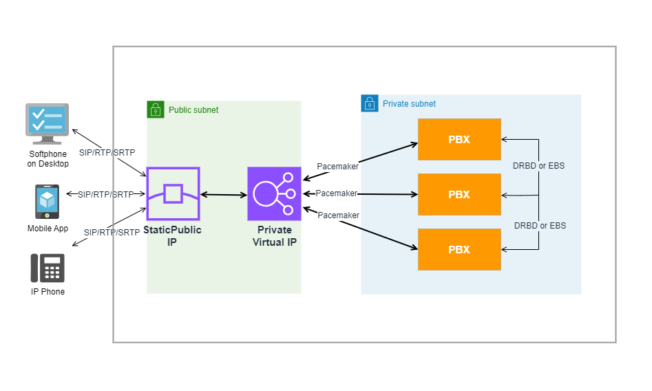

# PortSIP PBX High Availability Architecture

Make a high-availability cluster using three PortSIP PBX servers. PortSIP PBX can detect a variety of faults on one PBX server and automatically transfer control to the other server, the established calls will be recovered automatically.

**Figure 1-1**   PortSIP PBX HA Architecture

<figure><figcaption></figcaption></figure>

## PBX Node Failover with Virtual IP for LAN

As illustrated in the diagram above, the **PortSIP PBX** system is configured with three **PBX nodes** within the **LAN**. A **virtual IP** is assigned to float between two active PBX nodes, ensuring **high availability** and **failover protection** for your communication system.

**How It Works**

1.  **Virtual IP for Active Nodes:**

    The private **virtual IP** is shared among the three PBX nodes, ensuring that communication components such as **IVR servers** and **Queue servers** can communicate via the virtual IP. This setup guarantees **continuous service** even if one of the PBX nodes becomes unavailable, as the virtual IP will always point to an active node. The private virtual IP address is configured during you setup the PortSIP PBX HA.&#x20;
2.  **Static Public IP for Client Access:**

    A **static public IP** is configured to route incoming traffic to the **virtual IP**. When an **IP phone** or **client app** connects using this static public IP, the **SIP messages** are routed to the virtual IP, which in turn directs them to the currently active PBX node. This ensures that client devices consistently connect to the active PBX node, without manual configuration changes.
3.  **Pacemaker Monitoring and Failover:**

    The **Pacemaker** service continuously monitors the health of the active PBX node. If Pacemaker detects that the active node is unresponsive, it automatically triggers the **failover process**. This causes the virtual IP to "float" to another active PBX node, ensuring **uninterrupted service** and minimizing downtime in the event of a node failure.

## Pacemaker

The [Pacemaker](http://www.clusterlabs.org/) is a high-availability Cluster Resource Manager (CRM) that can be used to manage resources and ensure that they remain available in the event of a node failure.

The PortSIP PBX HA uses the [Pacemaker](http://www.clusterlabs.org/) to do the resource management and monitoring, once the event of PBX node failure, the resources will automatically move to a working node in the cluster.&#x20;

## DRBD

[DRBD ](https://linbit.com/drbd/)is used for High Availability purposes. It is a software product used to replicate data in real time from one server to another. This ensures business continuity even in the event of hardware failure.

The [DRBD ](https://linbit.com/drbd/)is utilized in the PortSIP HA scenario to synchronize data (DB, recording files, log files, and prompt files) between the PBX nodes.

To connect to the PBX service, all SIP clients (IP Phone, Softphone, Mobile App, WebRTC Client) will access the Virtual IP of PortSIP PBX in the HA scenario.

