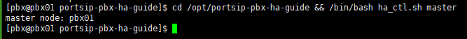

# Upgrading High Availability Installation


Before upgrading the PBX HA, please consult with PortSIP support to ensure the versions are compatible.


Please follow the below steps to upgrade your current PBX HA.

## Back up data

Before upgrading, please back up the PBX data.

1. Stop the PBX service

Perform the below command only on the **pbx01.**

```sh
cd /opt/portsip-pbx-ha-guide && sudo /bin/bash ha_ctl.sh stop -s pbx
```

2. Check the current master node

Perform the below command only on the **pbx01.**

```sh
cd /opt/portsip-pbx-ha-guide && sudo /bin/bash ha_ctl.sh master
```

For example, the below output indicates the current master node is **pbx01**.&#x20;

<figure><figcaption></figcaption></figure>

3. Back up data

Log in to the current master node, and back up the PBX data directory: `/var/lib/portsip`.

## Upgrading PortSIP PBX HA v16.x to v22.x

If you are currently running PortSIP PBX v16.x with High Availability (HA), follow these steps to upgrade to the latest version, v22.x.


Ensure you have backed up the current PBX data directory (`/var/lib/portsip`) as outlined in the backup steps.


### **1. Install the New PortSIP PBX v22.x HA**

Since PortSIP PBX v22.x HA only supports **Ubuntu 24.04**, you must rebuild the three PBX node servers. Choose one of the following methods:

* **Method 1**:\
  Prepare three new servers running Ubuntu 24.04. These servers must have the **same specifications**, **IP addresses**, and **hostnames** as the current three servers running v16.x. Install PortSIP PBX v22.x HA following the steps outlined in the [**High Availability Installation on Ubuntu**](./) guide.
* **Method 2**:\
  Destroy and then completely rebuild the current three servers running Ubuntu 20.04 by reinstalling them with Ubuntu 24.04. Then, install PortSIP PBX v22.x HA following the [**High Availability Installation on Ubuntu**](./) guide.

Choose the method that best suits your requirements to install the new PortSIP PBX v22.x HA.

### **2. Stop the PBX v22.x HA**

To proceed with the upgrade, stop the PBX service on the v22.x HA environment. Perform the following steps **only on pbx01**:

1.  Stop the HA services:

    ```bash
    cd /opt/portsip-pbx-ha-guide && sudo /bin/bash ha_ctl.sh stop -s pbx
    ```
2.  Verify the current master node:

    ```bash
    cd /opt/portsip-pbx-ha-guide && sudo /bin/bash ha_ctl.sh master
    ```

### **3. Migrate Data**

1. Log in to the current master node of your PortSIP PBX v16.x HA environment.
2. Copy the backup data from the v16.x environment to the data directory of the v22.x installation (`/var/lib/portsip`).

### **4. Start PortSIP PBX v22.x HA**

Start the upgraded PBX system by running the following command:

```bash
cd /opt/portsip-pbx-ha-guide && sudo /bin/bash ha_ctl.sh start -s pbx
```

The PortSIP PBX application will automatically upgrade the data during the startup process.

## Upgrading PortSIP PBX v22.x HA to the Latest Version

If you currently running the PortSIP PBX v22.x HA, please follow the below steps to upgrade it to the latest version.

### 1. Download and update resources

Perform the below command only on the **pbx01.**

```sh
  cd /opt && rm -rf portsip-pbx-ha-guide-22-online.tar.gz && \
  sudo wget -N https://www.portsip.com/downloads/ha/v22/portsip-pbx-ha-guide-22-online.tar.gz \
  && sudo tar xf portsip-pbx-ha-guide-22-online.tar.gz
```

### **2. Update**

Use the new version image of PortSIP PBX to update the PBX.


Please contact PortSIP support to obtain the **\<PortSIP PBX new version image>** before upgrading.


Perform the below command only on the **pbx01.**

<pre class="language-sh"><code class="lang-sh"><strong>cd /opt/portsip-pbx-ha-guide/ &#x26;&#x26; sudu /bin/bash update.sh &#x3C;PortSIP PBX new version image>
</strong></code></pre>

For example:

```sh
cd /opt/portsip-pbx-ha-guide/ && sudo /bin/bash update.sh portsip/pbx:22
```

