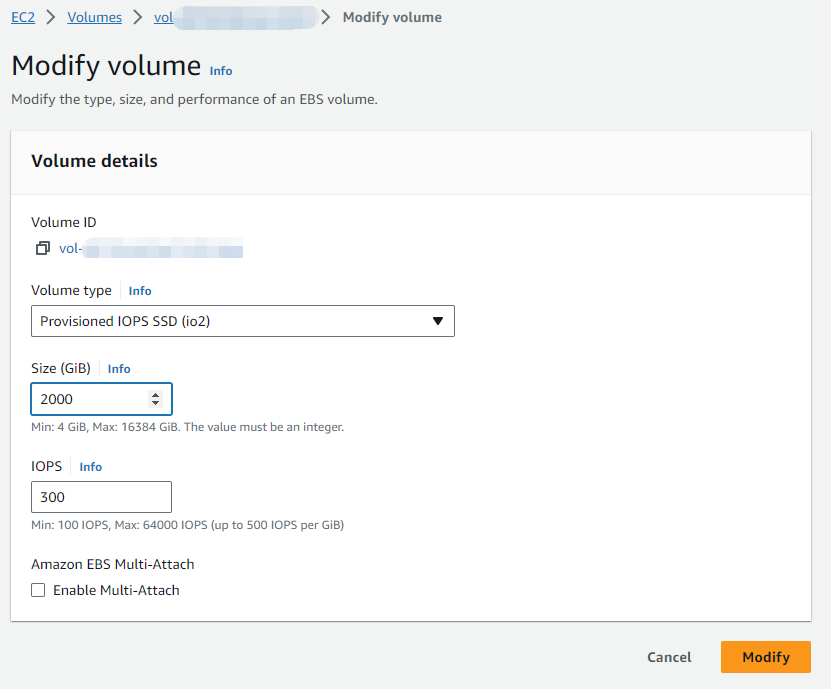

# Increase Size of EBS Volume

With the growth of your business, there might be a need to increase the size of your [EBS ](https://docs.aws.amazon.com/AWSEC2/latest/UserGuide/AmazonEBS.html)volume. This would allow your PortSIP PBX HA to support a larger number of users, process more calls, and store more recording files. This guide provides step-by-step instructions on how to increase the size of an AWS [EBS ](https://docs.aws.amazon.com/AWSEC2/latest/UserGuide/AmazonEBS.html)volume.

## Prerequisites

* The PortSIP PBX HA must be successfully configured as the article: [High Availability Installations on AWS](high-availability-installations-on-aws.md).

## **Back-up EBS**&#x20;

Before you proceed with increasing the size of your EBS volume, it's recommended to create a snapshot of the EBS. This will back up your PBX data, providing a safety net that allows you to roll back if any issues arise during the resizing process.

Please follow the below steps to process.

* Sign in to the AWS EC2 console.&#x20;
* In the navigation panel, select **Elastic Block Store**, and choose **Volumes**. &#x20;
* Find the volume that is being used in HA and select its checkbox.&#x20;
* Click on **Actions**, then select **Create snapshot**. In the **Description** field, enter **pbx-ha-volumes-backup**.&#x20;
* Click on **Create snapshot**.

<figure><figcaption></figcaption></figure>

## Increase Size of EBS Volume

Please follow the steps below to increase the EBS volume size to **2000GB** as an example:

1. Sign in to the AWS EC2 console. In the navigation pane, select **Elastic Block Store**, then choose **Volumes**.&#x20;
2. Find the volume that is being used in HA and select its checkbox. Click on **Actions**, then select **Modify volume**.&#x20;
3. The **Modify volume** screen will display the volume ID and the current configuration of the volume, including type, size, input/output operations per second (IOPS), and throughput.&#x20;
   * For the **Volume type**, do not change the value.
   * For **Size**, change it to 2000 GB.&#x20;
   * For **IOPS**, do not change the value.&#x20;
   * For **Throughput**, do not change the value.&#x20;
4. Click on **Modify.** When prompted for confirmation, choose **Modify** again.

<figure><figcaption></figcaption></figure>

## Extend the File System <a href="#extend-the-file-system" id="extend-the-file-system"></a>

Perform the below command on the PBX HA EC2 instance **ip-172-31-16-133** only.

```
cd /opt/portsip-pbx-ha-guide && /bin/bash extend.sh run -s disk-only
```


