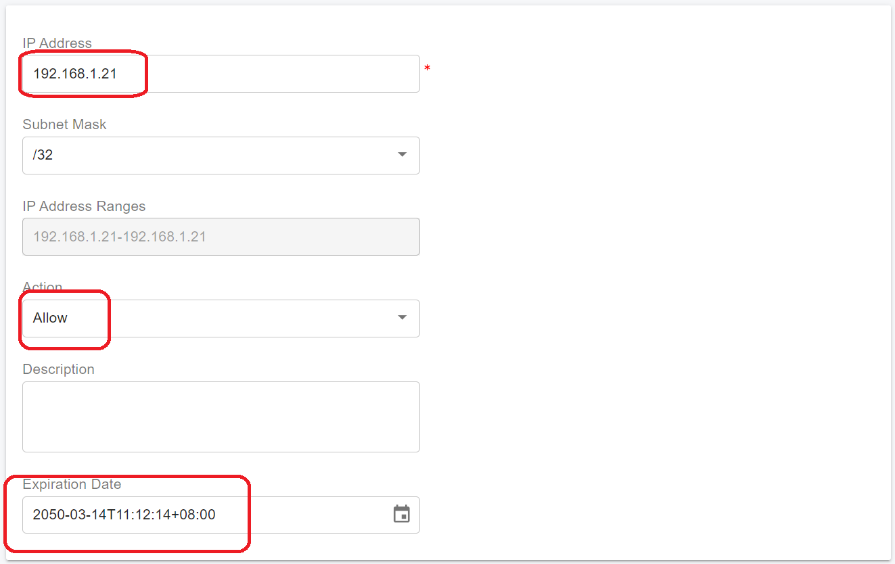

# Configuring Cluster Servers

In this guide, we will assume that the following servers are being installed for the cluster:

* **Main Server**: Install the PBX with an IP address of **192.168.1.20**.
* **Server 1**: Install a media server with a private IP address of **192.168.1.21** and a static public IP of **104.101.137.60**.
* **Server 2**: Install a queue server with an IP address of **192.168.1.22**.
* **Server 3**: Install a meeting server with an IP address of **192.168.1.23**.
* **Server 4**: Install an IVR server with an IP address of 1**92.168.1.24**.
* **Server 5**: Install an IM server with a static private IP address of 1**92.168.1.25,** and a static public IP address of **104.18.36.110.**


A server can only deploy one type of PortSIP server at a time. For instance, it's not allowed to deploy both the media server and queue server simultaneously on **Server 1**.


## Setup the PortSIP PBX

Before configuring the cluster servers, please ensure that you have completed the PBX installation and configuration on the **Main Server** by following the guide for [Installation of the PortSIP PBX](/broken/pages/iSgqciZUHcGkgwJ7MeW5) to install it.


Note: In this step, just need to install the PBX only, is no need to install the IM server at this stage, as it will be installed later in this guide.



All commands must be executed in the **`/opt/portsip`** directory.


## Configure the Firewall

It is necessary to create firewall rules on the **Main Server** that allow the cluster servers to access the PBX server (**Main Server**).&#x20;

To configure these firewall rules, please perform the following commands on the PBX server (**Main Server**).

```sh
sudo firewall-cmd --permanent --zone=trusted --add-source=192.168.1.21
sudo firewall-cmd --permanent --zone=trusted --add-source=192.168.1.22
sudo firewall-cmd --permanent --zone=trusted --add-source=192.168.1.23
sudo firewall-cmd --permanent --zone=trusted --add-source=192.168.1.24
sudo firewall-cmd --permanent --zone=trusted --add-source=192.168.1.25
sudo firewall-cmd --reload
```

To verify that the rule has been created correctly, you can use the following command:

```sh
sudo firewall-cmd --zone=trusted --list-all
```

The correct output should be like below:

```sh
[ubuntu@localhost ~]$ sudo firewall-cmd --zone=trusted --list-all
trusted (active)
  target: ACCEPT
  icmp-block-inversion: no
  interfaces: 
  sources: 192.168.1.21 192.168.1.22 192.168.1.23 192.168.1.24 192.168.1.25
  services: 
  ports: 
  protocols: 
  forward: yes
  masquerade: no
  forward-ports: 
  source-ports: 
  icmp-blocks: 
  rich rules:
```

To allow the entire C class address to access the PBX server (**Main Server**), you can use the following commands:

```sh
sudo firewall-cmd --permanent --zone=trusted --add-source=192.168.1.0/24  
sudo firewall-cmd --reload
```

In the future, if you add more servers to the existing cluster, you will need to create firewall rules to allow those servers’ IP addresses to access the PBX server (**Main Server**), just like the rules mentioned above.

## Configuring the IP Address Whitelist


This step is mandatory; without it, the service will not work.


To prevent the PBX from limiting the cluster servers' request rate, we need to add the cluster servers' IPs to the whitelist in the PBX.&#x20;

To do this, please follow the below steps:

1. Sign in to the PBX web portal as the System Administrator
2. Select the menu **IP Blacklist** > **Add**.&#x20;
3. Enter the cluster server IP as shown in the screenshot below and choose a long **expiration date.**
4. Repeat the above steps for each cluster server.

<figure><figcaption></figcaption></figure>

## Add the Cluster Servers

To add the cluster servers in the web portal, sign in to the PBX Web portal as the system administrator.

### Disable Default Servers

The PortSIP PBX installation comes with default media, queue, meeting, and IVR servers. We recommend disabling these default servers so that the **Main Server** only handles SIP signaling, allowing it to support more users and calls.&#x20;

To do this, please select the **Servers** menu, expand each server type(media servers, queue servers, meeting servers, IVR servers), and turn off the default server as the below screenshot shows up.

**Note:** The IM Server is no need to disabled.

<figure><figcaption></figcaption></figure>

### Add Media Server

To add a new media server, select the **Servers > Media Servers** menu, click the **Add** button, enter the server information as shown in the screenshot then click the **OK** button to save it. Please remember the server name "**media-server-1**", we will use it in a later step.


If your PBX is deployed for internet users to access, it is essential to assign a static public IP to the extended media server. Enter the static IP address as shown in the screenshot below.


Suggest don't set the Maximum of call sessions to more than 5,000.

<figure><figcaption></figcaption></figure>

### Install Media Server

Please go to **Server 1** (whose IP address is **192.168.1.21**) to install the media server.&#x20;

Make sure you have followed the guide for [Preparing Cluster Servers](preparing-cluster-servers.md) on **Server 1**.

To install the media server, execute the following commands and pay close attention to the parameters:

* `-a 192.168.1.21`: This specifies the private IP of **Server 1**.
* `-x 192.168.1.20`: This specifies the private IP of the PBX Server (**Main Server**).
* `-s media-server-only`: This indicates that only the media server should be installed.
* `-n media-server-1`: This specifies the name of the media server, which must be the same as the name entered on the PBX Web portal in the previous step.

```sh
cd /opt/portsip
sudo /bin/sh cluster_ctl.sh \
run -p /var/lib/portsip \
-a 192.168.1.21 \
-x 192.168.1.20 \
-i portsip/pbx:22 \
-s media-server-only \
-n media-server-1
```


If your media server is hosted on a cloud platform such as AWS or Azure, you will need to create a network rule in the cloud platform to allow the following ports:

* `35000 - 65000`: UDP


You can repeat the above steps to set up more media servers. Just make sure to use a different IP address and server name for each one.


If you set up multiple media servers, they must not use the same server name or IP address. Especially, you must ensure that the server name specified in the commands matches the one entered on the web portal.


### Add Queue Server

To add a new queue server, select the **Servers > Queue Servers** menu, click the **Add** button, enter the server information as shown in the screenshot then click the **OK** button to save it. Please remember the server name "**queue-server-1**", we will use it in a later step.

<figure><figcaption></figcaption></figure>

### Install Queue Server

Please go to **Server 2** (whose IP address is **192.168.1.22**) to install the queue server.&#x20;

Make sure you have followed the guide for [Preparing Cluster Servers](preparing-cluster-servers.md) for **Server 2**.

&#x20;To install the queue server, execute the following commands and pay close attention to the parameters:

* `-a 192.168.1.22`: This specifies the private IP on **Server 2**.
* `-x 192.168.1.20`: This specifies the private IP of the PBX Server (**Main Server**).
* `-s queue-server-only`: This indicates that only the queue server should be installed.
* `-n queue-server-1`: This specifies the name of the queue server, which must be the same as the name entered on the PBX Web portal in the previous step.

```sh
cd /opt/portsip
sudo /bin/sh cluster_ctl.sh \
run -p /var/lib/portsip \
-a 192.168.1.22 \
-x 192.168.1.20 \
-i portsip/pbx:22 \
-s queue-server-only \
-n queue-server-1
```

You can repeat the above steps to set up more queue servers. Just make sure to use a different IP address and server name for each one.


If you set up multiple queue servers, they must not use the same server name or IP address. Especially, you must ensure that the server name specified in the commands matches the one entered on the web portal.


### Add Meeting Server

To add a new meeting server, select the **Servers > Meeting Servers** menu, click the **Add** button, enter the server information as shown in the screenshot then click the **OK** button to save it. Please remember the server name "**meeting-server-1**", we will use it in a later step.

<figure><figcaption></figcaption></figure>

### Install Meeting Server

Please go to **Server 3** (whose IP address is **192.168.1.23**) to install the meeting server.&#x20;

Make sure you have followed the guide for [Preparing Cluster Servers](preparing-cluster-servers.md) on **Server 3**.

&#x20;To install the meeting server, execute the following commands and pay close attention to the parameters:

* `-a 192.168.1.23`: This specifies the private IP of **Server 3**.
* `-x 192.168.1.20`: This specifies the private IP of the PBX Server (**Main Server**).
* `-s meeting-server-only`: This indicates that only the meeting server should be installed.
* `-n meeting-server-1`: This specifies the name of the meeting server, which must be the same as the name entered on the PBX Web portal in the previous step.

```sh
cd /opt/portsip
sudo /bin/sh cluster_ctl.sh \
run -p /var/lib/portsip \
-a 192.168.1.23 \
-x 192.168.1.20 \
-i portsip/pbx:22 \
-s meeting-server-only \
-n meeting-server-1
```

You can repeat the above steps to set up more meeting servers. Just make sure to use a different IP address and server name for each one.


If you set up multiple meeting servers, they must not use the same server name or IP address. Especially, you must ensure that the server name specified in the commands matches the one entered on the web portal.


### Add IVR Server

To add a new IVR server, select the **Servers > IVR Servers** menu, click the **Add** button, enter the server information as shown in the screenshot then click the **OK** button to save it. Please remember the server name "**vr-server-1**", we will use it in a later step.

<figure><figcaption></figcaption></figure>

### Install IVR Server

Please go to **Server 4** (whose IP address is **192.168.1.24**) to install the IVR server.&#x20;

Make sure you have followed the guide for [Preparing Cluster Servers](preparing-cluster-servers.md) on **Server 4**.

To install the IVR server, execute the following commands and pay close attention to the parameters:

* `-a 192.168.1.24`: This specifies the private IP of **Server 4**.
* `-x 192.168.1.20`: This specifies the private IP of the PBX Server (**Main Server**).
* `-s vr-server-only`: This indicates that only the meeting server should be installed.
* `-n vr-server-1`: This specifies the name of the IVR server, which must be the same as the name entered on the PBX Web portal in the previous step.

```sh
cd /opt/portsip
sudo /bin/sh cluster_ctl.sh \
run -p /var/lib/portsip \
-a 192.168.1.24 \
-x 192.168.1.20 \
-i portsip/pbx:22 \
-s vr-server-only \
-n vr-server-1
```

You can repeat the above steps to set up more IVR servers. Just make sure to use a different IP address and server name for each one.


If you set up multiple IVR servers, they must not use the same server name or IP address. Especially, you must ensure that the server name specified in the commands matches the one entered on the web portal.


### Installing IM Server

Currently, the IM server does not support cluster installations; it can be deployed as a standalone server. It can support up to 50,000 online users with a powerful CPU and memory(16 cores, 16GB).

The following hardware specifications are suitable for supporting up to 50,000 users online, with messaging and file sharing:

* **CPU**: 20 cores or higher
* **Memory**: 16 GB
* **Disk**: High I/O performance required (SSD recommended, at least 256 GB)
* **Network Bandwidth**: 1000 Mbps or higher, particularly if handling high volumes of messages and file sharing.
* **Static private IP**: You must configure a static private IP for this IM server. In this case, we assume it's **192.168.1.25.**
* **Static public IP:** If your PBX and IM server are located in the cloud for the internet users to access, you must have a static public IP for this IM service. In this case, we assume it's **104.18.36.110.**

#### Generate a Token for the IM Server

* Log in to the PortSIP PBX Web portal as the System Administrator.
* Go to **Servers > IM Servers**.
* Select the default server and click **Generate Token**.
* Copy the generated token for later use.

<figure><figcaption></figcaption></figure>

#### Create and Run Instant Messaging Docker Instance

Use the following command to create the Instant Messaging (IM) service Docker instance in the server which has the IP **192.168.1.25**. Replace each parameter with your actual values:

* **-E**: Specifies that the IM server is installed in extended mode (required).
* **-p**: Specifies the path for storing IM service data (required).
* **-a**: Specifies the private IP address of this IM server. If this parameter is omitted, the **-A** parameter must be specified.
* **-A**: Specifies the public IP address of this IM server. If this parameter is omitted, the **-a** parameter must be specified. If you install the IM server on a **separate server in the cloud, this parameter must be specified**. Otherwise, it can be ignored. In this case is **104.18.36.110**.
* **-i**: Specifies the PBX Docker image version (required).
* **-x**: Indicates the main PBX server's IP address (typically the private IP of the main PBX server) (required).
* **-t**: Provides the token generated and copied in the previous step (required).
* **-f**: Specifies the path for storing files sent in chats. This path must differ from the one specified with **-p**. If omitted, chat files will be stored in the path specified by **-p**.


```sh
sudo /bin/sh im_ctl.sh run -E \
-p /var/lib/portsip/ \
-a 192.168.1.25 \
-A 104.18.36.110 \
-i portsip/pbx:22 \
-x 192.168.1.20 \
-t MJC4NZBLYTGTZTJJNS0ZMWZHLWIXZDCTZJLLMDEWZJHKZTAY
```


For example, if you want to store the chat files in the path `/chat/files`, please ensure this path is already existing, then use the below command (please pay attention to the **-f** parameter.) to create the Instant Messaging (IM) service Docker instance on the IM server (IP **192.168.1.25)**. Replace each parameter with your actual values:

```sh
sudo /bin/sh im_ctl.sh run -E \
-p /var/lib/portsip/ \
-f /chat/files/ \
-a 192.168.1.25 \
-A 104.18.36.110 \
-i portsip/pbx:22 \
-x 192.168.1.20 \
-t MJC4NZBLYTGTZTJJNS0ZMWZHLWIXZDCTZJLLMDEWZJHKZTAY
```


If your Instant Messaging (IM) server is hosted in the cloud (e.g., AWS), you must ensure that TCP port 8887 is open in the cloud firewall rules. The client application requires access to this port in order to send and receive messages.


## Restarting Servers

After completing adding the cluster servers, now go to restart the servers to make them up.

### Restart the Main PBX server

Perform the following command on the PBX Server (**Main Server**) to restart the service.

```sh
cd /opt/portsip
sudo /bin/sh pbx_ctl.sh restart
```

### Restart the Resource Load Balancer

Perform the following command on the PBX Server (**Main Server**) to restart the resource load balancer.

```sh
cd /opt/portsip
sudo /bin/sh pbx_ctl.sh restart -s loadbalancer
```

### Restart Media Servers

Go to each media server, and perform the below commands to restart the service.

```sh
cd /opt/portsip
sudo /bin/sh cluster_ctl.sh restart -s media-server-only
```

### Restart Queue Servers

Go to each queue server, and perform the below commands to restart the service.

```sh
cd /opt/portsip
sudo /bin/sh cluster_ctl.sh restart -s queue-server-only
```

### Restart Meeting Servers

Go to each meeting server, and perform the below commands to restart the service.

```sh
cd /opt/portsip
sudo /bin/sh cluster_ctl.sh restart -s meeting-server-only
```

### Restart IVR Servers

Go to each IVR server, and perform the below commands to restart the service.

```sh
cd /opt/portsip
sudo /bin/sh cluster_ctl.sh restart -s vr-server-only
```

Now all cluster servers have been successfully up, you can check their status on the PBX Web Portal by going to the **Servers** menu,  if everything has been set up correctly, the server status will be displayed as "**Online**".

### Restart the IM Server

Go to the IM server, and perform the below commands to restart the service (**please ensure the Main PBX service is started**).

```sh
cd /opt/portsip
sudo /bin/sh im_ctl.sh restart
```

## SBC Cluster

To deploy the SBC cluster, please follow this topic [Deploy the SBC Cluster](../portsip-pbx-administration-guide/11-deploy-the-sbc-cluster.md).

