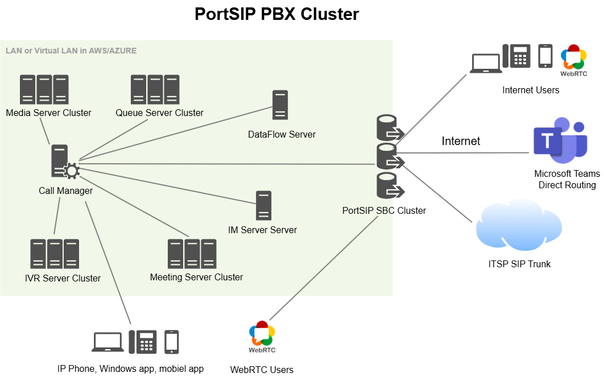
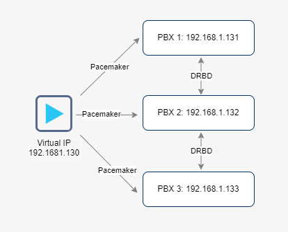

# Topology

Traditional PBX systems place heavy demands on server resources: CPU, memory, disk I/O, and network bandwidth when handling large volumes of concurrent calls, meetings, queue traffic, IVR interactions, and real-time media processing. As concurrency grows, single-node deployments quickly become a bottleneck, making a clustered architecture essential for scalability, performance, and reliability.

PortSIP PBX is designed from the ground up with a **distributed, service-oriented architecture**. At the core is a centralized **Call Manager**, dedicated exclusively to SIP signaling and call control, while specialized functional servers—such as Media, Meeting, Queue (ACD), IVR, Instant Messaging, and DataFlow—operate independently and scale horizontally as a cluster.

This architecture cleanly separates signaling from media and application workloads, enabling efficient resource utilization, predictable performance, and seamless horizontal scaling across large deployments.

***

### Scalability and Capacity

The PortSIP PBX cluster architecture is engineered for carrier-grade environments and can support:

* Over 1 million users
* Approximately 100,000 concurrent online users (registered or signed in)
* Up to 10,000 simultaneous calls

***

### Cluster Architecture Components

The diagram below illustrates the overall PortSIP PBX cluster topology. Each component plays a distinct role in ensuring scalability, performance, and operational resilience.

<figure><figcaption></figcaption></figure>

#### Call Manager Server

The Call Manager is the central control plane of the system. It is deployed together with the PBX core services, database, and load-balancing logic, and is responsible for:

* SIP signaling and call control
* Registration and authentication
* Routing logic and policy enforcement
* Coordination of all backend service nodes

By isolating signaling from media processing, the Call Manager ensures stable call control even under heavy load.

***

#### Media Servers

Media Servers handle real-time media processing, including RTP streams, transcoding, recording, and tone generation.

* Can be deployed as a single server or as a scalable cluster
* Calls are dynamically load-balanced by the Call Manager
* Additional Media Servers can be added at any time to increase capacity

This design allows media workloads to scale independently of signaling.

***

#### IVR Servers

IVR Servers process interactive voice response logic, prompts, and DTMF input.

* Can be deployed standalone or as a clustered service
* IVR sessions are load-balanced across available servers
* Capacity can be expanded by adding more IVR Servers as required

***

#### Queue Servers (ACD)

Queue Servers manage contact center queue logic, including call distribution, agent state handling, and queue metrics.

* Support single-server or clustered deployment
* Load balancing ensures queues are evenly distributed
* Additional servers can be added seamlessly as traffic grows

***

#### Meeting Servers

Meeting Servers are responsible for audio and video conferencing workloads.

* Meetings are dynamically distributed across the cluster
* Capacity scales horizontally by adding more Meeting Servers
* Ensures consistent performance for large or concurrent meetings

***

#### Instant Messaging (IM) Servers

IM Servers provide real-time messaging and collaboration services.

* Typically deployed on a single high-performance server
* Can support up to **50,000 concurrent online users**
* Optimized for high-throughput messaging workloads

***

#### DataFlow Servers

DataFlow Servers power analytics, reporting, dashboards, and real-time metrics.

* Usually deployed on a dedicated, high-performance server
* Designed for high-volume data ingestion and fast query performance
* Provides real-time visibility into call activity and system performance

***

### Cluster Architecture with High Availability (HA)

For customers requiring maximum uptime and fault tolerance, PortSIP PBX supports a **High Availability (HA) cluster architecture**.

<figure><figcaption></figcaption></figure>

#### Call Manager Servers (HA)

In an HA deployment:

* **Three Call Manager servers** are deployed in an HA configuration
* A **Virtual IP (VIP)** is exposed to client apps, IP phones, and backend services
* SIP signaling continues seamlessly even if one Call Manager fails

<figure><figcaption></figcaption></figure>

This ensures continuous service availability and eliminates single points of failure in the control plane.

Detailed design and deployment guidance is available in the [PortSIP PBX High Availability Architecture](../high-availability-v22.x/) documentation.

***

#### Media Servers (HA)

* Media Servers are continuously monitored by the Call Manager
* If a Media Server fails, active calls are automatically reassigned to available servers
* No manual intervention is required for call recovery

***

#### IVR Servers (HA)

* If an IVR Server becomes unavailable, administrators receive an email alert
* The failed server can be disabled through the PBX web portal
* IVR traffic is automatically redistributed to remaining servers

***

#### Queue Servers (HA)

Queue Servers follow the same high-availability behavior as IVR Servers:

* Automatic failure detection
* Email alerts to administrators
* Manual disablement via the web portal
* Automatic reassignment of queue workloads

***

#### Meeting Servers (HA)

* Meeting Server failures trigger administrator notifications
* The failed server can be disabled through the PBX web portal
* Active and new meetings are redirected to healthy servers

***

#### IM Servers (HA)

* IM Servers support up to 50,000 online users per high-performance node
* In HA deployments, multiple IM Servers ensure uninterrupted messaging services
* Failures do not disrupt user messaging sessions

***

#### DataFlow Servers (HA)

* DataFlow Servers provide analytics and real-time metrics
* Typically deployed on powerful dedicated hardware
* Designed for continuous availability and high data throughput

***

### Summary

PortSIP PBX’s cluster and HA architecture delivers:

* True horizontal scalability
* Clear separation of signaling, media, and application workloads
* Carrier-grade reliability and fault tolerance
* Simple, incremental expansion without service disruption

This architecture makes PortSIP PBX an ideal platform for service providers, enterprises, and UCaaS operators building large-scale, high-performance communication services.

