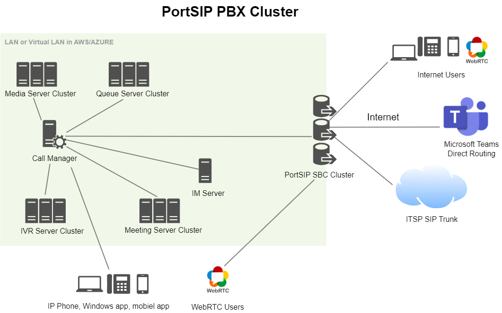

# Topology

Typically, PBX systems face significant hardware demands—including CPU, memory, and bandwidth—when managing a high volume of simultaneous calls, meetings, queue calls, and IVR interactions. To handle these scenarios effectively, PBX systems often require deployment in a clustered architecture.

PortSIP streamlines this process by leveraging a centralized Call Manager server dedicated exclusively to SIP signaling, while specialized media servers, meeting servers, queue servers, Instant Messaging servers, and IVR servers operate as a cluster. This distributed architecture efficiently manages media, recording, ACD, messaging, and other call processing tasks, ensuring optimal resource utilization and effortless scalability.

The PortSIP PBX Cluster topology is built to support over 1 million users, approximately 50,000 concurrent online users (registered or signed-in), and up to 10,000 simultaneous calls. For service providers requiring the capacity to serve more than 50,000 concurrent users, we recommend exploring our advanced PortSIP UCaaS solution for unmatched scalability and performance.

## Cluster Architecture Overview

The diagram below illustrates the PBX cluster architecture. Here’s how each component works:

<figure><figcaption></figcaption></figure>

* **Call Manager Server**\
  The main server is deployed with the PBX Call Manager, Database, and Load Balancer. It primarily handles SIP signaling and database operations.
* **Media Servers**\
  Media Servers can be deployed as a single server or in a cluster. The Call Manager dynamically load-balances calls across the available media servers. As your business scales, you can easily add more media servers.
* **IVR Servers**\
  IVR Servers function similarly to Media Servers. They can be deployed individually or as a cluster. The load balancer assigns IVRs to the available servers. Additional servers can be added as needed.
* **Queue Servers**\
  Queue Servers, like Media and IVR servers, can be deployed as a single server or a cluster. The load balancer ensures that call queues are managed across the available servers. More servers can be added as your needs grow.
* **Meeting Servers**\
  Meeting Servers handle virtual meetings, and like the other servers, they can be scaled by adding more servers to the cluster. The load balancer ensures meetings are distributed effectively.
* **IM Servers**\
  IM Servers, while typically deployed on a single server, can support up to 50,000 online users with powerful server hardware.

## Cluster with High Availability (HA) Architecture

For customers requiring enhanced reliability, the **HA architecture** provides high availability by deploying multiple Call Manager Servers and ensuring fault tolerance.

<figure><figcaption></figcaption></figure>

* **Call Manager Server**\
  In this architecture, three Call Manager servers are deployed with high availability (HA) support. A **Virtual IP** is exposed for access by other server components, client apps, and IP phones. This setup provides seamless SIP signaling management and guarantees continuous service in case of server failure. \
  The diagram below provides detailed information about the **Call Manager HA** component, as referenced in the above **PortSIP PBX** **HA Cluster** diagram.&#x20;

Further details can be found in the [PortSIP PBX High Availability Architecture](../high-availability-v16.x/high-availability-for-on-premise/portsip-pbx-high-availability.md) documentation.

<figure><figcaption></figcaption></figure>

* **Media Servers**\
  Media Servers in the HA cluster are managed by the Call Manager, which dynamically reassigns calls from any failed media server to available ones. If a media server becomes unavailable, the call manager will automatically reassign the calls of this server to another available media server.
* **IVR Servers**\
  IVR Servers are deployed similarly to Media Servers. If an IVR server is down, the system administrator is notified via email and can disable that server through the PBX web portal. The load balancer will then reassign IVR tasks to other active servers.
* **Queue Servers**\
  Queue Servers follow the same behavior as IVR Servers. In case of a server is down, the system sends an email alert to the administrator. The PBX web portal allows administrators to disable the failed server, with the load balancer reassigning tasks to another available server.
* **Meeting Servers**\
  For Meeting Servers, it operates similarly. If a Meeting Server fails, the administrator receives an alert and can disable it via the PBX web portal. Meetings are automatically reassigned to other active servers in the cluster.
* **IM Servers**\
  The IM Server can handle up to 50,000 online users when deployed on high-performance hardware. In an HA configuration, IM servers ensure that messaging services remain uninterrupted, even in the event of server failure.

