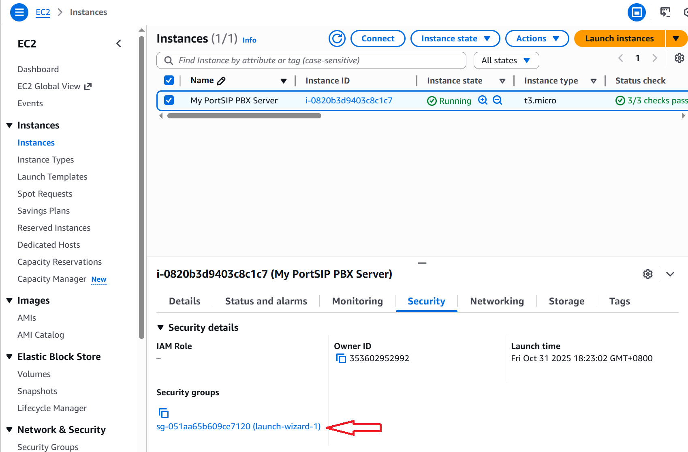
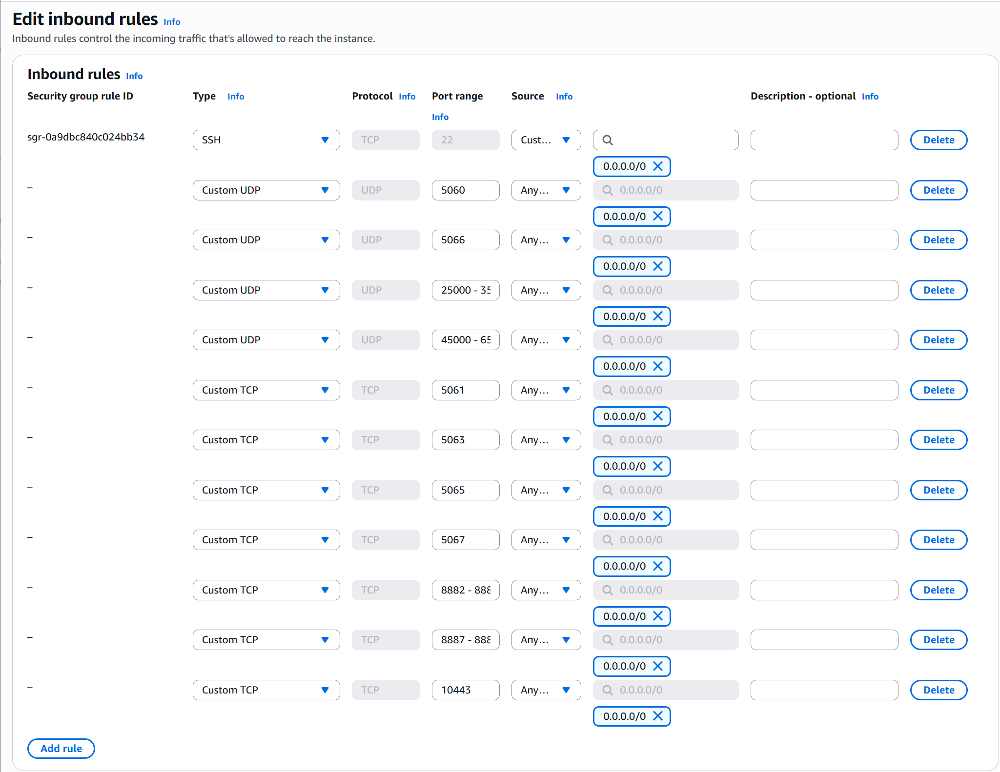
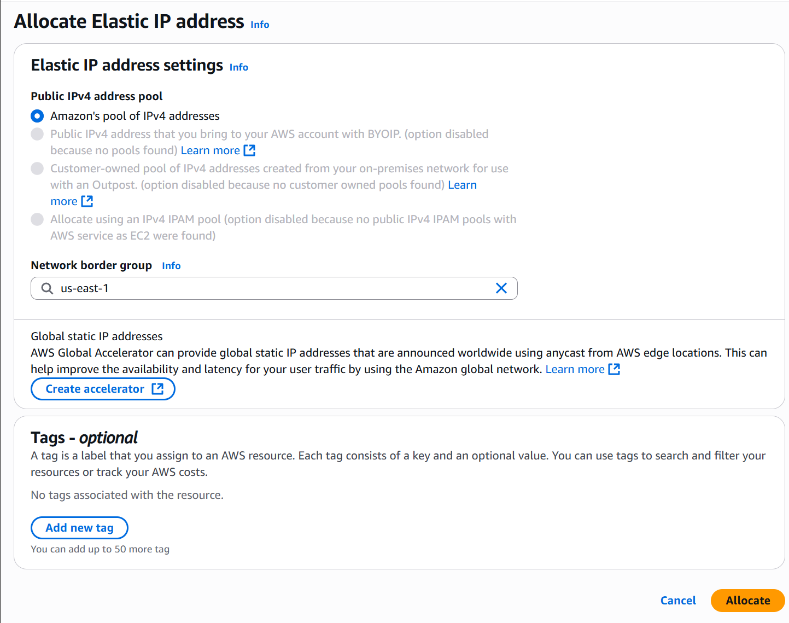
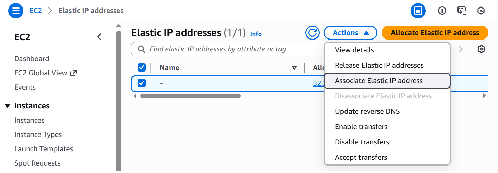
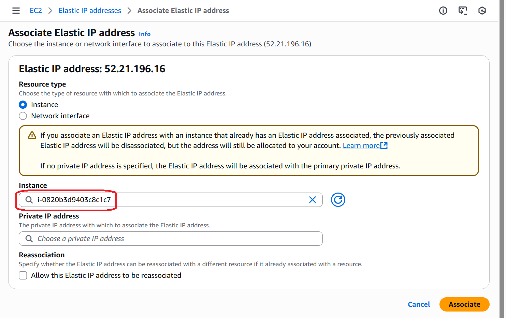

# Prepare the AWS Environment for Deployment

If you plan to deploy PortSIP PBX on Amazon Web Services (AWS), follow the steps below to prepare the EC2 instance, Elastic IP, and security groups.

***

### 1. Sign in to the AWS Console

1. Log in to your AWS Management Console.
2. Select the desired region and availability zone where you want to deploy the PortSIP PBX instance.

### 2. Launch an EC2 Instance

1. Open the **EC2 Dashboard**.
2. Navigate to menu **Instances > Instances**.
3. Click **Launch instances** in the upper-right corner.
4. The **Launch an instance** configuration page will appear.

### 3. Choose the Operating System and Instance Type

* Under **Name and tags**, assign a friendly name, such as `PortSIP PBX Server`.
* In the **Application and OS Images (Amazon Machine Image)** section, choose **Ubuntu 24.04**.
* In the **Instance type** section, select an instance, such as `m3.large` or another type (`m6i.large`, `m7i.large`) as your requirements. Ensure that the **architecture** is set to **64-bit (x86)**.

<figure><figcaption></figcaption></figure>

### 4. Generate a Key Pair

AWS requires an SSH key pair for secure access to your instance.

* If you already have an existing SSH key pair, select it from the **Key pair (login)** drop-down list.
* If not, click **Create new key pair,** in the Create key pair page:
  1. Enter a friendly name for the key pair.
  2. Keep the default settings.
  3. Click **Create key pair**.
  4. Save the downloaded `.pem` key file securely to your computer.

Please reference the screenshot below:

<figure><figcaption></figcaption></figure>

### 5. Configure Network Settings

* In the **Network settings** section:
  * If this is your first PortSIP PBX deployment, choose **Create security group** to automatically create a new one.
  * If you already have an existing security group for PortSIP PBX, choose **Select existing security group** and select it.
* Keep all other network parameters at their default values.

### 6. Configure Storage

* Allocate **at least 50 GB** of storage for the root volume.
* If you plan to store large numbers of call recordings, increase the disk size as needed.
  * As a general guideline, 1 MB of disk space is required for every 1-minute audio recording.
  * Calculate the total required capacity based on your call volume and retention period.

<figure><figcaption></figcaption></figure>

Click **Launch instance** to start your EC2 server.

### 7. Configure the Security Group

1. Navigate to **EC2 > Instances** and select your newly created instance.
2. Select the **Security** tab at the bottom to view the associated security group (In case it's `sg-051aa65b609ce7120 (launch-wizard-1)`).
3. Click the security group link to open its details.

Please refer to the screenshot below.

<figure><figcaption></figcaption></figure>


1. Under the **Inbound rules** tab, click **Edit inbound rules**.
2. Add the following rules required by PortSIP PBX:
   1. UDP: 5060; 5066; 25000-35000;45000-65000
   2. TCP: 5061;5063;5065; 5067; 8882-8883;8887-8889;10443
   3. Please keep the default SSH  rule for port 22; do not edit it

> **UDP 25000–35000**: Used by the SBC. Skip this rule if the SBC is hosted on a separate server.
> \
> **UDP 45000–65000**: Used by the PBX media server. Skip this rule if the media server runs on a separate host.

<figure><figcaption></figcaption></figure>


Click **Save rules** to apply the changes.

These rules ensure that SIP signaling, RTP media, and management access function properly.

### 8. Allocate and Associate an Elastic IP

A **static public IP address** is required to ensure that SIP devices and external services can always reach your PBX.

1. In the left navigation pane, go to the menu **Network & Security > Elastic IPs**.
2. Click **Allocate Elastic IP address** in the upper-right corner.
3. Keep all default settings and click **Allocate**. See the screenshot below.

<figure><figcaption></figcaption></figure>


Back to the menu **Network & Security > Elastic IPs**, the allocated Elastic IP is listed, select that new Elastic IP, then click the **Actions** button and choose the **Associate Elastic IP address** from the pop-up menu.

<figure><figcaption></figcaption></figure>

On the **Associate Elastic IP address** page:

* In the **Instance** field, choose your PortSIP PBX EC2 instance.
* Click **Associate**.

<figure><figcaption></figcaption></figure>

Your EC2 instance now has a persistent public IP address. You can use the SSH client to connect to the EC2 instance by this elastic IP address.&#x20;

### 9. Verification

After associating the Elastic IP address and applying the security rules:

* Your EC2 instance now has a **fixed public IP address**.
* All necessary ports are open for **SIP signaling**, **RTP media**, and **web access**.

To connect to your instance using an SSH client:

1. Use the **default username**: `ubuntu`
2. Select the **SSH key pair** that you created and downloaded in the previous step for authentication.
3.  Example connection command:

    ```bash
    ssh -i /path/to/your-key.pem ubuntu@<Elastic-IP>
    ```

Your **AWS environment** is now fully prepared for the PortSIP PBX deployment.

You can proceed to the next section:[ **Installing PortSIP PBX**](1-installation-of-the-portsip-pbx-1/).

