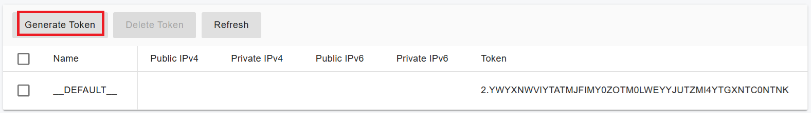

# Install Data Flow Service

### Instructions

PortSIP PBX v22.3 introduces a new component: **PortSIP Data Flow Service** — a high-performance analytics engine built on **ClickHouse**.\
This service powers the following advanced features:

* Call Detail Record (CDR) Storage and Analytics
* Comprehensive Call Reports
* Real-Time Data Dashboards
* Queue Wallboards for Contact Center Operations

ClickHouse is optimized for handling **large-scale datasets,** such as billions of CDRs and real-time queue or agent activities. It provides rapid query and analytics capabilities ideally suited for service providers and enterprise deployments.

### Deployment Guidelines

Because ClickHouse is resource-intensive and optimized for analytics workloads, **the PortSIP Data Flow service must be installed on a separate server**.\
Deploying it on the same server as the PBX core service may degrade overall performance due to heavy CPU and memory usage during data processing.

> **Important:**\
> Do **not** install the Data Flow service on the same server as the PortSIP PBX.\
> Running both services together may impact PBX call performance and overall system stability.

#### Hardware Requirements

The PortSIP Data Flow service can be installed on either a **physical server** or a **virtual machine**.\
For optimal performance, ensure your hardware meets or exceeds the specifications below.

Here is the[ ClickHouse official Best Practices](https://clickhouse.com/docs/guides/sizing-and-hardware-recommendations) for your reference.

**Minimum Requirements**

* **vCPU:** 4 cores
* **Memory:** 16 GB
* **Disk:** 128 GB SSD

**Recommended Requirements**

* **vCPU:** 8 cores
* **Memory:** 32 GB
* **Disk:** 128 GB or higher (preferably NVMe SSD)

#### Hardware Sizing Formula

For large-scale deployments, use the following formula to estimate hardware requirements:

* **vCPU:** ≥ 8
* **Memory:** vCPU × 4 GB
* **Disk:** Based on expected CDR volume

#### Supported Operating Systems

The PortSIP Data Flow service supports **64-bit Linux** only.\
The following operating systems are officially supported:

* **Ubuntu:** 22.04, 24.04
* **Debian:** 11.x, 12.x

#### Static Private IP Address

You must configure a static private IP address for this Data Flow server. In this case, we assume it's **192.168.1.35**. If the server is without a static private IP address, then it should have a static public IP address - it should be able to communicate with the PBX server.

### Step 1: Generate the token

Please follow the steps below to generate the token:&#x20;

* Log in as the **System Administrator** to the PortSIP PBX Web portal.
* Navigate to **Servers > Data Flow**.
* Select the default server and click the **Generate Token** button.

<figure><figcaption></figcaption></figure>

### Step 2: Configure the Firewall on the PBX Server <a href="#configure-the-firewall" id="configure-the-firewall"></a>

To allow the separate Data Flow server (IP: **192.168.1.35**) to access the PBX server (IP: **192.168.1.20**), it is necessary to create appropriate firewall rules on the PBX server.

Please execute the following commands on the **PBX server** (IP: **192.168.1.20**) to configure these firewall rules.

```sh
sudo firewall-cmd --permanent --zone=trusted --add-source=192.168.1.35
sudo firewall-cmd --reload
```

To verify that the rule has been created correctly, you can use the following command:

```sh
sudo firewall-cmd --zone=trusted --list-all
```

The correct output should be like the following:

```sh
[ubuntu@localhost ~]$ sudo firewall-cmd --zone=trusted --list-all
trusted (active)
  target: ACCEPT
  icmp-block-inversion: no
  interfaces: 
  sources: 192.168.1.35
  services: 
  ports: 
  protocols: 
  forward: yes
  masquerade: no
  forward-ports: 
  source-ports: 
  icmp-blocks: 
  rich rules:
```

You can also use the command below to allow the whole LAN to access the PBX server:

```bash
sudo firewall-cmd --permanent --zone=trusted \
--add-source=192.168.1.0/24 && \
sudo firewall-cmd --reload
```

### **Step 3: Create and Run Data Flow Docker Instance**


All commands must be executed in the **`/opt/portsip`** directory.


Perform the commands below to download the installation scripts and initialize the environment:

```sh
mkdir -p /opt/portsip
```

```sh
sudo curl \
https://raw.githubusercontent.com/portsip/portsip-pbx-sh/master/v22.3/init.sh  \
-o  init.sh
```

```sh
sudo /bin/sh init.sh
```

Execute the command below to install the `Docker-Compose` environment. If you get the prompt likes`*** cloud.cfg (Y/I/N/O/D/Z) [default=N] ?`, enter the **Y** and then press the **Enter** button.

```sh
cd /opt/portsip
```

```sh
sudo /bin/sh install_docker.sh
```

Use the following command to create the Data Flow service Docker instance on the server (IP **192.168.1.35)**. Replace each parameter with your actual values:

* **-p**: Specifies the path for storing data (required), for example, `/var/lib/portsip`.
* **-d:** The ClickHouse image, `portsip/clickhouse:25.8`.
* **-a**: Specifies the private IP address of this server. If this parameter is omitted, the **-A** parameter must be specified.
* **-A**: Specifies the public IP address of this server. If this parameter is omitted, the **-a** parameter must be specified.
* **-i**: Specifies the PBX Docker image version (required).
* **-x**: Indicates the main PBX server's IP address (typically the private IP of the main PBX server) (required).&#x20;


If the PBX is deployed in High Availability (HA) mode, you must enter the **Virtual IP of the PBX** for this parameter.


```sh
sudo /bin/sh dataflow_ctl.sh run \
-p /var/lib/portsip/ \
-a 192.168.1.35 \
-i portsip/pbx:22.3.17.1271-beta \
-x 192.168.1.20 \
-d portsip/clickhouse:25.8
```

### Notes

* If the PBX IP address is modified after deployment, you must delete the existing PortSIP Data Flow Docker instance and recreate it.
* If a new authentication token is generated for the Data Flow service, you must delete and recreate the current Data Flow Docker instance.
* After upgrading the PBX to a new version, you must remove and recreate the Data Flow Docker instance to ensure compatibility.

The above operations do not affect or erase existing data.


