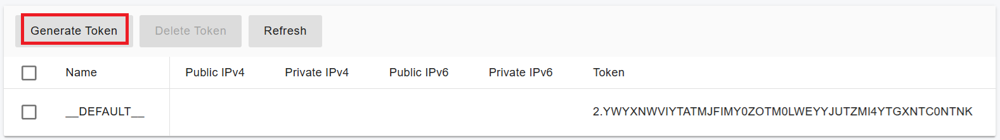

# Install Data Flow Service

### Instructions

Starting with **PortSIP PBX v22.3**, PortSIP introduces a new component: the **PortSIP Data Flow Service,** a high-performance analytics engine built on **ClickHouse**.

The Data Flow service powers the following advanced capabilities:

* [Call Detail Record (CDR) storage and analytics](../../20-cdr-and-call-recordings/cdr.md)
* [Comprehensive call reports](../../21-call-reports/call-reports/)
* [Real-time data dashboards](../../16-call-queue/live-wallboards.md)
* [Queue wallboards for contact center operations](../../16-call-queue/live-wallboards.md)

ClickHouse is optimized for large-scale analytical workloads, capable of handling billions of CDRs and real-time queue or agent activity data with extremely fast query performance. This makes it ideal for service providers and enterprise-grade deployments.

***

### Deployment Guidelines

Because ClickHouse is **resource-intensive** and optimized for analytics workloads, the **PortSIP Data Flow service must be installed on a separate server**.

Deploying the Data Flow service on the same server as the PBX core may degrade overall system performance due to high CPU, memory, and disk I/O usage during data ingestion and analytics processing.

> ❗ **Important**\
> **Do not install the Data Flow service on the same server as the PortSIP PBX.**\
> Running both services on a single server may negatively impact call processing performance and overall system stability.

***

### Hardware Requirements

The PortSIP Data Flow service can be deployed on either a **physical server** or a **virtual machine**.

For best performance, ensure your hardware meets or exceeds the specifications below.\
For additional reference, see the [**ClickHouse official best practices documentation**](https://clickhouse.com/docs/guides/sizing-and-hardware-recommendations).

#### Minimum Requirements

* **vCPU**: 4 cores
* **Memory**: 8 GB
* **Disk**: 128 GB SSD

***

#### Recommended Requirements

* **vCPU**: 8 cores
* **Memory**: 16 GB
* **Disk**: 256GB or larger (NVMe SSD preferred)

***

#### Hardware Sizing Formula (Large-Scale Deployments)

For large or high-volume environments, use the following guideline:

* **vCPU**: ≥ 8
* **Memory**: vCPU × 4 GB
* **Disk**: Based on expected CDR volume and data retention policy

***

### Supported Operating Systems

The PortSIP Data Flow service supports **64-bit Linux only**.

The following operating systems are officially supported:

* **Ubuntu**: 22.04, 24.04
* **Debian**: 12

***

> ❗ **Important**\
> Follow every step in this guide in order. Do not skip any steps unless the guide explicitly says you can.

### Network Requirements

#### Static IP Address

You must configure a **static private IP address** for the Data Flow server.

* Example private IP: `192.168.1.35`

If a static private IP is not available, the server must have a **static public IP address** and be able to communicate reliably with the PBX server.

#### Configure Cloud Firewall or Network Security Rules

Skip this step if you are **not** deploying in a **cloud environment.**

> ❗**Important**\
> Restrict this rule to the **internal IP range** of your deployment to maintain security.

If the PBX and Data Flow server are hosted on **AWS, Azure, Google Cloud, or other cloud platforms**:

* Ensure the Data Flow server is within the same **VPC/VNet/VLAN**
* Create a **firewall or security group rule** allowing **all TCP traffic** from the **Data Flow server private IP** to the PBX server IP.

> ⚠️ **Note**\
> Restrict this rule to the **internal IP range** of your deployment to maintain security.

***

### Step 1: Generate the Data Flow Token

1. Log in to the **PortSIP PBX Web Portal** as a **System Administrator**.
2. Navigate to **Servers > Data Flow**.
3. Select the **default Data Flow server**.

<figure><figcaption></figcaption></figure>

4. Click **Generate Token**.
5. Copy and securely store the generated token.

***

### Step 2: Configure the Firewall on the PBX Server

To allow the Data Flow server (**`192.168.1.35`**) to communicate with the PBX server (**`192.168.1.20`**), configure firewall rules **on the PBX server**.

Execute the following commands on the PBX server:

```bash
sudo firewall-cmd --permanent --zone=trusted --add-source=192.168.1.35
sudo firewall-cmd --reload
```

Verify the firewall rule by executing the command below:

```bash
sudo firewall-cmd --zone=trusted --list-all
```

Expected output:

```shellscript
[ubuntu@localhost ~]$ sudo firewall-cmd --zone=trusted --list-all
trusted (active)
  target: ACCEPT
  icmp-block-inversion: no
  interfaces: 
  sources: 192.168.1.35
  services: 
  ports: 
  protocols: 
  forward: yes
  masquerade: no
  forward-ports: 
  source-ports: 
  icmp-blocks: 
  rich rules:
```

#### (Optional) Allow the Entire LAN

If required, you may allow the entire LAN subnet by performing the following commands:

```bash
sudo firewall-cmd --permanent --zone=trusted \
--add-source=192.168.1.0/24 && \
sudo firewall-cmd --reload
```

***

### Step 3: Create and Run the Data Flow Docker Instance

All commands must be executed in the **`/opt/portsip`** directory on the Data Flow server.

#### Initialize the Environment

```bash
sudo mkdir -p /opt/portsip
cd /opt/portsip
sudo curl https://raw.githubusercontent.com/portsip/portsip-pbx-sh/master/v22.x/init.sh -o init.sh
sudo /bin/sh init.sh
```

***

#### Install Docker and Docker Compose

```bash
sudo /bin/sh install_docker.sh
```

If prompted with:

```shellscript
cloud.cfg (Y/I/N/O/D/Z) [default=N] ?
```

Enter **Y** and press **Enter**.

***

#### Create the Data Flow Service Docker Instance

Command parameters:

* `-p` : Path for storing Data Flow and ClickHouse data (required)
* `-d` : ClickHouse Docker image. Optionial, suggest keep it by default
* `-a` : **Private IP address** of the Data Flow server
* `-A` : Public IP address (**only use if the server has no private IP**)
* `-i` : PortSIP PBX Docker image version (required)
* `-x` : PBX server **private IP address(required)**
  * If PBX is deployed in **HA mode**, use the **Virtual IP (VIP)**
*   -g: Sets the startup grace period for DataFlow health checks. Failed health checks during this period do not count toward the consecutive failure threshold for marking the container as `unhealthy`. The default is **90 seconds** if `-g` is omitted. We recommend leaving this parameter unset unless you need a different grace period.

    For example, `-g 120` sets the grace period to 120 seconds. This setting does not impose a fixed startup deadline or stop the container when the period expires.&#x20;

Example command:

```bash
sudo /bin/sh dataflow_ctl.sh run \
-p /var/lib/portsip/ \
-a 192.168.1.35 \
-i portsip/pbx:22 \
-x 192.168.1.20
```

#### Notes and Operational Considerations

* If the **PBX IP address changes**, you must delete and recreate the existing Data Flow Docker instance.
* If a **new authentication token** is generated, the Data Flow Docker instance must be deleted and recreated.
* After upgrading the **PBX to a new version**, you must remove and recreate the Data Flow Docker instance to ensure compatibility.

The above operations **do not affect or erase existing analytics data** stored in ClickHouse.

***

### Install Multiple Data Flow Instances on One Server

A Data Flow server may have enough resources to serve multiple PBX systems. You can run a separate Data Flow instance for each PBX on the same server, reducing the need for additional hardware.

Before installing another instance, complete steps 1–3 of the initial Data Flow installation described above and verify that the first instance is working properly.

The deployment uses:

1. **One ClickHouse instance** shared by all Data Flow instances on the server.
2. A separate Data Flow instance for each PBX.
3. A connection from each Data Flow instance to its corresponding PBX.

#### Example: Install a Data Flow Instance for Another PBX

Assume the first Data Flow instance is already serving the first PBX(192.168.1.20). To add an instance for a second PBX with the IP address `192.168.1.21`, run the Data Flow installation command with these parameters:

| Parameter | Value                                                                                                                                                 |
| --------- | ----------------------------------------------------------------------------------------------------------------------------------------------------- |
| `-a`      | The Data Flow server’s private IP address.                                                                                                            |
| `-A`      | The Data Flow server’s public IP address. Use this only if the server has no private IP address.                                                      |
| `-x`      | The second PBX’s private IP address: `192.168.1.21`. If the PBX is deployed in HA mode, use its virtual IP (VIP) instead. This parameter is required. |

Use **the same `-a` or `-A` value** that you used for the first Data Flow instance. Set `-x` to the **second PBX**, not the PBX configured in steps 1–3.

#### Step 1: Configure the Firewall on the PBX Server

To allow the Data Flow server (**`192.168.1.35`**) to communicate with the PBX server 2 (**`192.168.1.21`**), configure firewall rules **on the PBX server**.

Execute the following commands on the PBX server(192.168.1.21):

```bash
sudo firewall-cmd --permanent --zone=trusted --add-source=192.168.1.35
sudo firewall-cmd --reload
```

Verify the firewall rule by executing the command below:

```bash
sudo firewall-cmd --zone=trusted --list-all
```

Expected output:

```shellscript
[ubuntu@localhost ~]$ sudo firewall-cmd --zone=trusted --list-all
trusted (active)
  target: ACCEPT
  icmp-block-inversion: no
  interfaces: 
  sources: 192.168.1.35
  services: 
  ports: 
  protocols: 
  forward: yes
  masquerade: no
  forward-ports: 
  source-ports: 
  icmp-blocks: 
  rich rules:
```

#### (Optional) Allow the Entire LAN

If required, you may allow the entire LAN subnet by performing the following commands:

```bash
sudo firewall-cmd --permanent --zone=trusted \
--add-source=192.168.1.0/24 && \
sudo firewall-cmd --reload
```

#### Step 2: Run the following example commands on the Data Flow Server

```
sudo /bin/sh dataflow_ctl.sh run \
-p /var/lib/portsip/ \
-a 192.168.1.35 \
-i portsip/pbx:22 \
-x 192.168.1.21
```

***

### Installation Complete

The **Data Flow Service** has now been successfully installed.

You can now proceed to [Step 7: Reboot to Apply the Certificate](../../installation-of-portsip-pbx-v22.3-beta-version/install-portsip-pbx.md#step-7-reboot-to-apply-the-certificate) in the Install PortSIP PBX guide.

