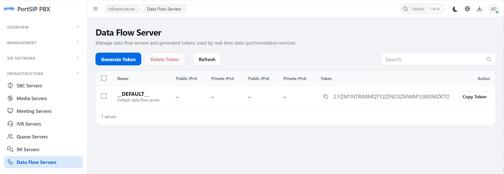
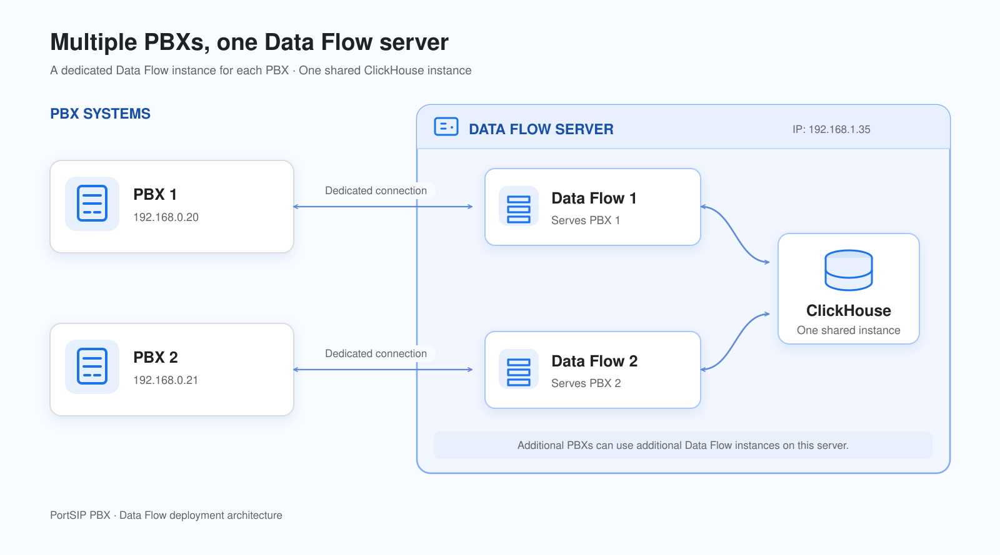

# Install Data Flow Service

### Overview

PortSIP PBX v22.3 introduced the **PortSIP Data Flow service**, which uses ClickHouse to store and analyze call and contact center data. The service supports:

* [Call Detail Record (CDR) storage and analytics](../../20-cdr-and-call-recordings/)
* [Call reports](../../21-call-reports/call-reports/)
* [Real-time dashboards and queue wallboards](../../16-call-queue/live-wallboards.md)

ClickHouse is designed for large analytical datasets and fast queries. Deploy Data Flow when your PBX requires these reporting and analytics capabilities.

***

### Deployment Guidelines

Install Data Flow on a **separate physical server or virtual machine**. ClickHouse ingestion and analytics can use substantial CPU, memory, and disk I/O. Running Data Flow on the PBX server can affect call processing and system stability.

> **Important:** Do not install Data Flow on the same server as PortSIP PBX.

Starting with **PortSIP PBX v22.8.0**, you can install multiple Data Flow instances on the same Data Flow server.

This allows one Data Flow server to serve multiple PBX systems. Each PBX has its own Data Flow instance, while all Data Flow instances on the server share one ClickHouse instance. See Install Multiple Data Flow Instances on One Server.

### Hardware Requirements

| Resource | Minimum    | Recommended                        |
| -------- | ---------- | ---------------------------------- |
| vCPU     | 4 cores    | 8 cores or more                    |
| Memory   | 8 GB       | 16 GB or more                      |
| Storage  | 128 GB SSD | 256 GB or more; NVMe SSD preferred |

For large deployments, start with at least **8 vCPUs** and plan for approximately **4 GB of memory per vCPU**. Size storage according to the expected CDR volume and retention period. When several PBXs share one Data Flow server, size the server for their combined workload.

For further guidance, see the [ClickHouse sizing and hardware recommendations](https://clickhouse.com/docs/guides/sizing-and-hardware-recommendations).

### Supported Operating Systems

Data Flow supports **64-bit Linux** on the following distributions:

* Ubuntu 22.04 or 24.04
* Debian 12

### Network Requirements

Assign the Data Flow server a **static private IP address**. The examples in this guide use `192.168.1.35` for Data Flow, `192.168.0.20` for PBX 1, and `192.168.0.21` for PBX 2. The private subnets must be able to route traffic between the Data Flow server and each PBX.

If the Data Flow server has no private IP address, assign it a static public IP address and ensure it can communicate reliably with the PBX. Use `-A` instead of `-a` when installing the service in this case.

#### Cloud Firewall or Network Security Rules

If you deploy on AWS, Azure, Google Cloud, or another cloud platform, configure the relevant network route and security group or firewall rules so the Data Flow server can reach each PBX. The current installation procedure requires allowing TCP traffic from the **Data Flow server IP** to the **PBX IP**. Restrict the source to the specific Data Flow server address rather than opening the PBX to an entire network where possible.

If your deployment is not in a cloud environment, continue with the PBX host firewall steps below.

> **Important:** Complete the steps in order. Skip a step only when it is explicitly marked optional or does not apply to your deployment.

***

### Install the First Data Flow Instance

#### Step 1: Generate the Data Flow Token on PBX 1

1. Sign in to the **PortSIP PBX Web Portal** as a **system administrator**.
2. Go to **Servers > Data Flow**.
3. Select the **default Data Flow server**.
4. Click **Generate Token**.

<figure><figcaption></figcaption></figure>

#### Step 2: Configure the Firewall on PBX 1

On **PBX 1 (`192.168.0.20`)**, allow the Data Flow server (`192.168.1.35`) through the host firewall:

```bash
sudo firewall-cmd --permanent --zone=trusted --add-source=192.168.1.35
sudo firewall-cmd --reload
```

Verify that `192.168.1.35` appears in the `sources` field:

```bash
sudo firewall-cmd --zone=trusted --list-all
```

For example, the output should include:

```
trusted (active)
  target: ACCEPT
  sources: 192.168.1.35
```

> **Optional:** If your deployment requires trusting the entire Data Flow subnet, replace the individual source with `192.168.1.0/24`. This grants broader access to the PBX, so use the single-server rule above whenever possible.
>
> ```bash
> sudo firewall-cmd --permanent --zone=trusted --add-source=192.168.1.0/24
> sudo firewall-cmd --reload
> ```

#### Step 3: Create and Start the Data Flow Instance

Run the following commands **on the Data Flow server**. The commands in this step use `/opt/portsip` as the working directory.

**Initialize the Environment**

```bash
sudo mkdir -p /opt/portsip
cd /opt/portsip
sudo curl https://raw.githubusercontent.com/portsip/portsip-pbx-sh/master/v22.x/init.sh -o init.sh
sudo /bin/sh init.sh
```

**Install Docker and Docker Compose**

```bash
sudo /bin/sh install_docker.sh
```

If you see the following prompt, enter **Y** and press **Enter**:

```
cloud.cfg (Y/I/N/O/D/Z) [default=N] ?
```

**Start the Instance**

The `dataflow_ctl.sh run` command accepts these parameters:

| Parameter      | Description                                                                                                                                                                                                                                                                                                                                                                                                                |
| -------------- | -------------------------------------------------------------------------------------------------------------------------------------------------------------------------------------------------------------------------------------------------------------------------------------------------------------------------------------------------------------------------------------------------------------------------- |
| `-p <path>`    | Directory for persistent Data Flow and ClickHouse data. Required. Reuse this path when recreating an instance.                                                                                                                                                                                                                                                                                                             |
| `-d <image>`   | ClickHouse Docker image. Optional; keep the default unless your deployment requires a different image.                                                                                                                                                                                                                                                                                                                     |
| `-a <IP>`      | Private IP address of the Data Flow server. **Use this when the server has a private IP**.                                                                                                                                                                                                                                                                                                                                 |
| `-A <IP>`      | Public IP address of the Data Flow server. **Use this only when the server has no private IP**.                                                                                                                                                                                                                                                                                                                            |
| `-i <image>`   | PortSIP PBX Docker image version. Required.                                                                                                                                                                                                                                                                                                                                                                                |
| `-x <IP>`      | Private IP address of the PBX served by this Data Flow instance. Required. **For a PBX HA deployment, use its virtual IP (VIP)**.                                                                                                                                                                                                                                                                                          |
| `-g <seconds>` | Startup grace period for Data Flow health checks. The default is **90 seconds**. Failed checks during this period do not count toward the consecutive failures required to mark the container `unhealthy`. **Leave this parameter unset unless you need a different grace period.** For example, `-g 120` sets it to 120 seconds. It is not a fixed startup deadline and does not stop the container when the period ends. |

Example for **PBX 1 (`192.168.0.20`)** and **Data Flow (`192.168.1.35`)**:

```bash
sudo /bin/sh dataflow_ctl.sh run \
  -p /var/lib/portsip/ \
  -a 192.168.1.35 \
  -i portsip/pbx:22 \
  -x 192.168.0.20
```

If the Data Flow server has no private IP, replace `-a 192.168.1.35` with `-A <static-public-IP>`.

#### Recreating an Instance

Delete and recreate the affected Data Flow instance when:

* Its PBX IP address or VIP changes.
* You generate a new Data Flow authentication token on that PBX.
* You upgrade the PBX to a new version and need a matching Data Flow instance.

Recreating the instance does not erase existing ClickHouse analytics data **provided that you preserve and reuse the same persistent data directory specified by `-p`**. Do not delete that directory when removing the container.

***

### Install Multiple Data Flow Instances on One Server

**Supported starting with PortSIP PBX v22.8.0.** You can install multiple Data Flow instances on one server, with one instance for each PBX. The instances **share one ClickHouse instance** and use the **same Data Flow server IP**. Each instance connects to its corresponding PBX.

<figure><figcaption></figcaption></figure>

A single Data Flow server supports up to **100 Data Flow instances**. For typical deployments, we recommend **around 10 instances** and generally advise **no more than 20 instances** per server. The practical limit depends on the server's CPU, memory, storage performance, and the combined workload of the connected PBXs.

Before adding another instance, complete **Steps 1–3** for the first PBX above and confirm that its Data Flow instance is working.

The following example adds **PBX 2 (`192.168.0.21`)** to the existing Data Flow server (`192.168.1.35`). PBX 1 remains at `192.168.0.20`.

#### Step 1: Generate the Data Flow Token on PBX 2

Sign in to **PBX 2** as a system administrator. Go to **Servers > Data Flow**, select its default Data Flow server, click **Generate Token**.

#### Step 2: Configure the Firewall on PBX 2

Run these commands **on PBX 2 (`192.168.0.21`)** to allow the Data Flow server (`192.168.1.35`):

```bash
sudo firewall-cmd --permanent --zone=trusted --add-source=192.168.1.35
sudo firewall-cmd --reload
```

Verify the source rule:

```bash
sudo firewall-cmd --zone=trusted --list-all
```

The output should list `192.168.1.35` under `sources`. If you must trust the whole Data Flow subnet, use the optional `192.168.1.0/24` rule shown in the first installation instead.

#### Step 3: Start the Second Instance on the Data Flow Server

Run the following command **on the existing Data Flow server**, from `/opt/portsip`:

```bash
cd /opt/portsip
sudo /bin/sh dataflow_ctl.sh run \
  -a 192.168.1.35 \
  -x 192.168.0.21
```

Use **the same `-a` or `-A` Data Flow server address** as the first instance. Change `-x` to **PBX 2's IP address or VIP**. Do not use PBX 1's address for the new instance. Do not install a second ClickHouse instance.

#### Install Additional Instances

For each additional PBX, repeat **Steps 1–3** in this section: generate its Data Flow token, allow the Data Flow server through that PBX's firewall, and start a new Data Flow instance. Keep the same `-p` directory and Data Flow server address (`-a` or `-A`), and set `-x` to the additional PBX's IP address or VIP.

***

### Installation Complete

After installing the required Data Flow instances, return to[ ](../../installation-of-portsip-pbx-v22.3-beta-version/install-portsip-pbx.md#restart-the-pbx-to-apply-the-ssl-certificate)[Restart the PBX to Apply the SSL Certificate](../../installation-of-portsip-pbx-v22.3-beta-version/install-portsip-pbx.md#restart-the-pbx-to-apply-the-ssl-certificate) in the PortSIP PBX installation guide.

