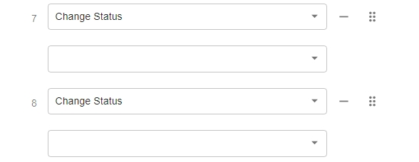

# Upgrade to the Latest Version Within v22.x

This guide applies to standalone PortSIP PBX deployments upgrading from one v22.x release to a newer v22.x release. Follow the steps in order, and upgrade each service installed in your deployment.

### Back Up Before Upgrading

Back up both the PBX and SBC before starting. Follow [Backup and Restore: An Essential Guide](https://support.portsip.com/portsip-communications-solution/tutorials/backup-and-restore).

The upgrade procedure is designed to preserve PBX data, but verify that your backups are complete before proceeding.

#### Attention

* After upgrading from an earlier version to **v22.2.x or a later version**, the SBC token is automatically regenerated.\
  To ensure continued operation, you must update the SBC Web Portal with the new token.
* If you upgrade from a version earlier than **v22.3.0** to **v22.3.x or a later version**, you must install the Data Flow service after the upgrade.\
  Please follow the guide[ Install Data Flow Service](install-data-flow-service.md) to complete the installation.
* If you upgrade from a version **earlier than v22.3.0** to **v22.3.x or a later version**, the extension phone provisioning settings for the BLF keys for Change Status to **Do Not Disturb (DND)** and **Available** will be **cleared**. After the upgrade, you must **reconfigure these BLF key settings**.

<figure><figcaption></figcaption></figure>

***

### High Availability Deployments

> ❗ **Important**

If your PBX uses High Availability (HA), follow [Upgrading High Availability Installation](https://support.portsip.com/portsip-communications-solution/high-availability-v22.x/high-availability-and-scalability-on-premise/upgrading-high-availability-installation). The procedure below is for standalone deployments.

***

### Upgrading Within v22.x

> ❗ **Important**\
> Follow every step in this guide in order. Do not skip any steps unless the guide explicitly says you can.

All commands in this section must be executed in the following directory:

```bash
/opt/portsip
```

#### Step 1: Update the Installation Scripts

**This step is required on every server that hosts a service you are upgrading.** On each server, run:

```bash
cd /opt/portsip
sudo curl https://raw.githubusercontent.com/portsip/portsip-pbx-sh/master/v22.x/init.sh -o init.sh
sudo /bin/sh init.sh
```

> ❗ **Important**\
> This step is **mandatory**, don't skip this step!

Complete this step before running an upgrade command on that server.

#### Step 2: Upgrade the PBX

On the PBX server, run:

```bash
cd /opt/portsip
sudo /bin/sh pbx_ctl.sh upgrade -i portsip/pbx:22
```

#### Step 3: Upgrade the SBC

If PortSIP SBC is installed, run the following on the SBC server:

```bash
cd /opt/portsip
sudo /bin/sh sbc_ctl.sh upgrade -i portsip/sbc:11
```

> ❗ **Important**\
> After upgrading to **v22.2.x or later** from an earlier version, the **SBC token is regenerated automatically**.\
> You must update the **SBC Web Portal** with the new token to restore SBC functionality.

#### Step 4: Upgrade the IM Service

If the IM Service is installed **on the PBX server**, the installation scripts were updated in Step 1. Run:

```bash
cd /opt/portsip
sudo /bin/sh im_ctl.sh upgrade -i portsip/pbx:22
```

If the IM Service is installed **on a separate server**, first update the installation scripts on the IM server:

```bash
cd /opt/portsip
sudo curl https://raw.githubusercontent.com/portsip/portsip-pbx-sh/master/v22.x/init.sh -o init.sh
sudo /bin/sh init.sh
```

Then upgrade the IM Service:

```bash
sudo /bin/sh im_ctl.sh upgrade -i portsip/pbx:22
```

#### Step 5: Install or Upgrade the Data Flow Service

**If Data Flow Is Not Yet Installed**

If the Data Flow Service is not installed, install it **after completing the PBX upgrade**. This applies if:

* You are upgrading from a version earlier than **v22.3.0 to v22.3.x** or later and **have not installed Data Flow**; or
* Your PBX is already running v22.3.x or later **without Data Flow**.

Follow [Install Data Flow Service](https://support.portsip.com/portsip-communications-solution/portsip-pbx-administration-guide/1-installation-of-the-portsip-pbx/installation-of-portsip-pbx-v22.x/install-data-flow-service) to complete the installation.

**If Data Flow Is Already Installed**

The Data Flow version **must match** the PBX version. Before upgrading Data Flow, upgrade **every associated PBX**, including all PBXs served by a shared Data Flow server.

On the Data Flow server, update the installation scripts:

```bash
cd /opt/portsip
sudo curl https://raw.githubusercontent.com/portsip/portsip-pbx-sh/master/v22.x/init.sh -o init.sh
sudo /bin/sh init.sh
```

Then upgrade the Data Flow Service:

```bash
sudo /bin/sh dataflow_ctl.sh upgrade \
  -i portsip/pbx:22 \
  -d portsip/clickhouse:26.3
```

