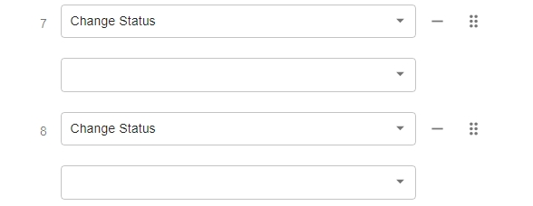

# Upgrade v16.x to the Latest v22.x

### Important Notice

After upgrading from **PortSIP PBX v16.x to v22.x**, the **legacy PortSIP Softphone is no longer compatible** with v22.x.

To continue using the PBX without interruption, all users must install the new [PortSIP ONE app](https://www.portsip.com/portsip-one/), which is fully compatible with v22.x and designed to support the latest PBX features and architecture.

***

### Overview

This guide provides step-by-step instructions for upgrading an existing **PortSIP PBX v16.x deployment** to the latest **v22.x release**.

\
It covers required preparations, upgrade procedures, and post-upgrade actions to ensure a smooth and reliable transition.

***

### Processing Feature Access Code (FAC) Conflicts Before Upgrading

Starting with v22.x, PortSIP PBX introduces new default Feature Access Codes (FACs). Before upgrading, it is **mandatory** to verify that no tenant-defined custom FACs conflict with these new defaults.

#### Newly Introduced FACs

**v22.0**

* Call Flip: `*11`
* Reset Calls: `*12`
* Clear Push Information: `*13`
* Call Transfer: `*54`

**v22.2**

* Night Mode: `*16`
* PIN-Based Calling: `*20`
* Set Default Outbound Caller ID: `*64`

#### Important Notes

* Prior to upgrading from **v16.x to the latest v22.x**, confirm with **all tenants** whether custom FACs have been configured.
* Custom FACs must **not overlap** with any of the new default codes listed above.
* If a conflict exists, the **upgrade process will fail**.
* To avoid upgrade issues, review and modify **any conflicting custom FACs** before proceeding.

> ❗ **Important**\
> Follow every step in this guide in order. Do not skip any steps unless the guide explicitly says you can.

***

### Backup

Before starting the upgrade, ensure that **both the PBX and SBC are fully backed up**.

Please follow the guide [**Backup and Restore: An Essential Guide**](../../backup-and-restore/) to complete the backup process.

> If all steps are followed correctly, your PBX data will remain intact throughout the upgrade.

***

### Prerequisites for Upgrading from v16.x

* If your current PBX version is **earlier than v16.4.8**, you must first upgrade to **v16.4.8** by following the guide [**Upgrading to the Latest v16.x Release**](../installation-of-portsip-pbx-v16/upgrade-portsip-pbx-to-v16.x.md)**.**
* Once upgraded to the latest v16.x version, proceed with the steps below to prepare for the v22.x upgrade.
* All commands must be executed in the `/opt/portsip` directory.

***

> ❗ **Important**\
> Follow every step in this guide in order. Do not skip any steps unless the guide explicitly says you can.

### Update the Upgrade Scripts

Download and apply the latest upgrade scripts by running the following commands:

> ❗ **Important**\
> This step is **mandatory**, don't skip this step!

```bash
sudo rm -rf /opt/portsip/*.sh
sudo curl \
https://raw.githubusercontent.com/portsip/portsip-pbx-sh/master/v22.x/init.sh \
-o init.sh
sudo /bin/sh init.sh
```

***

### Upgrading the PBX

> **Important**\
> If your deployment uses **PBX High Availability (HA)**, do **not** follow this section.\
> Instead, refer to [**Upgrading PortSIP PBX HA v16.x to v22.x.**](../../../high-availability-v22.x/high-availability-and-scalability-on-premise/upgrading-high-availability-installation.md#upgrading-portsip-pbx-ha-v16.x-to-v22.x)

This guide applies **only to standalone PBX deployments**.

To upgrade the PBX to v22.x, run:

```bash
cd /opt/portsip && sudo /bin/sh pbx_ctl.sh upgrade -i portsip/pbx:22
```

***

### Upgrading the SBC

If you are currently running **PortSIP SBC v11.x** and want to upgrade to the latest release, execute the following command:

```bash
cd /opt/portsip && sudo /bin/sh sbc_ctl.sh upgrade -i portsip/sbc:11
```

***

### Installing the Instant Messaging (IM) Service

Starting with **PortSIP PBX v22.0**, a dedicated Instant Messaging (IM) service is introduced, providing modern collaboration capabilities such as one-to-one and group chat.

The IM service requires a **separate installation step** and is **not installed automatically** as part of the PBX upgrade.

After completing the PBX upgrade, please follow the [**Install IM Service**](install-im-service.md) guide to complete the IM service installation and configuration.

***

### Installing the Data Flow Service

Starting with **PortSIP PBX v22.3**, PortSIP introduces a new component: the **PortSIP Data Flow Service,** a high-performance analytics engine built on **ClickHouse**.

If you upgraded from **v16.x** to **v22.3.x**, you need to install the **PortSIP Data Flow service** after completing the PBX upgrade.

Please follow the guide [**Install Data Flow Service**](install-data-flow-service.md) to complete the installation.

***

### Post-Upgrade Tasks (Required When Upgrading from v16.x to v22.x)

After completing the upgrade, perform the following actions to ensure full system functionality.

#### Re-generate User QR Codes

1. Navigate to **Call Manager > Users**.
2. Click **Send All Welcome Email**.

This action re-generates QR codes for all users, allowing them to sign in successfully using the **PortSIP ONE app**.

***

#### Reconfigure Microsoft 365 Integration

If Microsoft 365 integration was configured in v16.x, it must be **reconfigured** after upgrading.

Follow the **Microsoft 365 Integration Guide** and complete the following steps:

* Remove all previously configured callback URIs in Microsoft 365.
* Add the **two new callback URIs** as specified in the guide.

***

#### Regenerate XML Phone Books for IP Phones

For each tenant:

1. Log in to the PBX Web Portal as a **Tenant Administrator**.
2. Navigate to **Advanced > Contacts**.
3. Select any contact, make a minor edit, and click **OK**.

This action triggers the PBX to regenerate the **XML phone book**, allowing IP phones to download the updated directory successfully.

***

#### Review SMTP Email Configuration

Starting with v22.0, **SMTP configuration behavior has changed**.

* Existing SMTP settings from earlier versions are now treated as a **Generic Email Provider**.
* Review your email configuration carefully and update it if required to ensure proper email delivery.

***

#### Review Phone BLF Key Configuration

The extension phone provisioning settings for the BLF keys for Change Status to **Do Not Disturb (DND)** and **Available** will be **cleared**. After the upgrade, you must **reconfigure these BLF key settings**.

<figure><figcaption></figcaption></figure>

