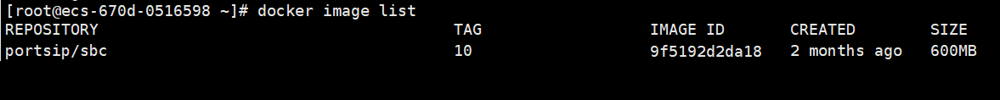
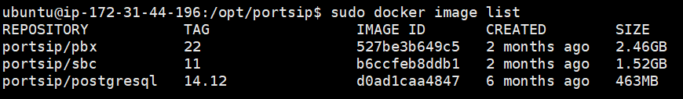
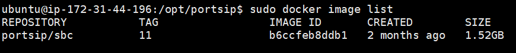
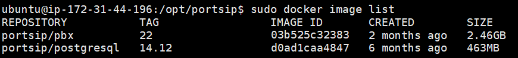

# Upgrade to the Latest v22.x on Linux

This guide provides step-by-step instructions for upgrading your current PortSIP PBX v16.x or v22.x installation to the latest v22.x release.

## Back-Up

Please follow the article [Backup and Restore: An Essential Guide](https://support.portsip.com/portsip-pbx/portsip-pbx-administration-guide/backup-and-restore) to back up the PBX and SBC.


Rest assured, if all steps are followed correctly, your PBX data will remain intact throughout the upgrade process.


## Prerequisites for Upgrading from v16.x

If your current installation is running a version lower than v16.4.4, please first follow the [**Upgrading to the Latest v16.x Release**](../installation-of-portsip-pbx-v16/upgrade-portsip-pbx-to-v16.x.md) guide to complete the upgrade to v16.4.4.

Once your PBX is upgraded to the latest v16.x, follow the steps below to remove the v16.x installation before upgrading.


After you upgraded the PortSIP PBX from v16.x to v22.x, the old PortSIP Softphone app can't be used with v22.x, you must use the new [PortSIP ONE](https://www.portsip.com/portsip-one) app with the PortSIP PBX v22.x and higher.



All commands must be executed in the **`/opt/portsip`** directory.


### Remove the current PBX installation

#### 1: Stop PBX docker instances <a href="#step-1-stop-pbx-docker-instance" id="step-1-stop-pbx-docker-instance"></a>

Perform the following commands to stop the PBX Docker instance:

```sh
cd /opt/portsip
sudo /bin/sh pbx_ctl.sh stop
```

#### 2: Delete the PBX docker instances <a href="#step-2-delete-the-pbx-docker-instance" id="step-2-delete-the-pbx-docker-instance"></a>

Perform the following command to delete the PBX Docker instance:

```sh
sudo /bin/sh pbx_ctl.sh rm
```

#### 3: Delete the PBX docker images <a href="#step-3-list-the-pbx-docker-images" id="step-3-list-the-pbx-docker-images"></a>

Perform the following command to list the PBX Docker images:

```sh
docker image list
```

You will get a similar result, as shown in the screenshot below.

<figure><figcaption></figcaption></figure>

You can use the following command to delete Docker images by specifying the first 4 digits of the IMAGE ID for **PBX** and **Postgresql**. In this case, the IMAGE IDs are **03b8** for **PBX** and **d569** for **Postgresql**:

```sh
docker image rm 03b8 d569 
```

#### 4: Delete the scripts <a href="#step-4-delete-the-pbx-scripts" id="step-4-delete-the-pbx-scripts"></a>

Use the below commands to delete the current scripts.

```sh
rm install_pbx_docker.sh
rm install_docker.sh
rm pbx_ctl.sh
```

### Remove the current SBC installation

If you installed **PortSIP SBC 10.x** with PortSIP PBX v16.x, you will also need to upgrade to **v11.x** for compatibility with PortSIP PBX v22.x.&#x20;

Please follow the steps below to remove the current installation.

#### 1: Stop SBC docker instances <a href="#step-1-stop-pbx-docker-instance" id="step-1-stop-pbx-docker-instance"></a>

Perform the following commands to stop the SBC Docker instance:

```sh
cd /opt/portsip
sudo /bin/sh sbc_ctl.sh stop
```

#### 2: Delete the SBC docker instances <a href="#step-2-delete-the-pbx-docker-instance" id="step-2-delete-the-pbx-docker-instance"></a>

Perform the following command to delete the SBC Docker instance:

```sh
sudo /bin/sh sbc_ctl.sh rm
```

#### 3: Delete the SBC docker images <a href="#step-3-list-the-pbx-docker-images" id="step-3-list-the-pbx-docker-images"></a>

Perform the following command to list the SBC Docker images:

```sh
sudo docker image list
```

You will get a similar result, as shown in the screenshot below.

<figure><figcaption></figcaption></figure>

You can use the following command to delete Docker images by specifying the first 4 digits of the IMAGE ID for **SBC**. In this case, the IMAGE ID is **9f51** for **SBC**:

```sh
sudo docker image rm 9f51
```

#### 4: Delete the scripts <a href="#step-4-delete-the-pbx-scripts" id="step-4-delete-the-pbx-scripts"></a>

Use the below commands to delete the current scripts.

```sh
rm install_pbx_docker.sh
rm install_docker.sh
rm sbc_ctl.sh
```

You are now ready to upgrade to the latest version of PortSIP PBX v22.x.

### Important: Upgrading from v16.x to v22.x


If you are upgrading from v16.x to v22.x, please follow these steps after your upgrade is complete.


* **Re-generate User QR Codes:**
  * Go to **Call Manager > Users** and click the **Send All Welcome Email** button. The PBX will then re-generate QR codes for all users, allowing the PortSIP ONE app to sign in successfully.
* **Reconfigure Microsoft 365 Integration:** If you have configured Microsoft 365 integration on v16.x, follow the [**Microsoft 365 Integration Guide**](../../microsoft-365-integration.md) to configure it again:&#x20;
  * Remove all previously configured callback URIs in Microsoft 365.
  * Add the two new callback URIs as described in the guide.
* **Must log in to** the PBX web portal as a tenant administrator for each tenant and navigate to **Advanced > Contacts**. Select any contact, make an edit, and click **OK**. This action will prompt the PBX to generate an XML phone book for your IP phones, allowing them to download it successfully.
* Since SMTP server configurations have changed in v22.0, your previous settings will now be recognized as a generic email provider. Please review your configuration and update it if necessary.

## Prerequisites for Upgrading within v22.x


All commands must be executed in the **`/opt/portsip`** directory.


If you are currently running **PortSIP PBX v22.x** and wish to upgrade to the latest version, please follow the steps below.

### Remove the current PBX installation

#### 1: Stop PBX docker instances <a href="#step-1-stop-pbx-docker-instance" id="step-1-stop-pbx-docker-instance"></a>

Perform the following commands as root to stop the current PBX Docker instance:

```sh
cd /opt/portsip
sudo /bin/sh pbx_ctl.sh stop
sudo /bin/sh im_ctl.sh stop
```

#### 2: Delete the PBX docker instances <a href="#step-2-delete-the-pbx-docker-instance" id="step-2-delete-the-pbx-docker-instance"></a>

Perform the following command to delete the PBX Docker instance:

```sh
sudo /bin/sh pbx_ctl.sh rm
sudo /bin/sh im_ctl.sh rm
```

#### 3: Delete the PBX docker images <a href="#step-3-list-the-pbx-docker-images" id="step-3-list-the-pbx-docker-images"></a>

Perform the following command to list the PBX Docker images:

```sh
docker image list
```

You will get a similar result, as shown in the screenshot below.

<figure><figcaption></figcaption></figure>

You can use the following command to delete Docker images by specifying the first 4 digits of the IMAGE ID for **PBX** and **Postgresql**. In this case, the IMAGE IDs are **527b** for **PBX** and **d0ad** for **Postgresql**:

```sh
docker image rm 527b d0ad 
```

#### 4: Delete the scripts <a href="#step-4-delete-the-pbx-scripts" id="step-4-delete-the-pbx-scripts"></a>

```sh
rm install_pbx_docker.sh
rm install_docker.sh
rm pbx_ctl.sh
rm im_ctl.sh
rm init.sh
```

### Remove the current SBC installation

If you installed the PortSIP SBC 11.x with the PortSIP PBX 22.x, please follow the below steps to remove it.

#### 1: Stop SBC docker instances <a href="#step-1-stop-pbx-docker-instance" id="step-1-stop-pbx-docker-instance"></a>

Perform the following commands as root to stop the current SBC Docker instance:

```sh
cd /opt/portsip
sudo /bin/sh sbc_ctl.sh stop
```

#### 2: Delete the SBC docker instances <a href="#step-2-delete-the-pbx-docker-instance" id="step-2-delete-the-pbx-docker-instance"></a>

Perform the following command to delete the SBC Docker instance:

```sh
sudo /bin/sh sbc_ctl.sh rm
```

#### 3: Delete the SBC docker images <a href="#step-3-list-the-pbx-docker-images" id="step-3-list-the-pbx-docker-images"></a>

Perform the following command to list the SBC Docker images:

```sh
docker image list
```

You will get a similar result, as shown in the screenshot below.

<figure><figcaption></figcaption></figure>

You can use the following command to delete Docker images by specifying the first 4 digits of the IMAGE ID for **SBC**. In this case, the IMAGE ID is **b6cc** for **SBC**:

```
docker image rm b6cc
```

#### 4: Delete the scripts <a href="#step-4-delete-the-pbx-scripts" id="step-4-delete-the-pbx-scripts"></a>

```sh
rm install_pbx_docker.sh
rm install_docker.sh
rm sbc_ctl.sh
```

### Remove the separated IM service installation

If your IM service is installed on a separate server, please follow the below steps to remove it.

First, use SSH to connect to the separate IM server to perform the below commands.

The IM service is hosted within the PBX Docker instance and image, so it will appear as **PBX** in the following steps.

#### 1: Stop IM docker instances <a href="#step-1-stop-pbx-docker-instance" id="step-1-stop-pbx-docker-instance"></a>

Perform the following commands as root to stop the current IM Docker instance:

```sh
cd /opt/portsip
sudo /bin/sh im_ctl.sh stop
```

#### 2: Delete the IM docker instances <a href="#step-2-delete-the-pbx-docker-instance" id="step-2-delete-the-pbx-docker-instance"></a>

Perform the following command to delete the IM Docker instance:

```sh
sudo /bin/sh im_ctl.sh rm
```

#### 3: Delete the IM docker images <a href="#step-3-list-the-pbx-docker-images" id="step-3-list-the-pbx-docker-images"></a>

Perform the following command to list the IM Docker images:

```sh
docker image list
```

You will get a similar result, as shown in the screenshot below.

<figure><figcaption></figcaption></figure>

You can use the following command to delete Docker images by specifying the first 4 digits of the IMAGE ID for **PBX** and **Postgresql**. In this case, the IMAGE IDs are **03b5** for **PBX** and **d0ad** for **Postgresql**:

```sh
docker image rm 03b5 d0ad 
```

#### 4: Delete the scripts <a href="#step-4-delete-the-pbx-scripts" id="step-4-delete-the-pbx-scripts"></a>

```sh
rm install_pbx_docker.sh
rm install_docker.sh
rm pbx_ctl.sh
rm im_ctl.sh
rm init.sh
```

## Upgrade to the Latest PortSIP PBX v22.x

If you have removed the current installation of **PortSIP PBX** (while retaining the PBX data), you can proceed with the upgrade by following the [same steps as for a **fresh installation**](install-portsip-pbx-on-linux.md). The process is identical to installing a new PBX docker instance, and the installer will automatically handle the data upgrade process.

