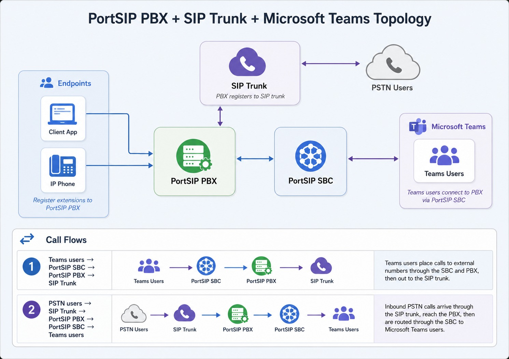
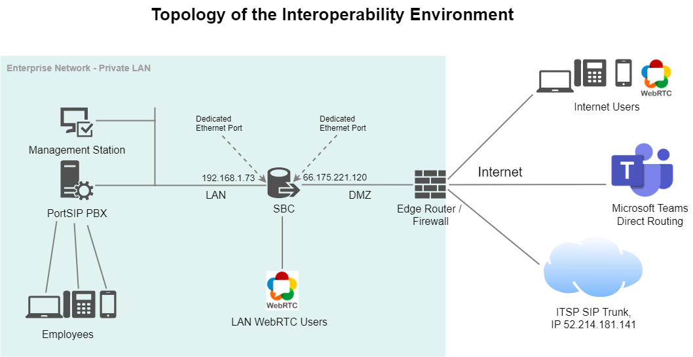

# Architecture

### Prerequisites

Before configuring Microsoft Teams Direct Routing with PortSIP PBX and PortSIP SBC, make sure the following requirements are met:

1.  **Microsoft Teams and Microsoft 365 domain**

    You must have a Microsoft Teams account and a Microsoft 365 tenant with a fully qualified domain name (FQDN) that you own.
2.  **Required Microsoft licenses**

    Users must have the required Microsoft licensing for Teams. This may include one Microsoft 365 or Office 365 suite license, such as E1, E3, or E5, and one Teams standalone license, such as Microsoft Teams Enterprise or Microsoft Teams EEA, depending on your region and Microsoft licensing requirements.

    For the latest Microsoft licensing details, refer to the official Microsoft documentation:\
    [https://learn.microsoft.com/en-us/microsoftteams/user-access](https://learn.microsoft.com/en-us/microsoftteams/user-access)
3.  **Calling policy configuration**

    In the Microsoft Teams admin center, ensure that **Prevent toll bypass and send calls through the PSTN** is set to **Off** for the calling policy assigned to the Teams users.

    To verify this setting:

    1. Sign in to the **Microsoft Teams admin center**.
    2. Go to **Voice > Calling policies**.
    3. Select the calling policy assigned to the Teams users.
    4. Set **Prevent toll bypass and send calls through the PSTN** to **Off**.
    5. Save the policy.

    This setting allows calls to use Direct Routing through the configured SBC. This is especially important if your deployment also uses Microsoft Phone System.
4.  **Trusted TLS certificate**

    A trusted TLS certificate is required for the SBC FQDN. The certificate should be issued by a public certificate authority, such as DigiCert, Thawte, GeoTrust, or a similar trusted CA.

    A wildcard certificate may also be used if it covers the SBC FQDN.

    **Example:**\
    If the SBC FQDN is `sbc.portsip.cc`, the certificate must cover either:

    * `sbc.portsip.cc`, or
    * `*.portsip.cc`
5.  **Network access**

    The configuration is simpler when PortSIP PBX or PortSIP SBC is deployed with a public IP address.

    PortSIP PBX can also be deployed on a private LAN IP address. In this case, the firewall and NAT rules must be configured correctly so that Microsoft Teams and the PortSIP SBC can reach the required SIP and media services.

    **Note:**\
    If PortSIP PBX is deployed behind a firewall or NAT device, make sure the required signaling and media ports are properly forwarded and accessible according to your PortSIP deployment design.

***

### Call Flows

The following call flows are typically used when integrating Microsoft Teams with PortSIP PBX through PortSIP SBC.

#### 1. Teams Users to External Numbers Through PBX and SIP Trunk

**Flow:**\
Microsoft Teams Users → PortSIP SBC → PortSIP PBX → SIP Trunk → External Number

**Description:**\
Microsoft Teams users place outbound calls to external numbers. The calls are sent from Microsoft Teams to the PortSIP SBC, then routed to PortSIP PBX. PortSIP PBX applies the configured outbound routing rules and sends the calls to the SIP trunk.

#### 2. PSTN Users to Teams Users Through SIP Trunk and PBX

**Flow:**\
PSTN Users → SIP Trunk → PortSIP PBX → PortSIP SBC → Microsoft Teams Users

**Description:**\
Inbound PSTN calls arrive at PortSIP PBX through the SIP trunk. PortSIP PBX applies the configured inbound routing rules and forwards the calls to Microsoft Teams users through the PortSIP SBC.

<figure><figcaption></figcaption></figure>

***

### Topology of the Interoperability Environment

This guide uses the following topology to demonstrate interoperability between Microsoft Teams, PortSIP SBC, and PortSIP PBX.

#### Deployment Scenario

In this example, the enterprise deploys PortSIP PBX in its private network to provide unified communications services for internal users. The enterprise also wants to enable Microsoft Teams users to make and receive calls through PortSIP PBX.

#### Network Topology

The example environment uses the following network configuration:

| Component              | Address / Domain                   | Description                                                                                                   |
| ---------------------- | ---------------------------------- | ------------------------------------------------------------------------------------------------------------- |
| PortSIP PBX            | `192.168.1.72`                     | Private static IP address. The PBX is deployed in the internal network and does not have a public IP address. |
| PortSIP SBC            | `192.168.1.73`                     | Private static IP address. The SBC is deployed at the edge of the enterprise network.                         |
| Public IP address      | `66.175.221.120`                   | Static public IP address used for the SBC.                                                                    |
| SBC FQDN               | `sbc.portsip.cc`                   | Public DNS record that resolves to the SBC public IP address `66.175.221.120`.                                |
| TLS certificate        | `sbc.portsip.cc` or `*.portsip.cc` | Trusted TLS certificate used by the SBC for secure SIP signaling.                                             |
| PortSIP PBX SIP domain | `sip.portsip.cc`                   | SIP domain used by the PortSIP PBX tenant.                                                                    |

#### Topology Description

In this topology:

1. PortSIP PBX is deployed inside the enterprise private network.
2. PortSIP PBX uses the private static IP address `192.168.1.72`.
3. PortSIP SBC is deployed at the network edge and uses the private static IP address `192.168.1.73`.
4. The SBC is reachable from the public Internet through the static public IP address `66.175.221.120`.
5. The DNS name `sbc.portsip.cc` resolves to the SBC public IP address `66.175.221.120`.
6. A trusted TLS certificate is installed for `sbc.portsip.cc`, or a wildcard certificate is installed for `*.portsip.cc`.
7. The PortSIP PBX tenant uses `sip.portsip.cc` as its SIP domain.

<figure><figcaption></figcaption></figure>

#### Call Routing Behavior

The example environment supports the following routing behavior:

1.  **PBX user to Teams user**

    When a PortSIP PBX user dials a Teams user’s phone number, PortSIP PBX routes the call to PortSIP SBC. PortSIP SBC then forwards the call to Microsoft Teams.
2.  **Teams user to PBX extension**

    When a Microsoft Teams user dials a number, the call is routed to PortSIP SBC first. PortSIP SBC then sends the call to PortSIP PBX. PortSIP PBX applies the configured inbound rule and routes the call to the target extension.
3.  **Teams user to external PSTN number**

    When a Microsoft Teams user dials an external PSTN number, the call is routed from Microsoft Teams to PortSIP SBC, then to PortSIP PBX. PortSIP PBX applies the outbound rule and sends the call to the SIP trunk.
4.  **External PSTN caller to Teams user**

    When an external PSTN caller dials a number assigned to a Teams user, the call arrives at PortSIP PBX through the SIP trunk. PortSIP PBX routes the call to PortSIP SBC, and PortSIP SBC forwards the call to Microsoft Teams.
