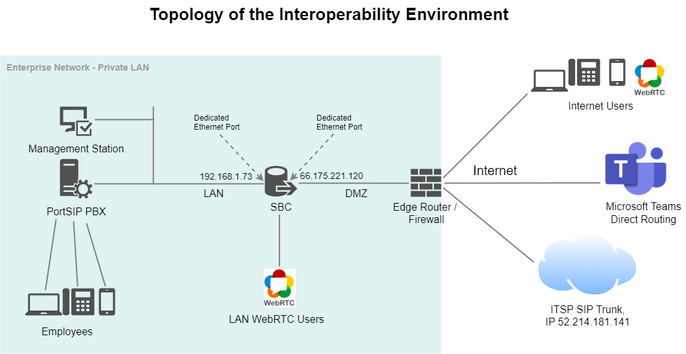

# Architecture

## Pre-Requisites

* Requires Microsoft TEAMS (Office 365) account with a domain in Office 365 with FQDN (fully qualified domain name) that you own.
* Microsoft 365 E5 subscription plan or Microsoft Teams + Microsoft Phone System (add-on) for Teams users that wish to call or be called.
* Make sure `Prevent toll bypass and send calls through the PSTN` setting in the calling policy of the user is set to Off. That will allow direct routing, especially if you are also using the MS phone system as well. It is found in the Microsoft Teams admin center under the left-side menu item `Voice > Calling policies`. Then choose the calling policy the user is using and make sure this setting is turned `Off`.
* A trusted TLS/SSL certificate for your domain, for example, DigiCert, Thawte, Geotrust, Verisign, or a wildcard certificate is recommended.
* The setup is a lot easier if the PBX runs on a public IP address. It is also possible to run the setup in a LAN with private IP, but this requires a proper setup of the firewall and additional steps on the PBX to make access from the Microsoft servers possible to the PBX.

## Topology of the Interoperability Environment

In this guide, the interworking between SBC and Microsoft Teams with PortSIP PBX was done using the following topology setup:

<figure><figcaption></figcaption></figure>

* Enterprise deployed with PortSIP PBX in its private network for enhanced communication within the Enterprise. The PBX has a static private IP address `192.168.1.72` , no DMZ, and no public IP Address assigned.
* Enterprise wishes to offer its employees enterprise-voice capabilities and to connect Microsoft Teams.
* &#x20;The SBC has a static private IP address `192.168.1.73` which is deployed located at the edge of the enterprise network, DMZ is the static public IP address`66.175.221.120`.
* The domain `sbc.portsip.cc` has resolved to the SBC static public IP `66.175.221.120`.
* A trusted TLS certificate for the domain `sbc.portsip.cc`, or a wildcard TLS certificate for the domain `portsip.cc` .
* The SIP domain is `sip.portsip.cc` for the tenant of PortSIP PBX.
* The PBX user dials the Teams user phone number, the PBX route that calls to SBC, and the SBC route to Microsoft Teams.
* When a Teams user dials the number, the call is routed to the SBC, then to the PBX, and finally to the extension as per the PBX inbound rule.
